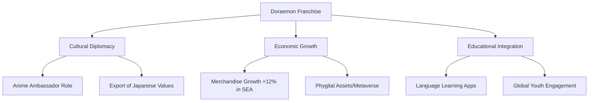

Imagine having a best friend who’s a robotic cat from the 22nd century. He’s got a magical pocket where he can pull out an "Anywhere Door" and whisk you away to the snowy peaks of the Himalayas or back to the time of the dinosaurs in a heartbeat. For millions of us, that was the ultimate childhood dream. But as we move through **2026**, it’s becoming pretty clear that Doraemon isn’t just a cute manga character or a trip down memory lane. He has become a roadmap for our technology, a mirror for our emotions, and a bridge for different cultures to connect.

The real magic of Fujiko F. Fujio’s creation isn't actually the gadgets—it's the way he mixes **wild imagination with the messy reality of being human**. Today, with Generative AI and humanoid robots becoming a reality, and as we all grapple with the climate crisis, *Doraemon* has shifted from a whimsical story to something that feels incredibly relevant to our daily lives.

Whether you've loved Nobita and his robotic guardian since you were a kid or you're just discovering them now, looking at the "Doraemon Effect" in 2026 tells us a lot about where we're all heading.

---

## 🤖 The Robot Best Friend: From Sci-Fi to Reality

For a long time, the idea of a robot that could not only do the dishes but also give you a pep talk or be a true friend was pure science fiction. But by **2026**, the gap between that 22nd-century cat and our current tech has shrunk significantly. Thanks to **Large Language Models (LLMs)** and new humanoid robotics, the question is no longer "Can we build a robot?" but "Can we build a companion?"

If you look at developments like **Tesla Optimus** or **Figure AI**, the focus isn't just on how the robot moves, but on how it interacts with *us*. When you think about Doraemon, he isn't just a tool; he’s a mentor. In 2026, we're seeing that same energy as emotionally intelligent AI is integrated into physical bodies. These aren't just industrial arms in a factory anymore; they're being designed to recognize when we're sad, offer encouragement, and hold natural, flowing conversations.

> "Modern robotics isn't just about automating chores anymore; it's about creating a 'social presence.' Doraemon gave us the first real blueprint for a healthy human-robot relationship: one built on trust, a few mistakes, and growing together."

The tech parallels are actually pretty wild:
- **How they think**: Doraemon’s ability to find the exact tool for a specific problem is a lot like **RAG (Retrieval-Augmented Generation)** in AI, where a system digs through a massive database to provide the perfect, context-aware answer.
- **Emotional Intelligence**: "Affective Computing" is allowing 2026 AI to read our tone and facial expressions. It's essentially Doraemon’s ability to scold Nobita for being lazy or give him a hug when he's heartbroken.
- **Everything in one place**: That "4D Pocket" is basically the original version of **Cloud Computing**—an invisible, endless stash of tools and info that you can access instantly through a single interface.

Looking ahead, we're moving toward "Companion Robots" that don't just help with housework, but help carry the emotional weight of loneliness. The spirit of Doraemon is practically moving into our living rooms.

---

## 📊 A Global Icon and a Friendly Face for Japan

Doraemon has always been a hit, but he’s also a diplomat. As Japan's official **"Anime Ambassador,"** the blue cat has done more to share Japanese values—like *omotenashi* (hospitality), perseverance, and the importance of friendship—than almost any other export. In **2026**, this influence is stronger than ever, especially across India and Southeast Asia.

The numbers show a huge jump in popularity. In places like **Vietnam and Thailand**, licensed gear sales have grown by approximately **12% year-on-year**. Much of this is driven by "Zillennials" who see Doraemon as a symbol of wholesome optimism in a digital world that can sometimes feel overly cynical.

It's not just about selling toys, though; it's about learning. By 2026, the franchise has leaned heavily into **edutainment**. There are now apps using Doraemon and the gang to teach the Japanese language and cultural etiquette, turning a fun show into a bridge between countries.

**The Big Picture Impact:**
- **Cultural Soft Power**: By featuring a main character like Nobita—who is flawed and struggles—Japan shares a story about "growing through failure." This resonates deeply in high-pressure school cultures across Asia.
- **The Business Side**: The mix of manga, anime, and high-end collectibles continues to bring in billions. Companies like **Bandai** are even experimenting with "phygital" assets (items that exist as both physical and digital collectibles).
- **Diplomatic Reach**: Having Doraemon in museums and cultural centers worldwide makes Japan feel approachable and friendly, which strengthens broader diplomatic and economic ties.

---

## 🚀 Movies 2.0: AR, VR, and the 4D Experience

Every spring, the new Doraemon movie is a massive event in Japan. But the way we consume these stories is evolving. The 2024 film, *Nobita's Earth Symphony*, signaled a move toward deeper, more emotional themes—exploring how music and art can heal a broken world.

By **2026**, the experience has expanded far beyond the movie screen. The franchise is now leveraging **Augmented Reality (AR)** and **Virtual Reality (VR)**. Imagine sitting in a theater where, through your AR glasses, you can see the gadgets appearing in the room with you, or "stepping inside" the 4D pocket to explore the movie's environment.

We're moving from simply watching a story to actually being *in* it. The "4D Pocket" isn't just a plot point anymore; it's becoming a user interface for movie interaction.

**Cool New Innovations in 2026 Cinema:**
1.  **Immersive Worlds**: VR experiences where fans can "visit" the locations featured in the movies.
2.  **The Best of Both Worlds**: A hybrid of classic 2D art and 3D backgrounds, maintaining the original manga feel while looking stunning on modern 8K screens.
3.  **Interactive Plotting**: Special screenings where the audience can vote on which gadget Doraemon should use, which dynamically changes the scene's outcome.

This keeps the series fresh for "digital natives"—kids who grew up with iPads and VR headsets—while preserving the simple charm that adult fans love.

---

## 💡 The Nobita Way: Finding Strength in the Struggle

Doraemon brings the wonder, but **Nobita Nobi** brings the heart. For years, critics called Nobita a "loser" because he’s lazy and clumsy. But in **2026**, people are viewing "The Nobita Complex" in a new light. In a world obsessed with "productivity hacks" and being the "best version of ourselves," Nobita is actually a bit of a rebel.

Nobita is the ultimate example of **being imperfect**. He fails constantly, but he never stops trying to be a better person. His growth isn't a steep climb; it's slow, it's messy, and it's very human. The real point of the stories isn't that a gadget fixes everything—it's that Nobita eventually learns how to handle things *without* the gadget.

> "Nobita shows us that it's okay to be the slowest person in the room, as long as you're kind and you don't give up. In an age of AI perfection, Nobita's flaws are actually what make him so relatable."

**What we can learn from Nobita:**
- **It's Okay to Fail**: Nobita’s mishaps remind us that failing is a fundamental part of growing up.
- **Empathy is a Superpower**: Despite his struggles, Nobita is often the kindest character, showing a huge capacity for love and friendship regardless of a person's status.
- **Self-Reliance**: The most rewarding moments occur when the gadgets break and Nobita must find his own courage and wit to save the day.

In 2026, with so many young people feeling burnt out or anxious, the story of a boy who "isn't enough" but is still loved and valued is a vital reminder.

---

## 🌍 Saving the Planet and the Future of Toys

Doraemon has always been big business, but the **2025-2026 cycle** has seen a shift toward ethical production. As global concern for the environment grows, the creators realized that a character who travels through time and space should care deeply about the Earth he visits.

We're seeing the toy industry move toward a **"circular economy"** (reducing waste and reusing materials). Bandai and other partners are phasing out single-use plastics in favor of **biodegradable materials and recycled ocean plastics** for Doraemon figures. It's not just a marketing move; it's a requirement for Gen Z and Gen Alpha.

Furthermore, **"Phygital" goods** are changing the nature of collecting. In 2026, when you buy a physical Doraemon toy, it often comes with a digital twin (such as a metaverse item). This allows your favorite character to follow you from your bedroom shelf into the digital world.

**Sustainable Trends:**
- **Eco-Friendly Materials**: A transition to **100% recycled packaging** and plant-based plastics.
- **Digital Collectibles**: Reducing shipping and carbon footprints by offering high-value digital assets.
- **Educational Manga**: Using short stories to teach children about recycling and biodiversity—mirroring the environmental themes in the classic space adventures.

By linking the brand to the survival of the planet, they're ensuring Doraemon remains a symbol of hope for the *actual* future.

---

## 🔬 The 4D Pocket vs. Real Tech

If you view Doraemon's gadgets as metaphors, we're essentially living in a world that is recreating them. The "4D Pocket" is effectively the ultimate **API**—a single point of access to a million different tools.

Here’s how some of the most famous gadgets stack up against **2026** technology:

| Gadget | 2026 Real-World Equivalent | Status |
| :--- | :--- | :--- |
| **Anywhere Door** | **Virtual Reality / Telepresence** | $\approx$ High-end VR lets us "visit" anywhere instantly. |
| **Translation Konjac** | **Real-time AI Translation** | $\checkmark$ AI earbuds now provide near-instant translation. |
| **Memory Bread** | **External Brains / Knowledge Graphs** | $\approx$ Cloud notes and AI search (like Perplexity/GPT). |
| **Time Machine** | **Digital Archiving / Time-lapse Data** | $\approx$ Big Data lets us reconstruct the past with immense detail. |
| **Bamboo Copter** | **Personal eVTOLs / Drone Tech** | $\approx$ Urban Air Mobility is currently being tested. |

The "magic" of Doraemon is that he always has the *right tool at the right time*. That's exactly what we want from our devices in 2026—technology that anticipates our needs before we even ask.

But there's a catch. The manga consistently teaches us that **relying too much on tools leads to trouble**. When Nobita uses a gadget to cheat or avoid hard work, it always blows up in his face. This is a crucial lesson for us in 2026 as we integrate AI into schools and workplaces. Tech should help us be better, not replace the effort of being human.

---

## 🎯 What’s Next? 2027 and Beyond

Looking past 2026, it feels like Doraemon is becoming an integrated part of our lives. We aren't just reading about the 22nd century anymore; we're building it.

The next frontier will likely be **Hyper-Personalization**. Imagine an AI Doraemon companion that knows your history and your goals—not to do your work for you, but to nudge you in the right direction, just as the robotic cat does for Nobita.

**What to look for in 2027-2030:**
1.  **Haptic Gear**: VR where you can actually "feel" the weight and texture of the gadgets.
2.  **AI-Powered Manga**: Stories that adapt in real-time so that *you* become a character in the plot.
3.  **Sustainability Hubs**: Theme parks that use Doraemon's image to fund real-world research into climate change and space exploration.

The best thing about Doraemon is that he's a "fixed point." No matter how much the technology changes, the heart of the story—friendship, kindness, and the courage to fail—remains constant.

---

## Conclusion: The Eternal Return of the Blue Cat

Doraemon is more than just a character; he's a philosophy. He represents the hopeful belief that no matter how lost or "useless" you might feel, there's always a way forward, as long as you have a friend by your side and a little imagination.

In **2026**, as we step into this new era of AI and robot companions, we're realizing that we don't actually need a 4D pocket to change our lives. The real "gadgets" are the things we build inside ourselves: **resilience, empathy, and a curiosity about the unknown**.

Doraemon reminds us that the future isn't just something that happens to us—it's something we create. And as long as we stay curious and kind, the future will be a place worth visiting.

The blue robotic cat has spent decades teaching us how to be better humans. Maybe the biggest lesson is that the most powerful tool in any pocket isn't a gadget at all—it's the bond between two friends, helping each other grow, one mistake at a time.

***

**Sources and Further Reading:**
- [The Evolution of Anime Diplomacy](https://global-culture-reports.com/doraemon-diplomacy)
- [AI and the Companion Robot Roadmap](https://tech-insights-robotics.com/ai-doraemon-parallel)
- [Sustainable Toy Manufacturing Trends 2026](https://market-watch-toys.com/doraemon-licensing-2026)
- [The Psychology of Growth and the Nobita Complex](https://psychology-of-anime.edu/nobita-complex)

---

*📸 Cover photo by [Cheung Yin](https://unsplash.com/@cheungyin) on [Unsplash](https://unsplash.com/photos/a-group-of-inflatable-cartoon-characters-on-a-city-street-73BW6YMXNHg)*
