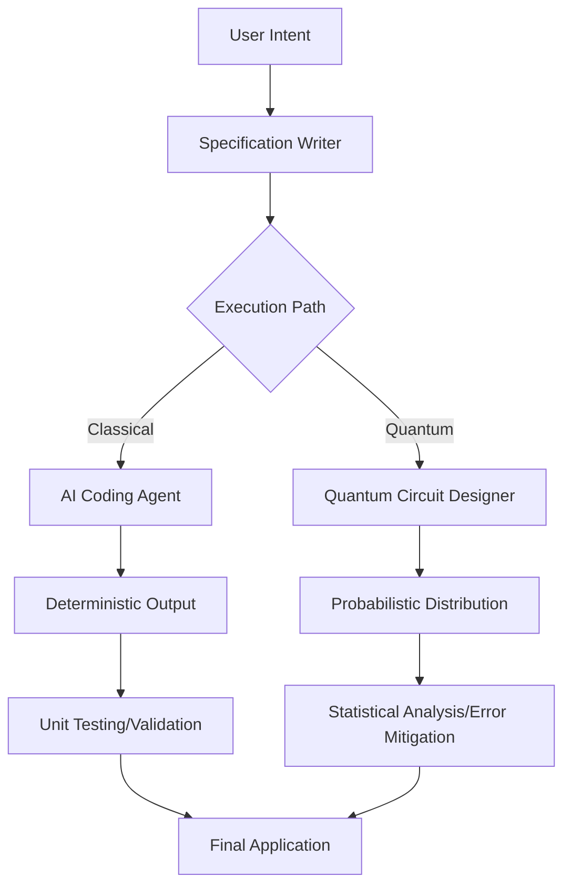

For over fifty years, "Hello World" has been the universal way for a human to say "hi" to a machine. It’s the simplest way to prove something is actually working—a little ritual to make sure the code compiles and the door is open for you to start creating. But as we settle into 2026, that handshake is changing. Printing a simple line of text to a screen isn't really the hurdle anymore. The challenge has shifted from *how* to make a computer talk to *what* we actually want it to solve.

In 2026, "Hello World" isn't about learning where the semicolons go; it's about orchestration. We’ve entered a world where talking to a computer in plain English is the new "assembly language," where quantum qubits are stepping in for binary bits to handle the heavy lifting, and where "vibe coding" has been replaced by a much more disciplined approach to engineering. The door is wide open for anyone to start, but the projects we're building have become far more complex. To get a handle on where we are, we need to look at how AI-driven development, quantum computing, and the very definition of a "developer" have all shifted.

  
  
📸 <a href="https://unsplash.com/@claybanks">Clay Banks</a> on <a href="https://unsplash.com/photos/a-laptop-computer-sitting-on-top-of-a-wooden-desk-8q6e5hu3Ilc">Unsplash</a>

---

## 🤖 The End of the Manual "Hello World" and the Rise of AI Orchestration

For decades, the very first thing you learned in any coding class was how to write a `print` statement. By 2026, that feels like something out of a museum. With AI coding assistants and natural language programming becoming the norm, the "manual" Hello World is pretty much gone for beginners. We’ve moved from **Syntax-First Development** (learning the rules of the language) to **Intent-First Development** (figuring out what you actually want to happen).

A while back, we saw a trend called "vibe coding." It was a period where people tried to build entire apps based on loose prompts and "vibes," basically hoping the AI would fill in the blanks. But as the folks over at [Neward & Associates](https://blogs.newardassociates.com/blog/2026/2025-tech-predictions.html) pointed out, "vibe coding" started to fall apart. Why? Because we realized that building software isn't actually about writing lines of code—it's about understanding a problem well enough to explain the solution.

So, the "Hello World" of 2026 isn't a line of code; it's a **Prompt-Specification Pair**. Beginners aren't stressing over a missing bracket anymore; they're struggling to be clear about what they actually need. The focus has shifted to "AI orchestration," where the developer is like a conductor, guiding an AI through logical steps to get a working result. It’s a weird paradox: it’s easier than ever to generate a "Hello World" app, but it’s harder than ever to fix a complex system built by an AI that doesn't truly "understand" the logic it just wrote.

> "The honeymoon phase of effortless AI generation is over, and the need for actual architectural rigor is hitting home. We aren't replacing developers; we're just swapping the boredom of syntax for the challenge of being precise."

---

## 💡 Blueprint Coding: The New Starting Point

As "vibe coding" faded, a more professional approach took over in 2026: **Specification-Oriented Development (SOD)**. Think of this as moving up a level. Instead of writing the code itself, the developer writes a rigorous specification—basically a blueprint that defines exactly how the software should behave, what its limits are, and how it should handle mistakes. The AI then uses this blueprint as the "source of truth" to build the app.

In this world, the "Hello World" exercise has turned into a "Spec Hello World." Instead of just printing a string, a student is asked to define a specification for a greeting service, including:
- **Inputs:** (e.g., the user's name and their preferred language).
- **Outputs:** (the actual greeting).
- **Edge Cases:** What happens when things go wrong (like if the name is left blank).
- **Performance Metrics:** How fast it needs to be (e.g., a response in less than 10ms).

Tools like **Spec Kit** have baked this right into the workflow. This is a big deal because it captures the heart of programming—logic and breaking problems down—without getting bogged down in the quirky rules of a specific language. By focusing on the "what" instead of the "how," developers in 2026 are learning to think like architects from day one.

This also helps fix the "hallucination" problem we saw in older AI models. When the AI has to follow a strict blueprint, there's much less room for it to make things up. The developer's job is now to "steer" the AI and make sure the final product matches the spec. This is the real "Hello World" of today: getting your human intent and the machine's execution to line up perfectly.

---

## 🔬 The Quantum "Hello World": Getting Used to Probability

While AI handles the "how" of software, 2026 is the year quantum computing finally left the lab and entered the developer's toolkit. For a new generation of engineers, the coolest "Hello World" isn't happening on a laptop—it's happening on a superconducting quantum processor.

Quantum programming requires a totally different way of thinking. Normal programming is deterministic (if you do X, you always get Y). Quantum programming is **probabilistic**. In a regular "Hello World," the result is always the same. In a quantum "Hello World," you're dealing with superpositions and entanglement, and your result is more like a statistical map. As [The Quantum Insider](https://thequantuminsider.com/2026/06/19/state-of-quantum-computing-programming-languages) mentioned, Python is still the foundation, but the real magic happens in frameworks like **Qiskit**, **Cirq**, and **PennyLane**.

The "Hello World" of quantum is usually creating a **Bell State**—basically entangling two qubits so that whatever happens to one instantly affects the other, no matter how far apart they are.

- **Qiskit (IBM):** The industry heavyweight, appearing in **65% of quantum job listings**.
- **Q# (Microsoft):** The go-to for enterprise apps that mix quantum and classical computing.
- **PennyLane (Xanadu):** The leader for Quantum Machine Learning (QML), as it plugs directly into PyTorch and TensorFlow.

It’s a steep learning curve. You have to wrap your head around Hadamard gates, CNOT operations, and "measurement collapse" (the fact that observing a quantum variable actually changes its state). You can't just `print()` a quantum variable. This has brought back a need for math and statistical validation—skills that some ignored during the "move fast and break things" era of web dev.

---

## 📈 Hardware Evolution: Moving Past x86

The gear we use to run our "Hello World" has changed, too. For a long time, Intel and AMD (x86) ruled the world of desktops and servers. By 2026, the tide has completely turned. **ARM architecture**—which started in phones and took off with Apple Silicon—is now the dominant force for laptops and the cloud.

This shift has changed how we build and ship software. We're seeing a huge move toward **Native Compilation** because using "translators" (emulation) is simply too slow. This has made languages like **Rust** and **Zig** incredibly popular because they're fast and safe. Even Microsoft has pivoted hard toward Rust for the core of Windows, choosing stability and security over the old C++ ways.

At the same time, we're seeing **Hybrid Quantum-Classical Infrastructure**. In 2026, a professional "Hello World" might involve an ARM-based server handling the user interface and database, while sending a super-complex math problem to a quantum processor via **CUDA-Q** (NVIDIA's hybrid platform).

According to [SpinQ](https://www.spinquanta.com/news-detail/the-future-of-quantum-application-development-software-trends-and-predictions-for-2026-2030), the market for quantum software is expected to hit **$10 billion by 2030**, growing by over **40%** every year. This is all about "hardware-software synergy"—writing code that is specifically tuned to the physical chip it's running on.

---

## 🌍 The Rise of SLMs and Local-First Development

For a while, the trend was "bigger is better"—think GPT-4 and the quest for a "God-AI" that knows everything. But in 2026, we've seen a shift toward **Small Language Models (SLMs)**.

The "Hello World" of this era is the **Local-First Agent**. Instead of sending every single request to a giant server in the cloud (which is slow and can be a privacy nightmare), developers are using compact, specialized models that run right on the user's device. These micro-LLMs aren't trying to write poetry; they're trained to do one thing perfectly, like writing CSS or optimizing a SQL query.

There are three big reasons for this:
- **Speed:** No more waiting for a round-trip to a data center. AI suggestions in your editor happen instantly.
- **Security:** Companies don't want to send their secret code to a cloud AI. Local models keep the code on the machine.
- **Expertise:** A small 3-billion parameter model trained only on Rust documentation often beats a trillion-parameter general model at writing Rust.

This has led to **Agentic Workflows**, where one "Master Agent" breaks a project into tiny pieces and hands them off to a team of SLMs. Your "Hello World" is now configuring this team. Instead of writing a function, you're designing a pipeline of specialized AI brains.

---

## 🎯 Real-World Use: Quantum-Classical Hybrids

The theoretical "Hello World" of quantum is now actually helping people in the real world. We're seeing "Quantum-Ready" companies using hybrid systems to solve problems that were simply impossible before.

### 🧬 Medicine and Drug Discovery
In pharma, the "Hello World" is simulating how a small molecule interacts. Regular computers struggle with the immense complexity of quantum chemistry. Using **PennyLane** and **SpinQit**, researchers can simulate atoms more accurately, which is estimated to cut the time and cost of early drug development by **30-50%**.

### 💰 Finance (FinTech)
In finance, it's all about **Portfolio Optimization** and **Risk Management**. Instead of old-school simulations, banks are using quantum algorithms to process a million variables at once. For example, SpinQ has worked with banks to optimize ATM placement and liquidity management, making operations far more efficient.

### 🚚 Logistics and Shipping
The "Traveling Salesperson Problem"—that classic CS puzzle—is finally being solved at scale. Companies are using hybrid systems to route thousands of trucks in real-time, adjusting for weather and traffic in ways a regular computer could only guess at.

> **The big takeaway:** Quantum isn't replacing regular computers in 2026; it's giving them a superpower. The industry "Hello World" is now the **Hybrid Workflow**: Classical Prep $\rightarrow$ Quantum Core $\rightarrow$ Classical Cleanup.

---

## 🎯 Fundamentals Over Syntax: Who is the "Developer" Now?

If AI can write the code and the blueprint handles the logic, what does it actually mean to be a programmer in 2026?

The value of a human developer has shifted. We're seeing a huge comeback for **Computer Science Fundamentals** over just knowing a language. It used to be that you identified as a "Java Developer" or a "Pythonista." In 2026, those labels don't mean much.

The most successful developers now are the ones who master:
- **Complexity Analysis:** Knowing Big O notation so they can tell when the AI is generating a slow solution when a fast one exists.
- **System Architecture:** Figuring out how micro-services, SLMs, and quantum modules all fit together.
- **Verification:** Writing the tests and proofs to make sure the AI-generated code is actually correct.
- **Domain Expertise:** Being able to take a business problem (like "how do we stop users from canceling their subscriptions?") and turn it into a technical blueprint.

The "Hello World" for a human developer is now the **Critical Review**. When the AI gives you a solution, your job is to ask: *Why this way? Where will this break? How does it scale?*

There is a real worry about "Junior Developer Extinction." If beginners only use AI to generate code without learning how it works, we'll end up with a generation of "copy-paste architects" who can't fix anything when the AI fails. That's why the industry is bringing back low-level concepts—like memory management and pointers—not because you'll use them every day, but so you actually understand what's happening under the hood.

---

## 🚀 Conclusion: The Endless Horizon of "Hello World"

Looking toward 2030, the "Hello World" of 2026 is just another step in how we talk to machines. We've gone from punch cards to command lines, from IDEs to AI agents, and from bits to qubits.

At its heart, "Hello World" has always been about **connection**. In 1972, it was a connection to a compiler. In 2026, it's a connection to a massive, distributed intelligence. It's never been easier to start—anyone with an idea and the ability to describe it can build an app. But the responsibility of the developer has never been higher.

The future belongs to the **Orchestrators**—the people who can bridge the gap between a human dream and a machine's execution. Whether you're coding a Bell State in Qiskit, setting up a swarm of SLMs, or drafting a blueprint for a global shipping engine, you're doing the same thing the first programmers did. You're telling the machine: *"I'm here, I've got an idea, and I want your help to bring it to life."*

The tools and the hardware have changed, but the spirit is exactly the same. The "Hello World" of 2026 isn't just text on a screen—it's the spark of an idea meeting the power of a quantum, AI-driven world.

**Welcome to the future of coding. Hello, World.**

---

1. 📸 Vladislav Klapin — [Vladislav Klapin](https://unsplash.com/@lemonvlad) on [Unsplash](https://unsplash.com/photos/person-holding-hello-sticker-SymZoeE8quA)
2. 📸 Clay Banks — [Clay Banks](https://unsplash.com/@claybanks) on [Unsplash](https://unsplash.com/photos/a-laptop-computer-sitting-on-top-of-a-wooden-desk-8q6e5hu3Ilc)
