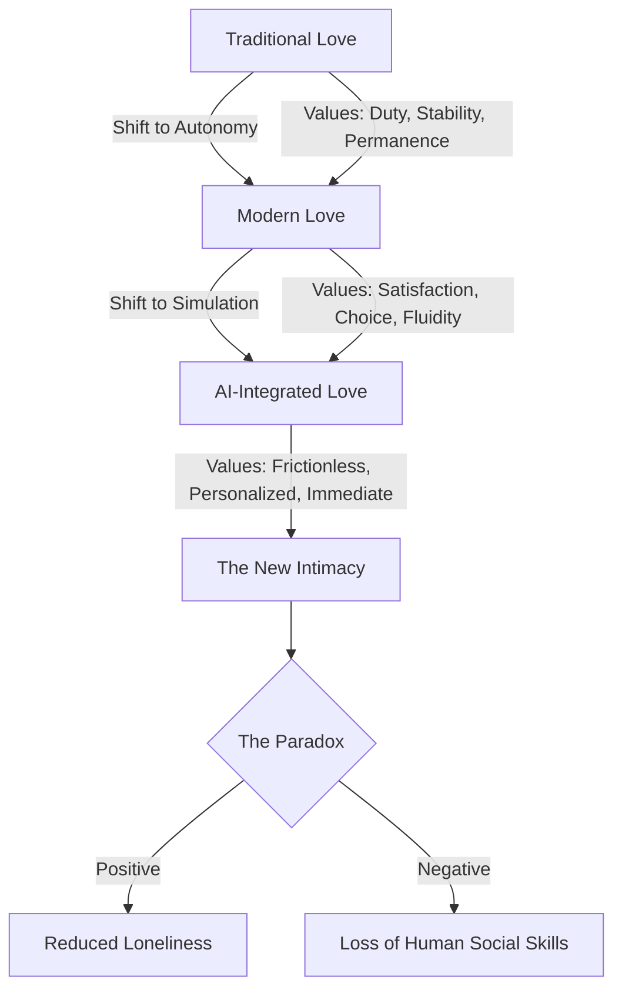

For a long time, the "rules" of love were pretty straightforward: you meet someone, you date, you commit, and you stick it out. The "Old Terms" of love were all about stability, duty, and that romanticized idea of "until death do us part." But looking at where we are in 2026, that playbook hasn't just been updated—it’s been totally rewritten. We've gone from searching for a "soulmate" to navigating "situationships," and from the intimacy of a shared home to the simulated company of an AI partner.

Today, love isn't really a destination you arrive at; it's more like a fluid, ongoing negotiation—and a lot of the time, there's an algorithm involved. It’s a strange contradiction: we have more ways to connect than ever before, yet we’re struggling with significant friction in our relationships. Or, even scarier, some of us are avoiding that friction entirely. To figure out where we're headed, we have to look at the tug-of-war between our old-school need for security and our modern craving for freedom.

---

## 🌍 The Way Love Used to Work: From Duty to "Choose-Your-Own" Passion

When we talk about love in "old terms," we aren't just talking about the 1950s. We're talking about a time when marriage was the glue that held communities together. Back then, love often came second to stability. Marriage was essentially a social contract to ensure the family survived, with very clear roles for men and women and a heavy emphasis on permanence.

But as we've moved further into the 21st century, things have shifted. Sociologists like Anthony Giddens call this **"confluent love."** Unlike the old model—where you stayed committed regardless of whether the relationship felt fulfilling—confluent love is more of a "pure relationship." In this version, you enter a relationship because you want to, and you stay as long as both people are getting what they need from it.

> "The romantic love model, which emphasizes relationship permanence... is being displaced by a new model of intimacy... the 'pure relationship,' meaning a relationship that is entered into for its own sake and maintained only as long as both partners get enough satisfaction from it." — [Contexts/PMC](https://pmc.ncbi.nlm.nih.gov/articles/PMC4244648)

This shift has given us significantly more freedom, but it’s also made things feel a bit precarious. When a "vow" is replaced by "satisfaction," there's always that lingering feeling that things could end if the spark fades. It’s the classic trade-off: we've traded the security of the cage for the anxiety of the open field.

- **Traditional Love**: Centered on stability, social duty, and traditional roles.
- **Confluent Love**: Centered on personal growth, mutual satisfaction, and commitment that lasts as long as it works.
- **The Trade-off**: Greater personal freedom, but increased psychological stress.

---

## 🎯 Decoding the New Lingo: Situationships and Slow Dating

By 2026, the way we talk about love has become a complex web of labels. Most of these are just ways to manage expectations so we don't have to be too vulnerable. The most prominent? The **situationship**. It's that intimate space that refuses to be defined. It’s basically romantic limbo: more than just a casual hookup, but not quite a partnership.

If you look at the psychology behind it, situationships are often where **anxious-avoidant dynamics** play out. The avoidant person loves the ambiguity—they get the perks of intimacy without the "weight" of a label. Meanwhile, the anxious person goes along with the limbo because they're terrified that asking for a definition will drive the other person away. It's a textbook example of the "commitment phobia" prevalent today.

But people are getting burned out. After years of "swipe culture," 2026 has seen the rise of **slow dating**. This is essentially a rebellion against treating romance like a game. Slow dating focuses on:

1. **Quality over Quantity**: Matching with fewer people and actually taking the time to have real conversations.
2. **Dates with a Purpose**: Swapping the "quick coffee" for shared experiences—like hiking, cooking, or volunteering—to see how someone actually functions in the real world.
3. **Heart First**: Building a solid emotional connection before jumping into the physical side of things.
4. **Unplugging**: Intentionally stepping away from the apps to let serendipity happen in person.

This suggests that even though we started by chasing efficiency and "better options," the pendulum is swinging back. We're craving something real. [Psychologie et Sérénité](https://psychologieetserenite.com/en/blog/why-love-looks-different-now-2026-trends-explained) points out that this hyper-connected generation is actually starving for "deeper, more authentic connections" rather than whatever the algorithm suggests.

---

## 📊 The Money Talk: The New Economics of Intimacy

In the "old days," money in a relationship was usually implicit: one person provided, the other nurtured. In 2026, love is much more logistical. Money isn't just about survival anymore; it's a litmus test for alignment. According to a [2026 report by Mercury](https://mercury.com/blog/new-economics-of-modern-love-2026-report), the "economics of love" is now a conscious conversation.

There's a fascinating generational gap here. **Gen Z (39%) and Millennials (35%) are far more likely to plan their finances intentionally** than Baby Boomers (29%). For younger couples, a joint account isn't just a formality—it's a major relationship milestone.

**Key 2026 Financial Stats:**
- **57% of adults** feel they have their daily money management handled, but **73%** feel more confident doing it *with* a partner.
- **90% of couples** say they are mostly or completely open about their finances.
- **1 in 7 people** say that housing costs (such as mortgages or renovations) are where they have to compromise the most.
- **42% of Gen Z** report shifting to "shared money" when they move in together, regardless of marital status.

Even the "password keeper" role has shifted. Women are now more likely than men (**22% vs 14%**) to hold the financial passwords, reflecting a change in domestic power dynamics. However, some old habits persist: **22% of Gen X and 21% of Boomers** admit to hiding financial information because they don't think their partner "gets" money—a gap that has almost entirely vanished with Gen Z (**2%**).

---

## 🤖 The Algorithmic Embrace: From Tools to AI Partners

The biggest leap from the "old terms" of love is how AI has entered the bedroom and the heart. We aren't just using AI to *find* a partner (as we do on Tinder); some people are using AI *as* the partner.

According to the [Institute for Family Studies](https://ifstudies.org/blog/artificial-intelligence-and-relationships-1-in-4-young-adults-believe-ai-partners-could-replace-real-life-romance), **25% of young adults believe AI partners could actually replace real-life romance**. While it sounds like a movie plot, the data shows people are becoming increasingly comfortable with simulated love. In fact, **40% of Gen Z singles** are open to the idea of their future partner having an AI boyfriend or girlfriend.

Why is this happening? A few primary reasons:
- **Zero Risk**: AI partners provide unconditional support and validation. There is no risk of rejection or conflict.
- **The "Practice" Theory**: Some use AI as a training ground to learn how to be better partners to humans.
- **The Next Step from Porn**: There is a clear link between heavy porn use and AI romance; it is viewed as a more "interactive" version of the same experience.

But this "perfect" love has a downside. [Psychology Today](https://www.psychologytoday.com/us/blog/the-digital-self/202406/how-artificial-intelligence-is-reshaping-relationships) warns that it can create an "inferiority complex" in humans. **15.43% of Gen Z** worry that their human partner might actually prefer a tailored, always-available AI over a messy, unpredictable human being.

---

## 🔬 The MIRA Model: The Science of Machine Love

To understand how we can "love" a piece of software, researchers developed the **Machine-Integrated Relational Adaptation (MIRA)** model. As explained in [PMC/NCBI](https://pmc.ncbi.nlm.nih.gov/articles/PMC12960742), AI plays two distinct roles in our lives: the **Relational Partner** and the **Relational Mediator**.

**1. The Relational Partner (The Direct Connection)**
This is when the AI serves as a confidant or companion. MIRA suggests this works through **linguistic reciprocity**—the AI mirrors your tone and communication style, which tricks the brain into feeling "known" and understood.

**2. The Relational Mediator (The Middleman)**
This occurs when the AI sits *between* two humans. It might rephrase a heated text to make it more constructive or suggest a "better" way to ask for something. While this can improve communication, it raises a critical question: **Is it authentic?** If an AI writes your apology, is it actually *your* apology?

> "The universal laws that govern human psychology have not changed simply because high-quality generative AI now exists... Humans seek connection, trust, understanding, and emotional resonance, regardless of whether these needs are fulfilled by humans or machines." — [MIRA Model Research](https://pmc.ncbi.nlm.nih.gov/articles/PMC12960742)

The most concerning aspect of the MIRA model is **Relational Substitution**. This happens when the "low cost" of AI (no judgment, no effort, no fighting) makes the "high cost" of human love (compromising, arguing, being vulnerable) feel like too much work.

---

## 💡 The Friction Gap: Why "Perfect" Love is Dangerous

The most worrying trend in 2026 is the loss of "relational friction." In the past, love was forged through conflict. Learning how to argue, forgive, and meet in the middle is how we grow emotionally.

As [eNCA's "Making Sense"](https://www.youtube.com/watch?v=v1yEWfn1xZA) points out, AI companions for kids and teens are creating a generation that doesn't know how to handle pushback. When you grow up with an AI that is always on its best behavior, you miss out on key social skills:
- **Reading the Room**: Noticing when a partner is grumpy or distant based on their energy.
- **Solving Conflicts**: Learning to navigate a disagreement without a "reset" button.
- **Empathy through Pain**: Understanding someone else's struggle because you've struggled together.

Real relationships aren't smooth. They require patience and the willingness to be misunderstood. When we replace those hurdles with constant validation, we lose the essence of what makes us human. Some students have even reported that their AI chatbots "raised their standards" so high that no real human could possibly compete.

---

## 🚀 The Great Return: The Renaissance of "The Real"

Despite the tech, 2026 is also witnessing a "Return to the Real." A growing group of "relational rebels" are ditching the algorithms to find a modern version of those "old terms" of love.

We're seeing this manifest in several ways:
- **Analog Meetups**: A surge in "no-phone" dates, book clubs, and hiking groups where people meet "in the wild."
- **Conscious Uncoupling**: Using old-school mediation to transform breakups into growth processes rather than wars.
- **Intentional Community**: Moving back toward "tribal" living, focusing not just on one partner, but on a holistic support system of friends and neighbors.

The goal isn't to return to the restrictive roles of the past, but to reclaim the **effort** of loving someone. We're realizing that while AI can give us *attention*, it cannot give us *presence*. Attention is a data stream; presence is a shared sacrifice of time and energy.

---

## 🎯 Finding the Balance: Merging Tech and Touch

As we look ahead, the goal isn't to choose between "old school" (stability) and "modern" (freedom/AI). It's about blending them. The happiest couples of the late 2020s will likely be those who use tech to *enhance* their relationship, but never to *replace* it.

If you're navigating love today, here is a simple three-step guide for "Relational Health":

1. **Check Your Intimacy**: Identify where you're using "frictionless" shortcuts (like AI or social media validation) to avoid the hard work of human connection.
2. **Invite the Friction**: Embrace the awkwardness of real-world dating. Choose the "messy" over the "curated."
3. **Write Your Own Rules**: Forget labels like "situationship" or "marriage." Create a unique agreement with your partner based on your shared values.

At the end of the day, love—regardless of the era—is an act of courage. Whether we're arguing over a joint bank account or dealing with a chatbot's mirroring, we all want the same thing: to be seen, understood, and accepted for who we are—flaws and all.

The algorithm can find you a match, and the AI can fake a conversation, but only a human can hold your hand in the dark. In 2026, the most radical thing you can do is stay present in the mess.

---

*📸 Cover photo by [Emmanuel Phaeton](https://unsplash.com/@emmanuelphaeton) on [Unsplash](https://unsplash.com/photos/love-scrabble-tiles-on-book-page-ZFIkUxRTWHk)*
