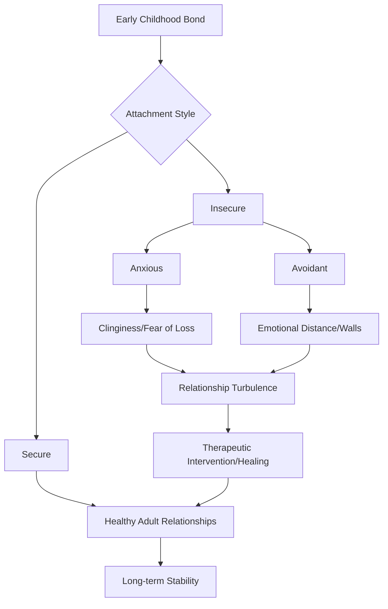

It’s 2026, and honestly, things feel a bit weird. We’re more connected than we’ve ever been—we've got haptic tech, AI that matches us with scary accuracy, and the ability to chat with someone across the world in a heartbeat. But despite all the gadgets, we’re still stuck with that same old question people have been asking since the days of Plato: **What actually *is* love?**

For a long time, we thought of love as a mystery of the heart—a wild, poetic whirlwind that didn't really follow any rules. But as we've moved into the mid-2020s, the way we define love is changing. It’s not just a "feeling" anymore. It’s a mix of brain chemistry, psychological needs, and—more and more—digital connections. We're even seeing the rise of "Hybrid Affection," where the line between loving another human and feeling an emotional bond with an AI is starting to blur.

So, is love just a biological drive to keep the species going? Is it a psychological need to feel safe? Or is it a conscious choice to help someone else grow? To figure this out, we have to look at everything from the sparks in our brain to the lines of code in a Large Language Model.

---

## 🔬 How We’re Wired: The Chemistry of Craving

At its most basic level, love isn't a poem—it's a chemical cocktail. To understand love today, we have to admit that our brains are basically survival machines. Evolution hard-wired us to seek out other people because, back in the day, being alone usually meant you weren't going to survive.

The biological anthropologist [Helen Fisher](https://www.helenfisher.com) broke love down into three main stages, and it makes a lot of sense: **Lust, Attraction, and Attachment**.

1. **Lust**: This is the raw, basic drive to reproduce, fueled mostly by testosterone and estrogen.
2. **Attraction**: This is the "honeymoon phase." Your brain gets flooded with **dopamine** (the reward chemical) and **norepinephrine** (the stuff that makes your heart race and your palms sweat). Interestingly, your serotonin levels actually drop here, which is why you get that "obsessive" feeling where you can't stop thinking about the other person.
3. **Attachment**: Once the initial rush settles, **oxytocin** (the "cuddle hormone") and **vasopressin** kick in. These are the chemicals that create long-term bonds, trust, and that feeling of being "home" with someone.

**The Data on Desire**: Brain scans from 2024–2025 show that the part of the brain that lights up during early romantic love is almost exactly the same as the part that reacts to certain addictive drugs. **About 80% of that early-stage romance** is run by the dopamine system. That’s exactly why heartbreak can actually feel like physical withdrawal.

> "Love is a drive, not an emotion. It is as fundamental to our survival as hunger or thirst." — *Insights from Modern Evolutionary Psychology*

So, from a biological perspective, **love is a survival tool**. It keeps parents together long enough to raise kids and keeps the community tight. But while biology gives us the foundation, our minds build the rest of the house.

---

## 💡 The Mental Map: Beyond the Spark

If biology is the fuel, psychology is the map. By 2026, we've stopped talking just about "finding the right person" and started focusing more on "being the right person." 

One of the best ways to look at this is **Sternberg’s Triangular Theory of Love**, which suggests love is composed of three elements:
- **Intimacy**: Feeling close, connected, and bonded.
- **Passion**: The romance, physical attraction, and chemistry.
- **Decision/Commitment**: The short-term choice to love someone and the long-term promise to keep it going.

When you have all three, you've got **Consummate Love**—the gold standard. But the reality? Data from 2025 surveys shows that **only 15–20% of long-term couples** keep all three levels high at the same time. Usually, passion takes a backseat to commitment as the years go by.

### How Our Past Shapes Our Love
Psychology also tells us that the way we love is often based on how we were treated as children. These **Attachment Styles** act like an "emotional thermostat":
- **Secure Attachment**: You're comfortable with intimacy and comfortable being on your own.
- **Anxious-Preoccupied**: You crave a lot of closeness and often worry about being left.
- **Dismissive-Avoidant**: You keep people at arm's length to protect your independence.
- **Fearful-Avoidant**: You deeply desire closeness, but the vulnerability of it scares you.

In 2026, there's a huge trend toward "Attachment Healing." Instead of just calling a partner "toxic," more people are using therapy to move from an anxious or avoidant style toward **earned security**.

---

## 🤖 Love and Algorithms: The Synthetic Soulmate

The most wild shift in 2026 is the rise of **Synthetic Love**. We aren't just using apps to find humans anymore; some people are forming deep emotional bonds with AI.

With hyper-personalized AI companions, millions of people are experiencing "Algorithmic Intimacy." These AI partners are built to be perfectly empathetic, incredibly patient, and always available. They don't argue, they don't have "bad days," and they tell you exactly what you need to hear.

**The Numbers on Synthetic Bonds**:
- **Market Growth**: AI companionship users jumped by **300%** between 2023 and 2026.
- **Emotional Reliance**: A 2025 study found that **nearly 22% of users** felt "more understood" by their AI than by their actual human partners or friends.
- **Fighting Loneliness**: **65% of users** say AI companions helped them get through lonely transitional phases in their lives.

But is this *really* love? If love is about two people being vulnerable and growing together, then AI love is a simulation. AI cannot be vulnerable because it has nothing to lose. It doesn't "grow"—it just updates its data.

> "The danger of AI love is not that the machine becomes human, but that the human begins to prefer the frictionless simulation of love over the messy, challenging reality of human connection." — *Digital Ethics Review, 2026*

Still, for people with severe social anxiety or deep trauma, these AI partners can act like "emotional training wheels," helping them practice intimacy in a safe space before trying it out with humans again. It's becoming a genuine tool for psychological healing.

---

## 📊 The Reality Check: Swipe Fatigue and "Slow Love"

For a decade, we treated dating like a game—swipe, match, repeat. But by 2026, we've hit a wall called **Swipe Fatigue**.

The data is clear: high-volume dating isn't working. **Over 70% of Gen Z and Millennials** say they're "burnt out" by the paradox of choice. Basically, when you have too many options, you get paralyzed and end up less satisfied with whoever you actually choose.

**What people are doing instead in 2026:**
- **Intentional Dating**: Moving away from "seeing where it goes" and being upfront about long-term goals from the very first message.
- **Slow Dating**: Like the "slow food" movement, people are choosing to date one person at a time to build a real connection.
- **Community Matching**: A return to "old school" ways—friend-of-a-friend introductions and hobby groups are up **40%**.

There's a funny irony here: as our tech gets more advanced, we want our romance to feel more primitive. We miss the "serendipity" that a computer can't create. The "Meet-Cute" isn't just a movie cliché anymore; it's something we actually need for our own mental well-being.

**Quick Comparison: Apps vs. Organic**

| Feature | Algorithmic Matching | Organic Connection |
| :--- | :--- | :--- |
| **Efficiency** | High | Low |
| **Compatibility** | High (on paper) | Hit or miss |
| **Emotional Tension** | Low | High (the good kind of nervous!) |
| **Risk of Burnout** | High | Low |

---

## 🌍 The Big Picture: Redefining "Partnership"

Love also depends on *who* we're allowed to love and how we structure our lives. In 2026, the "nuclear family" isn't the only goal anymore.

We're seeing a rise in **Relationship Pluralism**. Essentially, love is being separated from the requirement of monogamy.

1. **Ethical Non-Monogamy (ENM)**: This includes polyamory and open relationships where everyone is on the same page. In big cities, about **5–10% of adult relationships** now use some form of ENM.
2. **Solo-Polyamory**: A trend where people prioritize their own independence and "singlehood" while still having multiple committed romantic partners.
3. **Platonic Life Partnerships**: The idea that a best friend can be the most important person in your life. More people are choosing to buy houses and raise children with a best friend rather than a romantic partner.

We're moving toward **Customized Commitment**. Instead of trying to fit into a pre-made box (Marriage $\rightarrow$ Kids $\rightarrow$ House), couples are writing "Relationship Agreements" to define their own boundaries and expectations.

> "The future of love is not the absence of commitment, but the presence of conscious, negotiated commitment." — *Global Sociology Forum*

This is all about authenticity. Love is becoming less of a social contract and more of a personal alignment of values.

---

## 🎯 How to Actually Do It: Cultivating Deep Love

Understanding the science and sociology of love is one thing, but *practicing* it when we're all distracted by screens is another. In 2026, the most important skill isn't "chemistry"—it's **Attentional Presence**.

In a world where our attention is pulled in a thousand directions, giving someone your full focus is the ultimate act of love. The "Slow Love" movement suggests a few ways to build a stronger bond:

1. **Digital Detox Zones**: Create "no-phone" areas in your home so your intimacy isn't interrupted by a notification.
2. **Active Vulnerability**: Skip the small talk and go for the "big talk." Share your fears, your shames, and your dreams.
3. **The 5:1 Ratio**: Stick to the "Gottman Ratio"—for every one negative interaction, try to have at least five positive ones.
4. **Collaborative Growth**: Don't think of your relationship as a destination ("We found the one"), but as a project ("We're building something together").

**Quick Tips for Modern Lovers:**
- **Love is a verb**: It’s something you *do* every day, not just something you "fall into."
- **Conflict is actually helpful**: When handled with kindness, arguments are the engine that helps a relationship grow.
- **Boundaries are good**: Clear boundaries don't push people away; they create the safety needed for real intimacy.

---

## Conclusion: The Eternal Flame in a Digital Age

So, what is love in 2026?

It’s the **dopamine rush** of a first date and the **oxytocin warmth** of a twenty-year marriage. It’s the comfort of an AI that knows exactly what to say when you're down, and the challenging, beautiful friction of a human partner who tells you the truth you don't want to hear.

Love is where our most basic biological urges meet our highest psychological goals. The *tools* have changed—we've gone from handwritten letters to haptic pings and AI prompts—but the *essence* is the same: we just want to be seen, known, and accepted.

Whether it's the passion of *Eros*, the deep friendship of *Philia*, the unconditional love of *Agape*, or the new digital bonds we're forming, love is still the only thing that bridges the gap between "me" and "you."

As we navigate the mid-21st century, maybe the biggest lesson is that love isn't something to be "solved" by an algorithm. Love is a choice. It's the decision to stay curious about another person, to embrace the messiness of being human, and to be brave enough to be vulnerable.

In the end, love is the only thing that makes this huge, cold universe feel like home. 🌟

---

*📸 Cover photo by [Yoav Hornung](https://unsplash.com/@yoav) on [Unsplash](https://unsplash.com/photos/love-is-love-wall-art-with-brown-wooden-frame-_FlNNNDezuw)*
