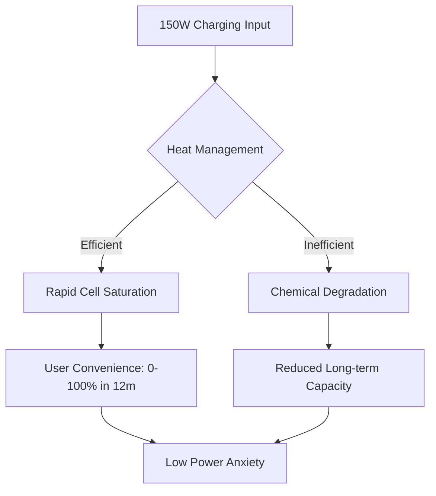

It’s March 2026, and man, the phone world has changed. We’re now using foldables that feel like pieces of paper, AI that basically reads our minds, and batteries that have finally moved past the old lithium-ion limits. But if you wander into tech forums or check out second-hand sites, you’ll notice one phone that people are still talking about: the **Realme GT Neo 3**.

Back when it first launched, everyone called it a "flagship killer." It was that daring device that cared more about raw speed and crazy-fast charging than having a fancy corporate logo. But looking back from 2026, the real question isn't whether it was great back then—it definitely was—but whether it's actually still usable today. Can a phone with a **Dimensity 8100** and a **50MP camera** really hang in a world of 200MP sensors and 2nm chips?

To figure that out, let's look at the actual numbers and see how this rule-breaking machine has held up over the years.

  
  
📸 <a href="https://unsplash.com/@ziontech">I'M ZION</a> on <a href="https://unsplash.com/photos/a-person-using-a-cell-phone-xeeFDmR1-dk">Unsplash</a>

---

## 🚀 The Brains: How the Dimensity 8100 Feels in 2026

To understand the GT Neo 3 today, we have to talk about its heart: the **MediaTek Dimensity 8100**. When this chip came out, it was a total game-changer for efficiency. While other phones were overheating or draining battery like crazy, the 8100 stayed cool and steady, feeling almost as fast as the top-tier Snapdragon chips of the time.

If we look at the numbers, the GT Neo 3 still hits a **3DMark Wild Life score of 5651** with a **stability rating of 95%**. In 2022, that was impressive. In 2026, it's basically the "baseline" for a decent experience. Sure, it doesn't have the fancy AI-processing power of today's phones, but for your everyday stuff—scrolling social media, browsing the web, or getting a few things done—it's still surprisingly smooth. The **quad-core ARM Cortex-A78** (up to **2.85 GHz**) and **quad-core ARM Cortex-A55** (at **2.0 GHz**) still do the heavy lifting without breaking a sweat.

The only place where you really feel the age is in high-end gaming. The **Mali-G610 MC6 GPU** was a beast back in the day, but the ray-tracing and ultra-detailed graphics of 2026's games are just too much for it. You won't exactly see the phone "lag" in the old-school way, but you won't be hitting those 120FPS marks that new phones do.

> "The Dimensity 8100 was probably the most honest chip of its era. It didn't promise the world, but it gave you a consistent, reliable experience that has actually aged better than a lot of those 'overclocked' flagships from the same year."

If you have the **12GB RAM** version, the phone still feels snappy. Multitasking is still a breeze. But if you're on the **6GB** or **8GB** models, you'll notice that today's "super-apps" are a bit bloated, meaning your background apps will close more often than they used to.

---

## 🔋 The Charging: Was 150W a Gimmick or a Genius Move?

If there's one part of the GT Neo 3 that still feels like it's from the future, it's the charging. This thing came with **80W** and a mind-blowing **150W fast-charging** option. Back in 2022, charging from 0% to 100% in under 15 minutes felt like a party trick. In 2026? It feels like something we can't live without.

Phones like the GT Neo 3 actually changed how we use our devices. We stopped the habit of plugging the phone in overnight and started "top-up charging." Being able to plug in for five minutes while you brush your teeth and get 40–50% battery basically killed "battery anxiety."

**The Quick Facts:**
- **Battery Size:** 4500 / 5000 mAh.
- **Charging Speed:** Up to 150W (on some models).
- **Charge Time:** 0-100% in about 10-15 minutes.
- **The 2026 Reality:** The batteries are starting to tire out.

Of course, that speed came with a price. Chemistry is chemistry, and lithium-ion batteries only have so much life in them. By 2026, a lot of original GT Neo 3s are showing some wear and tear. 150W charging creates heat, and even though Realme did a great job with the cooling, the cells eventually age. Most people are finding that their **5000 mAh** battery now feels more like a **3800 mAh** one.

But here's the funny thing: because the **150W charging** is so fast, the battery wear doesn't even really bother you. When you can top off a worn-out battery in 12 minutes, you stop caring that it only lasts a day instead of a day and a half.

---

## 📱 The Screen & Look: Does it Still Look Modern?

The GT Neo 3 has a **6.7-inch AMOLED display** with a resolution of **2412 × 1080 px**. Even though 144Hz and LTPO screens are the norm now, the Neo 3's screen is still a great experience.

The basics of AMOLED—deep blacks and popping colors—haven't really changed, so watching videos on this phone is still a blast. The **Corning Gorilla Glass 5** has held up well too, though most of us have a few scratches after four years of use.

Design-wise, the GT Neo 3 was very "2022"—sleek, slightly curved edges, and a light frame weighing only **188g**. Nowadays, we see a lot of flat screens and blocky, industrial looks. This actually makes the Neo 3 feel "classic" rather than "old." Honestly, it fits in the hand much better than some of the heavy, camera-bump-heavy bricks we have today.

**How it compares: 2022 vs. 2026 Displays**
- **GT Neo 3:** 120Hz AMOLED, FHD+, standard brightness.
- **2026 Mid-ranger:** 144Hz LTPO AMOLED, QHD+, 3000+ nits brightness.
- **The Verdict:** It's still "great," but it's not nearly as bright as new phones, which makes it a bit harder to see under the bright midday sun.

The buttons and haptics have stayed solid. Unlike some cheap phones that feel "mushy" after a year, the GT Neo series was built for power users, and that toughness is really paying off now.

---

## 📸 The Camera: Megapixels vs. AI Magic

The cameras are where you can really see the gap between 2022 and 2026. You've got a **50MP main camera** and a **16MP secondary**. On paper, 50 megapixels sounds like plenty, but the real story is different.

Photography in 2026 isn't about the sensor size anymore; it's about the **AI software**. Modern phones merge a dozen frames and fix the lighting in real-time. The GT Neo 3 does things the "old way." While it takes sharp photos in the daylight, it really struggles with the low-light "night modes" that every phone has these days.

**The "Old School" Photo Experience**
Imagine taking a photo of a city skyline at night. A 2026 phone uses AI to wipe out noise and perfectly balance the neon lights. The GT Neo 3 gives you an "honest" photo—you'll see the grain, a bit of blur in the shadows, and maybe some blown-out lights. For some, that's a downside. But for the "digital minimalists" of 2026, this natural look is actually becoming trendy again, kind of like the comeback of film photography.

- **The Good:** Fast shutter, great daylight colors, reliable selfies.
- **The Bad:** Weak ultra-wide lens, no real optical zoom, dated HDR.

> "The GT Neo 3 reminds us that a camera is just a tool for capturing a moment, not necessarily for making a masterpiece. It gets the job done, but it doesn't do the thinking for you."

Still, for the average person just posting to social media, that **50MP sensor** is more than enough. It's plenty of resolution for cropping, and the colors look natural.

---

## ⚙️ Software: From Android 12 to the 2026 World

The GT Neo 3 started with **Android 12**. By 2026, Android has changed a ton, with new ways of handling privacy, multitasking, and AI.

The biggest headache for Neo 3 owners in 2026 is software support. Most of these phones have hit the end of their official update road. That means you're probably stuck on Android 14 or 15, missing out on the latest AI features that define today's phones.

However, the hardware is still plenty strong—the **PCMark for Android Work 3.0 score of 14352** proves that. The problem isn't the processor; it's that modern apps are just hungrier. They're built for 16GB of RAM and AI accelerators, so some heavy apps might take a few extra seconds to load.

**The "Custom ROM" Savior:**
Because this phone was a hit with tech enthusiasts, the developer community kept it alive. A lot of users have switched to custom ROMs to get the latest Android versions and a "clean" experience. This has basically given the phone a second life, stripping away the Realme UI bloat and letting the **Dimensity 8100** actually breathe.

**Software Health Check in 2026:**
1. **App Compatibility:** About 95% of apps still work perfectly.
2. **Security:** Official updates are gone; custom kernels are the only way to stay safe.
3. **Smoothness:** Still feels fluid, though you'll see a few "stutters" in AI-heavy apps.
4. **Storage Speed:** With internal reads of **1193 MB/s**, apps still open pretty quickly.

---

## 📊 The Bottom Line: Was it Actually a Good Deal?

Looking back, the Realme GT Neo 3 was a masterclass in value. It gave you 90% of a flagship experience for half the price. In 2026, it's not about the "purchase value" anymore—it's about how well it lasted.

If you look at the cost-per-year, the GT Neo 3 is a huge win. Someone who bought this in 2022 and is still using it today has spent way less than someone who upgrades every single year. The **128GB and 256GB storage** options were generous back then, and while 256GB is the bare minimum now, it's still enough for most people who use the cloud.

**How it stacks up in 2026:**

| Feature | GT Neo 3 (2022) | 2026 Mid-Range | Status in 2026 |
| :--- | :--- | :--- | :--- |
| **CPU** | Dimensity 8100 | Dimensity 8xxx/9xxx | Capable but dated |
| **Charging** | 150W | 100W - 200W | Still Competitive |
| **RAM** | 6/8/12 GB | 12/16/24 GB | Tight for power users |
| **Screen** | 120Hz AMOLED | 144Hz LTPO | Very Good |
| **Camera** | 50MP Main | 100MP+ AI-driven | Outclassed |

The GT Neo 3 proved you don't need the most expensive chip to have a phone that lasts four years. By focusing on efficiency and a killer charging system, Realme made a device that didn't just compete—it endured.

---

## 🎯 Final Verdict: The Legacy of the Neo 3

Closing the book on the Realme GT Neo 3 in 2026, we've found a bit of an anomaly. It's a reminder of a time when "performance" meant stability and charging speed, not generative AI and foldable glass.

Is it still a "good" phone in 2026? **Yes.** For a student, a casual gamer, or someone who needs a reliable second phone, the GT Neo 3 is still a powerhouse. That **150W charging** is its greatest legacy—it's still relevant and often better than modern "premium" phones that have actually slowed down their charging to save the battery.

The GT Neo 3 wasn't just another product; it was a statement. It told the industry that we value speed and efficiency over marketing hype. It might not have the AI-magic of 2026, but it has something better: **proven reliability**.

**Tips for the 2026 User:**
- Still have one? **Swap the battery** and it'll feel brand new again.
- Check out **custom ROMs** to keep your software fresh and secure.
- Enjoy that **slim design** and **light weight** before all phones become heavy bricks.

In the end, the Realme GT Neo 3 didn't just kill the flagship; it lived way longer than anyone expected. It's proof that when you build a device around the right priorities—efficiency, speed, and value—it doesn't just last for a contract; it lasts for an era.

---
*For more detailed benchmarks and technical comparisons, visit [UL Solutions Benchmarks](https://benchmarks.ul.com/hardware/phone/Realme+GT+Neo3+review) or explore the [Realme Official Archive](https://www.realme.com).*

---

1. 📸 I'M ZION — [I'M ZION](https://unsplash.com/@ziontech) on [Unsplash](https://unsplash.com/photos/a-man-sitting-at-a-desk-o902m7kiOWs)
2. 📸 I'M ZION — [I'M ZION](https://unsplash.com/@ziontech) on [Unsplash](https://unsplash.com/photos/a-person-using-a-cell-phone-xeeFDmR1-dk)
