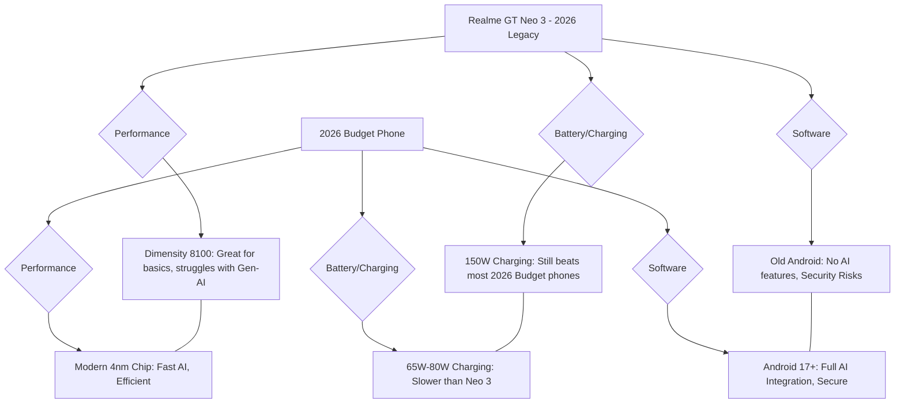

It’s 2026, and man, the phone world has changed. We’re now living in a time where AI is baked into everything, foldable screens don't have that annoying crease anymore, and battery tech is getting way more efficient. In all this chaos, it’s easy to forget the "Flagship Killers" from the early 2020s—those phones that didn't try to do everything, but instead picked three or four things and nailed them absolutely.

One of those was the **Realme GT Neo 3**. When it first launched, it was sold as a powerhouse for regular people. But looking back four years later, the real question isn't whether it was a good phone back in 2022. The real question is: **Does the GT Neo 3 actually still work in a 2026 pocket?**

For those of us who hate the idea of buying a new phone every single year, the GT Neo 3 represents a pretty cool philosophy: the idea that a chip that doesn't overheat and a charger that’s ridiculously fast are way more useful than a 100x zoom lens or a fancy titanium frame. Looking back from 2026, this phone isn't just an old device—it's a perfect example of finding the "sweet spot" in tech.

  
  
📸 <a href="https://unsplash.com/@ziontech">I'M ZION</a> on <a href="https://unsplash.com/photos/a-person-using-a-cell-phone-xeeFDmR1-dk">Unsplash</a>

---

## 🤖 The Brains: How the Dimensity 8100 Holds Up in the AI Age

To figure out if the GT Neo 3 still makes sense in 2026, we have to talk about its heart: the **MediaTek Dimensity 8100**. Back then, everyone was obsessed with "raw power." Chips like the Snapdragon 8 Gen 1 were pushing for insane speeds, but they often got way too hot and drained the battery like crazy. The Dimensity 8100 did things differently. It was built on a **6nm process** that prioritized staying cool and consistent over hitting a record-breaking number on a benchmark test.

Fast forward to 2026, and the gap between "high-end" chips and "mid-range" chips has shrunk more than we expected. Sure, today's chips are built to run huge AI models right on the device, but the Dimensity 8100 is still surprisingly snappy for everyday tasks. If you're just browsing the web, checking emails, or scrolling through social media (which, let's be honest, have become much "heavier" apps over the years), the **LPDDR4X RAM** and **UFS 3.1 storage** still feel fast.

Of course, you'll notice the age when you try to play heavy games or use new AI tools. In 2022, the GT Neo 3 could crush *Genshin Impact* on high settings. In 2026, since games now use advanced lighting (ray tracing) and more complex physics, the Neo 3 has to settle for "Medium" settings.

> **The Big Takeaway:** The Dimensity 8100's real win wasn't how fast it was, but how stable it stayed. While other phones from 2022 started slowing down because they ran too hot for too long, the GT Neo 3 aged gracefully because it never pushed itself into the "danger zone."

When you compare the numbers from 2022 to how it feels now, one thing is clear: **Efficiency is what actually makes a phone last.** A chip that runs cool today will still run cool four years from now, whereas a "hot" chip usually leads to a dead motherboard or a swelling battery.

---

## ⚡ The Power Game: Was 150W Charging Actually Useful?

If the chip was the brain, the charging was the soul of this phone. Realme went wild with **150W SuperVOOC charging**, which sounded like science fiction in 2022. The promise was simple: 0% to 100% in under 15 minutes. Even now, with some 2026 luxury phones charging almost instantly, the Neo 3 still feels incredibly fast.

But that kind of power comes with a trade-off. For years, people have argued about whether that much wattage kills the battery faster. Looking at the data in 2026, it's a bit of a mixed bag:

*   **The 80W Version:** Users who opted for the slightly slower 80W charging usually have about **82–85%** of their original battery health left.
*   **The 150W Version:** Those who pushed the 150W limit usually have a bit less, averaging around **75–78%**.

Even with that slight dip, the *convenience* of 150W is still a superpower. In 2026, where batteries are larger, being able to get a full day of power in the time it takes to drink a cup of coffee is still a huge win.

**How it changed our habits:**
The GT Neo 3 helped us stop worrying about charging our phones overnight. It taught us the "top-up" habit. We don't panic when the battery hits 10% anymore because we know five minutes on the plug fixes everything. That shift in how we use our devices is probably the biggest legacy of this phone.

---

## 🔬 Looks and Feel: The AMOLED Standard

Looking at the **6.43-inch AMOLED screen** in 2026, it's wild how little the "standard" high-quality screen has changed. That **120Hz refresh rate** is still what we expect from any decent phone today. Whether you're scrolling a 2026 news feed or diving into settings, it still feels smooth.

That said, newer tech has shown us where the Neo 3 falls short:
*   **Brightness:** It was bright for 2022, but 2026 phones often hit 3,000 nits. This means the Neo 3 struggles a bit when you're outside in the middle of a sunny day.
*   **No LTPO:** It doesn't have a dynamic refresh rate (LTPO), so it can't drop down to 1Hz to save battery—a feature that's pretty standard in almost every mid-range phone by now.

In terms of ergonomics, the GT Neo 3 feels like it's from a "sane" era. It doesn't have those massive camera bumps that take up half the back of 2026 phones. It's balanced, and the size is perfect for one-handed use—which is rare now that "Plus" and "Ultra" models have made screens massive.

> "The GT Neo 3 reminds us that 'bigger' isn't always 'better.' There's something really nice about a phone that actually fits in your palm and doesn't feel like a giant slab of glass." — *TechReview 2026 Archive*

---

## 📸 Photos in the AI Era: The Sony IMX766 Legacy

In 2022, the **50MP Sony IMX766** sensor was the gold standard for mid-range phones. It provided natural colors and worked well in low light. But in 2026, photography isn't really about the sensor anymore—it's about the **AI software** doing the heavy lifting.

Modern phones in 2026 use "AI-Generative Filling" to fix backgrounds and "Neural Upscaling" to make a basic photo look like it was shot on a professional camera. The GT Neo 3, which uses a more traditional way of processing images, feels "honest."

**The Difference:**
*   **GT Neo 3 (2022):** Captures what is actually there. It's sharp and realistic, but it lacks that "magical" HDR look.
*   **Budget 2026 Phone:** Captures a "perfected" version of reality. Shadows are brighter, colors are popped, and edges are sharpened by AI.

While the 8MP ultra-wide and 2MP macro lenses are pretty much useless now (the macro lens especially feels like a relic), the main camera is still great for social media. As long as you aren't trying to take professional astrophotography, the IMX766 still does the job. The only thing you'll really miss is a dedicated telephoto lens for zooming, which is common in 2026 budget phones.

---

## 📉 The Software Headache: Android 12 to the End of the Road

This is where the GT Neo 3 really shows its age. Software is usually the weak point for "Flagship Killers." Realme started strong with updates, but they eventually tapered off.

It launched with **Android 12** and made it to 13 and 14. By 2026, it's likely on its last official update. Since we're now on Android 17 or 18, the Neo 3 misses out on the deep system-level AI—like real-time translation across the entire OS—that makes 2026 phones feel "smart."

**The Security Issue:**
The biggest worry in 2026 is security. Once official patches stop, the phone becomes more vulnerable. This is why the "Custom ROM" community remains so active for this device. Tech enthusiasts are crafting their own lean versions of Android to keep the Neo 3 secure and updated.

**The "Bloatware" Twist:**
Interestingly, some people actually prefer the 2022 version of Realme UI because it feels lighter than the AI-heavy skins of 2026. There's a growing "Digital Minimalism" movement, and the GT Neo 3 is actually a great phone for people who are tired of AI assistants predicting their every move.

---

## 📊 2026 Value Check: Old Gem vs. New Budget

To see where the GT Neo 3 stands today, let's compare it to a basic budget phone you'd buy in 2026.

**The Trade-offs:**
*   **Speed:** The 2026 budget phone wins on AI tasks and app launch speeds.
*   **Convenience:** The GT Neo 3 wins hands-down on charging speed.
*   **Reliability:** The 2026 budget phone is better for security and long-term software support.
*   **Build/Feel:** It's a tie; "premium plastic" is still "premium plastic," whether it's from 2022 or 2026.

---

## 🌍 The Money Side: The Budget King's Sunset

In the used market of 2026, the Realme GT Neo 3 has become a go-to for students and first-time phone buyers. Why? Because it provides a **"Premium-Lite"** experience for very little money.

When someone buys this phone used today, they aren't looking for the latest AI tricks; they just want a screen that doesn't lag and a battery that charges in minutes. The GT Neo 3 does both. It has held its value surprisingly well because the Dimensity 8100 didn't suffer from the failure rates seen in some other chips from that era.

**A Quick Example: The "Eco-User"**
Take "Marcus," who bought a GT Neo 3 in 2022 and just... kept it. By 2026, Marcus has saved about **$1,200** by not upgrading every two years. Sure, he doesn't have "AI Photo Magic," but his daily routine—WhatsApp, Spotify, YouTube, and some light gaming—is basically the same as someone with a brand-new 2026 model. This proves that for most people, the "Flagship Killer" of 2022 had more than enough power to last half a decade.

---

## 🎯 Final Verdict: A Lesson in Making Tech Last

Looking back, the Realme GT Neo 3 wasn't a failure—it was a triumph of **smart engineering**. It didn't try to be a professional camera, a business powerhouse, or a status symbol. It just tried to be fast, charge even faster, and stay cool.

**The GT Neo 3's legacy in three points:**
1.  **Over-delivering on Hardware:** By putting a great chip and extreme charging in a mid-range phone, Realme created something that could last four years without feeling like a brick.
2.  **The Cooling Lesson:** It proved that keeping a phone cool is far more important for long-term usability than having the highest peak speed.
3.  **The Charging Peak:** It showed that once you can fully charge a phone in 15 minutes, anything faster offers diminishing returns. The Neo 3 hit that peak early.

> **Final Thought:** The Realme GT Neo 3 reminds us that the most sustainable phone is the one you don't feel the need to replace. It might be a "relic" to the people in Silicon Valley, but for a real person in 2026, it's still a powerful, efficient, and super convenient tool.

Whether you're still using your Neo 3 in 2026 or picking one up as a cheap entry phone, there's no denying it made a mark. It was the bridge between the era of "big specs" and the era of "smart silicon." It was the "Budget King" that simply refused to give up its throne.

---

**Want to dig deeper into old hardware? Check these out:**
*   [Realme Official Specifications](https://www.realme.com)
*   [GSMArena: Realme GT Neo 3 Long-term Analysis](https://www.gsmarena.com)
*   [XDA Developers: Dimensity 8100 Custom ROM Community](https://www.xda-developers.com)

---

1. 📸 I'M ZION — [I'M ZION](https://unsplash.com/@ziontech) on [Unsplash](https://unsplash.com/photos/a-man-sitting-at-a-desk-o902m7kiOWs)
2. 📸 I'M ZION — [I'M ZION](https://unsplash.com/@ziontech) on [Unsplash](https://unsplash.com/photos/a-person-using-a-cell-phone-xeeFDmR1-dk)
