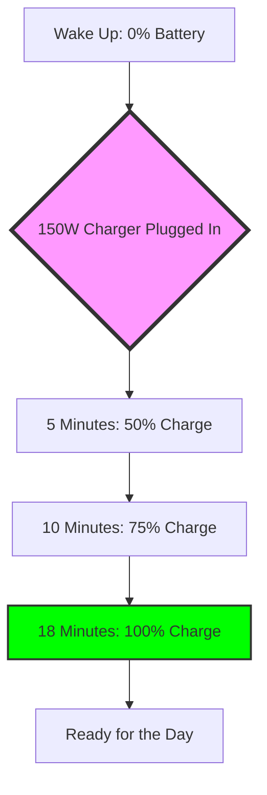

Picture this: it’s a Tuesday morning in 2026. You wake up at 7:45 AM and realize—with that little jolt of panic—that you forgot to plug in your phone last night. Back in the early 2020s, this would have been a total disaster. You’d spend your whole day glued to a power bank or hunting for a wall outlet in a crowded office. But if you own a **Realme GT Neo 3**, it’s barely an issue. A quick five-minute sprint to the charger, and you're already at **50% battery**. This wasn't just a cool feature; it completely changed the way we think about phone battery.

Looking back from 2026, the GT Neo 3 was a real turning point in the "charging wars." While today's fancy phones are all about AI chips and folding screens, the GT Neo 3 was the face of the **UltraDart** era. It proved that raw charging speed could actually change our daily habits. It wasn't just about bragging rights with the numbers; it was about the freedom of not being tethered to a wall. Let’s dive into the hardware, how the software held up, and whether this "power-first" device actually stood the test of time.

  
  
📸 <a href="https://unsplash.com/@ziontech">I'M ZION</a> on <a href="https://unsplash.com/photos/a-person-using-a-cell-phone-xeeFDmR1-dk">Unsplash</a>

---

## 🤖 The Brains of the Operation: Dimensity 8100 Today

When the Realme GT Neo 3 first hit the shelves, the **MediaTek Dimensity 8100** was a bold choice. For a long time, the narrative was that Qualcomm's Snapdragon chips were for the high-end gear and MediaTek was for budget phones. The Dimensity 8100, built on **TSMC's 5nm process**, basically proved everyone wrong. With **4x 2.85 GHz Cortex-A78** and **4x 2.0 GHz Cortex-A55** cores, it was incredibly efficient for its time.

Looking at it now in 2026, it's easy to see why this chip aged so well. Sure, the peak benchmarks—like that **AnTuTu v9 score of 819,348**—look a bit small compared to the monsters we have now, but in the real world, it still feels smooth. The Dimensity 8100 didn't try to hit crazy "burst" speeds that just made the phone overheat; instead, it stayed steady and reliable. That’s why, four years later, the GT Neo 3 still handles multitasking better than a lot of the budget phones you can buy today.

Thanks to the **LPDDR5 RAM** (up to **12GB**) and **UFS 3.1 storage**, apps still open quickly. That said, gaming has changed. Back in 2022, you could blast through *Genshin Impact* at **60fps on max settings**. In 2026, those settings make the phone run pretty hot, so most people have dialed it back to medium.

> "The Dimensity 8100 was really the 'sweet spot' of the 5nm era—you got 90% of the flagship power but 100% of the stability."

It also helps that Realme packed in a **nine-layer heat dissipation system**, including a big **VC (Vapor Chamber) heatsink**. Without that aggressive cooling, the chip probably would have struggled with the overheating issues we saw in other phones from that era.

---

## ⚡ The Magic of 150W: Changing the Way We Charge

The real star of the show is, hands down, the **150W UltraDart charging**. To understand why this was such a big deal, you have to think about the mental shift it caused. We stopped "overnight charging" and started "opportunity charging"—basically just plugging it in whenever we had a spare few minutes.

The numbers are still pretty wild:
- **0% to 50%**: Only about **5 to 7 minutes**.
- **0% to 100%**: Roughly **16 to 20 minutes** (depending on room temperature).
- **Initial boost**: You're gaining about **10% charge every minute** at the start.

They pulled this off using a dual-cell battery setup, which lets the charger pump power into two batteries at once without things getting dangerous. This move forced every other phone company to speed up. Even though the **4500mAh battery** (in the 150W version) is a bit smaller than the **5000mAh** one in the 80W model, the trade-off for that speed was a total win for convenience.

Now, looking back from 2026, there is a catch: **Battery Health**. Pumping that much power into a battery eventually takes a toll. People who've used the phone for three years say their battery capacity has dropped by about **15-20%**. But honestly? The convenience was so great that most users are happy to just pay for a battery replacement after a few years.

---

## 🔬 Let's Talk Cameras: The Sony IMX766 Legacy

The camera setup on the GT Neo 3 is a great example of "doing the job well." It uses the **Sony IMX766** main sensor—a **50MP** beast with **OIS (Optical Image Stabilization)** and an f/1.88 aperture. In 2022, this was flagship level; in 2026, it's still a reliable workhorse for Instagram and casual snaps.

The IMX766 is great because its **1/1.56" sensor size** gives you a natural background blur (bokeh) and decent low-light shots. However, when you look at the other cameras—the **8MP ultra-wide** and the **2MP macro**—the difference is pretty shocking. The ultra-wide is okay, but the macro lens is, as most 2026 reviewers put it, "basically just there for decoration."

**How the camera holds up (2022 vs 2026):**
- **Dynamic Range**: Still solid; it handles bright skies and dark shadows well.
- **Colors**: Realme's processing aged well—the colors are punchy but don't look fake.
- **Video**: **4K at 60fps** is still the standard, and the stabilization makes vlogging easy.
- **Selfies**: The **16MP front camera** is fine, though it struggles with the crazy high-res AI filters we use now.

One thing people forget is the **HEIF 10-bit photo** support. It captures a billion colors, so skies and skin tones look smooth. When you view those photos on the phone's own **10-bit AMOLED screen**, they still look gorgeous today.

> "The GT Neo 3 proves that one amazing sensor is way more useful than three mediocre ones."

---

## 🌐 Software: The Journey from Android 12 to Now

The software story of the GT Neo 3 has been a bit of a ride. It started with **Android 12** and **Realme UI 3.0**, promising a smooth, customizable feel. Over the years, it moved through Android 13 and into Android 14, with some tech-savvy users installing custom ROMs to keep it feeling fresh.

Realme UI has always been a mix of "lots of cool features" and "too many pre-installed apps." Even in 2026, people remember the annoyance of that "bloatware" cluttering things up. But the way it was optimized for the Dimensity 8100 was impressive. The "GT Mode" let you push the CPU and GPU for gaming, which became a lifesaver as apps got heavier over time.

**The Update Path:**
1. **The Start**: Android 12 (Realme UI 3.0) — All about the looks.
2. **The Middle**: Android 13 (Realme UI 4.0) — More about stability and battery life.
3. **The End**: Android 14 and security patches — Pure maintenance mode.

A really smart addition was the **dedicated display chip**. It used frame interpolation to make games feel smoother without draining the battery. It was a glimpse of the "AI-upscaling" we see in every single phone in 2026. Even though the security updates eventually stopped, the phone still works great because the hardware was actually more powerful than the software ever needed.

---

## 📈 Living with it: The 2026 User Experience

Owning a GT Neo 3 for four years tells us a lot about how these things are built. The **AG Glass** back and **Corning Gorilla Glass 5** front have held up surprisingly well. However, the plastic frame is where you can tell it wasn't a top-of-the-line flagship. The polycarbonate edges get scuffed and scratched way easier than aluminum would.

Performance-wise, that **120Hz AMOLED screen** is still the best part. With a **1080 x 2412** resolution and **394 ppi**, it’s still sharp. And the **1000Hz touch sampling rate** means the phone still feels snappy, which is huge for anyone still using it for gaming.

**The "Aging" Reality:**
- **Boot Time**: It used to take 20 seconds; now it's more like 35.
- **Battery Life**: You get about **6-7 hours of screen-on time** now, down from the original 8-9.
- **App Speed**: Daily stuff like WhatsApp, Instagram, and Chrome still run without any lag.
- **Heat**: It runs a bit warmer when charging now, likely because the battery is aging.

Also, while the **in-display fingerprint sensor** was a bit glitchy at first, software updates eventually fixed it. And the **dual stereo speakers** with **Dolby Atmos** still sound loud and clear for watching videos.

---

## 🎯 The Bottom Line: Is it Still Worth it in 2026?

By June 2026, the Realme GT Neo 3 has gone from a "powerhouse" to a "budget king." With prices dropping—sometimes as low as **₹20,490** in some markets—it's a really tempting option on the refurbished market.

If you compare a used GT Neo 3 to a brand-new 2026 budget phone, you might be surprised. A lot of new budget phones use "efficient" chips that are actually pretty weak. The GT Neo 3, with its **Dimensity 8100**, often beats them in raw speed and gaming.

**Why grab a GT Neo 3 in 2026?**
- **Insane Charging**: Most budget phones today still charge at 33W or 67W. **150W** is still a superpower.
- **Great Screen**: 120Hz AMOLED is common now, but the color accuracy on this 10-bit panel is often better than the cheap LCDs you find in new budget phones.
- **The Basics**: You get a great main camera, fast storage, and plenty of RAM.

The only real downsides are the lack of **water/dust resistance** and the aging battery. But if you care more about speed and a great screen than "ruggedness," it's an amazing value.

---

## 🌍 Wrapping Up: The Legacy of the "Speed Demon"

The Realme GT Neo 3 wasn't trying to be a timeless masterpiece like an iPhone or a Galaxy S-series. It was designed to be a **disruptor**. It took one specific thing—extreme fast charging—and made it available to everyone.

By 2026, the GT Neo 3 is more than just a gadget; it's a reminder of a time when phone innovation was about pushing the limits of power and heat. It proved that a "mid-range" phone could feel like a "flagship" if the company focused on the things that actually matter to users.

We don't remember the GT Neo 3 for its macro lens or its plastic frame. We remember it for the feeling of plugging it in for five minutes and knowing you were set for the next five hours. It changed what we expected from our phones and helped kill "low battery anxiety" for good. Whether it's a student's first phone or a power user's backup gaming device, the GT Neo 3 is a testament to what happens when you focus on one big, bold idea.

**Final Verdict for 2026:** A legendary "bridge" device that brought flagship speed to the rest of us. Its heart might be four years old, but it's still beating strong.

---
*Sources: [GSMArena](https://www.gsmarena.com/realme_gt_neo_3-11436.php), [Gadgets 360](https://www.gadgets360.com/realme-gt-neo-3-price-in-india-106809), [Stuff.tv](https://www.stuff.tv/review/realme-gt-neo-3-150w-review)*

---

1. 📸 I'M ZION — [I'M ZION](https://unsplash.com/@ziontech) on [Unsplash](https://unsplash.com/photos/a-man-sitting-at-a-desk-o902m7kiOWs)
2. 📸 I'M ZION — [I'M ZION](https://unsplash.com/@ziontech) on [Unsplash](https://unsplash.com/photos/a-person-using-a-cell-phone-xeeFDmR1-dk)
