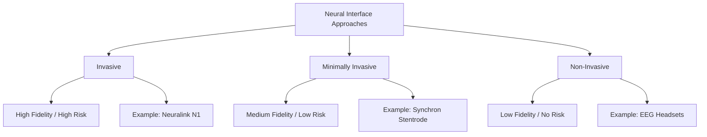

Can you imagine a world where there’s absolutely no delay between thinking of something and actually doing it? No typing, no talking to a voice assistant, no awkward hand gestures—just a quick thought, and the digital world around you reacts instantly. For a long time, this sounded like something straight out of a sci-fi movie or a cyberpunk novel. But here we are in 2026, and the line between our brains and our gadgets isn't a wall anymore; it’s more like a screen door.

High-bandwidth Brain-Computer Interfaces (or BCIs) have officially moved past the "let's see if this works" phase. We're seeing them transition from medical experiments into a legitimate industry. Whether it's the big headlines from **Neuralink** or the quieter, more precise work from **Synchron**, the goal has shifted. It's no longer just about "fixing" injuries—it's about giving the human mind an upgrade. But as we start blending neurons with silicon, we aren't just updating our hardware; we're fundamentally changing how we think about privacy, identity, and who is really in control.

---

## 🔬 The Technical Side: Three Ways to Connect

  
  
📸 <a href="https://unsplash.com/@whisperingshiba">Shawn Day</a> on <a href="https://unsplash.com/photos/a-computer-generated-image-of-a-human-brain-ZnkHPagIOlM">Unsplash</a>

To get a handle on where we are in 2026, it helps to realize that "Neural Interface" is an umbrella term. There are actually three very different ways to achieve this, and the choice usually comes down to a simple trade-off: **signal clarity versus surgical risk.**

First, there are the **Invasive BCIs**. This is the "deep dive" approach taken by companies like [Neuralink](https://neuralink.com/) and [Blackrock Neurotech](https://blackrockneurotech.com/). They use tiny electrode arrays that are implanted directly into the brain. For example, Neuralink’s **N1 implant** uses **1,024 electrode contacts** spread across **64 ultra-thin threads**—each one thinner than a human hair. Because they reside directly in the motor cortex, they can pick up "single-neuron" signals. This allows them to decode complex thoughts—like moving a cursor or playing a game—with incredible speed and precision.

Then we have the **Minimally Invasive** route, where [Synchron](https://www.synchron.com/) really shines. Instead of drilling into the skull, they slide their **Stentrode** through the jugular vein until it sits in a blood vessel right next to the motor cortex. While the signal isn't quite as sharp as a direct implant, it eliminates the need for open-brain surgery, making it a far more realistic option for a larger population.

Finally, there are **Non-Invasive BCIs**. These use sensors like EEG or fNIRS. While they can't "hear" individual neurons, they can pick up the general "hum" of brain activity. By 2026, these have evolved into sophisticated wearables—like headphones or headbands—that track focus or stress levels. They've essentially become part of the broader "wellness" trend.

---

## 🎯 Real-World Wins: From Paralysis to Perception

The most impactful part of BCI tech in 2026 is seeing it change lives in clinical settings. We've progressed from simply moving a mouse cursor to restoring true independence. **Noland Arbaugh**, the first person to receive a Neuralink implant, paved the way by demonstrating that someone with quadriplegia could reintegrate into the digital world. Since then, the breakthroughs have only accelerated.

One of the most mind-blowing developments is the **"Digital Bridge"** from the University of Lausanne. They created a wireless link that connects the brain to the spinal cord, bypassing the site of an injury. This has allowed paralyzed patients to walk naturally again. It represents a massive shift: we're no longer just "controlling a computer"; we're "controlling the body."

We're even starting to tackle the senses. Neuralink’s **Blindsight implant** (which the FDA labeled a "breakthrough device") aims to restore vision by stimulating the visual cortex directly. While it may not provide perfect 20/20 vision immediately, for someone who is totally blind, the ability to perceive shapes and light is a total game-changer.

- **Restoring Movement**: The **CONVOY Study** is helping patients control robotic arms with intuitive ease.
- **Finding a Voice**: Decoding brain signals into speech allows people with "locked-in syndrome" to communicate silently.
- **Mood Support**: Using "closed-loop" systems to treat severe depression by spotting biomarkers and delivering targeted stimulation.

> "The goal is no longer just to provide a tool for the disabled, but to restore the biological experience of agency and autonomy." — *Insight from the Frontiers in Human Dynamics analysis.*

---

## 📈 The Money Race: Big Tech and Big Bets

The amount of capital flowing into this space is staggering. This is no longer just a science project; it's a massive battlefield for venture capitalists and tech giants. Market projections for 2026 show a sector in the midst of an explosion. [Coherent Market Insights](https://www.coherentmarketinsights.com/) values the global BCI market at **USD 2.75 Billion in 2026**, with expectations to hit **USD 7.14 Billion by 2033** (a compound growth rate of approximately **14.6%**).

Other reports, such as those from [InsightAce Analytic](https://www.insightaceanalytic.com/), suggest the market for "Neuralink-style" implants alone could reach **USD 7.46 Billion by 2035**. This influx of cash is sparking a "feature war" to determine who can produce the most seamless interface.

The tech giants are moving in, too. In May 2025, **Apple** announced a **BCI Human Interface Device (HID) input protocol**, essentially creating a "plug-and-play" standard so BCIs can integrate effortlessly with iPads and Macs. Meanwhile, **OpenAI** has shown serious interest, investing **$250 million** into **Merger Labs** to explore blending Large Language Models (LLMs) with raw brain data.

- **North America**: Currently leading the pack with about **40.8% of the market**, driven by a dense startup ecosystem and a flexible FDA.
- **Asia-Pacific**: The fastest-growing region, particularly in Japan, where BCIs are being deployed to support an aging population.
- **Europe**: Leading the charge on regulation, focusing heavily on "Neurorights" and data ownership.

---

## 🤖 The "Cognitive AI" Shift: Software for the Brain

Here’s the real secret: the hardware is impressive, but the *software* is where the magic happens. We’ve moved past simple mathematical decoding to something called **Cognitive AI**. The big leap here is the use of **foundation models**—AI trained on the fundamental patterns of how human brains function.

[Synchron](https://www.synchron.com/) recently introduced **Chiral™**, a model that uses self-supervised learning to decode brain activity. In the early days of BCI, users had to spend hours "training" the system to understand them. Chiral uses massive datasets to "predict" user intent regardless of the individual. By partnering with **NVIDIA**, Synchron can process these signals in real-time, making the experience feel intuitive.

This transforms the BCI from a simple recorder into a translator. The system doesn't just see "Neuron A fired"; it understands the *context* of the thought. This is the beginning of **Human-AI Symbiosis**, where the AI acts as a secondary brain, anticipating needs before they are even consciously formulated.

1. **Catching the Signal**: Electrodes pick up raw electrical "spikes."
2. **Cleaning it Up**: AI filters out the noise to find critical patterns.
3. **Translating**: Models like Chiral map those patterns to a specific intent.
4. **Execution**: The system executes the command and refines it based on real-time feedback.

---

## 🌍 The Legal Side: Fighting for Your Thoughts

As this technology enters the human cranium, the law is scrambling to keep up. The defining question of 2026 is: *Who actually owns your thoughts?* Your neural data is the most private information you possess—it is literally the source code of your existence.

Because of this, we're seeing the rise of **"Neurorights."** **Chile** was the first nation to act, amending its Constitution to protect brain activity and the resulting data. In the US, **California** and **Colorado** have passed laws treating "neural data" as **sensitive personal information**, granting users the right to access, delete, or opt-out of data collection.

In Europe, the **EU AI Act** and **GDPR** serve as the primary shields. BCIs are classified as **high-risk AI**, requiring strict transparency. Spain’s **Charter of Digital Rights** even explicitly mentions "mental integrity" to ensure no one can manipulate brain states without explicit permission.

> **Key Takeaway**: The concept of *Habeas Mentem* (essentially, "you own your mind") is becoming as vital as the right to physical bodily autonomy. Without global standards, we risk a "neural divide" where privacy becomes a luxury for the rich, while others must trade their brain data for access to the tech.

---

## 💡 Big Questions: Who Are We Now?

Beyond the economics and the laws, there is a deeper, existential question: When you merge your mind with a machine, where do *you* end and the *machine* begin?

One primary concern is the **Sense of Agency**. Normally, the chain of action is simple: *I want to move $\rightarrow$ I move my muscle $\rightarrow$ an action occurs*. With a BCI, the muscle is bypassed. This creates **"disembodied agency."** If an AI-powered BCI predicts your intent and executes it a few milliseconds *before* you consciously decide to act, did *you* do it, or did the AI?

Then there is the **"No Body Problem."** As our minds expand into these devices, our brains start treating the BCI as a biological extension of the body. This is the dawn of the **Posthuman**. If you can instantly access all of Wikipedia through a neural link, is that "knowing" something, or is it simply "having access"? The line between organic memory and the cloud is blurring.

- **Losing the "Feel"**: There is a risk that by reducing physical interaction with the world, we lose our sensory understanding of it.
- **Radical Empathy**: Imagine "brain-to-brain" communication. It could create an unprecedented level of empathy—or the ultimate invasion of privacy.
- **Liability**: The legal nightmare of "algorithmic error." If a BCI-controlled robotic arm accidentally causes damage, is the user or the software developer liable?

---

## 🚀 Looking Ahead: The Neural Divide

Right now, the focus is on medical necessity, but the current trajectory leads straight toward **elective enhancement**. Neuralink's stated goal isn't just to treat patients; it's to "unlock human potential." This is where the conversation becomes controversial.

We are heading toward **Cognitive Augmentation**. Imagine a workplace where "enhanced" employees can process data ten times faster or maintain perfect focus for twelve hours straight. This could create a **neural caste system**. If an implant becomes a prerequisite for a high-paying job, the gap between the "enhanced" and the "naturals" won't be about wealth or education—it will be about biological capability.

Furthermore, **bidirectional interfaces**—devices that can *write* information into the brain—could allow us to regulate moods or modify memories. While this could "cure" PTSD or clinical depression, it also opens the door for corporate or governmental influence over human emotion.

- **Education**: A shift from "studying" to "installing" knowledge.
- **Labor**: The systemic pressure to get an implant just to remain competitive in the digital economy.
- **Defense**: The potential for "hive-mind" coordination in military operations.

---

## Conclusion: The Horizon of the Mind

Neural interfaces aren't just new gadgets; they are the next step in human evolution. By 2026, we've proven that we can listen to the electrical whispers of the brain to restore sight, movement, and speech. We have turned the human cortex into the newest frontier for data.

But the real measure of success won't be market growth or electrode density. It will be whether we can utilize these tools without losing what makes us human. As the gap between thinking and doing disappears, we must be vigilant in protecting the one place that has always been truly private: the inside of our own minds.

The convergence is happening. The interface is on. The only question left is: *Once we unlock everything the human mind can do, will we still recognize ourselves?*