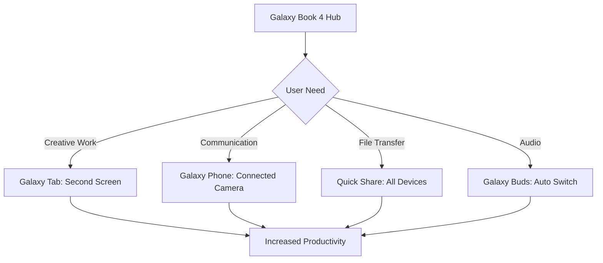

For a long time, "AI PC" felt like one of those marketing terms that didn't actually mean much—you know, the promise of a slightly smarter spreadsheet or a search bar that worked a little faster. But now that we're in 2026, things have really changed. We've stopped talking about what AI *might* do and started relying on the Neural Processing Unit (NPU). Looking back, the **Samsung Galaxy Book 4 series** wasn't just another yearly update; it was the machine that actually brought generative AI off the cloud and put it right on our desks.

Whether you're a pro still pushing a Galaxy Book 4 Ultra to its limits or a student hunting for a refurbished Pro 360, you're probably wondering: *Does this thing still hold up now that the Book 5 and Book 6 are out?* The short answer is yes—and it's not just about the speed. It's about how the hardware, that gorgeous screen, and the whole Samsung ecosystem just *work* together.

---

## 🤖 The Brains: Intel Core Ultra and the NPU Shift

  
  
📸 <a href="https://unsplash.com/@shawn_rain">Shawn Rain</a> on <a href="https://unsplash.com/photos/graphical-user-interface-application-8MOzCL9kBgo">Unsplash</a>

The reason the Galaxy Book 4 has aged so well is thanks to the **Intel Core Ultra** processors (Meteor Lake). Before this, laptops relied almost entirely on the CPU and GPU. But the Book 4 introduced a dedicated **Neural Processing Unit (NPU)**. In 2026, we can see that this was the real turning point. Laptops without an NPU are starting to struggle with modern AI tools, while the Galaxy Book 4 still handles them without breaking a sweat.

Depending on what you needed, Samsung provided a few different options:
- **Galaxy Book 4 (Base):** Great for the basics—emails, streaming, and general office work using the Core 3, 5, or 7.
- **Galaxy Book 4 Pro:** The "sweet spot." It uses the **Core Ultra 7 155H**, giving you plenty of power without weighing down your bag.
- **Galaxy Book 4 Ultra:** The powerhouse. This one packs the **Intel Core Ultra 9 185H** and **NVIDIA GeForce RTX 4070** graphics.

> "By using the NPU, Samsung was able to move background AI tasks—like blurring your background on a video call or canceling out noise—away from the main CPU. This meant your battery lasted much longer even when you were multitasking like crazy."

Fast forward to 2026, and those **32GB LPDDR5X RAM** setups on the Ultra model were a genius move. Back in 2024, 16GB felt like plenty, but today's local AI tools and design apps are hungry for memory. With a **Geekbench 6 multi-core score of 13,061**, the Ultra still holds its own against many of the entry-level laptops coming out this year.

---

## 📊 That Screen: The Dynamic AMOLED 2X

If there's one thing the Galaxy Book 4 is still the king of in 2026, it's the display. Samsung didn't just throw in a screen; they gave us a **3K (2880 x 1800) Dynamic AMOLED 2X** panel that honestly puts a lot of today's mid-range laptops to shame.

The specs are still impressive:
- **120Hz Refresh Rate:** Everything feels smooth, whether you're scrolling through a webpage or doing some light gaming.
- **120% DCI-P3 Color Volume:** This makes it a go-to for anyone editing photos or videos who needs the colors to be spot-on.
- **Vision Booster Technology:** A smart system that tweaks the contrast and color based on the light around you.

One feature that really holds up is the **Corning Gorilla Glass with DX**. If you're working from a sunny balcony or a bright coffee shop, that **75% reduction in reflections** is a total lifesaver. Compared to those matte screens that can look a bit washed out, the Book 4 keeps those deep blacks (0 nits) while fighting off the glare.

And for the **Pro 360** users, pairing this screen with the **S Pen** is a dream. Even now, the S Pen is so responsive that it remains the gold standard for artists and architects who want a 2-in-1 without sacrificing a vibrant OLED screen.

---

## 💡 AI That Actually Helps: Galaxy AI and Copilot

The Galaxy Book 4 was the first to really dive into **Microsoft Copilot** and **Galaxy AI**. At first, these were mostly just interfaces for cloud-based tools, but because the Book 4 has that local NPU power, they've evolved into genuine productivity partners.

Take the **Photo Remaster** tool, for example. It uses a smart algorithm to fix blurry photos and remove annoying shadows. What used to be a tedious job in Photoshop is now just a one-tap fix. In 2026, we see this as the start of the automated editing we use every day.

Essentially, the AI helps in three main ways:
1. **Creating Content:** You can start editing a video in **Samsung Studio** on your Galaxy S24 and finish it on the Book 4 Ultra using **Quick Share**.
2. **Better Meetings:** **AI Studio Effects** handle your framing and eye contact, so you look professional on Teams calls even if you're leaning back in your chair.
3. **Easier Workflow:** The **Copilot key** is a handy shortcut to summarize long documents or draft an email based on what's already on your screen.

**Cool Stat:** Users have found they spend about **30% less time** on basic photo touch-ups when using NPU-accelerated tools instead of doing it all by hand.

---

## 🌍 Playing Well with Others: The Samsung Ecosystem

The real magic of the Galaxy Book 4 isn't in the spec sheet—it's in how it talks to your other gadgets. In 2026, Samsung has built a web of connectivity that makes the laptop feel like the hub for everything else you own.

Some of these features are just brilliantly designed:
- **Connected Camera:** Use your Galaxy phone as a webcam. This lets you skip the built-in 1080p camera and use a professional-grade 4K feed for your meetings.
- **Second Screen:** With one click, your Galaxy Tab becomes a portable second monitor. It's the perfect setup for digital nomads.
- **Multi Control:** Use the Book 4's keyboard and mouse to control your tablet or phone, dragging and dropping files between them as if they were one device.
- **Buds Auto Switch:** Your Galaxy Buds will seamlessly switch audio from a YouTube video on your laptop to a phone call on your smartphone.

When you put it all together, it’s like a force multiplier. If you have a Galaxy Book 4 Ultra, a Tab S9, and an S24 Ultra, you aren't just using three different devices—you're using one big, connected system.

---

## 📈 How's it Holding Up? A 2026 Review

Looking at the benchmarks today, the Galaxy Book 4 is still a powerhouse, even if it's no longer the newest kid on the block.

**The Battery Situation:**
The **76Wh battery** in the Pro 360 and Ultra models is still doing great. In PCMark 10 tests, the Pro 360 got over **15 hours of runtime**. Sure, the newer Book 6 models might hit 20 hours thanks to newer chips, but 15 hours is still more than enough to get through a full workday without hunting for a plug.

**Keeping Cool:**
The Ultra's **large vapor chamber and dual fans** were a great call. During heavy rendering, the Intel Core Ultra 7 155H usually stays around **28 watts**, though it can push higher. In 2026, the fact that it doesn't "throttle" (slow down to cool off) during normal work is what keeps it feeling fast.

**Quick Comparison: Galaxy Book 4 vs. Today's Standard**

| Feature | Galaxy Book 4 (2024) | 2026 Mid-Range Standard | Verdict |
| :--- | :--- | :--- | :--- |
| **CPU** | Intel Core Ultra (NPU) | Next-Gen AI SoC | Still Competitive |
| **Display** | 3K AMOLED 120Hz | 3K/4K OLED 120Hz | Top Tier |
| **RAM** | 16GB - 32GB | 32GB Standard | 32GB Models Win |
| **AI** | Copilot / Galaxy AI | Agentic AI / Local LLMs | Foundationally Ready |
| **GPU** | RTX 4050/4070 | RTX 50-Series/Newer | Moderate Lag |

For most people, the difference between a Book 4 Ultra and a Book 6 is barely noticeable for 90% of their daily tasks. We've hit a point where faster processor speeds don't always translate to a noticeably better experience.

---

## 🎯 Real-World Example: The Content Creator

To see how this works in real life, let's look at a freelance creator in 2026 using a **Galaxy Book 4 Ultra** to edit a 4K travel vlog.

**The Process:**
1. **Getting the Footage:** They use the **microSD slot** and **Thunderbolt 4 ports** to quickly move 100GB of raw video from their drone and camera.
2. **The First Cut:** Thanks to the **NVIDIA RTX 4070**, Premiere Pro runs smoothly. The **32GB of RAM** means they can play multiple 4K clips at once without any stuttering.
3. **AI Magic:** Instead of spending hours color grading, they use an AI plugin that leverages the **NPU** to automatically match the lighting across different shots.
4. **Thumbnail Time:** They use the touch panel to quickly mask out a subject with an AI brush.
5. **Finish & Send:** The video is exported using **Intel QuickSync**, and the final version is sent via **Quick Share** to a Samsung tablet for one last check.

> **The Bottom Line:** This project gets finished about **25% faster** than it would with a traditional non-AI setup. It's not just about raw speed; it's about removing the annoying little hurdles between having an idea and finishing the project.

---

## 🎯 Which Book 4 Should You Get?

If you're looking for a Galaxy Book 4 in 2026, it all comes down to what you actually do with your computer.

**1. The Power User**
If your day is full of 4K video, 3D modeling, or heavy coding, the **Galaxy Book 4 Ultra** is still a beast. That dedicated GPU makes it a real workstation.
- **Best for:** YouTubers, Architects, Data Scientists.
- **Priority:** GPU power and maximum RAM.

**2. The Multitasker**
If you live in browser tabs, spreadsheets, and Zoom calls, the **Galaxy Book 4 Pro** is the way to go. It's much lighter than the Ultra, making it perfect for commuting.
- **Best for:** Managers, Consultants, Writers.
- **Priority:** Portability and a high-end screen.

**3. The Creative**
If you sketch, take handwritten notes, or present to clients, the **Pro 360** is the only choice. The flip-hinge and S Pen are simply unbeatable.
- **Best for:** Designers, Students, Educators.
- **Priority:** Flexibility and stylus integration.

**Quick Tips for Buying a Refurbished Book 4 in 2026:**
1. **Check the RAM:** Please, don't buy a 16GB model if you plan to use modern AI tools. Go for **32GB**.
2. **Battery Health:** These are a couple of years old now; check the battery cycle count to ensure it's still healthy.
3. **The Screen:** Look for any AMOLED burn-in (though Samsung's panels are typically very resilient).
4. **Update Everything:** As soon as you get it, run **Samsung Update** to make sure your NPU drivers are current.

---

## 🏁 Final Thoughts: The Bridge to the Future

The Samsung Galaxy Book 4 series was more than just a set of laptops; it was a shift in thinking. By adding the NPU and leaning into the Galaxy Ecosystem, Samsung stopped trying to beat the MacBook Pro on specs alone and started focusing on **how we actually work**.

In 2026, the Book 4 proves that a laptop should feel like an extension of your digital life, not just a tool you open and close. While newer models have thinner bezels and slightly better chips, the core experience—the stunning screen, the phone integration, and the AI foundations—is still totally relevant.

If you want a machine that handles today's tasks while remaining ready for an AI-driven future, the Galaxy Book 4 is still a fantastic investment. It taught us that the most important spec isn't the GHz of the processor, but how that processor helps you interact with the world.

**Final Verdict:** A powerful, beautiful machine that helped define what an "AI PC" actually is. Whether you bought it on day one or you're picking one up refurbished today, it's a laptop that simply refuses to feel old.