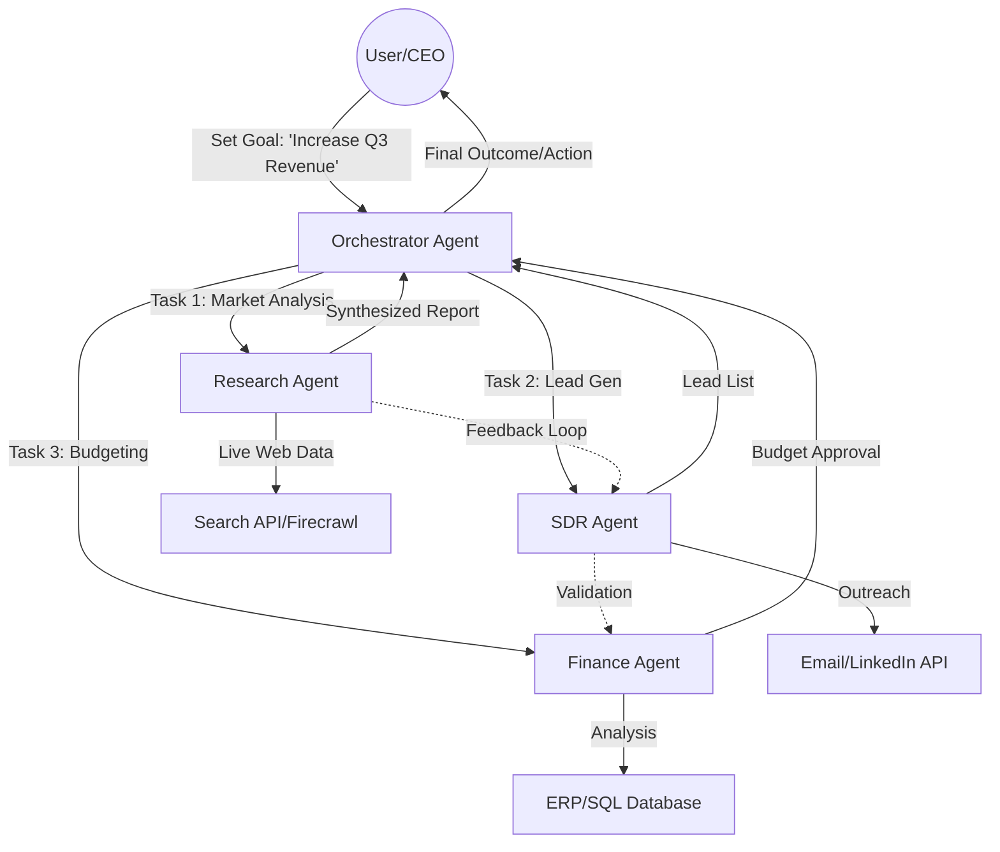

Picture this: it’s a Tuesday morning in 2026. You don’t wake up and spend an hour jumping between ten different apps just to get your life in order. Instead, your personal AI agent gives you a quick heads-up: it already pushed your 9:00 AM meeting back because your flight was delayed, rebooked your hotel using your favorite loyalty points, and put together a briefing for your afternoon presentation by skimming the three newest research papers in your field from the last couple of days.

This isn't some wild sci-fi movie plot; it’s the actual reality of the **Agentic Era**. We’ve finally moved past the "Chatbot Phase"—where AI was basically a reactive tool that just sat there waiting for you to tell it what to do—and stepped into the "Agentic Phase." Now, AI is more like a proactive partner that actually chases down goals for you.

The jump from Generative AI to Agentic AI is probably the biggest shake-up in tech since the first smartphone. We aren't just talking to machines anymore; we’re delegating work to them. As we head into 2026, the line between "software" and "employee" is getting pretty blurry. We're seeing a digital workforce that's completely changing how we think about productivity, business, and what it even means to be an "expert."

  
  
📸 <a href="https://unsplash.com/@markuswinkler">Markus Winkler</a> on <a href="https://unsplash.com/photos/white-and-black-typewriter-with-white-printer-paper-tGBXiHcPKrM">Unsplash</a>

---

## 🤖 How it Works: From One Giant Brain to a Team of Experts

For a while, everyone was obsessed with "monolithic" models—one massive AI trying to do everything. But by 2026, the smart move has shifted to **Multi-Agent Systems (MAS)**. The reason is simple: no single AI can handle a complex business workflow without getting confused or starting to make things up (what we call "hallucinations").

The way it works now is through an **Orchestrator Model**. Think of it like a manager. You give the "manager" agent a big goal (like, "Launch a new marketing campaign for our Q3 products"), and it breaks that goal down into smaller chores. Then, it assigns those chores to a team of specialized sub-agents—one for research, one for writing, one for legal compliance, and one for distribution.

This all runs on two main sets of "rules":
- **Model Context Protocol (MCP)**: This is the vertical layer that lets agents plug into tools, APIs, and data.
- **Agent-to-Agent (A2A) Protocol**: This is the horizontal layer that lets the agents talk to each other and hand off tasks.

According to [Svitla](https://svitla.com/blog/agentic-ai-market-trends-2026), this is what turns agents from simple "task-takers" into **outcome owners**. Because they work in teams, they can actually check each other's work. If the writer agent creates a draft that the legal agent thinks is too risky, they’ll go back and forth to fix it before a human ever has to look at it.

> "The future of AI isn’t a robot; it’s a team. We are shifting from monolithic AI to a system where a primary ‘orchestrator’ agent directs smaller, expert agents." — **Armita Peymandoust**, SVP, Salesforce.

---

## 📈 The Money Side: ROI and "Bot-to-Bot" Shopping

The growth of AI agents is honestly a bit staggering. The market was worth about **$7.63 billion in 2025**, but it's expected to hit **$182.97 billion by 2033**, growing by nearly **50%** every year [Azumo](https://azumo.com/artificial-intelligence/ai-insights/ai-agent-statistics). But the really interesting part isn't the market cap—it's the **Return on Investment (ROI)**.

People using this early are seeing an average ROI of **171%**, and some U.S. companies are hitting **192%**. This is different from the old-school automation (RPA) we used to see. RPA just automated repetitive clicks; Agentic AI automates **actual decision-making**.

Check out these real-world wins:
- **The IRS**: They used agentic systems to turn a 10-day process for opening tax court cases into just **30 minutes**, saving one division 50,000 minutes a year [Svitla](https://svitla.com/blog/agentic-ai-market-trends-2026).
- **AtlantiCare**: Their clinical assistants cut documentation time by **42%**, giving doctors and nurses back about 66 minutes every single day.
- **Fortune 500 Companies**: Some have cut reporting time from **15 days down to 35 minutes**, and dropped the cost per report from **$2,200 to just $9**.

We're also seeing the start of **Agentic Commerce**. This is where AI stops just "suggesting" a product and actually "buys" it for you. To make this safe, things like **Mastercard Agent Pay** have popped up, using "Agentic Tokens" so an AI can pay for something without ever seeing your actual credit card number.

Gartner thinks that by 2028, AI agents will handle more than **$15 trillion in B2B spending**. We're heading toward a world where "B2B" basically means "Bot-to-Bot." Your procurement agent will haggle with a supplier's sales agent in a split second to find the best price, the lowest carbon footprint, and the fastest shipping.

---

## 🎯 A New Way to Code: The Rise of the "Vibe Coder"

Software engineering has been completely turned upside down in the last two years. We've gone from "Copilots" (which just suggest the next line of code) to "Agents" (which can build and ship an entire feature).

Tools like **Claude Code**, **Cursor**, and **Devin** have brought us into the age of **Agentic Coding**. Now, the developer is less of a "writer" and more of a "conductor." This has created the **AI-native engineer**—someone who can plan a design, dig through a million lines of code, and deploy a fix in a few hours instead of a few weeks.

The productivity jump is huge. Engineers using these tools are shipping code **30% faster**. At TELUS, these tools saved over **500,000 hours** of manual work [Firecrawl](https://www.firecrawl.dev/blog/agentic-ai-trends).

But there's a catch: something called **"Vibe Coding."** This is when people use simple prompts to "vibe" an app into existence without actually knowing how the code works. It's great for getting things started, but it creates a "production gap."

**The risks here are real:**
- **Technical Debt**: AI-written code can have **1.7x more bugs** than human code if nobody checks it.
- **Security Holes**: There's a **45% higher rate of security flaws** in AI code that hasn't been reviewed.
- **Fragility**: AI tends to avoid the hard work of cleaning up old code, which leads to "spaghetti code" that works today but breaks tomorrow.

The best teams in 2026 treat AI like a **super-fast junior developer who has zero common sense**. They use a "Human-in-the-Loop" (HITL) system: the agents propose and test, but a human always audits and approves.

---

## 🔬 Specialized Intelligence: Why "Niche" Beats "General"

For a long time, the belief was that "bigger is better"—that one giant model would eventually solve everything. In 2026, we've realized the opposite is true. We're now seeing the rise of **Vertical AI Agents** and **Small Language Models (SLMs)**.

General models are like "jacks of all trades, masters of none." In a hospital or a law firm, a 2% mistake isn't just a glitch; it's a huge liability. That's why we're seeing agents trained on very specific, high-quality data for one specific job.

**Here's how that's playing out:**
- **Healthcare**: Specialized agents are **40%+ more efficient** than general ones because they actually understand medical terminology and laws.
- **Finance**: Specialized agents have cut false fraud alerts by **40%**, so humans can focus on actual threats [Google/LinkedIn](https://www.linkedin.com/pulse/google-just-predicted-5-ai-agent-trends-2026-heres-what-ben-kalkman-ugbnc).
- **Manufacturing**: Agents aren't just predicting when a machine will break; they're **autonomously fixing things** without needing a human to step in.

This is all possible because of **SLMs** (like Microsoft's Phi-4 or Google's Gemini Nano). These are **10-30x cheaper** to run and can live right on your device, which is great for privacy and speed. For example, Phi-4 is almost as smart as the original GPT-3.5 but uses **92% less energy**.

In 2026, your advantage isn't which model you use—it's the **data you have**. Companies with their own clean, private datasets are building "moats" that general AI simply can't cross.

---

## 🛡️ The Trust Gap: Guardian Agents and the Law

Since AI agents can now move money and change code, trust is the biggest hurdle. Only **22% of bosses** fully trust agents to work on their own [Keystone Solutions](https://www.linkedin.com/pulse/real-roi-ai-agents-why-2026-year-autonomous-workflow-zld4e). To fix this, we're using **Guardian Agents**.

Guardian Agents are AI "security guards." Their only job is to watch other agents. They act as a compliance layer, checking every single action against a set of rules before it happens. If a buying agent tries to hire a vendor that isn't approved, the Guardian Agent stops it and calls a human.

This is also a response to the **EU AI Act**, which fully kicked in in August 2026. It breaks AI into risk levels:
- **Unacceptable Risk**: Banned (like social scoring).
- **High Risk**: Heavily regulated (like critical infrastructure).
- **Limited Risk**: Just needs to be transparent (like chatbots).

And it's not just about laws; it's about security. Gartner warns that by 2028, **25% of cyber attacks** in companies will be caused by AI agents—either through "prompt injection" (hacking the AI's instructions) or "memory poisoning" (tricking the AI into making bad choices) [Azumo](https://azumo.com/artificial-intelligence/ai-insights/ai-agent-statistics).

> "AI automates fastest in domains where output can be verified. This is why coding and math are solved, but 'common sense' is still a struggle. These are 'jagged entities'—spectacularly capable in one area and brittle in another." — **Andrej Karpathy**.

---

## 🌍 Humans + Agents: The New Way to Work

The old fear that "AI will take all the jobs" has turned into something more nuanced: **AI will take over tasks, not people.** But the people who thrive will be the ones who know how to "pilot" these agents.

Think of it like an **Autonomy Ladder**:
1. **Level 1 (Chain)**: Basic "If this, then that" rules.
2. **Level 2 (Workflow)**: The AI knows the context and picks the best order of steps.
3. **Level 3 (Partially Autonomous)**: The AI plans and adjusts on its own, only asking for help when it's really stuck.
4. **Level 4 (Fully Autonomous)**: The system sets its own goals and learns as it goes [Svitla](https://svitla.com/blog/agentic-ai-market-trends-2026).

Most companies are currently at **Level 2 or 3**. The human's job has shifted from "doing the work" to "supervising the work." This requires a new skill: **Context Engineering**. Instead of trying to find the perfect "magic words" for a prompt, you're now curating the perfect set of data for the AI to work with.

The workforce is splitting into two groups:
- **The Orchestrators**: Pros who can manage a whole fleet of agents to get massive amounts of work done.
- **The Displaced**: People whose jobs are "highly verifiable" (meaning an AI can easily check if the work is right) and therefore easily automated.

Because of this, **64% of companies** are stepping up their AI training, focusing on how to actually manage these systems rather than just how to use a tool.

---

## 🚀 Conclusion: A Proactive Future

Looking at where we are in 2026, the "User Interface" as we know it is dying. We're moving away from clicking buttons and filling out forms and moving toward **Intent-Based Computing**. In this world, you just state your goal, and a team of agents handles the "how."

It hasn't all been smooth sailing. We've hit a "Production Gap," where 79% of companies try agents but only **11% actually use them in the real world** because of data and trust issues. We've also had to deal with "workslop"—that flood of low-quality AI noise that makes it hard to find actual human insight.

But there's no going back. When an agent can turn a 15-day project into 35 minutes, or save a doctor an hour of paperwork a day, the value is just too high to ignore.

The winners of the next decade won't be the ones with the "best model," but the ones with the **best orchestration**. The people who can blend human judgment, deep industry knowledge, and solid safety guardrails will be the ones who come out on top.

The Agentic Era isn't "coming"—it's already here. The real question is: "What can I delegate to my digital team today?"

---

### 🛠️ Your Agentic Transition Checklist

If you're a leader or a dev moving toward these systems in 2026, here is the best way to do it:

1. **Find the "Easy Wins"**: Start with tasks that are easy to verify (like data extraction or code cleaning).
2. **Fix Your Data**: Move beyond simple folders and databases to **Semantic Context**. Your agents are only as smart as the data they can find.
3. **Add a Safety Net**: Never let an autonomous agent touch your live systems without a **Guardian Agent** watching over its shoulder.
4. **Think in Teams**: Stop trying to find one "God Model" to do everything. Build a team of specialists with clear roles.
5. **Level Up Your People**: Train your team in **Context Engineering** and supervision so they don't fall into the "Vibe Coding" trap.

---

1. 📸 Igor Omilaev — [Igor Omilaev](https://unsplash.com/@omilaev) on [Unsplash](https://unsplash.com/photos/robot-and-human-hands-reaching-toward-ai-text-FHgWFzDDAOs)
2. 📸 Markus Winkler — [Markus Winkler](https://unsplash.com/@markuswinkler) on [Unsplash](https://unsplash.com/photos/white-and-black-typewriter-with-white-printer-paper-tGBXiHcPKrM)
