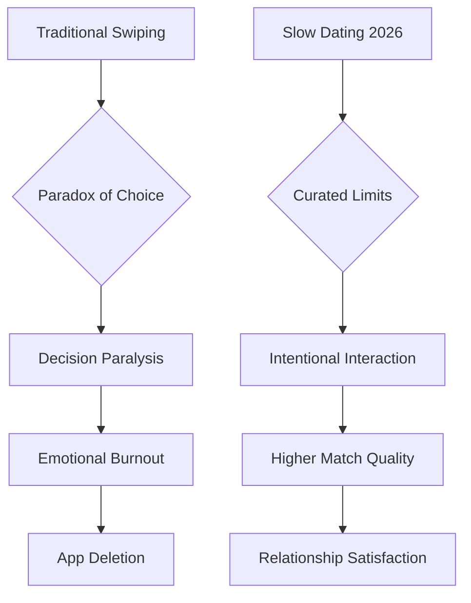

For almost twenty years, modern romance largely came down to one repetitive, almost hypnotic motion: the swipe. We essentially left our love lives up to a binary choice—left for no, right for yes—which turned the search for a partner into a kind of digital slot machine. But as we hit 2026, that "swipe era" hasn't just faded away; it has pretty much collapsed because, honestly, it just wasn't working anymore.

The massive burnout we all felt in the early 2020s triggered a huge shift. We’ve moved past the age of "more options" and entered the age of **curated compatibility**. These days, dating isn't about how many matches you can collect; it's about how well you actually align with someone. Thanks to smarter AI, a move away from old-school societal milestones, and a deep, desperate need for real human connection, the way we find love has been completely rewritten.

In 2026, dating is a hybrid. We have cutting-edge algorithms doing the heavy lifting—the vetting and the sorting—so that we can get back to the part we're actually good at: feeling chemistry. From the rise of "late bloomers" to the way we've finally started to kill off ghosting, here is a look at how dating works now.

  
  
📸 <a href="https://unsplash.com/@loganvoss">Logan Voss</a> on <a href="https://unsplash.com/photos/the-year-2026-in-green-3d-numbers-TYTonx-bV0o">Unsplash</a>

---

## 🤖 Your Own AI Wingman: Moving From Matching to Vetting

The biggest change in 2026 is that we've moved from "dating apps" to "dating agents." Back in the day, apps were just directories—digital catalogs where you had to do 100% of the filtering, the messaging, and the scheduling. Now, AI doesn't just throw a profile your way; it acts more like a personal concierge.

According to recent data from Pew Research (2026), **over 68% of singles are now using at least one AI-powered dating platform**. This isn't just about better filters; it's called "agentic matchmaking." These AI agents are trained on your actual values, the way you talk, and what you want for your future, rather than just your height or your favorite movie. They handle all the "boring stuff"—the dreaded "How was your day?" small talk and the headache of trying to find a time that works for a first date.

The impact on our mental health has been huge. People are reporting a **40% decrease in first-date anxiety** because the AI does a "compatibility handshake" with the other person's agent before the humans even say hello. By the time you actually meet for coffee, your AI has already confirmed that you're on the same page about things like money, kids, and politics.

> **The big takeaway:** In 2026, AI isn't just a tool to find people; it's a filter for authenticity. It cuts out the "noise" of people you'd never actually get along with, saving users about **four hours a week** of pointless chatting.

Take platforms like [Winged Dating App](https://www.wingedapp.com/), for example. They focus on deep compatibility scores. Instead of a deck of 100 profiles to flip through, you might only get two "High-Alignment" introductions a week. Because there are fewer options, they feel more valuable, and people actually put effort into the conversation instead of treating others as disposable.

---

## 📈 The "Late Bloomer" Renaissance: Tossing the Timeline

For a long time, there was an unspoken "romantic clock." The idea was that by 25 you should be dating seriously, by 30 you should be engaged, and by 35 you should have a family. In 2026, that clock is officially broken. We're seeing a "Late Bloomer Renaissance," where starting your romantic life in your late twenties or thirties isn't just okay—it's celebrated.

The numbers back this up: **one in three new relationships in 2026 now starts after the age of 28**. This is mostly because Gen Z and Millennials realized that jumping into a partnership before you even know who you are usually leads to the kind of burnout that defined the 2010s. People are prioritizing emotional maturity and getting their own lives together first.

According to YouGov (2025), **54% of singles say they feel way less pressure** to hit those traditional relationship milestones by a certain age. This has created a new group of "intentional daters"—people who enter the pool with a level of self-awareness and emotional intelligence that you rarely saw in twenty-somethings a decade ago.

- **New Priorities:** The focus has shifted from "finding a partner" to "becoming a partner."
- **Community Support:** Thanks to TikTok and Reddit, there are huge "late bloomer" communities, so no one feels like they're "behind" in life anymore.
- **Better Stability:** Relationships that start later are actually lasting longer because both people are usually more financially and emotionally independent.

Basically, dating isn't a race anymore. It's a slow-burn process where the goal is finding a real match, not hitting a deadline. The pressure to fit in has been replaced by a desire for a partner who adds to a life that's already good.

---

## 🎯 The Death of Ghosting: A New Kind of Digital Manners

Ghosting—just vanishing without a word—was pretty much the defining trauma of early digital dating. But by 2026, thanks to some clever tech and a cultural push toward "radical transparency," ghosting has become socially unacceptable.

Reports of ghosting on major platforms have **dropped by 58% since 2024**. It's not just that people suddenly got nicer; it's that the tech started rewarding honesty. Many apps now use "closure prompts." If you decide you're not feeling it, the app nudges you to send a quick, respectful closure message before the chat gets archived.

Some platforms have even added "communication scores." If you're clear and respectful when ending things, you get better visibility in the algorithm. If you're a "serial ghoster," you get flagged or pushed to the bottom.

> "The psychological toll of silence was the biggest reason people hated dating apps. By automating the 'breakup' and making rejection normal, we've taken away the ambiguity that causes so much anxiety." — *Industry Insight on Modern Romance*

**71% of users now say they'd much rather have a blunt rejection** than be left wondering in silence. This is all part of a bigger move toward emotional resilience. In 2026, the "strong" dater isn't the one playing hard to get; it's the one who is honest about not being interested. It just makes the whole process faster for everyone.

---

## 💡 Beating the Burnout: The "Slow Dating" Movement

By 2023, "dating app fatigue" was practically a medical condition. Having too many choices led to decision paralysis—we had so many options that we felt empty. In 2026, the industry responded with "Slow Dating."

Right now, **64% of singles say they experience burnout** at least once a year, but they're handling it differently. Instead of deleting their apps in a rage, they use "Slow Mode." This lets users limit their matches to maybe three a week, or blocks them from seeing new people until they've finished their current conversations.

Moving from quantity to quality has led to a **39% drop in total app deletions**. People aren't quitting dating apps; they're just changing how they use them.

Think of "Slow Dating" like the "Slow Food" movement. It's about savoring the process of getting to know one person deeply instead of skimming the surface of twenty people. This has also led to a rise in "intentionality coaching," where people work with AI or human therapists to figure out their non-negotiables before they even start swiping.

---

## 🌍 Throwing Out the Old Gender Rulebook

The "scripts" we used for dating in the 20th century—the guy asks, the guy pays, the woman hints—have mostly vanished by 2026. Today, things are way more fluid and based on what two people actually agree on.

**55% of singles in 2026 say that traditional gender roles don't matter at all** when it comes to their happiness in a relationship. You can really see this in the "initiation gap." It used to be the man's job to make the first move. Now, **61% of women and non-binary individuals feel totally comfortable initiating dates**, and 48% of men actually prefer a more balanced approach.

This shift shows up in the little things, too:
- **Paying the Bill:** "Splitting the bill" or paying based on who earns more is now the default for first dates.
- **Emotional Work:** There's a much bigger expectation that both partners put in equal effort to keep the relationship healthy.
- **Different Structures:** People are way more open to non-linear setups, like ethical non-monogamy or polyamory, putting personal happiness over "what society expects."

The result? Much more authentic connections. When you get rid of the "script," you actually have to talk to each other. Instead of guessing, couples in 2026 just ask: *"How do we want this to work?"* That kind of directness builds a foundation on actual agreements rather than old assumptions.

---

## 🔬 From Texting to Talking: The Voice-First Revolution

For a decade, the "texting phase" was like a gauntlet you had to run. It was full of misread tones, anxiety over how long someone took to reply, and that "fake intimacy" you get from a perfectly curated chat history. In 2026, we're replacing that with voice and video.

Currently, **69% of first interactions happen via voice notes or short video clips** instead of text. This solves the oldest problem in the book: the "vibe check." We've all had that experience of texting someone for weeks, feeling a huge connection, and then meeting in person only to realize there's zero chemistry.

By moving the vibe check to the very beginning, platforms have seen **match-to-date conversion rates double**. Hearing someone's laugh or seeing their expressions in a 15-second video creates a level of trust that a text just can't touch.

> **The "Anti-Catfish" Effect:** Voice and video-first dating have made catfishing way harder. **59% of users report feeling safer** meeting people in person because they've seen a real human presence, not just a static photo.

It's also changed the psychology of dating. Voice notes encourage a natural flow and get rid of the "performance" of texting, where you spend twenty minutes drafting one "perfect" message. In 2026, authenticity is found in the tone of a voice, not the cleverness of a pun.

---

## 🚀 The Hybrid Future: Curated Real-World Meetups

After years of being glued to our screens, there's been a huge swing back toward the physical world. While AI does the vetting, the actual *meeting* has moved away from that awkward one-on-one "interview date" and toward curated group experiences.

There's been a **44% increase in singles attending curated offline events** since 2025. These aren't the cringey speed-dating events of the 90s; they're high-concept mixers organized by AI. For example, an AI agent might put together a "Climate-Conscious Hiking Group" for ten people who all have a 90% compatibility score.

**35% of new couples in 2026 now meet at these events**, up from 21% in 2022. This "Hybrid Model" gives you the efficiency of a digital filter with the magic of organic, in-person chemistry.

1. **The AI Vetting:** The agents find a group of people who would actually get along.
2. **The Low-Pressure Start:** Everyone does a group activity they actually enjoy.
3. **The Organic Connection:** You interact naturally in a social setting.
4. **The Transition:** If two people hit it off, the AI helps them set up a one-on-one date.

This takes the "interrogation" feel out of the first date. When you're painting a mural or playing a board game, you're focusing on the activity, which lets the connection happen naturally.

---

## 🔮 Beyond 2026: Predictive Love and Virtual Worlds

As we look toward 2027 and beyond, things are starting to sound like a sci-fi movie. The next frontier is **Predictive Analytics** and **Immersive Environments**.

We're seeing the start of AI that doesn't just match you based on who you *are*, but predicts who you *will need*. Using behavioral data, these systems can spot potential arguments before they happen and suggest ways to talk through them. While some find it creepy, **22% of singles are interested in VR dating** for 2027, where they can meet in hyper-realistic virtual spaces to build trust before flying across the world for a real-life date.

But as tech speeds up, a counter-trend is growing: the "Analog Romantic." More and more people are choosing "tech-free" dating, intentionally avoiding algorithms to find the serendipity of meeting a stranger in a bookstore or a coffee shop.

The tension between predictive AI and old-school luck will be the big theme of the late 2020s. But one thing is for sure: the goal is still the same. Whether it's through a VR headset, an AI agent, or a chance encounter, we all just want to be seen and known.

---

## Conclusion: Getting Our Humanity Back

The move from the "Swipe Era" to the "Curation Era" is more than just a tech upgrade; it's about getting our humanity back. For too long, we treated dating like online shopping—browsing through people like they were products and optimizing for "specs" rather than souls.

In 2026, we're finally using technology for what it should be used for: getting out of the way. By letting AI handle the tedious parts—the vetting, the scheduling, the filtering—we've freed ourselves to focus on what actually matters. We've returned to the beauty of the "late bloom," the honesty of a clear "no," and the thrill of hearing a voice before seeing a face.

The future of dating isn't about having a perfect algorithm; it's about embracing the imperfection of being human. It's about finding someone whose messiness fits with yours. The most successful daters won't be the ones with the best profile photos, but the ones with the courage to be themselves.

Love in 2026 is intentional, transparent, and deeply human. The swipe is dead. Long live the connection.

---

1. 📸 BoliviaInteligente — [BoliviaInteligente](https://unsplash.com/@boliviainteligente) on [Unsplash](https://unsplash.com/photos/the-year-2026-in-metallic-3d-numbers-I1nwQnIqZTY)
2. 📸 Logan Voss — [Logan Voss](https://unsplash.com/@loganvoss) on [Unsplash](https://unsplash.com/photos/the-year-2026-in-green-3d-numbers-TYTonx-bV0o)
