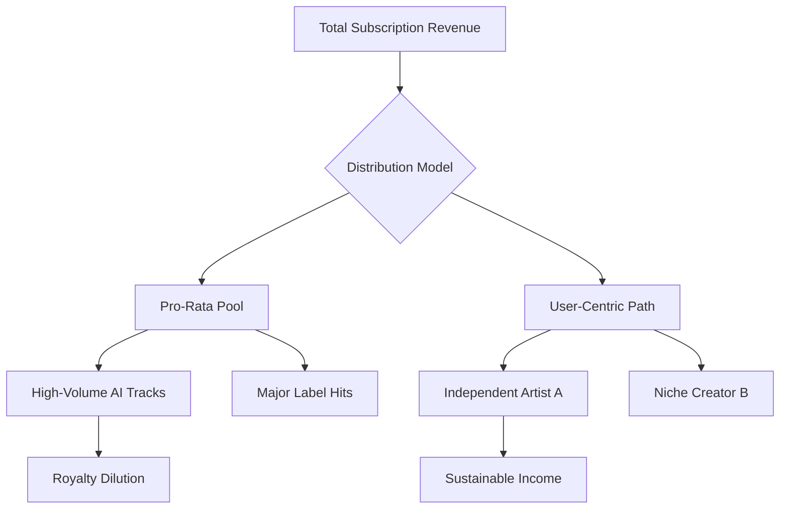

  
  
📸 <a href="https://unsplash.com/@marius">Marius Masalar</a> on <a href="https://unsplash.com/photos/tilt-selective-photograph-of-music-notes-rPOmLGwai2w">Unsplash</a>

Picture this: it’s a morning in 2026. You wake up, open your favorite music app, and your "Daily Mix" isn’t just a playlist anymore. It’s a living, breathing soundscape that changes in real-time based on your heart rate and the gloomy gray sky outside your window. Maybe you're listening to some "Neo-City Pop"—a mix of '80s Tokyo vibes and modern bedroom pop—that an AI cooked up specifically to make you feel that weird, beautiful mix of sadness and happiness. But then, as you head out the door, you find yourself reaching for a physical CD or a vinyl record. You just want something you can actually touch and hold in a world where everything feels a bit too digital and fleeting.

That’s the big contradiction of music right now. We’ve hit a point of **total abundance**. It’s never been easier to make a song, but because of that, *authentic* music has become more valuable than ever. The industry is going through its biggest shake-up since streaming first started. It’s a tug-of-war between the "Synthetic Wave"—that flood of AI music—and "Human Resonance"—our deep, instinctive need for raw, real human connection.

When you look at the numbers, it’s pretty wild. The **AI music market** is expected to jump from **USD 6.65 billion in 2025 to about USD 60.44 billion by 2034**, growing at a massive **CAGR of 27.80%**. But behind those big numbers, there’s a lot of tension: copyright lawsuits, fights over royalties, and a lot of us wondering what it even means to be an "artist" anymore.

  
  
📸 <a href="https://unsplash.com/@shootnmatch">weston m</a> on <a href="https://unsplash.com/photos/musical-notes-on-white-paper-3pCRW_JRKM8">Unsplash</a>

---

## 🤖 The AI Explosion: From "Digital Junk" to Safe Spaces

By 2026, generative AI stopped being a cool toy and simply became part of the plumbing. We aren’t asking *if* AI will be used anymore; we’re figuring out the ground rules. Right now, platforms like **Suno** and **Udio** are the big players, making high-quality music production available to everyone. Suno, valued at around **$2.45 billion**, has over **2 million paid subscribers** and puts out roughly **7 million new music files every single day**.

But there's a downside. This explosion created "AI slop"—low-effort, synthetic tracks that are flooding streaming services. The scale is honestly dizzying: **Deezer reported receiving over 50,000 fully AI-generated tracks every day**, which is nearly a third of all their new uploads. It's gotten so bad that Spotify had to wipe over **75 million spam or low-quality tracks** in a single year just to keep the platform usable.

Because of this, the industry is moving toward "Walled Gardens"—closed systems where AI is actually licensed. Take **Klay Vision**, for example. They didn't just scrape the web; they made official deals with all three major labels (Universal, Sony, and Warner). Instead of "asking for forgiveness later," Klay uses a **go-forward license**. This means the real artists and songwriters actually get paid when their "sonic identity" is used to make something new.

> **The bottom line:** The "Wild West" days of AI stealing data are ending. The future is all about **responsible AI**—systems that treat human creativity as something to be paid for, not just free training data.

---

## 📊 The Money Problem: The Great Royalty Dilution

The tech is amazing, but the financial side of things is a bit of a nightmare. Most of the industry uses a **pro-rata royalty model**. Basically, all the subscription money goes into one giant pot, and it's handed out based on the percentage of total streams. This is a disaster when millions of AI tracks enter the mix. Every single fake or synthetic stream steals a tiny bit of money away from a human artist.

The hit to the wallet is real. A study by **CISAC** suggests that by 2028, music creators could lose **24% of their total revenue** because of AI substitution—a staggering **€10 billion**. Plus, streaming fraud has become a professional business. Experts estimate it costs the industry over **a billion dollars a year**, and **80% of that** is driven by bot networks playing AI-generated tracks on loop.

To fix this, we're seeing a move toward **user-centric payment models**. In this version, if you spend your whole month listening to one indie folk singer, your subscription fee goes directly to *them*, instead of being diluted into a pool dominated by AI "lo-fi beats" and global superstars.

- **Pro-Rata Model:** One big pot; benefits the biggest stars and the AI "slop" farms.
- **User-Centric Model:** Your money follows your ears; benefits indie and authentic creators.
- **Superfan Tiers:** Direct tipping and memberships so fans can support artists without the middleman.

---

## 🌍 The Human Pushback: Why We Want Things We Can Touch

As music becomes an infinite, invisible utility, many of us are experiencing "streaming fatigue." The reaction? A massive comeback for physical music. In 2026, **vinyl, CDs, and even cassettes** aren't just for nostalgic collectors—they're a statement. Gen Z, in particular, is seeking "intentional listening." They want to actually *experience* an album rather than just letting a Spotify algorithm feed them songs in the background.

It really comes down to **ownership**. In a world where your entire library could vanish if a platform changes its rules, a physical record is something you actually own forever. There's a real joy in the ritual: unboxing the record, reading the liner notes, and listening to an album from start to finish, exactly how the artist intended.

This has been a lifesaver for artists. Limited edition colored vinyl and "physical-digital" hybrids (like CDs with special access codes) are now huge money-makers. For many indie artists, selling **1,000 physical records** is actually more profitable than trying to hit **1 million streams**.

> "Younger listeners are looking for tactile, intentional listening experiences that contrast with algorithm-driven streaming... People are seeking deeper engagement with the music they love, away from passive playlists." — **Romain Boudruche, We Are Rewind**.

---

## 🎯 How Sound is Changing: Moods and Mashups

In 2026, the old idea of "genres" is basically dead. We're in the age of **Genre Fluidity**. We don't really categorize music as "Pop" or "Rock" anymore; we categorize it by **how it feels**. Data from tools like MusicGen shows that people are searching for "soft," "emotional," and "dark" more than specific genres. It's all about the mood now.

We're also seeing a lot of **Maximalist Fusion**. Artists like Rosalía showed us how to blend classical music, global rhythms, and AI textures all at once. This "hybrid everything" style means a song can be a club hit and a movie soundtrack at the same time.

Here are a few sounds that are everywhere in 2026:
- **The Cinematic Revolution:** Everything—from a 15-second TikTok to a brand ad—is produced to sound like a massive movie trailer.
- **Neo-City Pop:** A modern take on '80s Japanese city pop, mixing jazzy chords with "bedroom pop" vibes.
- **The 1950s Vintage Escape:** People are craving "human" flaws—the breathy vocals and slight pitch wobbles that you can't find in perfectly polished AI music.
- **Lo-Fi Productivity:** "Study beats" have evolved into functional audio designed to actually help the brain focus.

---

## ⚖️ The Legal Fight: Who Owns Your Voice?

The biggest battle of 2026 isn't about chords or melodies—it's about **identity**. With vocal cloning, someone can essentially hijack an artist's voice without them ever knowing. This has led to a wave of new laws to protect a person's "right of publicity."

The leader here is the **ELVIS Act** in Tennessee, which was the first law to establish that a musician's voice is a protected asset. On a larger scale, the **NO FAKES Act** is attempting to make it illegal across the US to digitally replicate someone's voice or likeness without permission.

The real war is between the **RIAA** (the big labels) and AI companies. The big question is: does "feeding" copyrighted songs into an AI count as **fair use**, or is it just mass theft? The **Poseidon Wave Media** case is a critical milestone because they're trying to prove that AI can create a structural copy of a song, which would dismantle the "it's transformative" excuse AI companies love to use.

**The Legal Cheat Sheet for 2026:**
1. **Sound Recording Copyright:** Protects the actual recording of the song.
2. **Composition Copyright:** Protects the lyrics and the melody.
3. **Right of Publicity (NO FAKES Act):** Protects the "sonic fingerprint" of your actual voice.

---

## 🚀 More Than Just a Stream: Games, Health, and "Atomized" Music

Music is moving out of apps and into every other part of our lives. We're seeing the **atomization of music**, where sound is woven into gaming, fitness, and health tech.

Gaming is the prime example with **real-time adaptive music**. Instead of a looping soundtrack, AI analyzes how you're playing and shifts the tempo and intensity on the fly. The music becomes a living thing that reacts to your choices.

At the same time, the **wellness world** is using AI for "biometric soundtracks." Music is becoming a medical tool—AI creates specific rhythms and frequencies to lower stress (cortisol) or improve focus. Music has shifted from being just "entertainment" to becoming a "functional utility."

**Here is how that process typically works:**
1. **Biometric Input:** The app tracks your heart rate or scrolling speed.
2. **AI Analysis:** The system determines if you need "high tension" or "deep calm."
3. **Dynamic Synthesis:** It rearranges licensed music pieces in real-time to match that mood.
4. **Seamless Output:** You hear a personalized song that evolves as you do.

---

## 🎻 The Future Symphony: Finding the Human Heartbeat

As we look toward 2027 and beyond, the music industry isn't dying—it's just being refined. The "commodity" side of music (like generic corporate background tracks) will likely be fully handled by AI. But that actually opens a massive door for **real creators**.

The real value of music in 2026 isn't technical perfection—AI has already mastered that. Instead, the value lies in **storytelling, vulnerability, and shared human experiences**. The artists who win will be the ones who embrace their "human-ness"—their flaws, their stories, and their ability to actually connect with fans.

We're heading toward a hybrid world. We'll use AI as a "super-tool" to brainstorm and polish our tracks, but we'll still go to concerts and buy vinyl to actually *feel* something. Look at **Randy Travis**, who used AI to get his singing voice back after a stroke. It proves that when tech is used to heal or help rather than replace, it can be absolutely beautiful.

In the end, 2026 is all about **Balance**. It's the balance between the speed of the machine and the soul of the artist. Because in the clash between the synthetic and the organic, the human heartbeat is still the only rhythm that truly matters.

---

**Want to dive deeper? Check out these sources:**
- [iMusician: State of the Music Industry 2026](https://imusician.pro/en/resources/blog/state-of-the-music-industry-2026-trends-predictions)
- [Tuned Global: Music Industry Predictions 2026](https://blog.tunedglobal.com/music-industry-predictions-2026-trends)
- [Orphiq: Trends and Opportunities in 2026](https://orphiq.com/resources/music-industry-2026-trends)
- [BeatsToRapOn: Generative AI Forecast](https://beatstorapon.com/blog/generative-ai-music-industry-forecast-2026-2029)
- [Forbes: AI and the Power Shift in Music](https://www.forbes.com/sites/virginieberger/2025/12/29/nine-predictions-for-the-music-industry-in-2026-how-ai-reshapes-licensing-and-power)
- [Envato: Music Trends 2026](https://elements.envato.com/learn/music-trends)