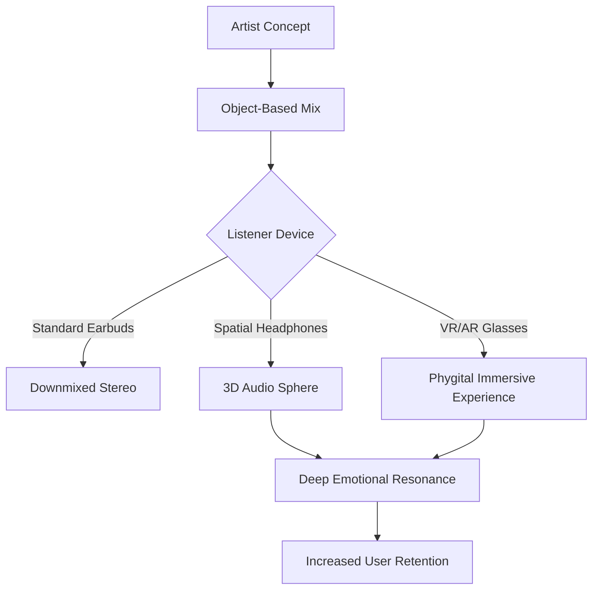

Picture this: it’s a morning in 2026. You wake up, but instead of a generic "Morning Chill" playlist, your speakers are playing a **real-time soundscape** that actually knows how you're feeling. It’s syncing with your heart rate and stress levels, slowly picking up the tempo and brightening in tone to gently nudge you awake. Then, on your way to work, you aren't just listening to a track—you're stepping into a **spatial audio world**. The instruments move around you in a full 360-degree circle, making it feel less like a recording and more like the band is right there in the room with you.

For a long time, music was something static—a vinyl record, a CD, or a digital file. But as we head toward 2026, the vibe is shifting from **just listening to actually being immersed**. That wall between the artist, the listener, and the space around us is essentially disappearing. Music is becoming a living thing, powered by AI, new monetization models, and a global cultural exchange that has finally broken the old grip of the US and UK pop charts.

This isn't just about fancy new gadgets; it’s about how we experience sound as humans. From the rise of artists in the "Global South" to the ethics of AI voices, 2026 is going to be a wild mix of innovation and identity. To understand where we're going, we have to look at how sound, science, and people are converging.

---

## 🤖 The AI Era: Moving Past the Gimmicks

  
  
📸 <a href="https://unsplash.com/@shootnmatch">weston m</a> on <a href="https://unsplash.com/photos/musical-notes-on-white-paper-3pCRW_JRKM8">Unsplash</a>

By 2026, the shock of "AI-generated songs" will have worn off. We'll be over the novelty of "AI Drake" or "AI Beatles," and we'll have moved into something much more sophisticated: **Hyper-Personalization**. AI isn't just a tool for producers to find a catchy melody anymore; it’s become a real-time collaborator that bridges the gap between what the artist intended and how the listener is feeling in the moment.

The big change here is the move from *Generative AI* (which simply creates a finished song) to *Adaptive AI* (which modifies the song while you're listening). We're seeing the rise of "Fluid Albums." These aren't just audio files; they're sets of musical "rules." Depending on your location or mood, the song might actually change. If you're out for a run, the BPM (beats per minute) kicks up to match your pace. If you're winding down for bed, the song strips itself back into a quiet, ambient version.

**Some numbers to keep in mind:**
- **Functional music** (AI tracks designed for focus, sleep, or anxiety) is exploding, with some reports showing a **compound annual growth rate (CAGR) of over 18%** as wellness becomes a core part of our daily routines.
- **70% of new producers** are now using AI to assist with mixing and mastering. This means you don't need a fancy degree in audio engineering to make a professional track; the value has shifted from *technical perfection* to *creative vision*.
- "Prompt-to-Production" tools have turned weeks of demo work into seconds, resulting in a massive flood of content—forcing us to rethink what "quality" actually means.

> "The artist's job in 2026 isn't just to write a song, but to design the 'musical DNA' that lets a song evolve for every single person who hears it. They're becoming architects of an experience, not just writers of notes." — *Industry Insight, 2025 Trends Report*

This creates a fascinating tension. AI can mimic a legendary singer's voice perfectly, but because of that, the "human element"—the raw emotion, the slight imperfections, the actual lived experience—has become a luxury. In 2026, "Human-Made" labels will be like "Organic" labels on food. We're already seeing "Lo-Fi Humanism," where artists intentionally leave in the sound of their breath or a stray room noise just to prove they're actually human.

The friction between "Prompt Engineers" and "Musicians" has mostly settled. The most successful artists now use AI to handle the heavy lifting of orchestration and sound design, leaving them free to focus on the story, the lyrics, and the emotional heart of the music.

---

## 🎧 The Death of Stereo: Stepping Inside the Sound

For almost a hundred years, we've listened to music in stereo—left and right. By 2026, stereo will feel like a relic, much like how mono felt back in the '60s. The new standard is **Spatial Audio** and **Object-Based Mixing**, which transforms the listener from a spectator into a part of the music.

Tech like Dolby Atmos and Sony 360 Reality Audio has moved from professional studios into our everyday earbuds. The way engineers "mix" a song has totally changed. Instead of panning a sound to the left or right speaker, they place "sound objects" in a 3D space. A violin can hover over your head, the bass can pulse under your feet, and the singer can whisper right in your ear as if they're standing inches away.

**How this changes the experience:**
- **Immersive Storytelling:** Artists are building "Sonic Worlds." A concept album isn't just a list of songs anymore; it's a journey. You might "move" from a noisy city street to a giant cathedral without ever leaving your couch.
- **VR/AR Integration:** With headsets like the Apple Vision Pro and Meta Quest, music becomes something you see and hear. At virtual concerts, you can actually walk *through* the orchestra or stand inside the drum kit and feel the percussion as a physical force.
- **Better Accessibility:** For people with hearing impairments, spatial audio mixed with haptic tech (vibrations) allows them to "locate" sounds, making music accessible to far more people.

**Stereo vs. Spatial (The 2026 View)**
- **Stereo:** Flat, directional, passive, one fixed perspective.
- **Spatial:** Spherical, immersive, active, dynamic, and emotionally resonant.

The end result is a much deeper emotional connection. By mimicking how we actually hear things in the real world (a process called **HRTF** or Head-Related Transfer Function), spatial audio triggers a stronger psychological response. It breaks down the "wall" of the headphones, making the music feel less like a recording and more like a shared memory. In 2026, the "sweet spot" isn't where you sit in the room—it's a state of mind.

---

## 🌍 The Global Ear: No More "World Music"

The idea of "World Music" as a separate, exotic category is officially dead. In 2026, the global charts are a true mix of cultures. The old dominance of the US and UK has faded, replaced by the explosive energy of the **Global South**, especially West Africa, Latin America, and South Korea.

**Afrobeats** and **Amapiano** aren't just trends anymore; they're the foundation of global pop. We're seeing a "Rhythmic Convergence" where Western artists aren't just "featuring" an African artist to get more streams; they're adopting the complex rhythms of Lagos and Johannesburg as the standard for dance music. The old "four-on-the-floor" House beat is being swapped for the syncopated, log-drum patterns of Amapiano.

**What the data tells us:**
- **Latin Music:** Now a global powerhouse. Spanish-language tracks are constants in the Global Spotify Top 10, even for listeners who don't speak a word of Spanish.
- **K-pop's Evolution:** It has moved past the "idol" phase. K-pop in 2026 focuses on high-concept storytelling and a blend of real humans and AI members, creating a hybrid experience.
- **New Growth Hubs:** Southeast Asia and Sub-Saharan Africa are the fastest-growing markets for paid subscriptions, shifting financial and cultural power away from the North.

> "We're entering a 'Post-Language' era. When the rhythm is this good and the production is this tight, the lyrics matter less than the 'vibe.' The world is tuning into frequency and emotion, not just words."

Much of this is driven by short-form video, which acts as a cultural accelerator. A kid producing tracks in their bedroom in Nairobi can have a global hit in 48 hours, completely bypassing old gatekeepers like radio stations and major labels. This has led to "Micro-Genres"—super-specific blends like "Japanese-Brazilian Lo-Fi"—that find their perfect audience through precision algorithms.

---

## 💰 Getting Paid: The New Economics of Sound

The way musicians make money in 2026 is undergoing a massive correction. For years, the "pro-rata" streaming model—where all revenue goes into one big pot and is split by total play count—was broken. It favored "background noise" (like 10-hour loops of rain) over actual art. A rain track could earn as much as a symphony simply because people left it on while they slept.

To fix this, the industry has shifted toward **Artist-Centric Payment Models**. Platforms like Deezer and Spotify now prioritize "professional artists" (those with real engagement) and pay less for "functional noise."

**The new ways artists make a living:**
- **Direct-to-Fan Equity:** Thanks to Web3 and blockchain, fans can now buy "fractionalized royalties." You can essentially buy 1% of your favorite song's future earnings. If the song blows up, you earn money too, turning the fan into a partner.
- **Micro-Transactions:** The "pay-per-song" model has returned in a digital form. You might pay a few cents to unlock a special 3D version of a track, a personalized AI voice note, or a digital collectible that grants access to a private community.
- **Subscription Tiers:** Artists are launching their own "mini-platforms." Fans pay a monthly fee for early demos, Discord access, and virtual merchandise.

**The shift in value:**
- **Old Way:** Volume $\rightarrow$ Streams $\rightarrow$ Fractions of a cent $\rightarrow$ Reliance on the Algorithm.
- **New Way:** Community $\rightarrow$ Ownership $\rightarrow$ Sustainable Career $\rightarrow$ Reliance on the Fanbase.

This is a huge win for the "middle-class musician." By cutting out the noise and rewarding genuine fandom, the industry is building a more sustainable system. However, it does create a new gap: artists who "play the game" of the algorithm versus avant-garde artists who struggle to fit in, even if they remain culturally vital.

---

## 🔬 Music as Medicine: The Sonic Pharmacy

Perhaps the most amazing development of 2026 is how music has entered the healthcare world. It's no longer just for entertainment; it's being prescribed as **Digital Therapeutics (DTx)**, backed by rigorous neuroscience.

We now have **Bio-Adaptive Soundscapes**. Using data from your Apple Watch or Oura ring, music apps can detect if your heart rate is spiking or if you're stressed. In real-time, the music adjusts its frequency and tempo to calm you down. This isn't just "relaxing music"—it's a targeted medical intervention.

**How it's being used in clinics:**
1. **Anxiety Mitigation:** AI music that senses a panic attack starting and automatically shifts into a "grounding" frequency using binaural beats to calm the nervous system.
2. **Cognitive Focus:** "Focus-states" tailored to your own brainwaves (Alpha and Beta), helping you reach a "flow state" faster and maintain it longer.
3. **Pain Management:** Using immersive spatial audio to distract the brain during medical procedures, which can significantly reduce the need for sedation.

- **The Science:** Significant work is being done on **Vagus Nerve Stimulation** through sound. "Vagal Music" is designed to trigger the parasympathetic nervous system and reduce inflammation.
- **The Market:** "Wellness Audio" has merged with "Health Tech," leading to "Audio-Pharmacies" where doctors prescribe specific soundscapes.

> "Music is the only thing that activates every part of the brain at once. In 2026, we're finally treating it like the medical tool it is, not just a luxury."

Of course, this brings up ethical questions. If a company can alter your mood or productivity with music in real-time, who owns that data? The line between "healing" and "manipulation" becomes thin when corporations use music to keep employees focused or customers spending.

---

## 🌿 Cleaning Up the Beat: Sustainable Sound

As the climate crisis intensifies, the music industry—once a major polluter due to massive world tours—has had to evolve. In 2026, **Sustainability and Circularity** are paramount. The goal is a "Net-Zero" sonic footprint.

The "Mega-Tour" has been reimagined. Instead of flying 100 tons of gear and 200 people across oceans, artists are using **Localized Production**. Stage designs are now 3D-printed from biodegradable materials in the city where the show is happening, drastically cutting shipping emissions.

**Green initiatives making a difference:**
- **Kinetic Flooring:** Major festivals now feature dance floors that harvest energy from the crowd's movement to power lights and sound. The audience literally becomes the power plant.
- **Carbon-Neutral Streaming:** Platforms are offsetting the energy used by data centers by investing in carbon-capture technology. You can even view the "Carbon Cost" of your playlist.
- **"Slow Touring":** Instead of a 50-city sprint, artists are opting for longer residencies in a few key hubs. This is better for the planet and significantly better for the artists' mental health.

**Then vs. Now:**
- **2016 Tour:** Private jets $\rightarrow$ Diesel generators $\rightarrow$ Plastic merch $\rightarrow$ Tons of waste.
- **2026 Tour:** Electric transport $\rightarrow$ Solar/Kinetic power $\rightarrow$ Recycled merch $\rightarrow$ Zero-waste.

This isn't just about being "green"; it's about survival. Gen Z and Gen Alpha demand accountability. "Green Certification" is now a prerequisite for selling tickets. Artists who don't adapt are being left behind by fans who view old-school excess as a relic of the past.

---

## 🎯 The "Phygital" World: Hybrid Experiences

The final piece of the puzzle is the **"Phygital" (Physical + Digital)** experience. We've moved past the clunky VR concerts of the early 2020s into a seamless blend where the digital layer enhances the physical one.

In 2026, a concert isn't just a place you go; it's a layer of reality you activate. With AR glasses or contact lenses, a fan at a show can see a digital aura around the artist, lyrics floating in the air, or a visualization of the music mapped onto the stadium walls.

**The Phygital Ecosystem:**
1. **The Digital Twin:** Major artists now have a "Digital Twin"—a high-fidelity AI avatar. This avatar can perform in 100 different cities in the metaverse simultaneously while the human artist plays one real show. This makes live music accessible to those who cannot afford to travel.
2. **Interactive Sets:** Fans can vote on the setlist, lighting, or even the key of the song in real-time via their devices, making the audience part of the creative process.
3. **Haptic Gear:** Haptic suits and vests allow fans at home to "feel" the bass and the kick drum, bridging the gap between the living room and the front row.

This changes the definition of "live." If a million people experience a perfectly synced, haptic, AR-enhanced show at home, is it any less "live" than being in a stadium? In 2026, the answer is: **It's just a different kind of presence.** We're moving from the "Age of the Spectacle" to the "Age of the Experience."

---

## Conclusion: Soul Meets System

Looking at 2026, it’s easy to worry that the "machine" has taken over. With AI writing melodies and avatars on stage, one might wonder: *Where is the soul?*

But the reality is the opposite. By letting AI handle the mundane—the mixing, the scheduling, the basic chord progressions—we're freeing artists to focus on the only thing AI cannot do: **Experience**. AI can simulate a heartbreak song by analyzing 10,000 ballads, but it cannot *feel* heartbreak. It can follow a trend, but it cannot start a revolution. It can mimic a voice, but it cannot possess conviction.

The theme of music in 2026 is **Synthesis**. It's the marriage of human emotion and machine precision. It's a world where a producer in Seoul, a singer in Lagos, and a listener in New York are all connected by a sustainable, bio-adaptive thread of sound.

We aren't just listening to music anymore; we're living inside it. The song is no longer a destination; it's an environment. In that world, the human heart remains the only conductor that matters. As we move forward, the goal is to ensure the technology stays the instrument, and the human spirit stays the musician.

***

**Quick Summary of 2026 Music Trends:**
- **AI:** Transitioning from simple tools to **real-time adaptive soundscapes** and "Fluid Albums."
- **Audio:** Stereo is legacy; **3D Spatial Audio** is the new standard for immersive feeling.
- **Culture:** The **Global South** (Afrobeats, Latin, K-pop) is the new epicenter of pop.
- **Economy:** A shift toward **Artist-Centric payments** and fan-owned royalties.
- **Health:** Music as a **clinical tool** (DTx) for mental health and stress management.
- **Planet:** A transition toward **carbon-neutral touring** and localized 3D-printed stages.
- **Experience:** **Phygital concerts** blending physical reality with AR, VR, and haptics.