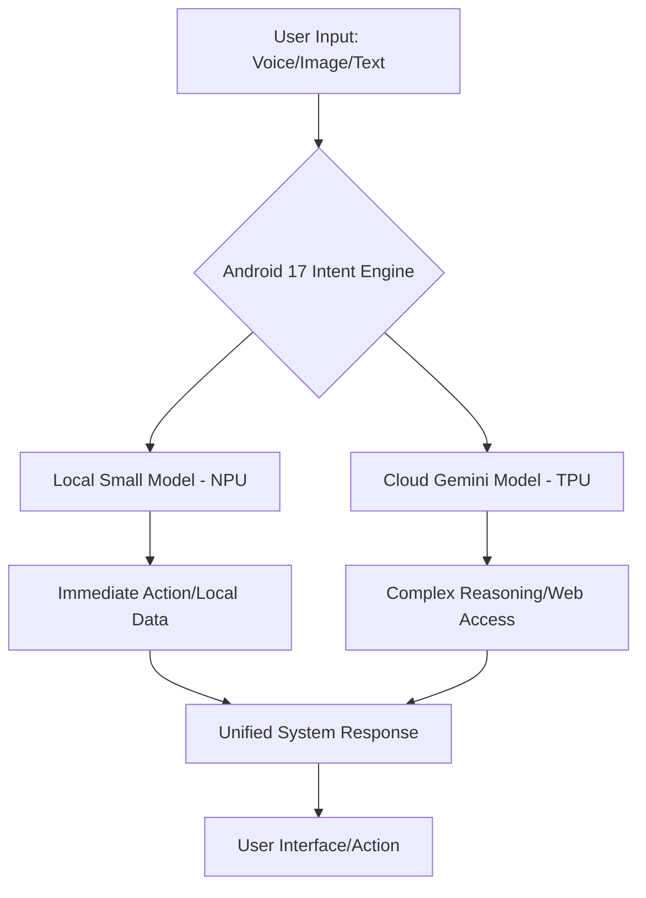

Picture this: It’s a morning in May 2026. You don’t have to fumble through your phone, opening a calendar app to check your day, a weather app to see if you need an umbrella, or a notes app to find your to-do list. Instead, your phone—running **Android 17**—has already done the legwork. It’s analyzed your emails, your schedule, and the local weather to place a simple, helpful "Morning Brief" right on your lock screen. It hasn't just listed your meetings; it’s already drafted replies to a few urgent emails and calculated exactly when you should leave the house based on current traffic and your preference for a quiet drive.

This isn't some far-off sci-fi movie; it’s where our phones are actually heading. By 2026, Android won't just be a place where you launch apps. It’s turning into a **proactive AI engine**. With **Google I/O 2026** coming up on **May 19–20 at the Shoreline Amphitheatre**, everyone is expecting a massive turning point. The big goal? Fully blending the **Gemini AI** ecosystem into the core Android experience.

Essentially, Android 17 is moving us from the "App Era" to the "Agent Era." Instead of you doing all the clicking, the operating system becomes a digital assistant that understands the context of what you're doing across different apps and sensors. We're moving toward a world where your phone doesn't just give you tools—it actually gets things done for you.

---

## 🤖 Android 17: Putting Gemini at the Core

  
  
📸 <a href="https://unsplash.com/@kellysikkema">Kelly Sikkema</a> on <a href="https://unsplash.com/photos/a-cell-phone-with-a-green-icon-on-it-hkXmZ_jQP4k">Unsplash</a>

For a long time, AI on Android felt like a collection of separate "extra" features—you had Google Assistant for voice, Magic Eraser for photos, and Smart Reply for texts. Android 17 changes that. It's moving away from "AI as a feature" and toward **"AI as the foundation."** The secret sauce here is the deep integration of **Gemini** models.

In the past, Gemini felt like an app you opened or a layer on top of your screen. In Android 17, Gemini *is* the interface. It will have **system-level permissions**, meaning it can see and interact with what's happening on your screen in real-time. Imagine an AI that actually knows what you're looking at—whether it's a complicated lease agreement or a messy spreadsheet—and can give you answers instantly without you having to copy and paste text into a chat box.

**Here is what we're expecting from the Gemini integration:**
- **Smooth Switching**: You'll be able to jump between voice, text, and images without a hitch. For example, you could point your camera at a broken dishwasher and say, "Find the manual for this and tell me how to fix this error code," and Android 17 will identify the model, search the web, and give you the solution.
- **A Memory That Works**: A private, secure "memory" that remembers your preferences. If you mentioned three weeks ago that you only like vegan spots, Android 17 will remember that and filter your food suggestions automatically.
- **Connecting the Dots**: The OS will be able to "reason" across different apps. It can take a flight invite from your calendar, a hotel confirmation from Gmail, and a packing list from Keep to build one seamless travel itinerary.

> "The goal isn't just to make the phone a better tool, but to make it feel like a digital extension of what you're trying to do. Android 17 isn't just a UI update; it's changing how we interact with our tech."

---

## 🔬 The Hardware Side: NPUs and Local Processing

Software is great, but it needs the right hardware to function effectively. For Android 17 to act like a real-time assistant, it can't rely on the cloud for everything. If every single request had to travel to a data center and back, the lag would be frustrating. That’s why 2026 will be all about **on-device processing** and **Hybrid AI**.

Google is expected to build **smarter NPU (Neural Processing Unit) schedulers** into the Android 17 kernel. Think of this as a traffic cop that decides whether a task should go to the CPU, GPU, or NPU so your battery doesn't drain and your phone doesn't overheat. By using **local LLMs** (smaller AI models built specifically for phones), basic tasks like summarizing a text or understanding a command will happen right on your device.

**Here is the technical breakdown in plain English:**
- **Better NPU Use**: New tools will let developers use the NPU more efficiently, which could cut energy use by **30–40%** compared to using the main processor.
- **The "Tiered" Approach**: Android 17 will likely split the work. Simple tasks (like "Set an alarm") stay on the phone; the heavy lifting (like "Write a detailed essay on quantum physics") goes to the powerful Gemini Ultra in the cloud.
- **Smarter Memory**: AI takes up a lot of room. Android 17 will likely use better memory compression to ensure phones with 8GB or 12GB of RAM can run models that previously required 16GB+.

By putting the "brain" closer to the user, Google is tackling the two biggest AI headaches: **lag** and **cost**.

---

## 📊 A New World for Developers: APIs & SDKs

For the people who build the apps we use, Android 17 is a total game-changer. The focus is shifting from building "screens" to building "capabilities" that an AI agent can trigger.

At **Google I/O 2026**, we expect new **AI-first platform APIs**. Instead of the AI trying to "guess" how to use an app by looking at the screen, the app will essentially provide the AI with a menu of things it can do (like "BookTable" or "SendInvoice").

**The big tools developers will be using:**
- **Better AI Studio**: A place to prototype how an app interacts with Gemini before it ever hits the Play Store.
- **Vertex AI Integration**: Stronger links to Google Cloud, allowing business apps to run their own custom-tuned models natively on the phone.
- **Open Model Support**: A standardized way for other AI models (like Llama or Mistral) to run on Android hardware just as efficiently as Gemini does.

This turns an app from a destination you visit into a **service provider**. For instance, a ride-sharing app doesn't need to worry about how you navigate its menus; it just needs a reliable "RequestRide" tool that Android 17 can trigger when you say, "Get me home."

---

## 🛡️ Keeping Things Private in an AI World

Here is the elephant in the room: if the OS sees everything you do to be helpful, that's a potential privacy nightmare. Google knows that for Android 17 to work, users have to trust it. That’s why **privacy-focused on-device tools** are a huge part of the 2026 plan.

We'll likely see **"Privacy Sandboxes for AI."** These are isolated zones where the AI can process your sensitive info without that data ever leaving your phone or being seen by app developers.

**The plan for privacy in Android 17:**
- **Local-First**: A rule that personally identifiable information (PII) stays on the device. If the cloud is needed, the system will use **differential privacy** to scrub your identity from the data first.
- **Detailed Permissions**: You won't just grant "Camera" access; you'll grant **"Context Access."** You could let Gemini see your emails but keep it away from your health data, or only let it see your calendar during work hours.
- **Clear Auditing**: A dashboard that tells you exactly why the AI accessed your data. For example: *"Gemini checked your Gmail at 10:00 AM to summarize your flight."*

> **The big takeaway**: Privacy isn't just a "feature" in Android 17; it's the foundation. If people don't feel safe, an agent-based OS simply won't work.

---

## 🎯 The Big Shift: From Apps to Agents

We are basically watching the "App Grid" fade away. For fifteen years, the routine has been: *Unlock $\rightarrow$ Find App $\rightarrow$ Click Menu $\rightarrow$ Do Task*. Android 17 wants to turn that into one simple step: *Say what you want $\rightarrow$ It gets done*.

This is the era of **Agentic Workflows**. An agent doesn't just give you a link; it does the work across different apps. Let's look at a real-world example: **Planning a Dinner Party**.

1. **What you say**: "I want to host a dinner party for six people this Friday. My budget is $100, and make sure there's something gluten-free."
2. **What Android 17 does**:
    - Checks your **Calendar** to make sure you're free.
    - Scans **Gmail** for any dietary notes from your usual guests.
    - Uses a **Grocery App** to find a recipe and put the ingredients in your cart.
    - Uses a **Payment App** to ensure you stay under $100.
    - Sends **WhatsApp** invites to everyone.
3. **The result**: You get a message: "All set! Dinner is Friday at 7 PM. Groceries are ordered and guests are invited."

This changes the entire economy of the Play Store. The "winner" won't be the app with the flashiest design, but the one with the most **reliable and easy-to-use API**.

---

## 🌍 The Global Race: Google vs. Apple vs. Microsoft

Android 17 isn't happening in a bubble. It's part of a massive AI arms race. By holding I/O 2026 in mid-May, Google is trying to set the pace before **Microsoft Build** and **Apple's WWDC**.

The fight isn't about who has the best screen or camera anymore—it's about who has the most **actually useful intelligence**.

**How the landscape looks right now:**
- **Google (Android 17)**: Their edge is their massive data ecosystem (Search, Maps, Gmail, YouTube) and the fact that Android is ubiquitous. Their goal is **total integration**.
- **Apple (iOS/Apple Intelligence)**: Their strength is the tight synergy between hardware and software, plus their brand focus on privacy. Expect their version to be more curated and "polished."
- **Microsoft (Copilot/Windows)**: They are the kings of productivity. They want an AI that follows you from your laptop to your phone seamlessly.

The risk for Google is **"feature bloat"**—trying to do too much and making the phone unstable. But if they pull this off, they stop being just a phone OS and become the **central operating system for your entire life**.

---

## 📈 Wrapping Up: A New Way to Use Your Phone

As we get closer to Android 17, remember that this isn't just another version update. It's a complete rethink of what a "phone" even is. For a decade, the smartphone has been a window to the internet. In 2026, it becomes an **autonomous partner**.

It won't be a perfect transition. There will be **AI hallucinations** (where it makes things up), **battery drains**, and **privacy concerns**. But the payoff is a device that actually saves us time instead of stealing it.

When the show starts at the Shoreline Amphitheatre on May 19, 2026, we'll see if Google can turn its AI research into something we can actually trust and use. If Android 17 works, the "App" as we know it becomes an old-school concept, replaced by a smart interface that knows what you need before you even have to ask.

**The Android 17 Prediction Checklist:**
1. **Gemini is the Boss**: No more "Assistant," just Gemini running the show.
2. **On-Device Brains**: AI that thinks in real-time, even without internet.
3. **Service-Based Apps**: Apps that act as tools for the AI, not just screens for you.
4. **Contextual Memory**: A phone that actually gets to know you over time.
5. **Privacy Vaults**: High-level encryption for everything the AI processes.

The era of the agent is arriving. The only question is: are we ready to let the OS take the wheel?