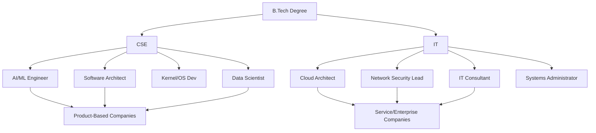

It’s 2026, and let’s be honest—the tech world looks completely different than it did even a few years ago. We aren't just talking about "learning to code" or "making websites" anymore. We're living in a world of autonomous AI agents, quantum security, and GenAI that can essentially write its own manuals. 

If you're looking to get into engineering, you're probably facing that same classic dilemma: **Do I go for a B.Tech in Computer Science Engineering (CSE) or a B.Tech in Information Technology (IT)?**

At first glance, they look like the exact same thing. Both involve spending a lot of time with a laptop, both require you to get comfortable with Python or Java, and both are great tickets into the Big Tech world. But if you look a little closer, they're actually quite different. 

Think of it like this: one is a **structural engineer** and the other is an **interior architect**. One focuses on the physics of why the building stays up; the other focuses on how to make the space actually work and feel great for the people living in it.

Picking the "wrong" one won't ruin your life, but picking the *right* one means your studies will align with what you're naturally curious about. Whether you want to build the next massive AI model from scratch or manage the cloud systems for a global company, the difference matters.

---

## 🤖 The Big Difference: The Creator vs. The Problem Solver

  
  
📸 <a href="https://unsplash.com/@haseebm">Haseeb Modi</a> on <a href="https://unsplash.com/photos/a-group-of-people-sitting-at-desk-with-laptops-LKySOH0mr38">Unsplash</a>

To really understand the difference between CSE and IT, you have to look at the goal of the degree. **Computer Science Engineering (CSE)** is all about the science of how computing actually happens. It’s a deep dive into the "molecular level" of tech—logic gates, memory management, and the complex algorithms that make a Google search happen in milliseconds. A CSE student doesn't just use a database; they want to know exactly how the data is stored so the system doesn't crash when a billion people use it.

**Information Technology (IT)**, on the other hand, is the art of making tech *work* in the real world. It’s about using technology strategically to solve business problems. If CSE is about building the tool, IT is about mastering that tool to get a job done. An IT pro asks questions like: *"How can we plug this AI tool into our shipping process to make it 20% faster?"* or *"How do we keep this network safe from hackers without slowing down the whole company?"*

> **The simple version:** CSE is about **innovation and creation** (building the engine), while IT is about **integration and optimization** (driving the car as efficiently as possible).

By 2026, this gap is even more obvious. With "Low-Code/No-Code" tools becoming mainstream, the IT role is evolving into that of a "Solutions Architect," while the CSE role is pushing deeper into fields like Quantum Algorithms and Neural Networks.

- **CSE Focus:** Theory of computation, system architecture, algorithm design, and the heavy mathematics behind it all.
- **IT Focus:** Systems management, network security, database administration, and automating business processes.

---

## 🔬 What’s Actually in the Syllabus?

If you look at the course list for most universities, the first two years are almost identical. Everyone struggles through Calculus, learns C++, and dives into Data Structures. But by year three, you'll notice a significant split.

**The CSE Path: The Deep Dive**
CSE is more theoretical and, let's be real, a bit more rigorous. You’ll encounter subjects like **Compiler Design** (how a language like Java actually turns into something a computer understands) and **Operating Systems** (how the "brain" of the computer manages memory and CPU). You'll spend a lot of time on **Complexity Analysis (Big O Notation)**—because in CSE, it's not enough that the code *works*; it has to be the most efficient version possible.

**The IT Path: The Practical Approach**
IT is more agile and geared toward immediate industry needs. Instead of Compiler Design, you might take **Information Infrastructure** or **Enterprise Resource Planning (ERP)**. You'll spend more time on **Database Management (DBMS)** and **Web Technologies**. While a CSE student is studying the theory of how a network protocol is designed, an IT student is actually configuring a Cisco router or deploying an app using Docker and Kubernetes.

### 📊 Quick Comparison: CSE vs. IT

| Subject Category | B.Tech CSE Focus | B.Tech IT Focus |
| :--- | :--- | :--- |
| **Core Logic** | Discrete Math & Theory of Computation | Applied Math & Statistics |
| **System Level** | Microprocessors & Compiler Design | System Admin & IT Infrastructure |
| **Data Handling** | Algorithm Analysis & Complexity | DBMS & Data Warehousing |
| **Networking** | Protocol Design & Theory | Network Management & Security |
| **Programming** | Low-level (C, Assembly) $\rightarrow$ High-level | Application-level (Java, Python, JS) |

Essentially: if you love the "how" and "why," CSE is for you. If you love the "what" and "when," IT is your lane.

---

## 📈 Let's Talk Money: Salaries & ROI in 2026

Here is the question everyone actually wants the answer to: **Who gets paid more?**

In 2026, the salary difference isn't really about the name of your degree, but about the *kind of jobs* those degrees typically lead to.

Based on recent data from [UPES](https://www.upes.ac.in/blog/computer-science/btech-it-vs-cse), CSE grads often command a higher starting salary because they tend to be hired by **Product-Based Companies** (think Google, NVIDIA, or OpenAI) for high-complexity roles. IT grads are also well-paid, but they often start at **Service-Based Companies** (like TCS, Accenture, or Capgemini) or within the IT departments of non-tech corporations.

**Estimated Salary Benchmarks for 2026 (LPA):**

- **Entry-Level (0-2 Years):**
    - **CSE:** **₹5 – ₹10 LPA** (AI/ML specialists can go significantly higher)
    - **IT:** **₹4 – ₹8 LPA**
- **Mid-Level (3-6 Years):**
    - **CSE:** **₹10 – ₹18 LPA**
    - **IT:** **₹7 – ₹14 LPA**
- **Senior-Level (7+ Years):**
    - **CSE:** **₹20+ LPA** (Architects, Principal Engineers)
    - **IT:** **₹15+ LPA** (IT Directors, CTOs, Infrastructure Leads)

**Why the gap?**
It comes down to "depth." Many people can build a website (an IT skill), but far fewer can optimize a database engine to handle a million requests per second (a CSE skill). That scarcity drives the price up. That said, an IT graduate who becomes an expert in **Cloud Architecture (AWS/Azure)** or **Cybersecurity** can easily outearn a mediocre CSE graduate. In the real world, **your skills matter more than your degree.**

---

## 🎯 Where Will You End Up? (Career Paths)

Both degrees get you into "Tech Heaven," but they open different doors.

### 🤖 The CSE Route: The Innovators
If you go with CSE, you're set up for roles where you're creating new software or fundamentally improving existing systems.
- **AI/ML Engineer:** Building the neural networks that power self-driving cars or AI doctors.
- **Software Architect:** Designing the blueprint for a massive app so it doesn't crash under the weight of millions of users.
- **Data Scientist:** Using math and coding to find hidden patterns in massive piles of data.
- **Kernel Developer:** Writing code that talks directly to the hardware (the "boss level" of coding).

### 🌍 The IT Route: The Strategists
If you choose IT, you're positioned to ensure that technology actually delivers tangible value to a business.
- **IT Analyst:** Acting as the bridge between "business stakeholders" and the "tech team."
- **Network Administrator:** Ensuring a global company's internet and communication systems are secure and fast.
- **Cloud Engineer:** Migrating legacy company systems into the cloud to reduce costs and increase speed.
- **Cybersecurity Specialist:** Protecting a company's data from hackers (this role overlaps significantly with CSE).

---

## 💡 The AI Factor: How GenAI Changed Everything

We can't talk about 2026 without mentioning **Generative AI**. LLMs have totally shifted the value proposition of these degrees.

For the **IT pro**, AI is a superpower. Tasks that used to take a week—like writing basic code for a web app or setting up a network script—now take seconds. This means IT is moving away from "coding" and toward "orchestration." A modern IT pro is a **Prompt Engineer** and a **System Integrator**, focusing on how to link different AI tools together to automate an entire business.

For the **CSE pro**, AI has actually raised the bar. When an AI can write a standard sorting algorithm in two seconds, your value isn't in *knowing* the algorithm—it's in *inventing* new ones. The focus has shifted to **AI Safety**, **Model Optimization**, and **Hardware-Software Co-design**. CSE engineers are now the ones making AI smaller, faster, and safer.

> **The Shift:** It used to be that IT was perceived as "easier" than CSE. Now, IT requires more **strategic thinking**, while CSE requires even deeper **mathematical proficiency**.

---

## 🚀 Finding Your Niche: Specializations

In 2026, a general degree is rarely enough. Most students now choose a specialization. If you're unsure which degree to pick, look at these niches:

**1. Cybersecurity**
The perfect middle ground. If you love the "cat and mouse" game of hacking and defending, either degree works. CSE will teach you how to find a bug in the C code; IT will teach you how to set up a "Zero Trust" security system for a whole company.

**2. Cloud Computing**
This is the heart of the IT degree. If you like managing virtual data centers and optimizing costs, IT is your home. But if you want to build the *software* that makes the cloud possible, stick with CSE.

**3. Data Science & Big Data**
This leans heavily toward CSE. You need a strong grasp of linear algebra and probability. IT students often become "Data Analysts" (using tools like Tableau), while CSE students become "Data Scientists" (building the actual models).

**4. Full Stack Development**
Anyone can do this. The difference? A CSE Full Stack dev usually focuses on **performance** (making the page load faster), while an IT Full Stack dev focuses on **UX and deployment** (getting the app to the user smoothly).

---

## 🎯 Still Confused? Ask Yourself These 4 Questions

Let's strip away the jargon. To figure out which one to enroll in for 2026, be honest with yourself about these four things:

1. **Do I love the "Why" or the "How"?**
    - "I want to know why this software is slow and I want to rewrite the logic to fix it" $\rightarrow$ **Choose CSE**.
    - "I love taking different tools and putting them together to build something that works" $\rightarrow$ **Choose IT**.

2. **Am I a Math person or a Management person?**
    - "I actually enjoy Calculus, Logic, and Discrete Math" $\rightarrow$ **Choose CSE**.
    - "I enjoy organizing systems, managing workflows, and solving business problems" $\rightarrow$ **Choose IT**.

3. **What does my dream workday look like?**
    - Spending 8 hours in a "flow state," solving complex coding puzzles $\rightarrow$ **Choose CSE**.
    - A mix of technical troubleshooting, chatting with stakeholders, and deploying updates $\rightarrow$ **Choose IT**.

4. **What's my risk appetite?**
    - "I want the highest possible salary ceiling (R&D and Product roles) and I don't mind a brutal learning curve" $\rightarrow$ **Choose CSE**.
    - "I want a faster path to a job and a versatile role that's needed in every industry (Health, Finance, Retail)" $\rightarrow$ **Choose IT**.

### 🛠️ Your Step-by-Step Plan
1. **Test drive it:** Spend one week on LeetCode (the CSE way) and one week setting up a Home Lab with a Virtual Machine and a Firewall (the IT way). See which one you actually enjoy.
2. **Read the actual syllabus:** Not all "IT" degrees are the same. Some are just "CSE-Lite," while others are highly specialized.
3. **Look at the placements:** Check which companies visit your college. Are they product giants (Google/Amazon) or consulting giants (Accenture/Deloitte)?
4. **Talk to a senior:** Find someone two years into their career. Ask them: *"Do you wish you had more theory (CSE) or more practical implementation (IT)?"*

---

## 🏁 Final Thoughts: Two Worlds, One Goal

As we move further into 2026, the line between CS and IT is blurring. We're seeing the rise of the **"T-Shaped Professional"**—someone who knows a little bit of everything but is a total expert in one specific area.

The truth is, the industry cares far more about your **GitHub repository** than the letters on your degree. A CSE student who can't deploy an app to the cloud isn't very useful, and an IT student who doesn't understand basic time complexity will eventually hit a ceiling.

**The Verdict:**
- Choose **Computer Science Engineering** if you want to be the one creating the next generation of technology. It's for the inventors and the hardcore coders.
- Choose **Information Technology** if you want to be the one using technology to push the world forward. It's for the strategists and the digital architects.

No matter what you pick, the golden rule for 2026 is: **Stay curious.** The tools we use today will be old news by 2030. The only "future-proof" skill is learning how to learn. Whether you're building the engine or driving the car, the road ahead is wide open.

***

**Ready to dive in?** Whether you become the architect or the implementer, just remember that the best engineers are the ones who never stop asking *"What if?"* 🚀