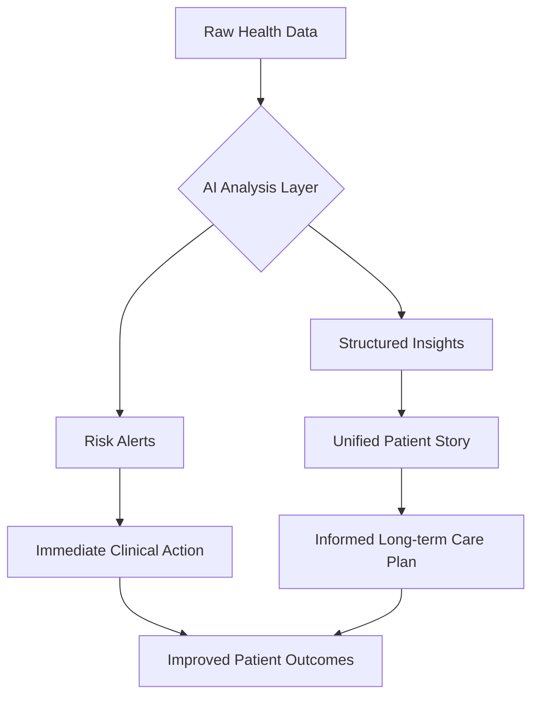

Picture this: you’re walking into a clinic in 2026. There’s no frantic digging through old paper files, no "we're still waiting on your records from that other specialist," and—thankfully—no more repeating your entire medical history for the fifth time. Instead, your doctor looks at a screen that shows a **Unified Patient Story**. It’s a seamless, real-time snapshot of everything—your lab results, every medication tweak, and even your genetic markers—no matter where that data originally came from.

This isn't a sci-fi movie plot; it's where we're heading with **Health Information (HI)**. For a long time, health data was treated like a digital filing cabinet—something used mostly for billing or legal cover. But as we move toward 2026, HI is changing. It's moving from a passive record to an active, intelligent system. We're shifting from simply "collecting data" to actually managing the *insights* that data provides.

The stakes are huge. Between the explosion of AI and the way we handle chronic illnesses today, having accurate, private, and fluid health information isn't just an "IT problem"—it's a matter of patient safety. By 2026, the quality of your health data will quite literally shape the quality of your care.

---

## 📊 Ending the Chaos: Getting to that Unified Patient Story

  
  
📸 <a href="https://unsplash.com/@ninjason">Jason Leung</a> on <a href="https://unsplash.com/photos/selective-focus-photography-of-multicolored-confetti-lot-Xaanw0s0pMk">Unsplash</a>

For years, the "dream" in healthcare has been interoperability (basically, getting systems to talk to each other). But for too long, that just meant being able to email a PDF from one office to another. In 2026, things are different. As industry leaders like Kevin Ritter from [Altera Digital Health](https://www.linkedin.com/company/altera-health) have pointed out, we're finally moving past fragmented data and starting to tell a **complete, unified story**.

The "Unified Patient Story" isn't just about dumping all your data into one folder; it's about **semantic interoperability**. In plain English? It means that when two systems exchange a blood pressure reading, they aren't just sending numbers. They're sharing the context—how it was taken and what it actually means clinically. By 2026, we're moving toward **intelligent data management**, where the system checks the quality of the data in real-time. This ensures doctors aren't just seeing *more* data, but *better* data.

This is a game-changer. When data is unified, we close the gaps that cause medical mistakes. Imagine a patient with a complex list of drug allergies spread across three different hospitals. In the old, fragmented way, one missing file could be fatal. In 2026, the system flags a conflict the second a doctor orders a medication, regardless of where that allergy was first noted.

**What's making this happen?**
- **FHIR-enabled Futures**: The use of "Fast Healthcare Interoperability Resources" (FHIR) lets systems exchange tiny, specific pieces of data rather than giant, clunky files.
- **Cloud-First Foundations**: Moving away from dusty old office servers to the cloud, allowing everything to sync in real-time.
- **Data Quality Scoring**: Systems that "grade" how reliable a piece of info is before it even hits the doctor's screen.

> "2026 will be the year healthcare data stops being fragmented and starts telling a complete story about every patient... unified, high-quality data is essential for better care, analytics, and provider decisions." — **Kevin Ritter, EVP of CareInMotion**

---

## 🔬 The Rulebooks: Making Sense of HTI-5 and USCDI v7

This shift isn't happening by accident; there are some big regulatory pushes behind it. In the U.S., the **Office of the National Coordinator for Health IT (ONC)** and the **Department of Health and Human Services (HHS)** are shaking things up with the **HTI-5 proposed rule** and **USCDI v7** standards.

The **HTI-5 rule** is a bit of a pivot. Instead of giving developers a rigid "check-the-box" list that often kills creativity, HTI-5 is trying to cut the red tape. The goal is to move toward **less prescriptive certification** and rely more on open APIs. By loosening the reins, the government is essentially daring the industry to innovate faster, especially when it comes to **AI-powered data exchange**.

At the same time, **U.S. Core Data for Interoperability (USCDI) v7** is expanding what we actually consider "essential" health info. The new drafts introduce **30 new data elements** to give a more human view of the patient. One of the most impactful additions is **accommodation data**. This means a system can automatically flag if a patient needs a sign language interpreter or wheelchair access, bringing social determinants of health (SDOH) right into the clinical workflow.

**What USCDI v7 is focusing on:**
- **Patient Context**: Including sensory needs and accessibility requirements.
- **Health & Safety**: Standardizing how "near-misses" (mistakes that were caught just in time) are recorded.
- **Care Coordination**: Making it easier to pass patient info between different facilities.

Think of it as a "push-pull" system: HTI-5 gives the *freedom* to build new tools, and USCDI v7 provides the *common language* those tools use to talk to each other.

---

## 🤖 AI and the Burnout Crisis: Turning Data into a Tool

For the last decade, doctors have been drowning in data but starving for actual insights. This is the "Efficiency Crisis"—where clinicians spend more time typing into an Electronic Health Record (EHR) than actually looking at their patients. By 2026, AI is finally starting to fix this.

As researchers like Anmol Madan have noted, AI isn't just for reading X-rays anymore; it's being used to **fix the operational plumbing** of healthcare. AI-driven systems can now handle **automated abstraction**. This means the AI reads thousands of pages of messy clinical notes, pulls out the key facts—like diagnoses or procedure dates—and organizes them into a neat, structured format.

This changes HI from a "cost center" (something you just pay to keep running) into an **operational asset**. When your data is intelligent, it helps you make decisions in the moment. For example, instead of a hospital manager looking at last week's report to see how full the ward is, an AI system provides a **real-time dashboard**, predicting bed shortages before they even happen.

**How AI is actually helping in 2026:**
1. **Ambient Documentation**: AI listens to the conversation between the doctor and patient and fills out the chart automatically, so the doctor can actually make eye contact.
2. **Predictive Risk**: Analyzing a patient's long-term data to spot who is most likely to be readmitted to the hospital.
3. **Automated Coding**: Smoothing out the friction between clinical notes and billing, which means fewer insurance denials and fewer headaches.

---

## 🌍 Looking Abroad: The European Health Data Space (EHDS)

While the U.S. is focusing on flexibility and APIs, Europe is taking a more organized, "all-in" approach with the **European Health Data Space (EHDS)**. The EHDS is a massive framework for mandatory data sharing, split into **primary use** and **secondary use**.

**Primary Use** is the intuitive part: it ensures a Spanish citizen can visit a doctor in Germany and have their medical records available instantly and securely. This cross-border exchange should be mandatory for priority data by **2029**, and fully rolled out by **2031**.

**Secondary Use** is where things get really interesting. It allows researchers and policymakers to access anonymized health data from across the entire EU to develop new medicines. This creates a huge pool of **Real World Evidence (RWE)**. Imagine a pharma company finding a tiny, rare patient population across 27 different countries in a few days instead of a few years.

Of course, it's not all smooth sailing. There’s a lot of talk about the **"EHDS Tax"**—the administrative cost and paperwork hospitals must manage to keep their data catalogs updated. There's also a tug-of-war between **transparency and intellectual property (IP)**; data holders must list sensitive clinical trial data and trust national bodies to keep it safe.

**Comparing the two approaches (2026):**
- **USA**: Market-driven, focused on "reducing friction" and giving developers flexibility.
- **EU**: Framework-driven, mandatory, and focused on the "public good" and research at scale.

---

## 💡 From "Checking Boxes" to Stewardship: A New Way of Thinking

Maybe the biggest change in 2026 isn't the tech, but the mindset. We're moving away from **technical compliance**—where the goal was just to "follow the rules"—and entering the era of **Shared Stewardship**.

As Tom Varghese puts it, the early failures of digital health (like those clunky patient portals we all hate) showed that just sharing data isn't enough. The real question is *stewardship*: who is responsible for this data, and how are they looking after it?

In 2026, taking care of health data is seen as a **collective responsibility**, not just the CIO's job. It's shared across five pillars:
- **Governments**: Setting the rules for privacy and accountability.
- **Health Systems**: Ensuring data is high-quality and accessible safely.
- **Tech Vendors**: Building security and interoperability into the product from day one.
- **Clinicians**: Being ethically responsible for how data is used in treatment.
- **Patients**: The most important part—the people whose trust makes the whole system work.

When stewardship is just a "box-ticking exercise," the system feels sterile and useless. But when it's a shared mission, HI becomes a **public good**. We're seeing this with "Patient-Centric Data Ownership," where patients have real control over who sees their data and why, rather than just a simple "yes/no" opt-in.

> "Problems arise when stewardship is reduced to technical compliance or efficiency... Effective health data stewardship is therefore shared stewardship." — **Tom Varghese, Orion Health**

---

## 🎯 The Real-World Struggle: Accuracy, Privacy, and Speed

Despite the fancy talk of AI and unified stories, the people actually managing this—the **Health Information Management (HIM)** pros—are under immense pressure. As Greg Miller from [Carta Healthcare](https://cartahealthcare.com) notes, the expectations for **accuracy, privacy, and performance** are higher than ever.

The paradox of 2026 is that the more data we have, the smaller the room for error. One AI "hallucination" or one mismatched record can lead to a serious medical mistake. Because of this, the HI professional has evolved from a "data keeper" to a "data validator."

**The three big pressures in 2026:**
- **The Accuracy Mandate**: Since AI is generating more of the records, we need a "human-in-the-loop" to double-check everything. HIM pros now use **data quality scoring** to ensure the "Unified Story" is actually accurate.
- **The Privacy Paradox**: We want data to flow for the sake of care, but it must be locked down tight. With the rise of quantum computing, we're moving toward **quantum-resistant encryption**.
- **The Performance Gap**: Doctors expect data to load instantly. In 2026, "lag" isn't just annoying—it's a barrier to treating a patient.

To handle this, hospitals are focusing on "frictionless workflows"—tools that integrate into the doctor's day instead of requiring another password or another screen.

---

## 🚀 Preparing for 2026: A Roadmap for HI Pros

If you're working in health info, you need a new toolkit. Knowing how to code in ICD-10 or 11 isn't enough anymore. Today's HI pro needs to be a bit of a data scientist, a bit of an ethicist, and a bit of a workflow engineer.

**If you're leading a healthcare team or working in HI, here is how to future-proof your world:**

1. **Clean Up Your "Data Debt"**: Find out where your data is still hidden in silos. You can't unify what you can't find. Look for "shadow data"—those random spreadsheets and local folders that live outside the official EHR.
2. **Build a Stewardship Team**: Stop saying "IT owns the data." Create a committee that includes doctors, patients, and compliance officers.
3. **Focus on Meaning, Not Just Exchange**: Don't just aim to "send data"; aim for the data to *mean* something. Make sure you're fully up to speed with **FHIR** and **USCDI**.
4. **Check the AI's Work**: If you're using AI for notes, build a strict "Human-in-the-Loop" (HITL) process. Every piece of AI-generated data should have a "confidence score."
5. **Fix the Patient Experience**: Look at your patient portal. Is it a scary "data dump" of labs, or is it a helpful health dashboard? Give patients insights they can actually use.

---

## 🎯 Conclusion: The New Heartbeat of Healthcare

Looking toward 2026, it's clear that **Health Information (HI)** isn't just a supporting character anymore—it's the lead. Moving from fragmented files to a **Unified Patient Story** is more than just a tech upgrade; it's a total rethink of how patients, doctors, and data interact.

It won't be easy. Between the "EHDS tax" in Europe, AI privacy risks in the US, and the stress on HIM professionals, it's a bumpy ride. But the payoff is a healthcare system that is actually **intelligent**.

When we stop treating health info as a checklist and start treating it as a shared responsibility for human life, we unlock the real promise of medicine. In 2026, the most powerful tool a doctor has won't be a pill or a scalpel—it'll be a perfectly accurate, seamless stream of information. The foundation is built; now we just have to learn how to use it.