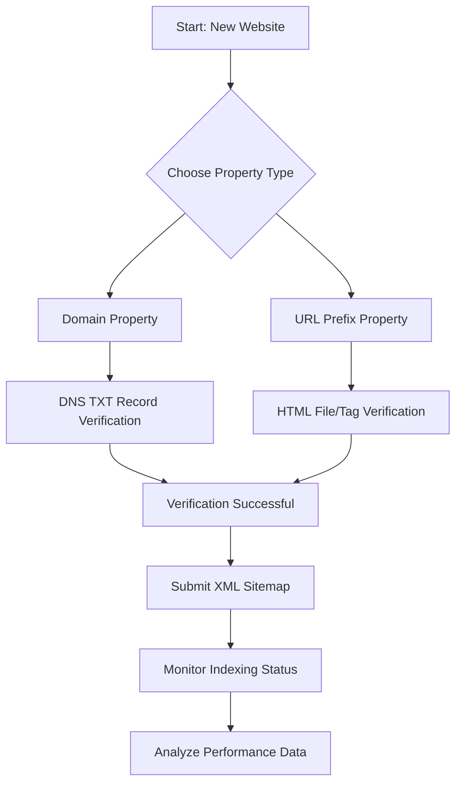

Have you ever worried that you'll wake up one day and find your website—the one that's been sitting pretty on page one for years—has just... vanished? It’s not because you did something wrong or got penalized. It's simply that Google’s AI Overviews (the evolved version of SGE) are now answering the user's question right there on the search page. The days of simply clicking a "blue link" are starting to fade. We've officially moved into the era of **Generative Engine Optimization (GEO)**.

By 2026, getting your site noticed isn't about "tricking the system" or cramming keywords into your footer. It's about becoming a name that Google actually trusts. Whether you're running a small blog or a global corporation, your visibility comes down to one main thing: how well your content communicates with **Google Search Console (GSC)**.

Think of this not as a dry tutorial, but as a friendly guide to help you stay visible and grow in this new version of search.

---

## 🤖 How SEO Has Changed: It's About Concepts, Not Just Words

  
  
📸 <a href="https://unsplash.com/@merakist">Merakist</a> on <a href="https://unsplash.com/photos/seo-text-wallpaper-l5if0iQfV4c">Unsplash</a>

For a long time, SEO felt like a word game. If you wanted to rank for "best coffee maker," you just made sure that phrase appeared a bunch of times. But by 2026, Google's AI has grown up. Search is now **semantic and entity-based**.

In plain English? Google doesn't just "read" your words anymore; it actually "understands" the topic. It knows that if you're talking about a "coffee maker," you're probably also talking about "brewing temperature," "arabica beans," and "countertop space." To win today, you need to optimize for **Entities**. An entity is just a fancy word for a well-defined thing—like a person, a brand, a place, or a specific technical concept.

**Here is the deal with AI Overviews (SGE):**
Data shows that **up to 80% of simple "info" questions** are now answered by AI summaries at the top of the page. This creates "Zero-Click Searches," where people get their answer without ever clicking a link. While that sounds scary, it's actually a huge opportunity. If you want to be the source the AI cites, you need a high level of **E-E-A-T (Experience, Expertise, Authoritativeness, and Trustworthiness)**.

> "In 2026, the goal isn't just to get the click—it's to be the expert source that the AI trusts enough to point everyone toward." — *Digital Strategy Insight*

To make this work, you've got to shift your approach:
- **Stop** obsessing over huge, generic keywords.
- **Start** answering the "long-tail" questions—the way people actually talk (the "how," "why," and "what if" questions).
- **Focus** on "Information Gain"—give people new, original insights that an AI can't just summarize from five other websites.

---

## 🎯 Google Search Console: Your Direct Line to Google

Before you write a single blog post, you need to make sure Google knows you exist. That’s where **Google Search Console (GSC)** comes in. Think of GSC as a health check for your site. It doesn't "do" the SEO for you, but it tells you exactly how Google sees your site and where things are getting stuck.

### How to Get Your Website into Google Search Console

Setting this up correctly is like laying a solid foundation for a house. If the foundation is shaky, nothing else will really work.

1.  **Set up your account:** Head over to the [Google Search Console](https://search.google.com/search-console/about) home page and sign in with your professional Google account.
2.  **Pick your property type:** You'll see two choices: *Domain* or *URL Prefix*. 
    - **Domain Property (The recommended choice):** This covers everything—your subdomains (like `blog.yoursite.com`) and both `http` and `https`. You'll need to verify this through your DNS settings.
    - **URL Prefix Property:** This only tracks one specific URL path. It's easier to set up but doesn't give you the full picture.
3.  **Verification (The tricky part):** 
    - For Domain properties, you'll add a **TXT record** to your DNS (wherever you bought your domain, like Cloudflare or Namecheap). This proves you actually own the site.
    - For URL Prefix, you can simply upload a small HTML file to your site or use a Google Analytics tag.
4.  **Submit your Sitemap:** Once you're verified, go to the "Sitemaps" tab. Enter the URL of your XML sitemap (usually `yourdomain.com/sitemap.xml`). This is essentially a map that tells Google, "Hey, here are my most important pages, and here is when I last updated them."

**Why bother?** Without GSC, you're basically flying blind. You won't know if Google is ignoring a page because of a technical error or if your site is simply too slow. In 2026, it can sometimes take a while for Google to "find" new pages; GSC lets you manually ask Google to index a page immediately.

---

## 🚀 Technical SEO: Getting the "Engine" Right

If your content is the "car," technical SEO is the "engine." You can have a stunning car, but if the engine won't start, you're not going anywhere. These days, Google cares deeply about **User Experience (UX)**.

### Core Web Vitals (CWV) in 2026
Google has updated its criteria. While loading speed and stability still matter, the primary focus now is **INP (Interaction to Next Paint)**.

- **LCP (Loading):** Your main content should be visible in **under 2.5 seconds**.
- **CLS (Stability):** Your page shouldn't "jump around" while it's loading. Aim for a score **below 0.1**.
- **INP (Responsiveness):** This is all about how "snappy" your site feels. When a user clicks a button, how fast does the site react? The gold standard for 2026 is **under 200ms**.

### Your Technical To-Do List
- **HTTPS is a must:** If your site isn't secure, Google will essentially hide it from the world.
- **Mobile-First is the only way:** Google barely considers the desktop version anymore. If your mobile menu is clunky or the text is too small, your rankings will take a hit.
- **Check your Robots.txt:** Make sure you aren't accidentally blocking `Googlebot` or the `Google-Extended` crawler (the one that helps train their AI).
- **Use Canonical Tags:** Use `rel="canonical"` so Google doesn't get confused if you have a few different URLs for the same product (like different colors of the same shirt).

> **Pro Tip:** Use the **URL Inspection Tool** in GSC to see exactly what Google sees. If the screenshot looks blank or messy, you've got a bug that's likely costing you customers.

---

## 💡 Content Strategy: Bringing Real Value to the Table

The days of "content farms" pumping out generic articles are over. AI can write 1,000 words of "okay" text in seconds. Because of that, Google is putting a huge premium on **E-E-A-T**.

### What E-E-A-T actually means for you
- **Experience:** Have you actually done this? Instead of saying "How to use a camera," try "In my 10 years of shooting weddings, I've found that this one setting is a lifesaver..."
- **Expertise:** Do you have the credentials? Link to your certifications, a solid author bio, or your portfolio.
- **Authoritativeness:** Do other experts in your field link back to you? That's where quality backlinks come in.
- **Trustworthiness:** Is your site safe? Do you have a clear "Contact" page, a privacy policy, and real reviews?

### The Secret Sauce: "Information Gain"
"Information Gain" is a concept Google uses to reward content that adds *something new* to the conversation. If the top 10 results all say "SEO helps you grow," and your article says "SEO helps you grow, and here is a study of 500 companies showing that AI-driven SEO boosted ROI by 22%," you've provided Information Gain.

**How to create "High-Gain" content:**
- **Do your own research:** Run a poll, look at your own data, and share the results.
- **Write real case studies:** Don't just give tips; show the "before and after" of a real project.
- **Don't be afraid to disagree:** Challenge the common wisdom with evidence.
- **Interview real people:** Get quotes from actual experts, not AI-generated personas.

**Then vs. Now: The SEO Shift**
- **Old Way:** Keyword density $\rightarrow$ **New Way:** Being an authority on the topic.
- **Old Way:** How many links do you have? $\rightarrow$ **New Way:** Who is linking to you and do they trust you?
- **Old Way:** Writing for the bot $\rightarrow$ **New Way:** Writing for humans, but organized for the bot.

---

## 📊 Using GSC to Find Easy Wins

Once your site is indexed, the real fun starts. GSC is a goldmine of data, but most people just look at "Total Clicks" and stop there. To really grow, you have to dig deeper.

### The Performance Report: Hunting for "Easy Wins"
The Performance report shows you the **Queries** people use, which **Pages** they land on, and where they're coming from. The fastest way to grow is to find "Striking Distance" keywords.

**The "Striking Distance" Plan:**
1. Filter your GSC report for keywords where your **Position is between 4 and 11**.
2. These are pages that are just barely missing the top spots or are at the very top of page two.
3. Give these pages a "refresh":
    - Add a few more internal links from your most popular pages.
    - Update the stats to 2026 numbers.
    - Add a quick video or a helpful chart to keep people on the page longer.
    - Tweak your Meta Title to make people *want* to click.

### The Indexing Report: Fixing the "Discovered - Currently Not Indexed" Headache
It's frustrating to see "Discovered - currently not indexed." It basically means Google knows your page exists, but it doesn't think it's important enough to spend the effort to crawl it.

**How to fix it:**
- **Better Internal Linking:** If no other pages on your site link to that page, Google sees it as an "orphan." Link to it from your homepage or a main pillar post.
- **Clean House:** Delete "thin" pages that don't provide real value. This tells Google to spend its "crawl budget" on your best stuff.
- **Check for Redirect Loops:** Make sure your 301 redirects aren't sending Google in a circle.

---

## 📈 Pro Moves: Schema, UX, and the Semantic Web

To really make your mark in Google's "Knowledge Graph," you need to speak its language: **Schema Markup (JSON-LD)**. Think of Schema as a digital ID card that tells Google exactly what your content is.

### Schema You Actually Need in 2026
- **Organization Schema:** Tells Google your brand name, logo, and social links.
- **Person Schema:** Connects your writers to their real-world professional identity (huge for E-E-A-T).
- **Product Schema:** This is how you get those star ratings and prices to show up right in the search results.
- **FAQ Schema:** Helps your questions and answers take up more space on the screen.
- **Article/BlogPosting Schema:** Helps Google understand your headline, date, and author.

### Where UX Meets SEO
By 2026, the line between a "designer" and an "SEO" has practically disappeared. How long people stay on your site (**Dwell time**) and whether they leave immediately (**Bounce rate**) are big clues to Google about whether your site is actually helpful.

- **Make it Interactive:** Add a simple calculator, a quiz, or an interactive chart to keep people engaged.
- **Accessibility:** Ensure your site works perfectly for screen readers. Being accessible is now a core part of being "Trustworthy."
- **Be Thoughtful:** Small touches—like having a Dark Mode or a design that adapts to the user's browser settings—are subtle signals that you care about the user.

> **The big takeaway:** Schema is like your website's ID card. Without it, Google has to guess who you are. With it, you're telling Google, "I'm a certified expert in X, and here is my definitive guide on Y."

---

## 🌍 Measuring Success and the "Get Better" Loop

SEO isn't a "one and done" project; it's a habit. The most successful sites in 2026 use a simple loop: **Data $\rightarrow$ Hypothesis $\rightarrow$ Test $\rightarrow$ Refine**.

### The Metrics That Actually Matter
Stop obsessing over being "#1." If the AI Overview answers the question, being #1 doesn't always guarantee traffic. Instead, focus on these **North Star Metrics**:
- **Conversion Rate per Page:** Are the people coming from Google actually signing up or buying?
- **Assisted Conversions:** Did someone find you via SEO, leave, and then come back later via a direct link to purchase?
- **Brand Search Volume:** Are more people searching for "[Your Brand Name]" specifically? This is the ultimate sign of authority.
- **Entity Rankings:** Are you ranking for the *concepts* in your niche, or just a few specific words?

### Your 2026 SEO Calendar
To keep growing, try this rhythm:
- **Weekly:** Check GSC for any "Crawl Errors" or security alerts.
- **Monthly:** Do a "Striking Distance" check and update 2-3 pages that are almost at the top.
- **Quarterly:** Perform a full technical health check (Speed, Schema, and links).
- **Yearly:** Review your overall topic map. What new trends or concepts have popped up in your industry this year?

---

## 🎯 Conclusion: Future-Proofing Your Spot on the Web

Setting up your SEO and Google Search Console in 2026 is really about **building trust**. You're not just optimizing for a bot; you're building a reputation.

The technical side—the DNS records, the sitemaps, the speed scores—is just the "entry fee." It gets you into the game. But the real win happens where **human expertise meets machine readability**. By using GSC to diagnose your site and E-E-A-T to fuel your content, you create a presence that can survive any algorithm update or AI shift.

The web is moving toward a future where the *best* answer wins, not just the *best optimized* answer. The irony is that to be recognized as the best, you still have to be perfectly optimized.

**Your Quick Action Plan:**
1. Verify your domain in **Google Search Console** today.
2. Check your **Core Web Vitals** to make sure your site isn't lagging.
3. Define your "Entities" and add **JSON-LD Schema**.
4. Pick your top 5 pages and rewrite them to add **Information Gain** and real-life experience.

Things will change again by 2027, but authority, speed, and being genuinely helpful never go out of style. Start building your authority today.