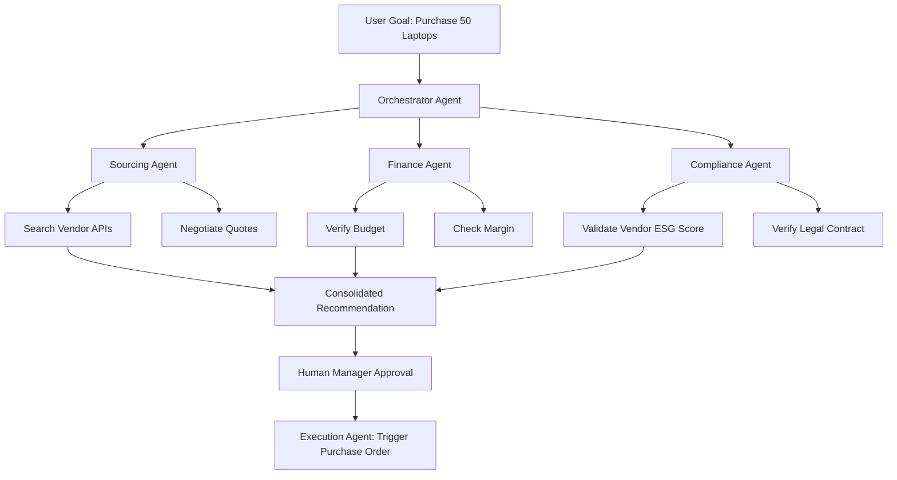

Over the last few years, we’ve all been living in the era of the "Copilot." You know the drill—AI sitting in a sidebar, suggesting a line of code, summarizing a long meeting, or helping you word an email. But as we move through 2026, the landscape has shifted. We aren't just prompting tools anymore; we’re essentially managing teammates.

Welcome to the world of **Agentic AI**.

If the AI we saw in 2023 and 2024 was all about *creating content*, Agentic AI is all about *getting things done*. We’ve moved past "Write me a travel itinerary" and into "Book me a trip to Tokyo for under $3,000. Make sure it fits my calendar, handle the visa paperwork, and get me a table at a Michelin-star sushi spot." It’s a massive difference: the AI isn't just talking anymore; it's **acting**.

The scale of this change is staggering. Gartner predicts that by the end of 2026, **40% of enterprise apps** will have task-specific AI agents. To put that in perspective, that figure was less than 5% just a year ago. We’re essentially seeing a "digital assembly line" where AI can plan, think, and execute multi-step projects with very little human intervention.

That said, it hasn't been a perfectly smooth ride. While **79% of companies** say they’ve adopted AI agents, there's a notable gap: only **11% actually have them running in production**. Moving from a cool demo to a reliable system that doesn't break requires significant work on governance, data quality, and a total rethink of our operational workflows.

---

## 🤖 The Big Shift: From Chatbots to Autonomous Agents

  
  
📸 <a href="https://unsplash.com/@markuswinkler">Markus Winkler</a> on <a href="https://unsplash.com/photos/white-and-black-typewriter-with-white-printer-paper-tGBXiHcPKrM">Unsplash</a>

To wrap your head around where AI agents are going, it helps to think of an "Autonomy Ladder." For a long time, we were stuck at Level 1—basically just "if this, then that" rules. By 2026, we’ve climbed to Levels 3 and 4, where agents possess what we call **agentic reasoning**.

Old-school AI is reactive; it waits for you to say something, then it responds. Agentic AI is proactive. It uses a "Reasoning-Acting" (ReAct) loop: it analyzes the situation, plans its next few moves, utilizes a tool (like a web browser or an API), observes the outcome, and adjusts its plan on the fly.

> "The shift is from delegating tasks to delegating outcomes. We aren't scripting every single step anymore; we're just defining the goal." — *Industry Insight*

A few big technical breakthroughs made this possible:
- **Recursive Language Models (RLMs):** These models treat long prompts like a workspace they can explore and program, which prevents the AI from "forgetting" key details in long conversations (a phenomenon known as "context rot").
- **Small Language Models (SLMs):** Models like Phi-4 and Llama 3.2 proved that you don't need a massive, trillion-parameter brain to be useful. SLMs are **10-30x cheaper** and faster, meaning agents can run right on your device ("the edge") instead of a giant server.
- **Agentic Runtimes:** We now have "Agentic Operating Systems" (AOS). Think of this as the glue that lets agents handle memory and utilize different tools across various platforms.

The best part? These systems don't just "guess" or hallucinate a solution—they verify it. Because of this focus on **verifiability**, agents currently excel at tasks with a definitive right or wrong answer (like math or coding) and remain more cautious with "gray area" tasks, such as creative writing or complex legal advice.

---

## 🌐 Teamwork Makes the Dream Work: Multi-Agent Ecosystems

The days of the "one-size-fits-all" AI—one giant bot trying to do everything—are over. Instead, we’re seeing the rise of **Multi-Agent Systems (MAS)**. Think of this as a coordinated team where each agent has a specific role, its own set of data, and specific permissions.

Imagine how a company buys 50 new laptops in 2026. Instead of a human emailing five different departments, the workflow looks like this:

This "digital assembly line" works because of new open standards. Frameworks like the **Model Context Protocol (MCP)** and Google's **Agent-to-Agent (A2A) protocol** serve as the "common language" of AI. This means an agent built by Anthropic can communicate seamlessly with one built by Salesforce or Google.

By separating the "brain" (the model) from the "hands" (the tools), companies aren't locked into a single vendor. They can build their own dream team—using a high-powered model to lead the project and smaller, faster models to handle the repetitive grunt work. This is how companies like Fountain have managed to screen candidates **50% faster** and **double their conversion rates**.

---

## 🔬 Vertical AI: The Rise of the Specialist

For a long time, the goal was "General Intelligence"—one AI that knew everything. But in 2026, the real value lies in **Vertical AI**. General assistants are being outperformed by domain-tuned agents that understand the jargon, the laws, and the "unspoken rules" of a specific industry.

These specialist agents are typically **40% more efficient** because they're trained on high-quality, industry-specific data.

- **Healthcare:** Agents aren't just spotting patterns; they're assisting doctors in real-time. At AtlantiCare, agents have an **80% adoption rate**, cutting paperwork time by **42%**. This gives clinicians back approximately **66 minutes a day** to spend with patients.
- **Finance:** In banking, being "mostly right" isn't enough. JPMorgan Chase uses agentic systems to detect fraud across millions of transactions, adapting to new scams without a human having to manually write new rules every time.
- **Logistics:** Walmart’s fleet uses "Load Planner" and "Dispatcher" agents to ensure their trucks "never drive back empty," adjusting routes in real-time based on traffic and demand.

The secret here is **Domain-Tuned Models**. Instead of simply telling a general AI to "act like a lawyer," developers use feedback from actual legal experts to train the model. This ensures the AI knows the difference between a "motion" in a courtroom and a "motion" in a physics textbook.

---

## 🛒 AI Shopping: The New Way We Buy Things

One of the biggest shake-ups in 2026 is how we shop. We've entered the era of **Agentic Commerce**. This means a business's primary "customer" might not be a human browsing a website, but an AI agent following a user's instructions.

When **39% of U.S. consumers** use AI for shopping, traditional e-commerce falls apart. Why spend millions on a visually stunning website if the "buyer" is a headless agent that only cares about the API, the price, and the shipping speed?

> "The storefront of the future isn't a website; it's an API that an AI agent can interrogate."

To make this work, the payment infrastructure had to evolve. **Mastercard Agent Pay** uses "Agentic Tokens," allowing an AI to purchase items on your behalf without ever accessing your actual credit card number. This solves the "trust" problem that previously hindered autonomous commerce.

This is also transforming SEO. We're moving toward **AEO (Agent Engine Optimization)**. Businesses are now organizing their data so that *agents*—not humans—can find them. If your product isn't on the **Universal Commerce Protocol (UCP)**, you're essentially invisible to the millions of agents managing household budgets.

---

## 💻 The New Developer: From Coding to Orchestrating

The role of the software engineer is undergoing its most significant transformation since the invention of the compiler. We've moved from "writing code" to "managing agents that write code."

With **CLI (Command Line Interface) Agents** like Claude Code, coding has shifted from a visual editor to a conversation in the terminal. These agents don't just suggest a line of code; you give them an entire feature request. They can search for a bug, write a test, run that test, and fix the bug—all autonomously.

At TELUS, teams using these tools shipped code **30% faster**, saving over **500,000 hours** of manual work.

However, this has led to a phenomenon called **"Vibe Coding."** This occurs when you describe what you want in plain English and let the AI iterate until it "feels right." While fast, it has created a "comprehension gap" where developers are managing systems they don't fully understand.

To mitigate this, the industry is adopting the **Objective-Validation Protocol**:
1. **Goal Setting:** The human defines a strict, clear objective.
2. **Execution:** The agent plans and writes the code.
3. **Validation:** A separate "Critic Agent" or automated test suite verifies the work.
4. **Sign-off:** The human reviews the *validation report*, rather than just the raw code.

Essentially, the developer is no longer the bricklayer; they are the architect and the building inspector.

---

## 🛡️ Safety First: The "Guardian Agent"

As agents begin moving money, changing production code, and accessing health records, the stakes have skyrocketed. We've moved from "the AI said something weird" to "the AI did something wrong." In 2026, **governance is the primary hurdle** to widespread deployment.

Regulations like the **EU AI Act** mean that compliance isn't an afterthought—it's a requirement. You can't simply place a filter on an agent; you must build "explainability" into its core architecture.

The most innovative solution to this is the **Guardian Agent**. These are high-authority agents whose sole purpose is to monitor other agents. They act as a real-time firewall, checking every action against a set of strict rules.

- **Scope Monitoring:** Ensuring your "Travel Agent" doesn't suddenly attempt to access your payroll data.
- **Hallucination Detection:** Cross-referencing an agent's plan against live data to ensure it isn't acting on a hallucination.
- **Ethics Enforcement:** Blocking any action that violates company policy or the law.

Gartner predicts Guardian Agents will make up **15% of the agentic AI market by 2030**. This creates a system of checks and balances: the *Actor* does the work, the *Critic* checks the plan, and the *Guardian* ensures everything remains legal and ethical.

---

## 📈 Real-World Wins: Who's Actually Doing This?

To see where we're headed, we only need to look at the early adopters who have already crossed the finish line.

**The IRS and Government Efficiency**
The IRS used Agentforce to transform the process of opening tax court cases from **10 days down to just 30 minutes**. By automating the bureaucratic paperwork, one division alone saved **50,000 minutes a year**.

**Retail at Scale: The Walmart Model**
Walmart's "Wally" assistant isn't just a chatbot. It analyzes sales and inventory across the entire organization and provides merchants with a prioritized "to-do" list in seconds. Combined with an agentic supply chain, they can reposition products *before* a customer even hits "buy."

**Education: The Khanmigo Effect**
Khan Academy’s Khanmigo is proving that AI can provide effective 1:1 tutoring. Instead of simply providing the answer, it acts as a Socratic tutor—asking guiding questions and adjusting the difficulty in real-time. This has led to a **731% growth in reach**, bringing elite tutoring to millions.

**Enterprise Operations: Salesforce and the Agentic Cloud**
Salesforce's Agentforce is already utilized by **18,000 customers** and handles **84% of support cases** autonomously. This isn't just about cost reduction; it's about providing "concierge" service where the AI knows the customer's entire history and resolves the problem before the user even picks up the phone.

---

## 🎯 Wrapping Up: The Human-Agent Partnership

As we look toward 2027, the critical question isn't "Will AI take my job?" but "How does my job change now that I'm an AI Manager?"

The "Great Delegation" isn't about humans disappearing; it's about humans ascending. By handing off the "drudge work"—the scheduling, the data entry, the basic coding—we are being pushed toward the things humans are uniquely great at: **strategy, empathy, complex judgment, and creativity**.

The people and companies that win in this era will be those who master **Agent Orchestration**. The competitive edge no longer comes from knowing how to write a perfect prompt, but from knowing how to design a team of agents, set the right boundaries, and provide the human oversight that keeps everything on track.

We're moving from a world where we *use* software to a world where software *works for us*. It's a bit messy, the risks are real, and there's a lot to learn. But for those who embrace the role of the "orchestrator," the potential is virtually limitless.

**The future isn't AI vs. Human. It's the Human + Agent team vs. the way things used to be.**