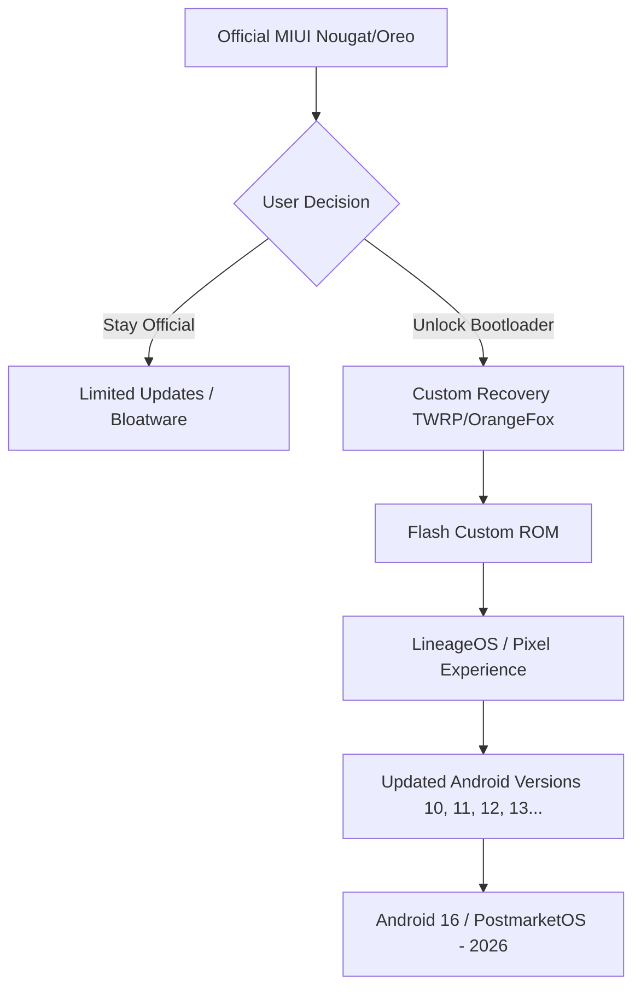

Ever wish your phone didn't just turn into a fancy paperweight after a few years? Imagine a device so well-made—and so loved by the people who tweak software—that it's still actually useful, and even relevant, nearly a decade after it first came out. In a world where we're basically told to throw our gadgets away every two years, that feels like a total glitch in the system. But looking back from **2026**, there's one phone that just refused to quit: the **Xiaomi Redmi Note 5 Pro**.

When it launched in early 2018, the Redmi Note 5 Pro (known to the tech geeks as **"whyred"**) did more than just sell a bunch of units; it really shook up the budget phone world. It hit the market right when phones were starting to get taller and mid-range chips were getting a serious boost. For a lot of us, it was the first time we got a "flagship" feel without having to empty our bank accounts. But the real magic of the Note 5 Pro isn't in the original brochure—it's in the thousands of lines of code written by the community to keep it alive long after Xiaomi stopped caring about it.

---

## 🤖 The Hardware: When "Budget" Actually Meant "Balanced"

To figure out why this phone lasted so long, we have to look at how the hardware clicked together back in 2018. At its heart was the **Qualcomm Snapdragon 636**. At the time, this chip was a big deal for budget phones. It brought **Kryo 260 cores** to the table, giving people the kind of speed and efficiency that used to be reserved for the really expensive stuff.

The specs were honestly spot on:
- **Screen**: A 5.99-inch **FHD+ (2160x1080)** IPS LCD that looked sharp with **403 PPI**.
- **Memory**: You could get **4GB or 6GB of LPDDR4X RAM**, which was way more than most budget phones offered back then.
- **Storage**: **64GB of eMMC 5.1**, with the option to add more via a hybrid SIM slot.
- **Battery**: A chunky **4000mAh Li-Po** battery that actually gave you two days of use.
- **Cameras**: A dual-camera setup on the back (12MP + 5MP) and a surprisingly great **20MP Sony IMX376** selfie camera.

That **LPDDR4X RAM** was a sneaky but important detail. While other brands were using slower memory to save a few cents, Xiaomi went with the good stuff. That’s exactly why the phone didn't start feeling like a snail as apps got heavier over the years.

Plus, it just felt solid. It had a metal body with rounded edges that felt way more premium than the plastic backs we see on most budget phones today. And let's not forget the **3.5mm headphone jack** and the **IR blaster**—features that have basically vanished from modern flagships but made this phone a total utility tool.

> "The Redmi Note 5 Pro was the first phone in the Redmi series I'd consider using as my daily driver... The combination of sheer hardware combined with the great camera, two-day battery life, and 18:9 panel makes it the device to beat." — [Android Central Review](https://www.androidcentral.com/xiaomi-redmi-note-5-pro-review)

---

## 🌍 Shaking Up the Market: A Hit in the Global South

The Redmi Note 5 Pro wasn't just another product; it was a total game-changer. In places like India, it didn't just compete—it dominated. By putting a **Snapdragon 636** and a **20MP selfie camera** in a phone that started around **₹13,999**, Xiaomi basically blurred the line between "cheap" and "premium."

It did more than just sell well; it democratized the "Pro" experience. Before this, if you wanted a "Pro" phone, you usually had to spend $700 or more. Xiaomi flipped that on its head, showing that students and first-time buyers could have a high-res screen and great cameras too.

**A few things that stood out:**
- **Huge Numbers**: Millions of these shipped across Asia and Europe, making Xiaomi the king of the budget hill.
- **The Selfie Boom**: That **20MP front camera with a flash** hit right when social media was exploding, making it the go-to for early content creators.
- **The New Shape**: It helped make the taller 18:9 screen the norm for budget phones, finally killing off those old-school chunky bezels and capacitive buttons.

Because so many people owned this phone, it caught the eye of developers. When millions of people use the same device, developers want to build for it. If someone made a cool custom ROM for **"whyred,"** they knew a massive global community would use it. That's what gave the phone its second life.

---

## 💡 The Software Struggle: MIUI vs. The Community

Straight out of the box, the Note 5 Pro came with **MIUI 9.2 (Android 7.1.1 Nougat)**. MIUI had some neat tricks—like **Dual Apps** and **Second Space**—but it was also famous for having a lot of "bloatware" and being a bit too aggressive with closing apps in the background. For some, it was just a feature-rich skin; for power users, it felt like a cage.

This created a weird situation. The hardware was top-tier, but the official software support was, well, hit-or-miss. Xiaomi wasn't great about updates, leaving users stuck on old Android versions. But ironically, this "neglect" is what sparked one of the most amazing community efforts in Android history.

Here is how most power users handled their software over the years:

By unlocking the bootloader, users could strip away the MIUI clutter and install a "clean" version of Android. This didn't just give them newer features; it actually made the phone faster. A device running **Pixel Experience** often felt snappier than it did when it was brand new, simply because all the trackers and background junk were gone.

---

## 🚀 The "Whyred" Legacy: A Playground for Geeks

In the world of Android fans, the codename **"whyred"** is basically legendary. While other phones were forgotten and tossed in drawers, the Redmi Note 5 Pro became the gold standard for ROM developers. It's incredibly rare for a phone to be supported across so many different versions of Android.

From the early days of **AOSP Pie (Android 9)** to the mind-blowing fact that people are still porting **Android 16** to it in 2026, this phone has been a canvas for experimentation. Projects like **LineageOS** gave people a stable, private alternative, while **ArrowOS** and **Pixel Experience** brought the latest Google tricks to 8-year-old hardware.

**Why did developers love "whyred" so much?**
- **Qualcomm was Steady**: The Snapdragon 636 had great drivers and was easy to work with.
- **Open Doors**: At the time, Xiaomi made it relatively easy to unlock the bootloader, which encouraged people to mess around with it.
- **Plenty of Room**: The 6GB RAM version had enough breathing room to run modern, memory-hungry versions of Android.

One of the coolest milestones was when people ported **postmarketOS**, which is actual Linux. This turned the Note 5 Pro from a "smartphone" into a "pocket computer," letting users run a full Linux environment. That shift from a consumer gadget to a developer tool is the ultimate sign of a phone that's built to last.

> "A build guide is available for developers that would like to make private builds, or either restart official support." — [LineageOS Wiki](https://wiki.lineageos.org/devices/whyred)

---

## 📈 Survival Stories: How Some People Never Upgraded

To really see the impact of the Note 5 Pro in 2026, you have to look at the "Survivors"—the people who just refused to buy a new phone for nearly a decade.

**Case 1: The Minimalist**
One person on XDA mentioned using the 6GB model as their main phone all the way through 2024. They used a stripped-down version of **LineageOS**, turned off unnecessary animations, and used "Lite" versions of apps like Facebook and Messenger. The only thing that gave out? The battery. After five years, the **4000mAh cell** was only holding about 60% of its charge, but since the phone was so popular, they just bought a replacement battery for a few bucks.

**Case 2: The Tinkerer**
Another user used their Note 5 Pro as a "learning lab." They started with MIUI, tried **Resurrection Remix**, jumped to **Android 13**, and eventually played around with an experimental **Android 16** build. For them, the phone wasn't for calling people; it was a textbook on how the Android kernel actually works.

**The "Secret Sauce" for the Note 5 Pro's longevity:**
1. **More than enough power**: 6GB of RAM was "overkill" in 2018, which made it "just right" by 2023.
2. **The community took over**: When the company stopped caring, the fans stepped up.
3. **Easy to fix**: The inside was simple, making it easy for anyone with a screwdriver to swap a battery or screen.

Comparing this to a 2026 flagship is a bit sad. Modern phones often have "planned obsolescence"—soldered parts or software locks that stop you from changing the OS. The Note 5 Pro represents a lost era where the user actually owned their device.

---

## 📊 Sorting Out the Variants: Pro, Global, and AI

If you're looking back at this device, the naming can get confusing. The Redmi Note 5 came in a few different flavors depending on where you lived. This explains why some people loved their phone more than others.

| Feature | Redmi Note 5 (Global) | Redmi Note 5 Pro (India) | Redmi Note 5 AI (China) |
| :--- | :--- | :--- | :--- |
| **Chipset** | Snapdragon 625 | **Snapdragon 636** | **Snapdragon 636** |
| **Front Camera** | 13 MP (OmniVision) | **20 MP (Sony IMX376)** | 13 MP (OmniVision) |
| **Rear Camera** | Single 12 MP | **Dual 12 MP + 5 MP** | **Dual 12 MP + 5 MP** |
| **RAM/Storage** | 3/4 GB / 32/64 GB | **4/6 GB / 64 GB** | 4/6 GB / 64 GB |
| **Connectivity** | Standard 4G | **Optimized for India** | **China-specific bands** |

The **Pro** was the clear winner because of that **Snapdragon 636**. The Global version used the older **Snapdragon 625**, which was efficient but just didn't have the "oomph" to run newer Android versions smoothly. The Pro's dual cameras also gave it a "Portrait Mode" that was a huge selling point back then.

This split actually helped the community. Developers mostly focused on the **"whyred" (Pro/AI)** build, creating a single codebase that worked across different countries as long as the hardware matched.

---

## 🎯 Final Thoughts: What the Future Can Learn

Standing here in **2026**, the Redmi Note 5 Pro is more than just a nostalgia trip; it's a lesson. It shows us that **phones can last** if the specs are balanced and users are allowed to tweak their own devices.

The Note 5 Pro worked because it didn't try to do everything—it just did the *important* things really well. It gave us a great screen, a battery that lasted, and a processor that could keep up, and then it stayed out of the way. The fact that we're still talking about it today is a tribute to open-source software and the value of a product that actually delivers on its promise.

**Lessons from the "Whyred" Era:**
- **Openness > Fancy Features**: A phone with okay features and an open bootloader is way more valuable in the long run than a locked-down "superphone."
- **RAM is the Key to Longevity**: CPUs age, but RAM determines if a new OS can even start. The 6GB model's survival proves this.
- **Community is the Best Warranty**: The best guarantee isn't a 1-year promise from a company; it's a group of dedicated developers on XDA Forums.

The Redmi Note 5 Pro might not win any benchmark tests today, but in the smartphone hall of fame, it definitely has a throne. It reminded us that a phone can be a tool, a toy, and a project—all wrapped in a single piece of aluminum.

---

**Want to dive deeper?**
- [LineageOS Wiki - Xiaomi Redmi Note 5 Pro](https://wiki.lineageos.org/devices/whyred)
- [Android Central: Redmi Note 5 Pro Review](https://www.androidcentral.com/xiaomi-redmi-note-5-pro-review)
- [XDA Developers: Redmi Note 5 Pro Forums](https://xdaforums.com/c/xiaomi-redmi-note-5-pro.7419)
- [PostmarketOS Wiki - Xiaomi Whyred](https://wiki.postmarketos.org/wiki/Xiaomi_Redmi_Note_5_Pro_(xiaomi-whyred))