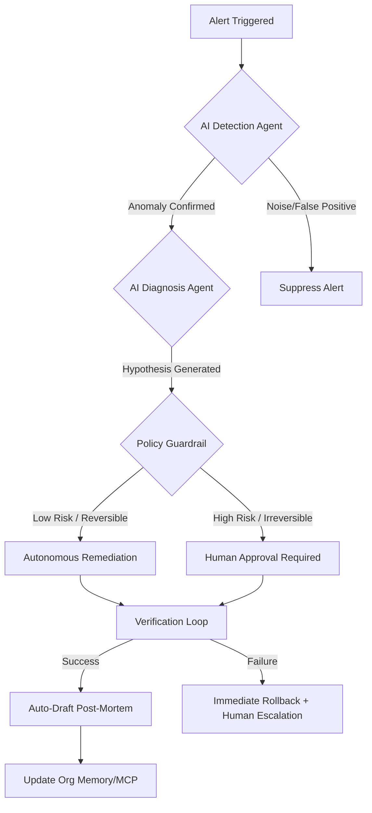

Imagine it’s 3:00 AM on a Tuesday. In the "old days" of site maintenance, this is where the nightmare begins. A pager goes off, a senior engineer is jolted awake, and the next four hours are a total blur of stress. You're jumping between five different dashboards, digging through messy logs, and trying to figure out why a deployment from six hours ago is suddenly causing everything to lag. We call this the "firefighting" model—and honestly, it’s a recipe for burnout, turnover, and millions in lost revenue.

But by 2026, the story is different. The alert still goes off, but the human doesn't have to wake up—at least, not right away. Instead, an **AI SRE Agent** catches the glitch, tracks it through the microservices, realizes it's a memory leak in a new pod, and just... fixes it. It rolls back the deployment automatically. By the time the engineer wakes up at 7:00 AM, they find a detailed report in their inbox and a system that never actually crashed for the users.

We’ve officially entered the age of **Agentic Reliability**. Maintenance isn't about scheduled patches or rushing to fix things when they break anymore. It's now a proactive, AI-driven approach where reliability is built into the system's DNA, not something that depends on how much sleep an engineer got.

---

## 🤖 The Big Shift: Moving from Firefighting to Proactive Care

  
  
📸 <a href="https://unsplash.com/@nicolasjleclercq">Nicolas J Leclercq</a> on <a href="https://unsplash.com/photos/construction-worker-on-street-WJg2bynUWOk">Unsplash</a>

For about twenty years, we did things the same way. We moved from big servers to virtual machines, and then to Kubernetes. But even as our tech got fancier, our mindset stayed stuck in "reactive mode." We relied on alerts that only went off *after* something broke—kind of like a check-engine light that only turns on once the engine is already smoking.

In 2026, we've shifted toward **Modern SRE (Site Reliability Engineering)**. The big change is that we stopped asking *"Is it up?"* and started asking *"Why is it acting this way?"* This is the jump from basic monitoring to full-stack **Observability**. By putting logs, metrics, and traces into one searchable place—mostly thanks to the [OpenTelemetry](https://opentelemetry.io/) standard—companies can spot "silent failures" before they turn into a total blackout.

And there's a real human reason for this shift. According to a [Catchpoint SRE Report](https://www.catchpoint.com), nearly **70% of SREs** said that on-call stress is why they're burning out. The old way of having one siloed team handle everything just doesn't work with today's complex cloud setups. Modern SRE spreads that responsibility. With **Internal Developer Platforms (IDPs)**, the safety rails are built right into the pipeline. Developers aren't just "throwing code over the wall" for someone else to fix; they actually own the reliability of the features they build.

> **The bottom line:** Modern maintenance isn't about pretending things never break; it's about getting really good at recovering. The goal has changed from "zero errors" to "managing the error budget" so we can keep innovating without breaking everything.

---

## 🎯 Agentic SRE: Meet the Autonomous Operator

The biggest game-changer in 2026 is **Agentic SRE**. Now, this isn't like the "AIOps" we saw a few years ago that just gave us better alerts. Agentic SRE involves AI agents that can actually *do* things. These aren't just simple "if this, then that" scripts; they're powered by LLMs that can reason through data, check the company's history, and execute fixes within safe boundaries.

The difference in how fast things get fixed (MTTR) is wild. [New Relic's 2026 AI Impact Report](https://newrelic.com) shows that AI-powered teams are seeing **2x better correlation** and **27% less alert noise**. When AI handles the "toil"—the boring, repetitive stuff like parsing logs—human engineers can finally focus on big-picture design and "what if" scenarios.

A huge part of making this work is the **Model Context Protocol (MCP)**. Think of MCP as the universal translator that lets AI agents talk to different infrastructure tools. It stops "vendor lock-in." Now, an agent can spot a spike in [Datadog](https://www.datadog.com), figure out what's wrong using a company knowledge base, and trigger a fix in [PagerDuty](https://www.pagerduty.com) without a human needing to click a button.

**Here is how autonomy looks in 2026:**
- **Read-Only:** The AI just summarizes what happened.
- **Advised:** The AI says, "I think we should do X because of Y."
- **Approved:** The AI asks, "Can I fix this?" and waits for a human to click "Yes."
- **Autonomous:** The AI handles low-risk, easy-to-reverse fixes (like clearing a cache or scaling pods) automatically.

---

## 🌍 Bridging the Gap: Bringing SRE to the Factory Floor

While the software world gets all the hype, something cool is happening with physical gear too. Maintenance for factories is getting a "digital twin" makeover. The line between the data center and the factory floor is blurring as **Industrial IoT (IIoT)** brings these same SRE principles to heavy machinery.

In 2026, updating a manufacturing plant feels a lot like deploying software. Using **Predictive Maintenance (PdM)**, AI looks at vibrations, heat, and sound to spot a failing bearing **4 to 6 weeks** before a human could ever notice. Moving from "fix it every six months" to "fix it when the data says it's wearing out" is a huge money-saver. [Deloitte](https://www.deloitte.com) says this can cut maintenance costs by **25%** and boost uptime by **10% to 20%**.

The stakes are massive here. Unplanned downtime costs the average Fortune 500 company about **$2.8 billion a year**—that's roughly **11% of their total revenue**. By using **Digital Twins** (virtual clones of the machines), teams can test a fix in a sandbox before they ever touch the real equipment.

**Where digital and physical maintenance meet:**
- **SRE for Hardware:** Setting "uptime goals" for physical machines.
- **Edge Computing:** Processing data right on the machine to trigger an emergency stop in milliseconds.
- **AR-Assisted Repair:** Techs wearing headsets that overlay step-by-step instructions directly onto the machine they're fixing.

---

## 📊 The Economics of Uptime: Is it Actually Worth It?

For a long time, maintenance was seen as a "cost center"—just a bill you had to pay to keep the lights on. In 2026, that's changed. **Reliability is now a competitive advantage**. We don't just measure success by "avoiding downtime," but by how happy our staff is and how fast we can ship new features.

The biggest hidden cost is **Senior Engineer Attrition**. Losing a veteran SRE—and all the "tribal knowledge" they have in their head—can cost a company between **$300,000 and $600,000** to replace. When AI takes over 60–80% of the annoying on-call pages, the real ROI isn't just the uptime; it's keeping your best people from quitting.

Then there's the "Toil Paradox." Traditional teams spend over **50% of their time** on manual, repetitive work. They're so busy fighting fires that they don't have time to build the sprinklers. AI breaks this cycle. By automating triage and paperwork, teams basically gain back **0.4 of an engineer's capacity** for every person on the team.

**Comparing the models:**
- **Traditional:** Slow recovery, high burnout, viewed as an expense.
- **Modern:** Fast recovery, sustainable pace, viewed as an investment.
- **Agentic:** Near-instant recovery for known issues, self-healing tech, reliability as a product.

> "The winners in 2026 aren't the ones with the fanciest AI, but the ones who combined great tools with a culture where everyone feels responsible for reliability."

---

## 🔬 The Architecture of Trust: Guardrails and Safety

The biggest hurdle isn't the tech—it's **trust**. Giving an AI "write access" to a live production environment is terrifying for any CTO. That's why 2026 is all about **Bounded Autonomy**.

To keep things safe, companies use a **Hierarchical State Machine**. Basically, the AI can't just jump to "fixing" things. It has to go through "Detection" and "Diagnosis" first, and the signal has to be high-confidence and match a safe, known pattern. This stops the AI from "hallucinating" a solution and making a bad situation even worse.

**The four pillars of safe maintenance in 2026:**
1. **Blast Radius Limits:** AI is tiered. A "Read-Only" agent can see everything, but a "Write" agent can only touch non-critical parts of the system.
2. **Identity Separation:** Every AI agent has its own ID. If something goes wrong, the audit log shows exactly which agent did it, not just a generic "system account."
3. **Replayable Audit Trails:** Every session is recorded. If the AI messes up, humans can replay exactly what the AI saw and why it made that choice.
4. **Deterministic Fallbacks:** The AI handles the *reasoning* (deciding what to do), but the *execution* (how to do it) is handled by a hard-coded, tested script.

---

## 💡 The Human-AI Synergy: Solving Burnout and the Skills Gap

As we move toward AI, we're hitting a weird problem called the **"Grey Wave."** A huge amount of expertise—the "gut feeling" a veteran technician has about a 20-year-old machine—is leaving the workforce as baby boomers retire. In North America, we're looking at **2.1 million unfilled maintenance jobs** by 2030.

Because of this, 2026 is all about **Knowledge Capture**. We're using AI to "download" the brains of our veterans. By using voice-to-text and structured prompts during repairs, AI turns a veteran's intuition into a digital runbook. The maintenance system stops being a boring list of tickets and becomes a living **Organizational Memory**.

The role of the SRE is also changing. We're moving from "Incident Firefighters" to **"Reliability Architects."** You're no longer the person staring at logs at 3 AM; you're the person designing the policies and governing the AI. This is how we actually solve burnout. When the "grunt work" is gone, engineering becomes about creating again, not just surviving.

**The new skill set for 2026:**
- **Prompt Engineering for Ops:** Learning how to tell an AI agent exactly how to behave safely.
- **Observability Design:** Making sure the data your system puts out is "AI-readable."
- **Chaos Engineering:** Purposefully breaking things to teach the AI how to fix them.
- **Ethics & Governance:** Deciding how much trust to give an autonomous agent.

---

## 🚀 Beyond 2026: The Dream of "Self-Healing" Systems

Looking further ahead, we're moving toward **AI-Native Engineering**, where the line between "building" and "maintaining" just disappears. In this world, the system doesn't just fix a crash; it stops the crash from ever being possible.

Imagine a system that notices memory usage creeping up. Instead of just adding more servers, the AI analyzes the code, finds the leak in a specific function, writes a pull request to fix it, tests it in a canary environment, and merges it—all before a single user notices a slowdown. That's the shift from **Remediation** to **Preventative Hardening**.

We're also seeing **Agentic Ecosystems**. Instead of one giant AI, we have a swarm of specialists: one for security, one for cost, one for performance, and one for reliability. They actually negotiate. The "Cost Agent" might want to shut down a cluster to save money, but the "Reliability Agent" says, "No way, there's a huge marketing event tomorrow," and vetoes the move.

**The path to total reliability:**
- **Stage 1 (Now):** AI helps us sort through alerts and cut the noise.
- **Stage 2 (Starting):** AI suggests a fix, and a human approves it.
- **Stage 3 (Coming soon):** AI handles most fixes automatically based on strict policies.
- **Stage 4 (The horizon):** AI rewrites its own infrastructure to eliminate bugs before they happen.

---

## Conclusion: Reliability as Your Secret Weapon

Site maintenance isn't a chore to be scheduled anymore; it's a strategic advantage. The shift from the chaotic firefighting of the 2010s to the smart, agentic reliability of 2026 is a total rethink of how we work with machines.

The numbers don't lie: the old way is too expensive. Whether it's the **$2.8 billion** lost to downtime in factories or the total burnout of tech teams, we can't keep doing it the old way. By embracing **Agentic SRE**, **Industrial IoT**, and **Bounded Autonomy**, companies aren't just fixing things faster—they're freeing themselves up to innovate. When you aren't terrified of that 3 AM alert, you're finally free to take the big risks that actually move the needle.

The future of maintenance isn't a world without humans. It's a world where humans are finally free from the boring stuff, allowing us to build systems that aren't just reliable, but truly resilient.

---
**Sources & Further Reading:**
- [Google SRE Workbook](https://sre.google/workbook/) - The gold standard for SLOs and Error Budgets.
- [New Relic 2026 AI Impact Report](https://newrelic.com) - Data on AI correlation and alert noise reduction.
- [MaintainX 2026 Trends](https://www.getmaintainx.com) - Insights into industrial predictive maintenance.
- [OpenTelemetry Documentation](https://opentelemetry.io/) - The foundation of modern observability.
- [SREcon / USENIX](https://www.usenix.org/) - Latest research on AI-driven incident response.