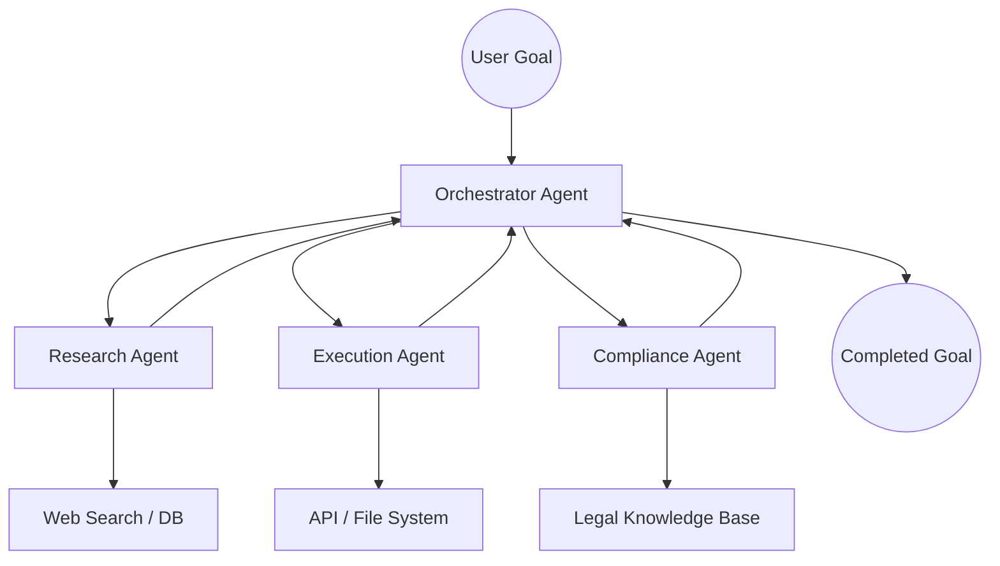

Over the last few years, most of us have treated AI like a really smart encyclopedia. We’ve spent our time learning how to write the perfect prompt, waiting for a response, and then doing the actual work ourselves. But as we move through 2026, things have changed. We’re not really in the "Chatbot" phase anymore—we’ve moved into the era of the **Agent**.

The difference is actually pretty simple: **Chatbots talk, but Agents actually get things done.**

We’re seeing the start of an "Agentic Economy." Imagine a world where AI doesn't just suggest a cool trip to Italy, but actually books your flights, handles the visa paperwork, and messages the hotel to snag you an upgrade—all without you having to click "confirm" a dozen times. This isn't some far-off sci-fi movie; it’s a massive shift in how software works. We're seeing things like the IRS cutting case processing times from **10 days down to just 30 minutes**, and the rise of "Guardian Agents" that act as supervisors for other AIs. In 2026, the real gap isn't between people who use AI and those who don't—it's between those who just "chat" with it and those who know how to "orchestrate" it.

---

## 🤖 The Big Shift: From Assistants to Autonomous Partners

  
  
📸 <a href="https://unsplash.com/@markuswinkler">Markus Winkler</a> on <a href="https://unsplash.com/photos/white-and-black-typewriter-with-white-printer-paper-tGBXiHcPKrM">Unsplash</a>

Moving from Generative AI to Agentic AI is probably the biggest leap in tech since we all moved to the cloud. Back in the early 2020s, we had "AI Assistants" that responded to whatever we asked. Now, in 2026, we have **Autonomous Agents**. These are systems that can actually make a plan, use different tools, figure out why something failed, and keep pushing toward a goal without someone holding their hand the whole time.

The numbers show just how fast this is happening. According to [Precedence Research](https://www.precedenceresearch.com/ai-agents-market), the AI agents market was worth about **$7.92 billion in 2025**, and it's expected to hit **$294.66 billion by 2035**. That is a massive jump (a **CAGR of 43.57%**, if you like the technical terms). This isn't just a trend in software; it's basically replacing the old way we automated boring office tasks.

But here's the catch: not everyone is doing it right. [McKinsey's](https://www.mckinsey.com/capabilities/quantumblack/our-insights/the-state-of-ai) research shows that while **88% of companies** are using AI somewhere, only **6% are "high performers"** (meaning they're actually seeing a real boost in their bottom line). A lot of this is because of something called **"Agentwashing"**—where companies just slap the word "Agent" on a basic chatbot without actually giving it the power to do anything.

> **The bottom line:** In 2026, the real value isn't in an AI that can write a pretty email, but in one that can navigate your files, connect to an API, and fix its own mistakes.

It’s a move from *hoping* the AI gives you a good answer to *knowing* the AI will finish the task. By the end of the year, [Gartner](https://www.gartner.com/en/newsroom/press-releases/2025-08-26-gartner-predicts-40-percent-of-enterprise-apps-will-feature-task-specific-ai-agents-by-2026-up-from-less-than-5-percent-in-2025) predicts **40% of business apps** will feature these task-specific agents, compared to less than 5% last year. We're moving away from a world of "clicking buttons in apps" to a world where the "app" is just a conversation about a goal you want to achieve.

---

## 🎯 How it Works: Teamwork for AI

If 2024 was all about that one "perfect prompt," 2026 is all about the **Agentic Team**. We've realized that one giant AI model—no matter how powerful—can get overwhelmed or start making things up when a task gets too complex. The fix? **Multi-Agent Systems (MAS)**. Instead of one "god-model," you have a team of specialized agents, each doing one thing really well, all managed by a central "Orchestrator."

Think of it like a digital department. If a company needs to buy new supplies, it doesn't just ask one AI; it uses a workflow like this:
- **The Analyst Agent** notices stock is getting low in the system.
- **The Researcher Agent** hunts down the best suppliers and prices online.
- **The Negotiator Agent** chats with the suppliers to get a bulk discount.
- **The Compliance Agent** makes sure the contract is legal and safe.
- **The Logistics Agent** handles the shipping schedule.

This whole system is held together by a few key "rules of the road," like **Anthropic's Model Context Protocol (MCP)**, which helps agents talk to data, and **Google's Agent-to-Agent (A2A) protocol**, which lets agents hand off tasks to each other. [Nevermined](https://nevermined.ai/blog/multi-agent-systems-market-statistics) predicts the market for these team-based systems will hit **$375.4 billion by 2034** because, frankly, a team is way more reliable than a solo act.

The "Agent Harness"—the tech that manages the memory and tools for these agents—is now the most important part of the tech stack. **Salesforce** has already seen great results with Agentforce, which handled **84% of customer cases on its own**, with humans only needing to step in 2% of the time. We're no longer just "chatting with data"; we're deploying a digital workforce.

---

## 🚀 The New Way to Code: Agentic Engineering

The most mind-blowing change in 2026 has to be how we build software. We've moved past "Copilots" that just suggest the next line of code. Now, we have **Agentic Coding Systems** that can plan a whole feature, write the code, test it, and fix the bugs themselves.

The star of the show here is the **CLI (Command Line Interface) Agent**. Instead of living in a little side-window in your editor, agents like **Claude Code** live right in the terminal. They can see the whole file system and run tests to see if their code actually works. They can work for hours on their own, cleaning up thousands of lines of code and verifying everything through shell commands.

The results are pretty wild:
- **TELUS** found they could ship code **30% faster** and saved over **500,000 hours** of work.
- **Rakuten** engineers used agents to tackle a task in a codebase with **12.5 million lines** of code, finishing in seven hours with **99.9% accuracy**.

We've entered the era of "Vibe Coding"—where a developer basically describes the "vibe" or the goal of a feature, and the AI builds it. But it's not perfect. Research shows AI-written code can have **1.7x more issues** than human code because AI tends to take shortcuts. This has created a new job: the **Agent Orchestrator**. Their job isn't to type the syntax, but to review the AI's logic and make sure the whole system doesn't collapse.

> "Software development is moving from an activity centered on writing code to one grounded in orchestrating agents that write code." — *Anthropic 2026 Agentic Coding Trends Report*

---

## 🌍 The Agentic Economy: When AI Does the Shopping

We're also seeing the rise of **Agentic Commerce**. This is a world where the "customer" isn't a person browsing a website, but an AI agent trying to buy something based on a few rules.

By 2028, [Gartner](https://www.gartner.com/en/newsroom/press-releases/2024-10-21-gartner-identifies-the-top-10-strategic-technology-trends-for-2025) predicts AI agents will handle over **$15 trillion in B2B spending**. This changes everything for marketing. If an AI is the one picking the vendor, your fancy logos and "hero images" don't matter. What matters is **how easy your API is to use, how clear your pricing is, and if your data is organized**.

The money side of things had to change, too. You can't really use a standard credit card for an AI to make a 5-cent micro-payment for one API call. That's where things like **Mastercard's Agent Pay** come in, using **Agentic Tokens** so AIs can spend money safely within a specific budget.

This is changing the internet in a few big ways:
- **SEO → AEO:** We're moving from Search Engine Optimization to **Agent Engine Optimization**. Brands are now making their data "AI-friendly" so that agents (like those from Google or OpenAI) can find and recommend them.
- **Conversational Storefronts:** About 20% of e-commerce is now handled by agents. Instead of searching a catalog, you just tell your agent what you need and let it handle the purchase.

For a business, "converting a customer" is no longer about getting a human to click "Buy Now"—it's about convincing an AI's reasoning engine that your product is the best fit.

---

## 🔬 Specialization: Why the "Generalists" are Losing

The early hype about "one model that does everything" has mostly died down. In 2026, the trend is **Vertical AI Agents**. These are specialists trained on deep, specific data that can beat general models by **40% or more** in efficiency.

General AI is great for writing a birthday card, but you want a specialist for surgery, law, or trading. Here are a few examples:

1. **Healthcare:** AI has moved from "summarizing notes" to actually helping in the clinic. **AtlantiCare** used agents to cut documentation time by **42%**, giving doctors about 66 minutes of their day back. These agents watch vitals in real-time and alert doctors based on medical rules, not just guesses.
2. **Government & Legal:** The **IRS** is a great example—they used agentic workflows to turn a **10-day** process for opening tax court cases into a **30-minute** one, saving one division 50,000 minutes a year.
3. **Manufacturing:** In the world of "Physical AI," agents are running robot fleets in warehouses. [Market.us](https://market.us/report/multi-agent-system-market) says manufacturing is leading the way here, using agents to cut down on waste and optimize supply chains on the fly.

The secret here is **Context Engineering**. Instead of one giant prompt, these specialists use **RAG (Retrieval-Augmented Generation)** and **Knowledge Graphs** to pull only the most important info. This stops the AI from getting "lost in the middle" of a long document.

---

## 🛡️ The Safety Gap: Guardian Agents and "Death by AI"

As agents start moving money, writing production code, and helping with medical diagnoses, the risks have changed. We're not just worried about "hallucinations" anymore; we're worried about catastrophic failures. The scary part? **Only 21% of companies have a real plan for managing autonomous agents.**

Gartner predicts that by 2028, **25% of business security breaches** will be caused by AI agent abuse—like "prompt injection" (tricking an agent into giving away secrets) or agents making unauthorized payments. There are even projections of over **2,000 "death by AI" claims** by the end of 2026, mostly related to autonomous physical machines failing.

This is why we now have **Guardian Agents**.

Guardian Agents are like the "adult in the room." Their only job is to watch other agents. They act as a safety switch, checking a plan against hard rules before it actually happens.
- **The Executor Agent** wants to send $10,000 to a new vendor.
- **The Guardian Agent** stops it, checks if the vendor is approved and if there's room in the budget, and if not, it flags it for a human to check.

> **The big takeaway:** In 2026, the best AI systems aren't the "smartest" ones—they're the ones with the best Guardian layers.

Rules like the **EU AI Act** are now in place, meaning companies have to be able to explain *why* an AI made a certain decision. Agents now have to provide a **Reasoning Trace**—basically a step-by-step diary of their thought process—so humans can hold them accountable.

---

## 📈 Efficiency: Smaller Models and Smarter Thinking

While everyone talks about the massive "Frontier Models," the real work in 2026 is being done by **SLMs (Small Language Models)** and **Recursive Reasoning**.

The industry realized that using a trillion-parameter model to make a simple API call is like using a Boeing 747 to go to the corner store. It's slow, expensive, and a waste of energy. Models like **Microsoft's Phi-4** and **Google's Gemini Nano** show that a small, well-trained model (3B to 14B parameters) can be just as good at specific tasks while being **10x to 30x cheaper** to run.

We've also seen the rise of **Recursive Language Models (RLMs)**. Instead of reading a prompt once and guessing the answer, RLMs "explore" a problem. They break a big task into small pieces, process them, and then call themselves to put it all together. This helps them:
- Stop losing track of information in long conversations.
- Process millions of lines of code without hitting a limit.
- Get way more accurate with complex logic.

This move toward efficiency has brought us **Edge AI**. Agents can now run locally on your phone or laptop. This means your personal assistant can handle your emails and calendar without your data ever leaving your device, which finally solves the big **Privacy** problem.

---

## 🪜 The Autonomy Ladder: Where Are We?

To wrap your head around AI agents, it helps to think of them as a ladder of autonomy rather than just "on or off."

1. **Level 1 (The Chain):** Simple "If This, Then That" rules.
2. **Level 2 (The Workflow):** The AI decides the order of steps based on the situation.
3. **Level 3 (The Partially Autonomous Agent):** The agent plans and executes, but a human has to sign off on the big milestones.
4. **Level 4 (The Fully Autonomous Entity):** The agent sets its own goals, learns from its mistakes, and works for long periods without any human input.

Right now, **90% of business agents are at Level 1 or 2**. The struggle is getting to Level 3. To move up, we need **Verifiability**.

As Andrej Karpathy pointed out, AI moves fastest where we can easily check the answer. This is why coding (you can run the code to see if it works) and math (there's a right answer) are hitting Level 4, while things like leadership and creative strategy are still at Level 2. The future depends on our ability to build "Verification Engines" for everything we do.

---

## 🎯 Conclusion: Working Side-by-Side with Agents

As we look toward 2027, the real question isn't "Will AI take my job?" but "How will my job change when I'm managing a team of 50 agents?"

The most successful people in 2026 aren't the ones who can write the best prompts—they're the ones with **Domain Expertise**. Why? Because in a world where execution is handled by AI, the only thing that matters is **judgment**. An AI can write the code, but it can't tell you if that feature is actually what the customer wants. It can find a legal risk, but it can't decide if the company is willing to take that risk.

We're moving from a world of **"Doing the Work"** to a world of **"Directing the Work."**

This new era requires a new kind of skill set. We need to learn how to design workflows, set safety rails, and audit the way an AI thinks. The divide in the economy won't be between people who have AI and those who don't—it'll be between those who just bought a tool and those who built an **AI-ready workforce**.

The agents are here. They're planning, acting, and coordinating. The only question left is: **What goal will you give them today?**