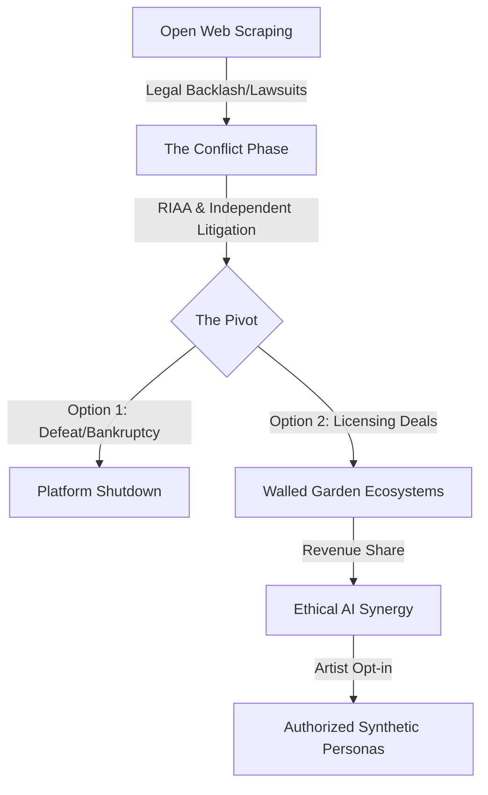

For a long time, the music world has felt like it's in a constant state of chaos. We went from the tactile feel of vinyl to the convenience of CDs, then survived the wild west of Napster, and eventually just let Spotify’s algorithms tell us what to like. But as we hit 2026, we aren't just talking about how we *get* our music anymore. We're talking about what music actually *is*.

The big theme right now is what I call **The Great Bifurcation**—basically, a massive split. On one side, you've got a high-speed AI factory churning out "functional audio" (the kind of stuff that just sits in the background while you work or sleep). On the other side, there's a huge push back toward raw, human authenticity—the kind of music that's a bit messy, deeply emotional, and feels real. We've reached a weird point where an AI can write a song in three seconds, but a human playing a guitar—even if they hit a wrong note—has never been more valuable.

This isn't just a passing phase; it's a total rewrite of how the industry works. From massive court battles to the return of physical records, we're essentially redefining what it even means to be an "artist" in real-time.

---

## 🤖 The AI Arms Race and the Legal Mess

  
  
📸 <a href="https://unsplash.com/@shootnmatch">weston m</a> on <a href="https://unsplash.com/photos/musical-notes-on-white-paper-3pCRW_JRKM8">Unsplash</a>

The biggest drama of 2026 is the war between AI platforms and the people who actually write the songs. For years, companies like **Suno** and **Udio** basically followed a "grab it first, apologize later" strategy, training their AI on millions of songs without asking anyone. But by 2026, that party has officially ended.

The RIAA (the "big dogs" representing labels like Universal and Sony) stopped playing defense and started swinging. The whole fight boils down to one question: is feeding copyrighted music into an AI "fair use," or is it just high-tech theft? The stakes are huge. **Suno**, for example, is valued at around **$2.45 billion** and has over **2 million paid subscribers**, which makes them a serious threat to traditional songwriters.

But the tide is turning. With new laws like the **NO FAKES Act** and Tennessee's **ELVIS Act**, we now have something called the **Right of Publicity**. It's not just about who owns the *recording* anymore; it's about who owns the *persona*—your voice and your likeness. In 2026, cloning someone's voice without their okay is a massive legal risk, forcing AI companies to stop scraping the web and start paying for licensed data.

> "Innovation cannot be built on stolen goods." — Gorm Arildsen, CEO of Koda, on the systemic theft of independent music catalogs.

Essentially, we're moving from the "Wild West" to a licensed system. Here is how that evolution looks:

---

## 📊 The War on "AI Slop"

As AI tools became easy for everyone to use, streaming apps got flooded with what insiders call **"AI Slop."** These are tracks that sound "fine" but have zero soul, generated in bulk just to trick the system and steal royalty pennies. By early 2026, this became a real crisis for human musicians.

**Deezer** shared some pretty shocking numbers: about **75,000 AI tracks** were being uploaded every single day, making up **44% of all new music** hitting the platform. Even worse? About **85% of the streams** on these synthetic tracks were fake, driven by bot networks designed to siphon money away from real people.

Here’s why that matters: in a "pro-rata" system, all the subscription money goes into one giant pot and is split based on the total number of streams. When bots pump up AI tracks, they're essentially stealing slices of the pie from human artists. It's a zero-sum game.

To fight back, **Spotify** started acting as a gatekeeper. They now require a track to hit **1,000 streams** in a year before it earns a single cent. They also clamped down on "functional noise" (like white noise or ASMR), making them harder to monetize. It's a first attempt to quarantine the "slop" and make human music valuable again.

- **Daily AI Uploads (Deezer):** ~75,000 tracks
- **AI Content Share:** 44% of daily deliveries
- **Fraud Rate in AI Streams:** 85%
- **Spotify Royalty Floor:** 1,000 streams/year

---

## 💡 "Walled Gardens" and Doing AI the Right Way

While the "pirate" AI models are crashing, a new approach is taking over: the **Licensed Walled Garden**. The idea here is that AI should be a tool to help artists, not replace them. **Klay Vision** is the gold standard for this; by late 2025, they managed to get licensing deals with all the major labels.

Unlike the other guys, Klay Vision only trains its AI on music they actually have permission to use. If you use the AI to remix a song, the system tracks exactly where it came from, ensuring the original songwriters get paid. It turns AI from a competitor into a **way to make more money**.

One of the most touching examples of this is the story of country legend **Randy Travis**. After a stroke took away his ability to sing, his team used a licensed AI model trained on his old songs to "give him his voice back." By having a surrogate singer perform and then mapping Travis's voice over it (under his own supervision), they showed that AI can actually be used for dignity and healing.

> "The conversation is shifting from 'AI versus human music' to 'What amazing things can artists create when they have access to these new tools?'" — Steve Boom, Amazon Music.

Even the tech giants are doing this. **YouTube’s Dream Track** lets you use AI voices from artists like John Legend and Sia, but *only* because those artists said yes. This is the only way forward that actually feels sustainable.

---

## 🌍 The Paradox of Choice: Getting Back to Basics

In a world where we have infinite, disposable music in the cloud, 2026 has seen a weird counter-movement: people actually want to *touch* their music again. "Streaming fatigue" is real, and listeners are tired of music feeling like an intangible utility.

We're seeing a huge comeback for **CDs, Vinyl, and even Cassettes**. This isn't just people being nostalgic; it's a choice. Younger listeners (Gen Z and Alpha) are into "slow listening"—the ritual of putting on a record, reading the liner notes, and listening to an album from start to finish without hitting "skip." It's a rebellion against the algorithm.

At the same time, people are craving better quality. After years of "good enough" audio, **Spotify** finally rolled out high-fidelity FLAC quality. Spatial audio (Dolby Atmos) has also moved from being a gimmick to a standard for big releases.

Interestingly, the way we find music has changed. We've stopped searching by "Genre" and started searching by "Emotion." Instead of "Synthwave," people search for "Deep Focus" or "Melancholic Rainy Day." In the AI era, we care less about the *category* of the sound and more about how it *makes us feel*.

1. **The Vinyl Revival:** A desire to own something real and tangible.
2. **The High-Fi Standard:** Pro-level audio quality is now the baseline for premium users.
3. **Mood-Based Discovery:** "Emotion mapping" is replacing traditional genres.
4. **Intentional Listening:** Moving from passive background noise to active album engagement.

---

## 🎯 The Sync Split: "Elevator Music" vs. "Soul"

"Sync" (placing music in movies, TV, and ads) is where this split is most obvious. The market has broken into two totally different worlds: **Functional Sync** and **Premium Sync**.

**Functional Sync** is the background stuff—the "corporate upbeat" track for a training video or the tension music for a reality show. This side of the business has been almost completely taken over by AI. Why pay a human when an AI can give you 100 versions of "generic corporate happy" for free? About **65% of music supervisors** now use AI for these basic cues. For library composers, this part of the job is basically gone.

But that's created a vacuum that has made **Premium Sync** more valuable than ever. For a huge movie climax or a brand-defining ad, supervisors are running *away* from AI. They want **extreme human authenticity**. In fact, nearly **49% of supervisors** flat-out refuse to use AI for high-profile projects.

Now, the "story behind the song" is the selling point. A brand doesn't just want a "sad song"; they want a song written by someone who actually *felt* that sadness. You can't synthesize human struggle. As a result, artists with a real, honest personal brand are actually getting paid more now than they were before AI.

- **Functional Sync:** Cheap, high volume, AI-run, "commodity" sounds.
- **Premium Sync:** Expensive, low volume, human-only, "identity" sounds.
- **The Bottom Line:** AI handles the plumbing; humans handle the poetry.

---

## 📈 The Rise of the Independent Artist

The biggest shift in 2026 is that the "Gatekeepers" (the big labels) aren't the only ones with the keys anymore. Independent artists aren't just a niche—they're a powerhouse, capturing over **40% of the global market share**.

This happened because distributing music is now easy for everyone. With tools like DistroKid, the big labels lost their monopoly on getting music into ears. Now, artists are focusing on **Direct-to-Fan (D2F)** revenue. The "Superfan" economy is the new goal. Instead of trying to get a billion streams for a tiny paycheck, artists are finding 1,000 "true fans" who will buy limited vinyl and pay for private memberships.

The catch? Being independent is a lot of work. In 2026, the most important person on an artist's team isn't always the producer—it's the **Data Manager**. Between splitting royalties across ten different apps and dealing with AI clones, managing the paperwork is now a full-time job.

The AI market is growing because of this, too. It's expected to jump from **$4.48 billion in 2025 to $5.55 billion in 2026**, and eventually hit **$12.86 billion by 2030**. But here's the twist: most of that money isn't going toward *making* music, but toward the *plumbing*—AI that tracks royalties and analyzes audience data.

> "Artists will act more like founders, and labels will win by being true partners, not gatekeepers." — Zach Friedman, Atlantic Music Group.

---

## 🚀 Looking Ahead: 2026–2030

By 2030, the "shock" of AI will have worn off. We'll enter the era of **Invisible AI**. Just like the drum machine in the '80s or Auto-Tune in the 2000s, AI will just be another tool in the studio—not a talking point, but a utility.

We'll probably see "Prompt Engineering" taught in music schools, and "Model Fine-Tuning" will be a standard skill for producers. The line between "human" and "AI" music will blur during production, but it will be a huge deal for *marketing*. We'll likely see a "Human-Made" certification—kind of like "Organic" or "Fair Trade" labels—to mark art that was made by people.

The world of music in 2030 will likely look like a three-layer cake:
1. **The Commodity Layer:** AI audio that changes in real-time for games, wellness apps, and background noise.
2. **The Artistic Layer:** Human-led music, assisted by AI, pushing the boundaries of how we feel.
3. **The Experiential Layer:** High-value, live, tactile experiences where the "human element" is the whole point.

At the end of the day, "The Great Bifurcation" shows us something fundamental about being human: the more we're surrounded by synthetic perfection, the more we crave authentic imperfection. The future isn't about machines winning; it's about machines taking over the boring parts so that artists can do what they do best—feel, suffer, love, and create.

**The music of 2026 isn't just about the sound; it's about the enduring value of the soul in a digital age.**