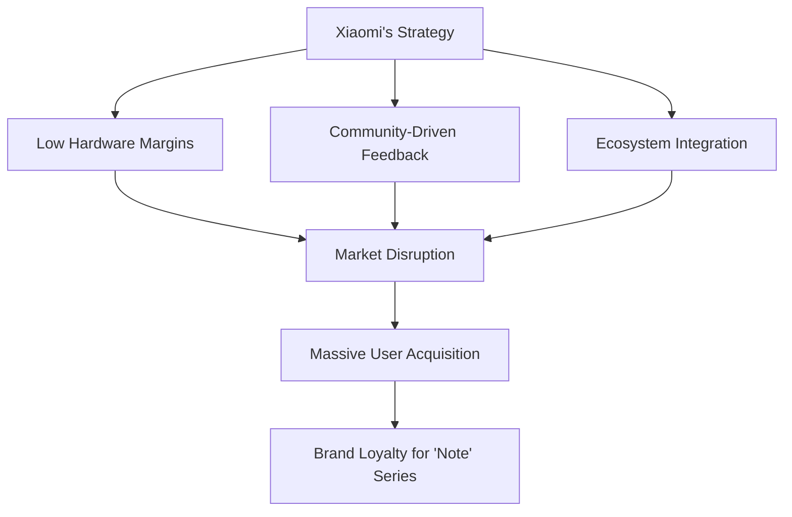

You know how it usually goes with tech—the second a new model is announced, we're basically told our current phone is a paperweight. We've been conditioned to think devices have a tiny shelf life. But every once in a while, a phone comes along that just refuses to die. It's so well-balanced and loved by its users that it outlasts its own expiration date. That’s the **Redmi Note 5 Pro**. When it dropped in early 2018, it didn't just sell millions of units; it basically became the gold standard for "bang for your buck," especially in markets like India.

Looking toward 2026, the real question isn't whether the Note 5 Pro is "fast" by today's standards—because let's be honest, it isn't. The question is: can it still actually *work* as a reliable tool while apps get bloatier and operating systems get heavier? This is a story about hardware that lasts, a community of developers who refuse to give up, and a business move that changed how we look at budget phones. By looking at the specs and real-world longevity, we can figure out if this "ancient relic" still belongs in your pocket or if it's time to put it in a museum.

---

## 📱 Hardware Breakdown: The Specs That Started It All

  
  
📸 <a href="https://unsplash.com/@_raj_28">Rajyavardhan Singh</a> on <a href="https://unsplash.com/photos/text-zO1uL40Fcfk">Unsplash</a>

To understand why the Redmi Note 5 Pro is still hanging on, you have to look at the blueprint. Back when it launched, it wasn't trying to beat the flagships; it was trying to give you 90% of that experience for about 30% of the price. The secret sauce was the **Qualcomm Snapdragon 636** chipset. Even though the 600-series was "mid-range," the 636 hit a sweet spot of power and efficiency. It used a 14nm FinFET process, which provided a significant jump in speed without draining the battery.

It featured a **5.99-inch display** and a massive **4000mAh battery**. Back when "battery anxiety" was becoming a real trend, the Note 5 Pro just kept going. In fact, many modern phones with power-hungry 120Hz screens struggle to match its raw endurance. According to [Wikipedia](https://en.wikipedia.org/wiki/Redmi_Note_5), that combination of the Snapdragon 636 and the high-capacity battery made it an absolute tank for the average user.

**The Quick Specs:**
- **Processor:** Snapdragon 636 Octa-core (1.8 GHz)
- **RAM:** 4GB or 6GB LPDDR4x
- **Battery:** 4000mAh Li-Po
- **Display:** 1080 x 2160 pixels (FHD+)
- **Camera:** Dual 12MP rear setup

The build was simple and practical. It wasn't fancy glass and titanium, but it felt solid. Plus, it has a 3.5mm headphone jack—which is increasingly rare—making it a win for anyone who hates dongles or wireless buds. It was built for utility, not luxury, and that’s exactly why it’s still around in the mid-2020s.

---

## 🛠️ The "Whyred" Magic: A Custom ROM Paradise

If the hardware is the body, the software community is the soul of this phone. In the Android world, every device has a codename, and for the Note 5 Pro, it's **"whyred"**. The "whyred" community became one of the most active spots for custom ROMs in Xiaomi's history. Because the Snapdragon 636 was developer-friendly and the user base was massive, thousands of enthusiasts worked to see how far they could push the device.

When Xiaomi eventually stopped official MIUI updates, the community took over. Projects like **LineageOS** and **Pixel Experience** breathed new life into the device. They stripped away the heavy "bloatware" of MIUI—which many users found intrusive—and replaced it with lean, fast versions of Android.

This community is the primary reason the phone remains viable. While official updates left the device stuck on older versions of Android, "whyred" developers have managed to push unofficial builds of Android 13 and even Android 14. This keeps the phone compatible with newer security patches and app requirements. For many owners, unlocking the bootloader and flashing a ROM became a rite of passage, turning a basic phone into a highly customizable piece of tech.

---

## 📉 The 2026 Reality: Can It Actually Survive?

Let's be real about the limits. The biggest problem now isn't the CPU—it's the **RAM**. While **4GB of RAM** was plenty in 2018, the modern web is a different beast. Chrome tabs and social media apps consume memory aggressively. In modern tech circles, 4GB is now considered the absolute bare minimum for a functional Android experience.

By 2026, "app bloat" is the primary breaking point. Apps that used to be 50MB are now often 500MB or more. The Snapdragon 636 struggles with the heavy animations and complex code of modern software. That said, there is a "minimalist" trend emerging. If you use "Lite" versions of apps (like Facebook Lite or Messenger Lite) and rely on the browser, the phone remains functional.

**2026 Usability Forecast:**
- **Basic Communication:** ✅ (Calls, SMS, WhatsApp)
- **Web Browsing:** ⚠️ (Slow on heavy sites, fine for text)
- **Social Media:** ⚠️ (Laggy on Instagram/TikTok)
- **Gaming:** ❌ (Limited to simple 2D games)
- **Photography:** ✅ (Still takes decent daylight snapshots)

It all comes down to expectations. If you want a modern "smartphone" experience, you'll be disappointed. But if you need a reliable "communication tool," it still does the job. For those who prioritize utility over prestige, the Note 5 Pro is a stubborn survivor.

---

## 🌍 Market Impact: How Xiaomi Flipped the Script

The Redmi Note 5 Pro wasn't just a phone; it was a disruptor. Before this, "budget" phones usually meant significant compromise. You either got something cheap and terrible, or something decent that cost a fortune. Xiaomi entered the market with a strategy that kept hardware margins razor-thin by integrating hardware, software, and internet services.

Xiaomi's goal was to offer "flagship-killer" specs at budget prices. The Note 5 Pro was the peak of that strategy. By utilizing the efficient Snapdragon 636 and massive scale in manufacturing, they forced competitors—from Samsung to Vivo—to rethink their pricing structures.

This created a new kind of buyer: the "spec-conscious" budget shopper. These were users who understood the value of a "Kryo CPU" and "LPDDR4x RAM." The Note 5 Pro gave a generation of users in emerging markets access to high-quality tech without breaking the bank, proving that a well-built phone could realistically last five years or more.

---

## 🔬 The Tech Logic: Why the Battery Holds Up

While most see the Note 5 Pro as a "value" phone, the technical reason for its longevity lies in its efficiency. The Snapdragon 636 didn't have the raw power of high-end chips, but its **performance-per-watt ratio** was incredibly balanced for basic multitasking.

Because it didn't push the hardware to extreme thermal limits during simple tasks, the 4000mAh battery enjoyed a very consistent discharge curve. Unlike more powerful chips of that era, which often suffered from sharp percentage drops during moderate use, the 636 remained stable.

**Technical Performance Profile:**
- **Light Tasks:** Highly efficient with minimal overheating.
- **Heavy Tasks:** Heats up quickly, leading to thermal throttling and performance drops.
- **Standby:** Very low drain, contributing to the legendary "multi-day" battery life reports.

This explains why the phone still feels "snappy" for basic operations. It wasn't built to sprint; it was built to jog a marathon. This efficiency is a major reason why it hasn't aged as poorly as other 2018 devices.

---

## 🗣️ User Experience: Real Voices from the Community

To see how the Note 5 Pro holds up in 2026, look at the users who refuse to let it go. Forums are full of a mix of nostalgia and technical venting. For some, it's still a daily driver—not because they can't afford a new one, but because they love the simplicity of a device they've spent years tweaking to perfection.

However, hardware degradation is inevitable. Battery wear is the biggest enemy, with many original cells now holding only 50-60% of their original capacity. This has sustained a secondary market for replacement batteries and a wealth of community-driven repair guides.

**Common challenges in 2026:**
- **Battery Life:** Original cells are degraded; replacements are almost mandatory.
- **App Stability:** Some modern apps crash due to outdated API levels in certain custom ROMs.
- **Camera Latency:** The time to launch the camera app has increased noticeably.
- **Charging Speed:** Micro-USB feels painfully slow compared to modern USB-C fast charging.

Still, the device has become a symbol of "anti-consumerism." By keeping a 2018 phone running in 2026, users are pushing back against the culture of annual upgrades.

---

## 🔋 The Art of Maintenance: Keeping it Alive

If you're still using a Note 5 Pro in 2026, it's less about "using" the phone and more about "maintaining" it. 

1.  **Swap the Battery:** A fresh cell removes the anxiety of the phone dying at 20%.
2.  **Pick a Lean ROM:** Avoid feature-heavy skins. LineageOS is generally preferred for raw performance over more aesthetic options.
3.  **Debloat:** Use ADB (Android Debug Bridge) to remove unnecessary system apps.
4.  **Go "Lite":** Use "Lite" versions of apps. Try *Via Browser* instead of Chrome, or use *Hermit* to create lite app wrappers for websites.
5.  **Clear Space:** eMMC storage slows down as it fills. Keeping at least 20% of storage free helps avoid major system lag.

By following these steps, the phone transforms from a lagging relic into a streamlined tool. The goal is to remove the "background noise" of the OS so the Snapdragon 636 can focus entirely on the task at hand.

---

## 🎯 Conclusion: A Legacy of Value

The Redmi Note 5 Pro was more than just a hit product; it was a proof of concept. It demonstrated that hardware doesn't have to be expensive to be durable, and that a dedicated community can extend a device's lifespan far beyond the manufacturer's intent. 

It cannot compete with the AI-powered monsters of today, but the fact that it can still make a call, send a text, and browse the web is a win for sustainability. It reminds us that we often purchase far more power than we actually need. The Redmi Note 5 Pro might be an "ancient relic" on paper, but in practice, it is a stubborn, reliable legend. Whether it makes it to 2027 or finally gives up, its impact on the industry and the "whyred" community remains the gold standard for budget excellence.