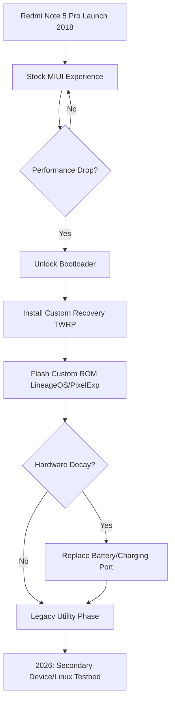

You know how it usually goes with smartphones. We buy one, use it for three or four years, and by the time it hits year five, it’s basically a paperweight in a junk drawer. Between the software getting bloated and the battery giving up the ghost, most phones just can't keep up. But every once in a while, a piece of tech comes along that just refuses to quit. That’s the **Redmi Note 5 Pro**.

Launched back in early 2018, this phone didn't just compete in the mid-range market—it basically rewrote the rules. For a lot of us, it was the "Goldilocks" phone: powerful enough to actually get things done, cheap enough for almost anyone to buy, and—most importantly—open enough that the developer community could really get their hands under the hood. Looking back from 2026, the Note 5 Pro isn't just a nostalgic piece of Xiaomi history. It’s a great example of what happens when a solid hardware foundation meets a global army of modders who refuse to let a good device die.

---

## 🚀 The 2018 Disruption: A New Standard for Value

  
  
📸 <a href="https://unsplash.com/@_raj_28">Rajyavardhan Singh</a> on <a href="https://unsplash.com/photos/text-zO1uL40Fcfk">Unsplash</a>

When Xiaomi dropped the [Redmi Note 5 Pro on February 14, 2018](https://en.wikipedia.org/wiki/Redmi_Note_5), they weren't just adding another model to the lineup; they were shaking up the entire mid-range scene. Back then, "budget" usually meant "compromised," but the Note 5 Pro felt premium without the flagship price tag. In India, it became an absolute sensation, with "flash sales" that showed just how desperate people were for high-spec hardware that didn't break the bank.

The real magic was that Xiaomi didn't cut corners where it actually mattered. While other brands were putting in sluggish processors or dim screens, the Note 5 Pro came with a **5.99-inch IPS LCD** and a massive **4000mAh battery** ([GSMArena](https://www.gsmarena.com/xiaomi_redmi_note_5_pro-8654.php)). This meant you weren't just getting a phone that "worked"—you were getting one that could actually survive a full day of heavy use, which was a significant benchmark for mid-range phones in 2018.

It changed the game immediately. By offering something that felt "near-flagship" for a fraction of the cost, Xiaomi forced competitors to step up. The Note 5 Pro proved that "mid-range" didn't have to be a compromise; it could actually be the sweet spot.

> "The Redmi Note 5 Pro didn't just win on price; it won on the psychological feeling of getting more than you paid for, which was the core of Xiaomi's early growth strategy."

---

## 🔬 The Silicon Heart: What Made the Snapdragon 636 Special?

If you want to know why this phone is still around, you have to look at the chip. It ran on the **Qualcomm Snapdragon 636**, which was a turning point for mobile efficiency. Unlike the older Snapdragon 625, the 636 used a more refined **14nm FinFET process**. In plain English: it could run faster without getting too hot or eating the battery alive.

The Snapdragon 636's efficiency was the "secret sauce." This architecture allowed for a better power-to-performance ratio, which is why the Note 5 Pro stayed snappy long after other 2018 phones started to lag. The octa-core setup made it a reliable workhorse for the average person's daily tasks.

Here are a few reasons why the Snapdragon 636 held up so well:
- **Better Graphics**: The Adreno 509 gave a noticeable boost to gaming and visuals over previous 600-series chips.
- **Thermal Stability**: The chip didn't "throttle" (slow down to cool off) as aggressively, keeping performance steady.
- **Solid Connection**: Reliable 4G LTE integration meant signal stability even in spotty areas.

Because the hardware was so stable, the software had more room to breathe. Sure, the 636 is a dinosaur by 2026 standards, but its reliability made it the perfect canvas for the mods that would eventually save the phone from a landfill.

---

## 🤖 The MIUI Struggle: Feature-Rich or Just Bloated?

Hardware is only half the story; software is what you actually interact with. For the Note 5 Pro, that was a bit of a love-hate relationship. It shipped with **MIUI**, Xiaomi's heavily customized version of Android. In 2018, people loved MIUI for its endless customization, but as the years went by, the software started to feel too heavy for the hardware.

Across various tech communities, users frequently complained about MIUI's **aggressive RAM management**. To keep the interface feeling smooth, MIUI would often kill background apps too quickly, which was a nightmare for power users. The "bloatware"—pre-installed apps and constant notifications—put a huge strain on the **3GB or 4GB of RAM**, creating a bottleneck that even the Snapdragon 636 couldn't always overcome.

It basically boiled down to this:
- **The Company's Goal**: Create a branded ecosystem that keeps you locked into the Xiaomi world.
- **The User's Reality**: As Android versions grew heavier, MIUI's overhead caused "stutter" and drained the battery faster.

This frustration is actually what gave the phone its second life. People got tired of the lag and started unlocking their bootloaders, turning the Note 5 Pro from a corporate product into a community project.

---

## 💡 The "Whyred" Phenomenon: A Developer's Playground

In the Android modding world, devices have codenames. The Redmi Note 5 Pro is **"whyred."** If you hang out in circles like [XDA Developers](https://forum.xda-developers.com/c/redmi-note-5-pro), "whyred" is legendary. It became the gold standard for "hackability."

Why did this specific phone become such a favorite for developers? It was a perfect storm. So many people owned the device that developers were highly motivated to build for it. The hardware was well-documented, and the bootloader was much easier to unlock than what you'd find on many Samsung or Huawei phones of that era.

The "whyred" community didn't just fix bugs; they completely reimagined what the phone could do. They built:
- **Custom Kernels**: Allowing users to "underclock" the CPU to extend battery life or "overclock" it for better gaming performance.
- **Debloated ROMs**: Versions of Android that stripped out unnecessary MIUI code, freeing up vital chunks of RAM.
- **Camera Mods**: Using Google Camera (GCam) ports to extract flagship-quality photos from mid-range sensors.

The general consensus among the modding community is that the Redmi Note 5 Pro became a standard testbed for custom ROMs. If a new build of LineageOS worked on "whyred," it was usually a sign that the build was stable for a huge swath of the budget Android ecosystem.

---

## 🌍 Breathing New Life: The Custom ROM Ecosystem

If the Snapdragon 636 was the body, Custom ROMs were the soul that kept the Note 5 Pro ticking into 2026. Xiaomi stopped providing official updates years ago, but the community didn't. Projects like **LineageOS** and **Pixel Experience** became the way to keep the phone secure and functional.

It is widely recognized in the Android community that custom ROMs extend the life of mid-range hardware by eliminating software overhead. For the Note 5 Pro, this meant users could run Android 11, 12, and even experimental later versions on hardware that was never officially supported.

Most users followed a similar journey:
1. **The Honeymoon**: Using the phone with stock MIUI as intended.
2. **The Sluggish Phase**: Noticing lag and battery drain as apps became more demanding.
3. **The Awakening**: Unlocking the bootloader and installing a custom recovery like TWRP.
4. **The ROM Phase**: Flashing a "clean" ROM (like Pixel Experience) to regain original speeds.
5. **The Legacy Phase**: Keeping the phone as a secondary device or specialized tool.

By stripping away the corporate skin, users realized that **the hardware wasn't the problem—the software was**. A Note 5 Pro running a clean version of LineageOS often felt faster than a newer mid-range phone bogged down by a heavy modern skin.

---

## 📊 The Battle Against Decay: Hardware Longevity

You can update software, but hardware eventually wears out. To make a Note 5 Pro last until 2026, users had to get creative. The biggest weak point was the **4000mAh battery**. Lithium-ion batteries naturally degrade after several hundred charge cycles, and by 2022, many original batteries had dropped significantly in capacity.

Luckily, the Note 5 Pro was designed in a way that made it relatively easy to maintain. It didn't rely on the extreme amounts of adhesive and proprietary screws found in many modern flagships; it was surprisingly repair-friendly.

Common ways people kept them alive:
- **Battery Swaps**: Third-party batteries were affordable and easy to install, restoring the 4000mAh capacity.
- **Port Repairs**: The Micro-USB port often wore out, but the community provided endless guides on replacing the daughterboard.
- **Screen Fixes**: Since it used a standard LCD instead of a costly OLED, replacing a cracked screen remained affordable.

This made the Note 5 Pro an accidental symbol for the **Right to Repair** movement. While the industry moved toward "sealed" devices, the Note 5 Pro remained a phone you could actually open and fix.

---

## 🎯 Legacy vs. Modernity: Why "Peak" Mid-Range Mattered

If you compare the Note 5 Pro to its successors—like the [Redmi Note 12](https://en.wikipedia.org/wiki/Redmi_Note_12) or the Note 13—you see a weird paradox. On paper, the newer models win everything: **AMOLED screens, 5G, 108MP cameras, and 120Hz refresh rates**. Yet, in community forums, people still refer to the Note 5 Pro as the "peak" of the series.

That's not about the specs; it's about **balance**. Back then, the gap between "mid-range" and "flagship" felt smaller. Today, mid-range phones often feel like "lite" versions of flagships, with materials or software designed to nudge you toward a more expensive model.

Here is the breakdown:
- **Note 5 Pro**: Focused on battery, stability, and an open ecosystem. It felt like a tool.
- **Modern Redmi Note**: Focused on "paper specs" (like high-megapixel cameras) that don't always translate to better real-world performance due to software limitations.

Interestingly, some people in 2026 still use the Note 5 Pro as a "distraction-free" phone. Because it lacks the hyper-optimized, AI-driven engagement algorithms of modern OSs, it has become a favorite for those practicing "digital minimalism."

---

## 📈 The 2026 Horizon: Utility, Ethics, and E-Waste

By 2026, the Note 5 Pro isn't anyone's main phone. But the fact that it's still around is a powerful statement against **planned obsolescence**. In a world where companies push a "new" phone every 12 months with incremental changes, the fact that a 2018 device can still browse the web and send messages is a win for the user.

These days, they've moved into "Legacy Roles":
1. **The Dedicated Tool**: Serving as a permanent Wi-Fi hotspot, a music player (utilizing the now-rare 3.5mm jack), or a smart home controller.
2. **The Learning Lab**: Used by students to learn how the Android kernel and Linux actually work.
3. **The "Dumb-phone" Alternative**: A way to stay connected for essentials without the constant pull of modern social media.

From an environmental perspective, the "whyred" community kept millions of devices out of landfills. By stretching a phone's life from three years to eight, they significantly reduced the carbon footprint associated with manufacturing replacements.

> "The longevity of the Note 5 Pro is not a failure of the market, but a triumph of the community. It proves that when hardware is honest and software is open, a device can outlive its creator's intentions."

---

## Conclusion: The Lesson of the "Whyred"

The Redmi Note 5 Pro was never meant to last until 2026. It was a high-volume product designed to grab market share. But thanks to efficient hardware, a fair price, and an obsessed global community, it became something more.

It taught us that **software is usually what makes a device obsolete**. When you strip away the corporate layers and artificial limits, hardware is actually incredibly resilient. The legend of "Whyred" reminds us that the most valuable feature a phone can have isn't a fancy camera or a folding screen—it's **openness**.

As we move toward a future of locked-down ecosystems, the Redmi Note 5 Pro stands as a reminder of what happens when users actually own their tech. It's more than just a phone; it's a testament to the open-source spirit.