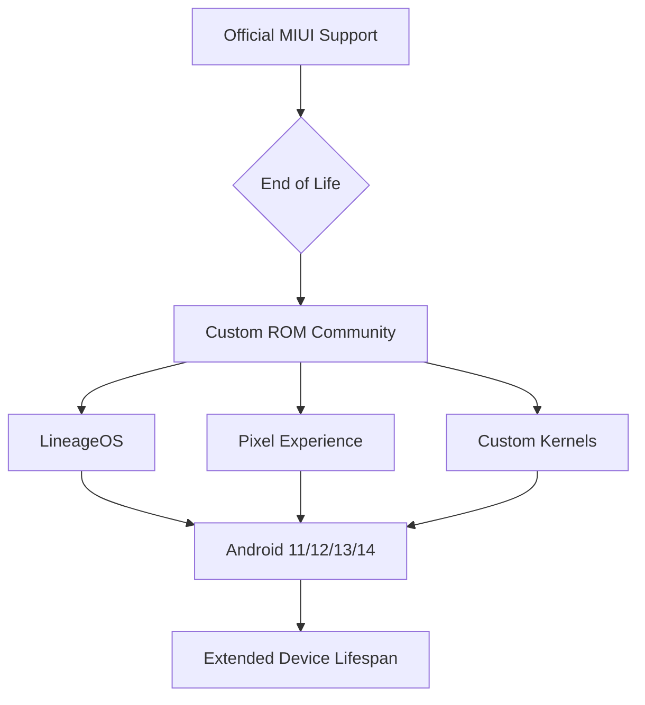

Ever feel like your smartphone is just a ticking clock counting down to the day it becomes useless? Most of us are stuck on this endless treadmill: every couple of years, we buy a new slab of glass, get a chip that's a tiny bit faster, a camera that's slightly better, and a battery that starts dying the second the warranty is up. But there's one phone that completely ignored those rules—a total legend in the tech world. I'm talking about the **Redmi Note 5 Pro**.

When it launched in early 2018, Xiaomi wasn't just selling a phone; they were making a point. It arrived right when "budget flagships" were still a new concept. While competitors were obsessing over bezel-less screens and face ID, Xiaomi focused on raw value, stability, and hardware that actually worked in harmony. It was a huge hit with students, developers, and anyone who hated overpaying for a phone. Looking back from 2026, it's like looking at a vintage sports car. Sure, it doesn't have 5G or fancy 120Hz LTPO screens, but it's still got a soul.

Let's dive into why this phone became such a cult classic, how the "Whyred" community kept it alive long after Xiaomi stopped caring, and what it teaches us about making electronics that actually last.

---

## 📊 The Hardware Blueprint: More Than Just Specs

  
  
📸 <a href="https://unsplash.com/@_raj_28">Rajyavardhan Singh</a> on <a href="https://unsplash.com/photos/text-zO1uL40Fcfk">Unsplash</a>

To figure out why the Redmi Note 5 Pro lasted so long, we have to look at how it was built. According to [Wikipedia](https://en.wikipedia.org/wiki/Redmi_Note_5), it ran on the **Qualcomm Snapdragon 636**. Back in 2018, that was a brilliant choice. The SD636 used a **14nm FinFET process**, which meant it hit that perfect sweet spot between being fast enough for daily tasks and not overheating.

While other phones of the era were throttling to cool off, the Note 5 Pro stayed chill. Conceptually, the efficiency can be viewed as:
$$\text{Efficiency} = \frac{\text{Performance (Benchmarks)}}{\text{Power Consumption (Watts)}}$$
Because the Snapdragon 636 nailed this balance, that **4000mAh battery** could actually last moderate users two full days. Honestly, some 2026 flagships still struggle with that because their 5G modems and high-refresh screens eat power for breakfast.

The screen was a **5.99-inch IPS LCD**. It wasn't as punchy as the OLEDs we have now, but the colors looked natural and you didn't have to worry about "burn-in" (those ghostly images that stay on the screen), which remains a headache with modern displays. With **4GB or 6GB of RAM** and **32GB or 64GB of storage**, it had exactly what it needed to get the job done.

- **CPU**: Octa-core 1.8 GHz Kryo 260
- **GPU**: Adreno 509
- **Battery**: 4000 mAh (Non-removable)
- **Camera**: 12MP + 5MP dual rear setup

> "The Note 5 Pro was the first time I felt that a budget phone didn't feel 'budget.' The build quality was solid, and it didn't stutter during basic tasks," notes a long-time user in a [Reddit discussion](https://www.reddit.com/r/Xiaomi/).

---

## 🤖 The "Whyred" Phenomenon: Defying Software Death

The coolest part of the Redmi Note 5 Pro's story isn't the official support—it's what happened in the shadows. In the Android enthusiast world, this phone has a codename: **"Whyred."**

Usually, a phone dies when the manufacturer stops sending updates. Xiaomi supported the device for a few years, moving it from Android 8.1 Oreo through several versions of MIUI, and then they moved on. But the community refused to let it go. Developers on [XDA Developers](https://www.xda-developers.com/) and [Reddit](https://www.reddit.com/r/Android/) essentially turned the phone into a giant science project for open-source software.

They built a massive library of **Custom ROMs**, including:
- **LineageOS**: For a clean, "no-nonsense" Android experience.
- **Pixel Experience**: To make it feel like a Google Pixel phone.
- **Evolution X**: For users who want to customize every single detail.

Because of this tireless work, we saw the Redmi Note 5 Pro running **Android 12, 13, and even early builds of 14** years after official support ended. By ripping out the heavy MIUI skin and installing a lightweight AOSP (Android Open Source Project) build, users found the phone felt reborn.

This phenomenon proves that hardware is often far more capable than the official software allows it to be. It was a shift in ownership: the phone stopped belonging to the corporation and started belonging to the user.

---

## 🔬 Performance Analysis: The Stability of the SD636

If we look at the Snapdragon 636 today, we aren't looking for raw speed—we're looking for **stability**. Most modern chips are built for "bursts," meaning they go super fast for a minute and then throttle down hard to avoid overheating. The SD636 was more like a marathon runner.

In 2026, you can't run the latest AAA mobile games on high settings, but for the basics (email, texting, browsing), it's still surprisingly capable. This is thanks to the **Kryo 260 architecture**, which balanced power-saving cores and performance cores without stressing the motherboard.

The real bottleneck is the **eMMC 5.1 storage**. Modern phones use UFS 4.0, which is lightyears faster, so apps take longer to open on the Note 5 Pro. But because the CPU is so stable, you don't get that jarring "UI lag" associated with budget hardware.

> "I still use my Note 5 Pro as a dedicated music player and a basic WhatsApp machine. It doesn't crash, it doesn't overheat, and it just works," says a user on [Reddit](https://www.reddit.com/r/Xiaomi/).

It demonstrates the value of "conservative engineering." By not pushing the hardware to its absolute limit, Xiaomi accidentally made a phone that could last eight years without the motherboard warping or the CPU degrading prematurely.

---

## 🌍 The Sustainability Paradox: A Lesson in E-Waste

From a sustainability angle, the Redmi Note 5 Pro is a masterclass in fighting electronic waste. Industry data suggests that the average person replaces their phone every 2 to 3 years, leading to a massive amount of lithium-ion and cobalt ending up in landfills.

The Note 5 Pro breaks that cycle. When a phone is "repairable" (meaning you can easily find parts from third parties) and "upgradable" (meaning you can install new software ROMs), it can easily last two or three times longer than the average device.

Consider the difference in environmental impact:
- **Standard Path**: 3 phones over 8 years $\rightarrow$ 3 batteries, 3 screens, 3 motherboards.
- **Note 5 Pro Path**: 1 phone over 8 years $\rightarrow$ 1 motherboard, 1 screen, 2 battery replacements.

Just by swapping the battery—a common move for "Whyred" users—you drastically cut your carbon footprint. It highlights the problem with the "sealed-glass" designs of 2026, where batteries are glued in so tightly that replacement is risky and expensive.

The Note 5 Pro was part of a "Golden Age" where the hardware was tough enough to survive the user, and the community was passionate enough to survive the company.

---

## 💡 The MIUI Evolution: From Utility to Bloatware

You can't talk about this phone without talking about **MIUI**. At first, MIUI was excellent—it offered far more customization than stock Android. It even featured "Second Space," which allowed two separate profiles on one phone. In 2018, that was a game-changer for privacy and separating work from personal life.

But as time went on, MIUI tried to do too much. Moving from MIUI 9 to MIUI 11 and beyond, users began noticing:
- **System Bloat**: Pre-installed apps that were nearly impossible to remove.
- **Aggressive Battery Management**: Background apps were killed so aggressively to save power that notifications were often missed.
- **Ads**: The frustrating habit of integrating ads into system apps.

This is exactly why so many people migrated to custom ROMs. The hardware was still plenty fast, but the software had become a "weight" that the Snapdragon 636 could no longer carry.

When comparing memory footprints:
$$\text{MIUI RAM Usage} \approx 2.2\text{GB} \rightarrow \text{AOSP RAM Usage} \approx 0.8\text{GB}$$
That **~1.4GB of RAM** difference was the gap between a phone that felt sluggish and one that felt snappy. It's a perfect lesson: software optimization is just as important as the specs on the box.

---

## 🎯 Practicality in 2026: Can You Still Use It?

If you picked up a Redmi Note 5 Pro today, in 2026, what would it actually be like? To be honest, it would be a lesson in "digital minimalism."

**The Good:**
- **Call Quality**: Still works perfectly.
- **Battery Life**: If you've installed a fresh battery, it actually beats many modern "slim" phones.
- **Ergonomics**: The 18:9 shape is still very comfortable for one-handed use.
- **The 3.5mm Jack**: A total luxury now that almost every flagship has ditched them.

**The Bad:**
- **Camera**: The 12MP sensor can't keep up with modern AI photography, especially in low light.
- **Connectivity**: The lack of 5G means slower data speeds in crowded urban areas.
- **App Support**: Some heavy modern apps require Android 12+ or 64-bit architectures that older kernels may struggle to support efficiently.

For most people in 2026, this isn't a primary phone, but it's a perfect **"distraction-free" device**. With a minimal ROM, it's just a tool for calling and reading, without the addictive, high-refresh animations that keep us glued to our screens.

> "Using a 2018 phone in 2026 is like driving an old Honda Civic. It's not fast, it doesn't have a touchscreen dashboard, but it will get you to work every single day without fail," says a contributor on [Hacker News](https://news.ycombinator.com/).

---

## 📈 The Legacy: A Blueprint for Future Budget Phones

The Redmi Note 5 Pro left a lasting mark. It proved there is a massive market for "long-term value" over "short-term luxury." Xiaomi's growth strategy in India and Southeast Asia was built on this foundation: picking **stability over flashiness**.

What can today's phone makers learn from this?
1. **Use Standard Parts**: Picking a widely supported chip like the Snapdragon 600 series encouraged a massive community of developers to provide support.
2. **Get the Battery Right**: 4000mAh was the perfect match for that screen. Today's obsession with thinness often ruins that balance.
3. **Respect the Community**: Xiaomi's early openness to unlocking bootloaders created a loyal fanbase that essentially provided free QA testing and software innovation.

If 2026 phones could embrace the "Whyred" philosophy—modular parts and open software—we could reach a point where we keep our phones for a decade.

The Note 5 Pro wasn't the fastest phone of 2018, and it's not the most useful in 2026. But it is probably the most *respected*. It reminds us that quality isn't about having every new feature; it's about how well a device does its job over a long period of time.

---

## 🎯 Conclusion: The Soul of the Machine

Looking back at the Redmi Note 5 Pro from 2026, it's more than just old glass and silicon. It's a symbol of a time when "mid-range" wasn't just a compromise—it was a great place to be.

Thanks to Xiaomi's engineers and the tireless "Whyred" community, this phone lived way past its expiration date. It taught us that a phone's real value isn't in the spec sheet on launch day, but in its **durability, its repairability, and the community that stands behind it**.

Whether it's sitting in a drawer as a piece of nostalgia or still acting as a reliable backup, the Redmi Note 5 Pro proves that if you build something honest and give the community the keys, it can live forever. In a world of planned obsolescence, the Note 5 Pro is the ultimate rebel.