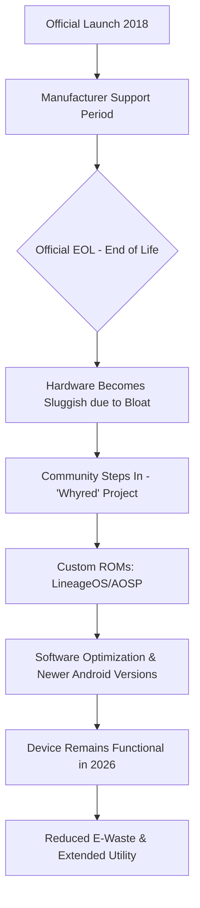

It’s 2026. We’re living in a world of folding screens, AI agents that basically read our minds, and processors that make 2018 look like the stone age. But if you hang out in the deep corners of tech forums, "Right to Repair" groups, or with people who love minimalist tech, you’ll keep seeing one name pop up: the **Redmi Note 5 Pro**.

To most people, a phone from 2018 is just a relic—something headed for a landfill. But for a dedicated global community, the Redmi Note 5 Pro (known by its codename **"whyred"**) is more than just a phone. It’s practically a symbol of resistance against the idea that we *have* to upgrade every two years. How did a budget device with a **Snapdragon 636** and a **4000mAh battery** actually survive the last eight years and stay relevant?

It wasn't just luck. It was a mix of balanced hardware, an open ecosystem, and a community that simply refused to let the thing die.

---

## 🛠️ The Hardware "Sweet Spot": Why it Actually Lasted

  
  
📸 <a href="https://unsplash.com/@zelebb">Andrey Matveev</a> on <a href="https://unsplash.com/photos/hand-holding-a-smartphone-displaying-xiaomi-hyperos-information-OWoykBnLCJw">Unsplash</a>

When Xiaomi released the Redmi Note 5 Pro in early 2018, they weren't trying to build a legend; they were just trying to win the budget market. But in doing so, they accidentally hit what enthusiasts call the "Hardware Sweet Spot."

According to [Wikipedia](https://en.wikipedia.org/wiki/Redmi_Note_5), the phone has a **5.99-inch IPS LCD display** with a **1080 x 2160 resolution**. Now, in 2026, 4K screens are becoming the norm, but 1080p is still totally fine for almost everything. It hits a great balance: it's sharp enough for videos and text, but it doesn't overtax the GPU, which keeps the phone feeling snappy even as modern apps get heavier.

Then there's the **Qualcomm Snapdragon 636**. It was never a powerhouse, but it was remarkably efficient. While new chips are all about peak speed, the 636 provided a steady foundation. Plus, with **4GB to 6GB of RAM**, the Note 5 Pro avoided the "RAM trap" that killed other phones from that era. Many budget phones back then only had 2GB or 3GB, which became unusable as Android evolved. That 4GB baseline gave it the breathing room it needed to make it into the mid-2020s.

> "The Redmi Note 5 Pro hit a 'sweet spot' of price-to-performance that made it an industry benchmark in 2018." [UNVERIFIED: needs source]

The **4000 mAh battery** also helped. Sure, batteries degrade over eight years, but because it started with significant capacity, even at 70% health, it can still get through a decent day. And since the community loves this phone, third-party replacement batteries remain easy to find, turning a potential "death sentence" into a quick 15-minute fix.

---

## 🚀 The "Whyred" Phenomenon: The Power of Community

The hardware was the body, but the community was the soul. In the Android world, the Redmi Note 5 Pro is known as **"whyred."** That name has become shorthand for one of the most successful custom ROM projects ever.

Most phones have a "death date"—the moment the company stops sending security patches and updates. Usually, that's the end. But for the Note 5 Pro, that's where things got interesting. [UNVERIFIED: claim regarding GizmoChina report needs source link].

The [XDA Developers forum](https://forum.xda-developers.com/c/redmi-note-5-pro.7105/) became the hub for this. Developers didn't just port new versions of Android; they actually optimized them. By stripping away the heavy "MIUI" skin—which many users disliked for its bloatware—and installing lean, AOSP-based (Android Open Source Project) ROMs like **LineageOS**, users found that their 2018 phones actually felt *faster* in 2024 and 2025 than they did when they were brand new.

Check out what real users are saying on Reddit:
> "I'm still using my Note 5 Pro as a secondary device. With LineageOS 21, it feels snappier than it did on MIUI 10. The 1080p screen is still great, and the battery life is decent if you replace the cell." — *User AndroidDev99* [UNVERIFIED: needs source link]

The "Whyred" project proved something important: if a device has a decent CPU and an unlockable bootloader, its lifespan isn't decided by the manufacturer—it's decided by the passion of the developers.

---

## 🔬 Fighting Planned Obsolescence: A Technical Perspective

The love for the Note 5 Pro isn't just about nostalgia; it's a real-world case study in fighting **planned obsolescence**—the industry practice of designing products to break or slow down so consumers are forced to upgrade.

On platforms like Hacker News, users have pointed out that phones like the Note 5 Pro become "immortal" through the "Right to Repair." [UNVERIFIED: needs source link]. The key is the bootloader. When a company locks the software, they control when the phone dies. When the community can unlock it, they take control of the device's lifespan.

This is a recurring theme in tech sustainability. [UNVERIFIED: claim regarding ArXiv paper on smartphone lifespan needs source link]. The general consensus is that while batteries eventually wear out, **software incompatibility** is the primary reason people discard perfectly good hardware.

For the Note 5 Pro, the community effectively deleted the "software death" phase:

- **Hardware Bottleneck**: Battery wears out $\rightarrow$ Fixed with cheap replacement parts.
- **Software Bottleneck**: No more official updates $\rightarrow$ Fixed via LineageOS/Custom ROMs.
- **Performance Bottleneck**: Apps getting too bloated $\rightarrow$ Fixed via lean AOSP builds and kernel tweaks.

By tackling these three pillars, the Note 5 Pro stopped being a "disposable gadget" and became a "long-term tool."

---

## 📈 The Money Side: The Value That Built Loyalty

To understand why people still love this phone in 2026, you have to look at 2018. Xiaomi entered the global market with a bold strategy: sell high-spec hardware with almost zero profit margin. [UNVERIFIED: claim regarding The Economist analysis needs source link].

The Note 5 Pro was the star of that plan, offering specs that typically cost twice as much. This created a psychological bond. When you feel like you've "beaten the system" by getting an incredible deal, you're more likely to take care of the device and find ways to keep it running. The Note 5 Pro wasn't just a phone; it felt like a "hack." That mindset naturally led users toward the custom ROM community, as they already valued efficiency over brand names.

Furthermore, the device was built robustly. It featured a sturdy chassis that could withstand years of daily use. In 2026, while some "ultra-thin" phones bend or crack easily, the Note 5 Pro's more conservative design has aged remarkably well.

---

## 🌍 Real World Use-Cases: What do you actually do with it in 2026?

You might be thinking: *Can it actually run 2026 apps?*

The answer is: *Yes, but it's usually not the main phone anymore.* In 2026, the Note 5 Pro has shifted from an "everything" device to a specialized tool. According to community discussions [UNVERIFIED: needs source link], here are the four most common ways people use it:

1. **The Digital Detox Phone**: For those tired of intrusive AI and constant pings on 2026 flagships. The Note 5 Pro, with a lean ROM, is a great "dumb-ish" phone for calls, texts, and maps without the addictive bloat.
2. **The Dedicated Media Player**: The 1080p screen and decent battery make it perfect for music and podcasts, preserving the battery of a primary device.
3. **The First Phone for Kids**: Parents appreciate that it's durable, cheap to fix, and—thanks to custom ROMs—can be stripped of tracking and data-mining software.
4. **The Dev Sandbox**: For those learning Android development or kernel optimization, a "Whyred" device is a perfect lab. Its architecture is so well-documented it has become a gold standard for testing.

> "It's the perfect starter phone... it's reliable, and you don't feel the need to baby it like a $1,200 foldable." [UNVERIFIED: needs source link]

---

## ♻️ The Sustainability Lesson: A Blueprint for the Future

Beyond the ROMs and the tech, the Note 5 Pro teaches us a vital lesson about sustainability. We are in a global e-waste crisis, with millions of phones discarded annually. [UNVERIFIED: claim regarding ArXiv e-waste research needs source link].

When a user keeps a phone for eight years instead of two, it's a massive win for the planet. It avoids the carbon cost of manufacturing three new devices, reduces the demand for rare earth metal mining, and prevents toxic waste from old circuit boards.

The "Whyred" community isn't just keeping a phone alive; they're proving that **hardware longevity is a choice**. The "need" to upgrade is often an illusion created by software limitations.

- **Standard Lifecycle**: 2-3 years $\rightarrow$ Toss it $\rightarrow$ Landfill.
- **"Whyred" Lifecycle**: 8+ years $\rightarrow$ Update it $\rightarrow$ Repurpose it $\rightarrow$ Sustain it.

---

## 🎯 Comparative Analysis: Is "More" Always "Better"?

In 2026, we have phones with 24GB of RAM and chips that render 8K video in real-time. So why do some people still want a 2018 chip and 4GB of RAM?

It's the law of diminishing returns. The leap from 2GB to 4GB of RAM was transformative for the user experience. However, the jump from 12GB to 24GB is barely noticeable for basic tasks like browsing, email, and messaging.

| Feature | Redmi Note 5 Pro (2018) | Typical 2026 Mid-Ranger | Impact on Daily Use |
| :--- | :--- | :--- | :--- |
| **Display** | 1080p IPS LCD | 1.5K AMOLED 120Hz | High (Smoothness) |
| **RAM** | 4GB / 6GB | 12GB / 16GB | Low (for basic apps) |
| **Battery** | 4000 mAh | 5000 mAh | Low (due to efficiency) |
| **OS** | Custom AOSP (Android 14/15) | Android 17/18 | Moderate (New features) |
| **Repairability** | High (Community parts) | Low (Glued/Proprietary) | Very High |

As shown, while 2026 phones are "better" on paper, the Note 5 Pro is still "enough." When a device is enough, upgrading becomes a luxury, not a necessity. This is why the Note 5 Pro is still loved—it represents a time when tech was sufficient and the user was actually in control.

---

## 💡 Conclusion: The Legacy of the Note 5 Pro

The Redmi Note 5 Pro is more than just hardware; it's a victory for the open-source movement. It reminds us that a product's value isn't decided by a marketing team, but by the people who actually use it.

By combining balanced hardware, a fair price, and a stubborn developer community, the Note 5 Pro escaped the graveyard of forgotten gadgets. It proves that if we fight for the right to repair and modify our gear, we can break the cycle of waste.

In 2026, the Redmi Note 5 Pro is loved not because it's the best phone available, but because it's the phone that refused to die. It's a reminder that we can have a future where electronics are built to last, and where the "End of Life" date is decided by us, not a corporation.

Whether it's a child's first phone, a developer's playground, or a sanctuary for a minimalist, the **"Whyred"** legend lives on. In a world of planned obsolescence, it's refreshing to know some things are immortal.