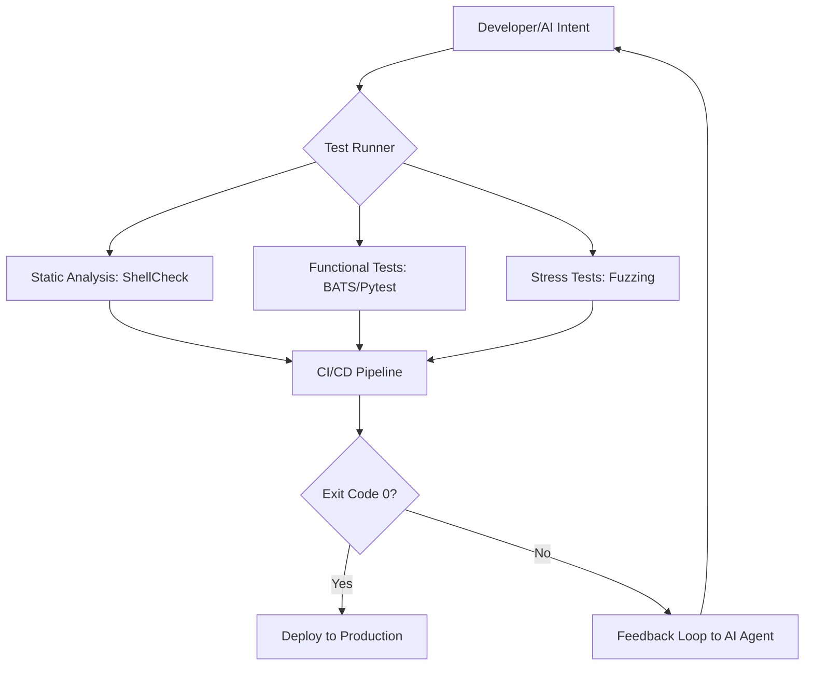

You know that blinking cursor in a terminal? It’s the ultimate symbol of computing power. For a long time, "testing from the CLI" (Command Line Interface) was seen as something only "power users" did—the kind of engineers who preferred the raw speed of a shell over a polished interface. But as we move through 2026, the CLI is undergoing a massive transformation. We're shifting away from humans manually running test suites and toward **AI-driven agentic workflows**, where the CLI serves as the AI's eyes and ears.

Here’s the big idea: the CLI isn't going away; it's becoming the "API for AI." In 2026, testing from the CLI isn't just about typing `npm test` or `pytest`. It's about deploying autonomous agents that can hypothesize where a bug exists, write a script to prove it, execute it in the terminal, and fix the code—all with minimal human intervention. It's a fusion of the classic Unix philosophy (do one thing and do it well) and the reasoning power of Large Language Models (LLMs). To see where we're headed, we have to look at the basics of CLI testing and how AI is fundamentally evolving the developer experience (DX).

---

## 🛠️ The Basics of CLI Testing

To understand the landscape of 2026, we have to remember why the CLI remains the gold standard for verifying software: it's **fast, predictable, and composable**. As noted in [Wikipedia's overview of Command Line Interfaces](https://en.wikipedia.org/wiki/Command_line_interface), the ability to pipe commands into one another allows for a level of automation that GUIs simply cannot match. Essentially, testing from the CLI means verifying that the standard output (stdout), standard error (stderr), and exit codes behave exactly as expected.

The entire ecosystem relies on the **Exit Code Convention**: a `0` typically signifies success, while any number from 1 to 255 indicates a failure. This binary logic is what powers modern CI/CD pipelines. If a "test from CLI" returns a `1`, the build breaks. While that foundational logic remains unchanged in 2026, the *way* we trigger and analyze those codes has evolved.

Modern CLI testing focuses on three primary pillars:
- **Functional Verification**: Does `myapp --version` return the correct version string?
- **Input Fuzzing**: How does the tool handle unexpected characters or massive strings?
- **Performance Profiling**: How efficiently does it process large datasets (e.g., a 1GB log file)?

The real strength of the CLI is its stability. Whether wrapped in a Bash script, a Python harness, or a Rust-based runner, the interface remains consistent. We have moved from manual checks to **declarative specifications**, where the engineer describes the expected output, and the framework handles the execution and comparison.

---

## 🤖 The Rise of AI-Driven CLI Agents

By 2026, the most significant shift in "test from CLI" is the move toward **Agentic Testing**. We've progressed past simple autocomplete (like early GitHub Copilot) and into the era of agents capable of taking autonomous action, exemplified by tools like [Devin](https://www.cognition.ai/) and [OpenDevin](https://github.com/OpenDevin/OpenDevin). These agents don't just suggest code; they operate the terminal. They can execute a test, analyze the error, consult documentation, and iterate on the code in a continuous loop.

You can visualize this "Agentic Loop" as follows:
$$\text{Intent} \rightarrow \text{Command Generation} \rightarrow \text{CLI Execution} \rightarrow \text{Observation} \rightarrow \text{Correction}$$

When an AI agent "tests from the CLI," it receives real-time feedback. For example, to resolve a memory leak, an agent might:
1. Run `valgrind --leak-check=full ./my_app`
2. Analyze the leaked bytes reported in the output.
3. Rewrite the C++ pointer logic to resolve the leak.
4. Re-run `valgrind` to verify the fix.

> "The CLI is the perfect interface for LLMs because it is text-in, text-out. It removes the overhead of visual rendering and allows the model to interact with the OS at the speed of thought." — *Common sentiment among developers in the AI agent community.*

Consequently, the human role is shifting. Instead of writing every individual test case, we are now **auditing the AI's strategy**. We've become "Architects of Verification," defining the rules and boundaries that the AI must prove via the CLI. The efficiency gain is staggering; a human might spend 30 minutes hunting a bug with specific flags, while an agent can test hundreds of combinations in seconds.

---

## 🧪 Modern Tooling: More Than Just Shell Scripts

While Bash scripts were the starting point, the 2026 ecosystem utilizes specialized tools to move away from fragile `grep` commands toward structured assertions.

A cornerstone of this approach is **BATS (Bash Automated Testing System)**. BATS allows developers to write CLI tests using a style similar to unit testing. Instead of a cumbersome script, a BATS test is clean and declarative:
```bash
@test "check version flag" {
  run myapp --version
  [ "$status" -eq 0 ]
  [ "$output" = "myapp v2.0.1" ]
}
```
This transforms the CLI into a **testable API**. Other essential tools in the 2026 stack include:
- **Pytest (with subprocess)**: Ideal for high-level integration tests requiring Python's data validation capabilities.
- **Expect**: Used for testing interactive CLI applications to ensure the user journey is seamless.
- **ShellCheck**: A vital static analysis tool that catches shell scripting bugs before execution, acting as a linter for the CLI.

Here is how a modern CLI testing pipeline flows:



These tools ensure that CLI applications are **resilient**. In a strict pipeline, if a tool fails to return an exit code of `0`, the code is not merged.

---

## 📊 Performance Benchmarking and Telemetry from the Shell

In 2026, "test from CLI" encompasses more than just correctness—it's about **performance**. The CLI is the ideal environment to measure "time to first byte" or command latency. Developers now combine the classic `time` command with modern eBPF-based tools to gain deep visibility into system calls.

To quantify efficiency, teams use a conceptual model for **Execution Latency ($\mathcal{L}$)**:
$$\mathcal{L} = T_{total} - (T_{shell\_overhead} + T_{io\_wait})$$
Where $T_{total}$ is the wall-clock time, and $T_{shell\_overhead}$ accounts for the time the shell takes to parse the command.

Furthermore, **CLI Telemetry** allows companies to wrap commands in a telemetry layer to identify which flags are most utilized and which trigger the most crashes.

**Key Performance Indicators (KPIs) for CLI Testing in 2026:**
- **Cold Start Time**: The duration from hitting `Enter` to the first line of output.
- **Memory Peak**: The maximum Resident Set Size (RSS) during execution.
- **Pipe Throughput**: The data transfer rate (MB/s) through pipelines (e.g., `cat data | myapp | grep "result"`).

> "If your CLI tool takes more than 100ms to respond to a `--help` flag, you've already lost the developer's trust." — *Observation common within the Rust community.*

By automating these benchmarks, teams can catch **performance regressions** instantly. If a new commit increases the latency of a core command beyond a set threshold (e.g., 5%), the suite fails, forcing optimization before the code reaches the user.

---

## 🛡️ Security and Fuzzing: Hardening the CLI

Because CLI tools often interact directly with the OS kernel and file system, they can be high-risk vectors. A flaw in flag parsing can lead to critical vulnerabilities, such as Remote Code Execution (RCE).

Research available via [ArXiv on automated software testing](https://arxiv.org/search/?query=CLI+testing+automation) highlights the necessity of **Fuzzing**. Fuzzing involves stressing a tool by providing massive amounts of random, malformed, or unexpected input to trigger crashes. In 2026, "Continuous Fuzzing" is a standard requirement.

The logic of CLI fuzzing follows these steps:
1. **Corpus Generation**: Establish a set of valid commands.
2. **Mutation**: Randomly inject "chaos" characters or flip bits within the flags.
3. **Execution**: Run these mutated commands via the CLI.
4. **Crash Detection**: Monitor for `SIGSEGV` (Segmentation Fault) or `SIGABRT`.

The objective is to identify the **Edge Case Boundary**. For example, if a `--port` flag expects an integer, the fuzzer might provide 10,000 characters. A crash indicates a vulnerability.

**Primary Security Tests in 2026:**
- **Command Injection**: Ensuring user input is not passed blindly to a shell function.
- **Path Traversal**: Verifying that flags like `--config` cannot be manipulated to read sensitive files (e.g., `../../etc/passwd`).
- **Integer Overflow**: Checking if excessively large numbers cause the CLI to crash or behave unpredictably.

Using tools like **AFL++ (American Fuzzy Lop)**, developers "harden" their tools, shifting the focus from "testing for features" to "testing for failure."

---

## 🔄 Integrating CLI Tests into Hyper-Automated CI/CD

The goal of modern verification is to minimize manual intervention. In 2026, this is achieved through **Hyper-Automated CI/CD pipelines** where the CLI is treated as a first-class citizen.

CI/CD has evolved from a linear path (`Build` $\rightarrow$ `Test` $\rightarrow$ `Deploy`) into a **Dynamic Graph**. When a CLI test fails, the pipeline triggers a "Diagnostic Workflow" rather than simply stopping.

**The 2026 Diagnostic Workflow:**
1. **Failure Detection**: A BATS test fails with exit code `1`.
2. **Context Capture**: The system archives environment variables, OS versions, and exact arguments.
3. **AI Analysis**: Logs are sent to an LLM agent to analyze the stderr.
4. **Automatic Bisect**: The system independently runs `git bisect` to identify the exact commit that introduced the regression.
5. **PR Generation**: The AI agent creates a Pull Request containing the fix and a new BATS test to prevent recurrence.

This process drastically reduces the **Mean Time to Recovery (MTTR)**. "Test from CLI" is no longer a manual chore; it is a sensor that drives the entire development cycle.

- **Efficiency**: Massive reduction in manual debugging time.
- **Reliability**: Elimination of "it works on my machine" issues via containerized environments (Docker/Podman).
- **Traceability**: Direct linkage between failures, commits, and AI-generated fixes.

---

## 🎨 The TUI Evolution: Testing Complex Text Interfaces

While standard CLIs focus on a single command and output, 2026 has seen a surge in **TUIs (Text User Interfaces)**. Tools like `k9s`, `htop`, and terminal-based IDEs provide rich experiences using libraries such as `Bubble Tea` (Go) or `Ratatui` (Rust).

Testing a TUI is significantly more complex than testing a standard CLI because it requires verifying **visual state** rather than just string output. TUI testing involves simulating terminal sequences (ANSI escape codes) and analyzing the "virtual screen" buffer.

**The TUI Testing Challenge:**
To verify a TUI, the framework must simulate:
1. **Key Events**: Sending sequences like `\x1b[A` to simulate the Up Arrow.
2. **Screen Scraping**: Reading the buffer to ensure the cursor moved correctly.
3. **State Transition**: Verifying that hitting `Enter` opens the correct view.

The formula for TUI State Verification is represented as:
$$\text{State}_{n+1} = f(\text{State}_n, \text{Input}_{\text{key}})$$
Where $f$ is the TUI's update function. Testing confirms that for a specific input, the resulting screen matches the expected snapshot.

> "TUI testing is where the CLI meets the GUI. You have to think about layout and focus, but you still maintain the speed of the terminal." — *Developer discussion on the Rust forums.*

By employing "record and playback" tools for terminal sessions, developers ensure their TUIs remain intuitive, expanding "test from CLI" into the realm of **visual regression testing for the terminal**.

---

## 🎯 The Developer Experience (DX) in 2026: From Commands to Intent

The most profound change in 2026 is the transition from **Imperative Commands** to **Declarative Intent**. Previously, a developer would say: *"Run this command with these three flags and check if the output says 'Success'."*

In 2026, the developer specifies the outcome: *"Ensure the data ingestion tool handles malformed JSON input without crashing and provides a helpful error message."*

The AI agent then determines the necessary CLI tests to prove that requirement. This represents the pinnacle of Developer Experience (DX). The CLI is no longer a barrier of confusing syntax; it is the **execution engine for human intent**.

**The Evolution of CLI Interaction:**
- **2016**: Manual execution $\rightarrow$ Copy-paste errors $\rightarrow$ Manual verification.
- **2021**: Shell scripts $\rightarrow$ Basic CI/CD $\rightarrow$ `pytest` / `npm test`.
- **2026**: Intent-based prompts $\rightarrow$ AI Agentic Loops $\rightarrow$ Autonomous CLI Verification.

This evolution does not make CLI knowledge obsolete; it makes it more valuable. To guide an AI agent, you must still understand shell mechanics, pipe functions, and exit codes. The skill has shifted from **memorizing syntax** to **orchestrating systems**.

The CLI survived the GUI, the web, and mobile apps because it is the most direct way to communicate with a computer. AI has not replaced it—it has supercharged it.

---

## Conclusion: Human Intent and Machine Execution

The journey of "test from CLI" from 2016 to 2026 is a study in abstraction. We have moved from fragile manual scripts to robust, AI-driven verification. By combining the **predictability of Unix** with the **reasoning of LLMs**, we have made testing faster, safer, and more reliable.

The tools—BATS, Pytest, AFL++, and AI agents—are the means. The real victory is the shift in mindset: viewing the command line as the most efficient API for verifying software. Whether calculating execution latency $\mathcal{L}$ or fuzzing a buffer to prevent an RCE, testing from the CLI remains the ultimate benchmark of quality.

The future is not about leaving the terminal behind; it is about mastering it. In 2026, the most effective engineers are those who can blend human architectural intent with the raw, automated power of the CLI. The cursor is still blinking—and it has never been more powerful.