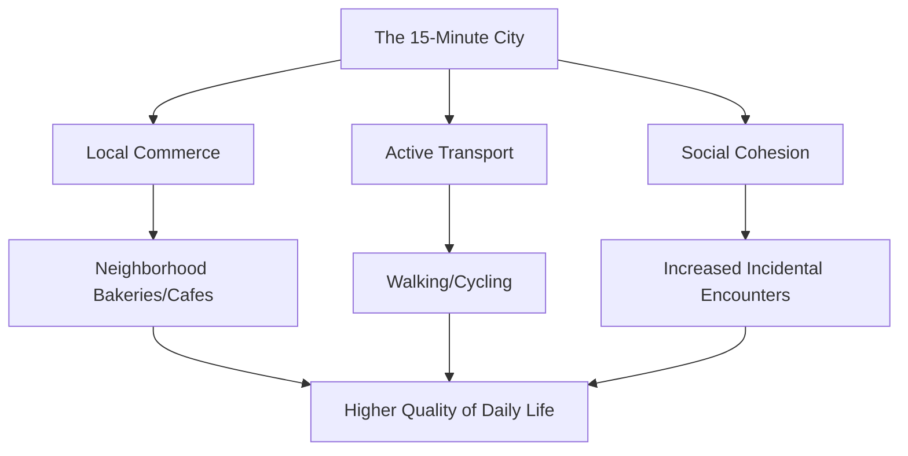

You know how it feels like the line between our online lives and our "real" lives is just... gone? That’s exactly where we are. As we head toward 2026, the way we wake up, work, eat, and hang out is changing in a way that feels even bigger than when the internet first took off. I like to call this **The Great Convergence**. It’s this weird, fascinating overlap where hyper-global tech meets a deep, almost desperate hunger for things that feel local and authentic. For some of us, life is becoming a smooth stream of AI-assisted experiences; for others, it's a conscious choice to hide away in "analog" sanctuaries.

The big paradox here is simple: the more universal our tools become, the more we crave a specific, grounded identity. We're seeing "digital nomadism" turn into "hyper-nomadism," and cities are being rebuilt to prioritize people walking over cars driving. In this post, I want to walk through the eight pillars of global culture as we move toward 2026, blending together research, tech community chatter, and the cultural shifts we're all feeling. We aren't just changing the gadgets we use; we're changing how we actually exist in time and space.

---

## 🌍 The Hyper-Nomad Era: Beyond Remote Work

  
  
📸 <a href="https://unsplash.com/@jhustin30">Kiel Salazar</a> on <a href="https://unsplash.com/photos/white-and-blue-taxi-cab-doors-are-all-close-gh0lS8C-ck0">Unsplash</a>

For a while, "remote work" was either a nice perk or something we had to do during the pandemic. But by 2026, it's evolved into **Hyper-Nomadism**. This isn't just about taking a laptop to a beach in Bali. Hyper-nomads are living in an **asynchronous global culture**. In many tech circles, the old "9-to-5" is being replaced by "output-based" contracts. Basically, as long as the work gets done, it doesn't matter where you are or what time you did it.

This is creating a new "global middle class" that isn't tied to any one country's economy. We're seeing "Digital Citizenship" programs where countries compete for high-earning remote workers with special visas. It changes daily life completely: the "commute" has been replaced by "community seeking." People aren't picking homes based on how close they are to an office, but on **lifestyle alignment**—moving for better air, a specific vibe, or a lower cost of living while still earning a "First World" salary.

Of course, it's not all sunshine. Sociological observations suggest that when your home and your work are totally decoupled, neighborhoods can start to feel "transient." When a huge chunk of a town is made up of hyper-nomads, those old-school "village" bonds—the kind of trust you have with a neighbor over ten years—can fade, replaced by a more fluid, network-style social life.

> "The office isn't dead; it just stopped being a place and started being a state of synchronization." — *Perspective from the future of work community.*

---

## 🎯 The Architecture of Daily Life: The 15-Minute City

While our work lives are going global, our physical lives are going local. One of the biggest shifts in how we live is the **15-Minute City**. The whole idea is simple: everything you need—work, shopping, doctor, school—should be within a 15-minute walk or bike ride from your front door.

Urban planning trends show that cities in Europe and South America are leading the way, turning streets back over to pedestrians instead of cars. This isn't just about traffic; it's a cultural shift. We're moving away from the "hub-and-spoke" model (where everyone crashes into one downtown core) toward a **polycentric model**, where there are multiple small hubs.

- **Less Transit Stress**: Urban residents are spending less time in traffic, which generally leads to higher reported levels of well-being.
- **Local Shops are Back**: Small, neighborhood businesses are thriving because people are spending their time and money right where they live.
- **Random Encounters**: We're seeing more "incidental encounters"—like bumping into a neighbor at the bakery—which helps fight the loneliness epidemic.

A lot of this is driven by sustainability. By ditching the car, cities are cutting carbon footprints and making daily habits fit the reality of climate change. The "daily routine" is becoming more of a circle than a straight line, centered around a tight-knit community.

---

## 🤖 The AI-Infused Routine: Outsourcing Cognition

By 2026, AI isn't just a "chatbot in a tab" anymore; it's an invisible layer in everything we do. We've moved from generative AI to **Agentic AI**. These aren't tools you have to "prompt" constantly; they're agents that run in the background of your life.

Many are now "outsourcing" the administrative parts of their brains. AI agents handle the logistics—scheduling, optimizing grocery lists for health goals, and filtering emails to prevent burnout. "Productivity" has changed: the skill is no longer *doing* the task, but *curating* what the agent produces.

There is also a fascinating cultural divide here. Observations of AI adoption suggest that in some East Asian cultures, AI is more frequently integrated into "companionship" roles, becoming emotional anchors in the home. In Western cultures, it tends to be more utilitarian—focused on efficiency and saving time.

We can think of this shift as a drop in "cognitive friction" ($\text{CF}$):
$$\text{CF} = \frac{\text{Mental Effort}}{\text{Task Complexity}} \rightarrow 0 \text{ as AI integration increases}$$

While this gives us more free time, it does make you wonder: what happens to us when the "struggle" of organizing our lives is gone? Some think it'll spark a new era of creativity; others worry we're losing basic executive functioning.

---

## 💡 The Great Deceleration: Digital Minimalism as Luxury

As a reaction to all that AI, a counter-culture has popped up: **The Great Deceleration**. This is the rise of "Slow Living" and "Digital Minimalism." The wild part? These aren't just for bohemians anymore—they've become **status symbols**.

In various sociology and future-focused forums, people are discussing the "luxury of being unreachable." In a world where AI makes sure you're always "optimized" and connected, the ability to actually disconnect is becoming a sign of power and wealth. This shows up in a few new habits:

- **The Analog Comeback**: Vinyl records, film photography, and physical journals are seeing a massive resurgence.
- **Dumbphones**: More Gen Z-ers are switching back to basic phones to reclaim their attention spans.
- **Nature-First Living**: "Forest bathing" and rural retreats are becoming the go-to way to detox from the digital noise.

From a psychological perspective, this is a defense mechanism. When your soul feels fragmented across ten platforms and a hundred notifications, slowing down is how you find yourself again. "Slow Living" isn't about hating technology; it's about **intentional friction**—choosing the slower path because it feels more human.

> "In 2026, the most expensive thing you can own is a morning without a screen." — *Common sentiment among Digital Minimalism advocates.*

---

## 📈 Global Palates 2026: Sustainability and Fusion

You can really taste the changes of 2026. The global plate is now a mix of crisis and innovation, blending **Hyper-Local Sourcing** with **High-Tech Proteins**.

Lab-grown meats and precision fermentation have begun to enter the mainstream. In hubs like Singapore, New York, and London, these alternatives are becoming a normal part of the diet. This is happening because ethical eating and environmental needs are finally colliding. People are thinking less about "national cuisine" and more about their "ecological footprint."

At the same time, we're seeing "Hyper-Fusion." Because of the hyper-nomad lifestyle, cooks are blending traditions in ways that ignore borders. We're seeing "Nomadic Cuisine"—dishes that mix ingredients from different continents, reflecting where the cook has actually lived.

- **Sustainable Proteins**: Algae snacks and lab-grown seafood are increasingly appearing in institutional dining.
- **Vertical Farming**: "Farm-to-table" now sometimes means the farm is located within the apartment building.
- **Cultural Synthesis**: AI is now commonly used to suggest flavor pairings based on global trending data.

Eating has evolved from a cultural ritual into a balancing act: how do we get the best global flavors while keeping $\text{CO}_2$ emissions per calorie as low as possible?

---

## 🔬 Digital Tribes vs. Physical Villages: The Loneliness Paradox

One of the most striking contradictions of 2026 is the **Loneliness Paradox**. We are more connected than we've ever been, but many people feel more isolated than ever. The "physical village" is often being replaced by the "digital tribe."

Anthropological perspectives on the digital age remind us that humans are wired for proximity. But now, many social needs are being met by niche online groups. These digital tribes give us great intellectual and emotional support, but they lack the "physicality" of a neighborhood.

There are growing concerns that consuming social interaction in short-form, algorithmic bursts is impacting our ability to be truly present. It's created a crisis where you might be "known" by thousands of strangers online, but remain "invisible" to the person living right next door.

To fix this, we're seeing "Third Places" 2.0—physical spaces built specifically to move connections from digital to physical. These aren't just coffee shops, but "co-living" hubs and "hobby guilds" where the whole point is to turn a screen-connection into a tactile one. The struggle of 2026 is trying to rebuild the "village" without giving up the freedom of the "network."

---

## 🚀 The Global Youth Aesthetic: The Algorithm's Influence

If you walk through Tokyo, Berlin, Mexico City, or Seoul today, you'll notice something: the youth look remarkably similar. This is the **Homogenization of Youth Culture**, driven by the algorithms of TikTok and Instagram.

The "Global Gen Z/Alpha Aesthetic" isn't decided by fashion houses in Paris or Milan anymore. Instead, it's a decentralized, AI-driven loop. Algorithms can spot a trend in one tiny corner of the web and blast it globally in hours. It creates "flash-culture," where trends appear and vanish at lightning speed.

- **Algorithm Fashion**: Clothes are made in "micro-drops" for trends that might only last two weeks.
- **Digital Identity**: The "online self" (avatars, feeds) often carries as much weight as the "physical self."
- **Linguistic Convergence**: "Internet Speak"—a mix of English, emojis, and memes—has become a global lingua franca for young people.

This creates a weird tension. While it makes people feel like they belong to a global group, it's also sparking a move toward **Hyper-Localism**. You'll see teenagers obsessively learning ancestral crafts—like traditional pottery or weaving—just to have an identity that an algorithm can't copy.

---

## 📊 Institutional Wellness: The Globalization of Mindfulness

Finally, the way we think about "health" has shifted. We've gone from **Healthcare** (fixing what's broken) to **Wellness** (optimizing how we exist). In 2026, wellness isn't just a luxury—it's often an institutional requirement.

From New York offices to Bangalore tech hubs, "mindfulness" is increasingly part of the professional landscape. Many companies are adding "well-being metrics" to their KPIs, incorporating mandatory meditation, sleep tracking, and official "digital detox" days.

This is a huge cross-cultural blend. The West has integrated Eastern mindfulness, and the East is leaning into Western "bio-hacking" and data-driven health. It's created a global industry that mixes ancient wisdom with hard science.

- **Bio-Hacking**: Using wearables to track cortisol and glucose in real-time to manage mood and energy.
- **Mindfulness in School**: Emotional regulation is being taught as a core subject, alongside traditional academics.
- **The Sleep Economy**: A boom in tech and architecture specifically designed to fix our circadian rhythms.

But some critics argue this "institutional wellness" is a form of "corporate pacification"—using mindfulness to help employees tolerate stressful jobs instead of fixing the structural issues of the workplace. That's the current struggle: genuine self-care versus "performative wellness."

---

## Conclusion: The Human Element in the Machine

Looking toward 2026, it's clear we aren't moving in just one direction. We aren't just becoming "more digital" or "more local"—we're doing both at the same time. We're hyper-nomads who still want a 15-minute neighborhood; AI-assisted workers who crave analog mornings; members of global digital tribes who are lonely for a real neighbor.

The "Great Convergence" is really just a search for balance. The tech of 2026 gives us incredible freedom and efficiency, but the "friction"—the slow walks, the handwritten notes, the unplanned chats, and the local flavors—is where the meaning is. As we hand over our routines to agents and our identities to algorithms, the most radical thing we can do is choose to stay human: messy, slow, and profoundly local.

The future of global culture isn't in a software update or an urban plan. It's in the gaps between them—the moments where we choose a person over a platform and an experience over an optimization.