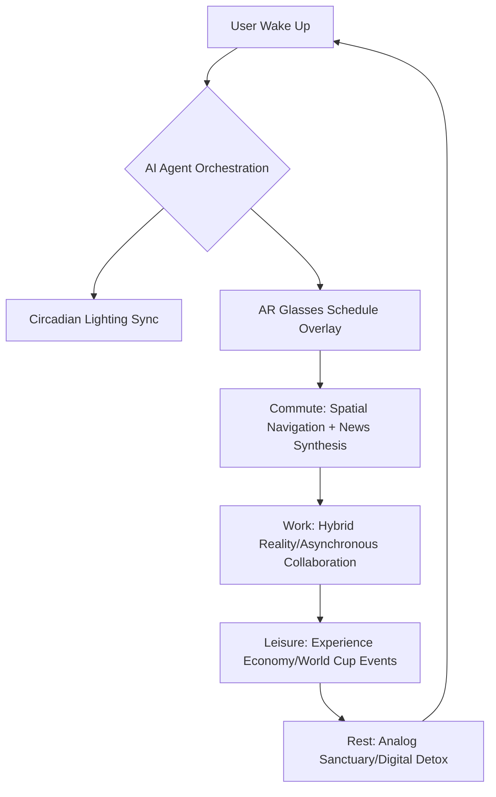

**Imagine waking up in June 2026.** You aren't jolted awake by a loud alarm or immediately diving into a frantic phone scroll. Instead, your room's lighting shifts subtly—something your AI agent handled by syncing with your circadian rhythm—to gently wake you up. You look around, and through a pair of lightweight AR glasses that look just like regular frames, your schedule for the day is floating right there in your field of vision. You aren't "checking an app"; the info is just *there*, part of your surroundings.

This isn't some far-off sci-fi dream; it's where we're actually headed based on the way tech and society are moving right now. 2026 feels like a major turning point—a "Great Convergence." It's the moment where the digital layers we've been building for twenty years finally blend into our physical lives. From the massive scale of the **2026 FIFA World Cup** to the quiet rise of **Autonomous AI Agents** and **Climate-Adaptive Urbanism**, our daily routine is shifting. We're moving away from clicking on screens and toward a continuous, augmented experience.

We're leaving the "Screen Age" and entering the "Layer Age." In this world, culture isn't just something we watch or read; it's something we move through, guided by a mix of hyper-personalized algorithms and real, raw human connection. So, how does this change how we live, work, and hang out? If we look at economic forecasts, tech community trends, and new urban blueprints, we can get a pretty good idea of what 2026 will actually feel like.

---

## 🌍 The World Cup as a Global Cultural Synchronizer

  
  
📸 <a href="https://unsplash.com/@jhustin30">Kiel Salazar</a> on <a href="https://unsplash.com/photos/white-and-blue-taxi-cab-doors-are-all-close-gh0lS8C-ck0">Unsplash</a>

The summer of 2026 is going to revolve around one thing: the **FIFA World Cup**. With the tournament spread across the US, Canada, and Mexico, it's set to be the biggest sporting event ever, featuring **48 teams** and **104 matches** [Talentor International](https://talentor.com/blog/how-will-the-fifa-world-cup-2026-redefine-global-scale-business-and-cultural-impact). The economic scale is staggering, with the event expected to generate billions of dollars in global economic output and provide a significant boost to the global GDP.

But beyond the cash, it's a huge experiment in the "Experience Economy." Being a fan has changed—it's now a **social-first viewing revolution**. We've moved away from just watching a long broadcast and toward a cycle of quick clips, memes, and instant reactions. GWI research shows that **74% of sports fans** now use social media to follow the game, with Gen Z leading the way by jumping between five or more platforms a day [GWI](https://www.gwi.com/world-cup/sports-trends). By 2026, the "stadium" is basically an algorithm; the most influential voices won't be the professional pundits, but fans "stitching" their reactions in real-time on TikTok and Instagram.

Also, because the tournament is in three countries, sports tourism is changing. Fans aren't just buying tickets; they're going on "cultural pilgrimages." Since **53% of sports fans** now value experiences over owning things, the 2026 Cup is sparking a huge jump in "adventure travel" and "ethical tourism" [GWI](https://www.gwi.com/world-cup/sports-trends). This is creating a fascinating cultural exchange where the "unexported America"—think roadside diners, Buc-ee's, and regional quirks—becomes a global viral hit as international visitors stream their authentic experiences to millions [Forbes](https://www.forbes.com/sites/pennyabeywardena/2026/06/17/the-world-cup-is-testing-the-america-the-world-thought-it-knew).

> "Influence now flows from unmanaged individual experience, not institutional messaging. Character has become more powerful than communications strategy." — Penny Abeywardena, Forbes.

---

## 🤖 The Era of the Autonomous Agent: From Chatbots to Life Managers

By 2026, the way we use AI will shift from "prompting" it to "delegating" to it. We're moving past the era of the LLM (Large Language Model) as a fancy search engine and into the era of the **Autonomous AI Agent**. These aren't just chatbots; they're agents that can handle multi-step tasks across different apps without constant human oversight.

One big headache popping up in 2026 is the **"Workslop Crisis."** Because AI can churn out summaries, drafts, and suggestions faster than humans can check them, companies are hitting a wall where "slop"—generic, AI-generated junk—is clogging up the decision-making process [WORKTECH Academy](https://cdn.worktechacademy.com/uploads/2026/01/World-of-Work-2026-WORKTECH_Academy.pdf). This means work has to be redesigned around "human-in-the-loop" judgment. The human's job isn't to write the first draft anymore; it's to be the editor and the one who provides the essential sensemaking.

To handle this, the corporate world is shifting toward a **"Bring Your Own Agent" (BYOA)** model. Instead of a company forcing everyone to use one tool, employees are encouraged to use a mix of approved agents that fit their specific role or way of working [WORKTECH Academy](https://cdn.worktechacademy.com/uploads/2026/01/World-of-Work-2026-WORKTECH_Academy.pdf). AI strategy is becoming less about a top-down mandate and more about the actual employee experience.

- **From Search to Synthesis**: You don't browse links anymore; you get a synthesized answer pulled from your own data and global knowledge.
- **The Automation of Boredom**: Scheduling, admin, and data retrieval are offloaded, giving people a "time bonus" for more creative work.
- **Algorithmic Governance**: Some futurists predict AI could even take on leadership roles, suggesting a **Fortune 500 company might name an AI model as CEO** to keep decision-making purely data-driven [Saxo](https://www.home.saxo/content/articles/equities/world-cup-2026-eng-26052026).

---

## 📈 The Orchestrated Labor Market: Skills Over Degrees

The way we think about "work" has fundamentally changed by 2026. The conversation isn't about whether AI will take our jobs, but about who knows how to **orchestrate** AI to create more value. A new kind of professional has emerged: the **AI Orchestrator**. These are individuals with "High AI Literacy" who can chain different agents together to solve complex problems, essentially turning AI into their own personal workforce.

We're also seeing the rise of the **"No-Entry Enterprise."** Since AI can now handle the basic, repetitive tasks that used to be the bread and butter of junior roles—like data entry or basic research—the traditional "apprenticeship" phase of a career is vanishing [WORKTECH Academy](https://cdn.worktechacademy.com/uploads/2026/01/World-of-Work-2026-WORKTECH_Academy.pdf). New hires are now expected to possess strong judgment and strategic thinking from day one, because the "doing" part is automated.

This has shifted how talent is valued:
- **Micro-Certifications as Currency**: Traditional degrees are taking a backseat to "bite-sized," skill-focused credentials. Employers are paying for on-demand learning to keep their teams agile [IWG](https://media.iwgplc.com/IWG/MediaCentre/IWG_WhitePaper_FutureWorkTrends_2026.pdf).
- **Fractional Leadership**: To handle a volatile economy, companies are hiring more **fractional executives**—part-time C-suite pros who bring deep expertise without the cost of a full-time hire [IWG](https://media.iwgplc.com/IWG/MediaCentre/IWG_WhitePaper_FutureWorkTrends_2026.pdf).
- **The "Sky-Blue Collar" Workforce**: A new mix of hands-on skill and cloud control, where technicians monitor and fix physical systems remotely using "digital twins" [WORKTECH Academy](https://cdn.worktechacademy.com/uploads/2026/01/World-of-Work-2026-WORKTECH_Academy.pdf).

> "Execution is no longer the beginning of a career. When technical execution becomes widely accessible, differentiation shifts toward sensemaking." — WORKTECH Academy.

---

## 🚀 Spatial Computing & The Invisible Interface

The most obvious change in 2026 is that the screen in your pocket is starting to disappear. We're moving into **Spatial Computing**, where the interface isn't a piece of glass, but a layer of data projected onto the real world.

The idea of **"Distance Zero"** is becoming a reality. Thanks to AI tracking and smart audio, people in a hybrid meeting—whether they're at HQ or at home—feel equally present in the conversation [IWG](https://media.iwgplc.com/IWG/MediaCentre/IWG_WhitePaper_FutureWorkTrends_2026.pdf). This is powered by wearable AR glasses that place navigation, translations, and alerts directly in the user's line of sight.

This is creating a **Hybrid Reality** where digital objects "persist" in physical space. You might leave a virtual sticky note on a physical office wall for a coworker or use an AR overlay to see a product's carbon footprint while shopping. However, because we're always "on," a counter-culture has emerged: **Analog Sanctuaries**. These are physical spots—cafes, libraries, or home zones—where AR and AI are banned so people can be fully present with one another.

---

## 🌡️ Urban Evolution: 15-Minute Cities & Climate Adaptation

By 2026, urban design is being driven by survival and sustainability. We're seeing **Climate-Adaptive Urbanism**, where the layout and timing of city life are changing to manage extreme heat.

The **"15-Minute City"**—where essentials are within a short walk or bike ride—is moving from theory to reality. An example is the $8 billion Ellinikon project in Athens, designed specifically around this concept by mixing residential, commercial, and cultural spaces around a massive central park [IWG](https://media.iwgplc.com/IWG/MediaCentre/IWG_WhitePaper_FutureWorkTrends_2026.pdf).

Even the **rhythm of the day** is shifting to fit the weather:
- **Temporal Shifts**: In high-heat regions, "siesta-style" schedules are returning. This involves a "Morning Peak" for intensive work, a "Midday Hiatus" to avoid the heat, and a "Twilight Economy" where shopping and socializing boom in the cooler evenings.
- **The "Hotelification" of the Office**: Since hybrid work is the norm, offices are being reimagined as "experience" hubs. Companies are adding barista bars, meditation rooms, and concierge desks to make the office a destination people *want* to visit [IWG](https://media.iwgplc.com/IWG/MediaCentre/IWG_WhitePaper_FutureWorkTrends_2026.pdf).
- **Micro-Innovation Hubs**: Cities are converting empty offices into urban factories. With 3D printing and robotics, small-batch production can happen locally, reducing reliance on fragile global supply chains [WORKTECH Academy](https://cdn.worktechacademy.com/uploads/2026/01/World-of-Work-2026-WORKTECH_Academy.pdf).

---

## 🔬 The Bio-Optimization Revolution: Health as a Performance Metric

Health in 2026 has shifted from "fixing things when they break" to "optimizing everything." **Biohacking** and the use of medicine for lifestyle enhancement have gone mainstream.

The rise of **GLP-1 agonists** (like Ozempic and Wegovy) has transitioned these medications from "treatments" to "lifestyle tools" [Saxo](https://www.home.saxo/content/articles/equities/world-cup-2026-eng-26052026). By 2026, these drugs—combined with real-time glucose monitors and AI nutrition plans—have become common wellness accessories for many.

This has created a culture of **"Bioperformance,"** where staying healthy is seen as a requirement for high performance. Companies are integrating "Well-tech" into the workspace:
- **Neuron Activation Pods**: Utilizing low-frequency vibrations to help the body recover [WORKTECH Academy](https://cdn.worktechacademy.com/uploads/2026/01/World-of-Work-2026-WORKTECH_Academy.pdf).
- **Neuro-Biophilia**: Using nature-based designs—such as fractal patterns and extensive greenery—to help neurodiverse employees (including those with ADHD or autism) stay focused and reduce stress [WORKTECH Academy](https://cdn.worktechacademy.com/uploads/2026/01/World-of-Work-2026-WORKTECH_Academy.pdf).
- **Functional Celebration**: Social habits are evolving. High-energy events are now paired with "optimized indulgence," such as alcohol-free drinks and recovery beverages. GWI found that **52% of sports fans** now identify as health-conscious [GWI](https://www.gwi.com/world-cup/sports-trends).

---

## 💡 The Algorithmic Self vs. The Authenticity Renaissance

As AI manages more of our lives, we're encountering a psychological tension: the **Algorithmic Self**. When AI suggests your books, your partner, and your career based on a trillion data points, the concept of individual "taste" begins to blur.

This has sparked a counter-movement: **The Authenticity Renaissance**. People are placing a premium on things that are "provably human." This is partly a reaction to the **"Dead Internet Theory"**—the feeling that much of the internet is simply AI interacting with other AI. Consequently, 2026 culture emphasizes:
- **The Luxury of Disconnection**: "Slow Living" has become a status symbol. For the wealthy, the ultimate brag is no longer how connected they are, but how unreachable they can be.
- **Verified Human Markers**: The emergence of digital certificates proving that a piece of art, a song, or a text was created by a biological human without AI assistance.
- **Uncurated Discovery**: A trend toward "blind travel" or "random exploration," where people intentionally disable AI agents to find experiences they *weren't* predicted to like.

---

## 🎯 Hyper-Localism & The New Community

Paradoxically, as the digital world becomes global and seamless, our social lives are shrinking back to the neighborhood. We're seeing a rise in **Hyper-Localism**, driven by both climate necessity and screen fatigue.

The **"Local Loyalty Effect"** is strengthening because hybrid work keeps people in their own communities for more of the day. We're moving away from the "global village" and toward a network of **"Intimate Villages."**

This is manifesting in several ways:
- **Neighborhood DAOs**: Local groups using decentralized organizations to manage shared energy grids, tool libraries, and childcare.
- **Circular Economies**: An increase in trading goods and services within a few blocks to reduce carbon footprints and support neighbors.
- **Social Friction Design**: Urban planners are intentionally adding "friction" to public spaces—such as shared gardens and open-air markets—to encourage the face-to-face interaction that digital life often eliminates.

By 2026, the most successful "smart cities" aren't the ones that replace the local experience with tech, but the ones that use tech to protect and improve it.

---

## Conclusion: The Synthesis of High-Tech and High-Touch

Daily life in 2026 isn't about machines replacing people; it's about **synthesis**. We're learning to live in the "And." We are global *and* local. We are augmented *and* authentic. We are optimized *and* organic.

The 2026 FIFA World Cup is the perfect example: a massive, high-tech global show that only truly matters because of the raw, unscripted emotion of a fan in a Texas diner or on a street corner in Mexico City. It's an event of immense economic scale, but its real value lies in those "unexported" moments of human connection.

As we navigate this "Layer Age," the most important skill won't be technical proficiency, but **emotional intelligence**. In a world where AI can run your schedule, write your emails, and optimize your health, the only thing left that's uniquely human is the ability to feel, to empathize, and to embrace the beautiful, messy chaos of being alive. The Great Convergence is here; the goal now is to make sure that as the world gets "smarter," it also gets more human.