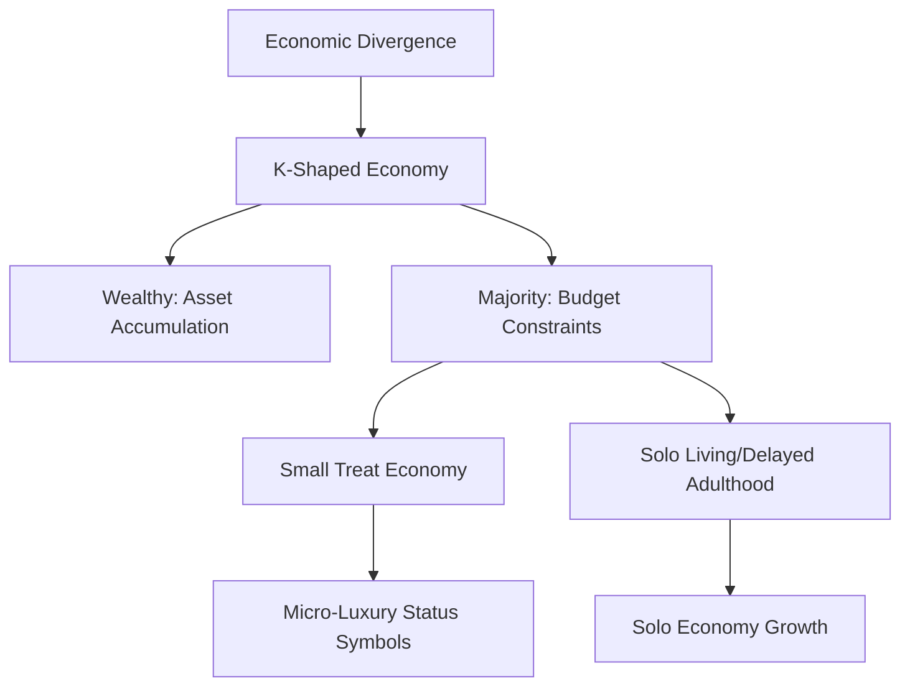

Picture this: it's 2026. You wake up, but instead of the usual stressful scroll through a chaotic newsfeed, you get a synthesized briefing from your AI agent. This isn't just a tool you open and close; it's a full-fledged member of your professional team. Maybe you're spending your autumn in a "seasonal home" in Portugal while your kids attend a borderless digital academy—a lifestyle that used to be for the ultra-rich, but is now becoming a reality for a new wave of seven-figure solopreneurs. As you head outside, you see your neighbor working in a regenerative garden. In a world saturated by algorithms, having a tactile, earthy hobby has become the ultimate status symbol.

We've hit a point where the culture is fundamentally recalibrating. For the last decade, everything was about "more"—more connectivity, more data, more speed. But by 2026, that path has broken. We're seeing a global pivot toward **intentionality**. The things we value most aren't attention or information anymore; they're trust, authenticity, and actually being physically present. This is what's being called the "Great Decoupling," where we're finally separating work from where we live, identity from mass media, and human connection from a screen.

In this post, I want to walk through the eight big shifts defining our lives and culture in 2026. By looking at real-world data, trend reports, and community discussions, we can start to map out the blueprint of our near future. From the "Small Treat Economy" to the "Analog Rebellion," we're essentially rewriting how we live, love, and work to make things feel human again in a machine-driven world.

---

## 🌍 The Fragmented Global Order & The Prepper Mindset

  
  
📸 <a href="https://unsplash.com/@jhustin30">Kiel Salazar</a> on <a href="https://unsplash.com/photos/white-and-blue-taxi-cab-doors-are-all-close-gh0lS8C-ck0">Unsplash</a>

The general vibe of 2026 is one of "New Global Disorder." The old rules that guided the world after WWII—things like free trade and trust in big international institutions—have mostly evaporated. According to the [Global Peace Index](https://www.visionofhumanity.org/maps/), global conflict has reached levels not seen since WWII, leaving many living under a cloud of constant uncertainty ([Forbes](https://www.forbes.com/sites/kianbakhtiari/2026/02/26/7-cultural-trends-for-2026-and-beyond)).

This instability has caused a fascinating psychological shift: "prepping" has gone mainstream. It used to be a fringe activity involving bunkers and canned beans, but now it's a sophisticated way of managing risk. In the U.S., the number of preppers has more than doubled to **20 million people** since 2017 ([Reuters](https://www.reuters.com/world/us/prepping-disaster-diversifies-more-americans-lose-trust-2024-03-09/)). This isn't just about survivalism; it's a cultural reaction to the erosion of trust in institutions.

Because of this, we're seeing a "nostalgia loop." When the future feels scary or out of reach, we cling to what we know. This shows up in "Remixing Classics," where folklore and mythology are blended into modern stories, and in Hollywood's obsession with remaking staples like *The Odyssey* and *Wuthering Heights* ([Weber Shandwick](https://webershandwick.com/news-insights/predicting-the-unpredictable-the-top-10-cultural-trends-and-moments-of-2026)).

> "In times of war and uncertainty, we prioritize self-preservation above collective concerns... people become less tolerant of uncertainty and more reliant on in-group identity." — *Forbes Analysis* ([Forbes](https://www.forbes.com/sites/kianbakhtiari/2026/02/26/7-cultural-trends-for-2026-and-beyond))

You can almost think of this as a sociological tension where the drive for stability $S$ is inversely proportional to how volatile the world $V$ feels:
$$\text{Cultural Conservatism} \propto \frac{S}{V}$$

---

## 💰 The K-Shaped Life: Small Treats and Solo Living

Economically, 2026 is split. We're seeing a "K-shaped" divergence where the wealth gap has become a canyon. The top **10% of the wealthiest Americans now account for 50% of all consumer spending** ([Forbes](https://www.forbes.com/sites/kianbakhtiari/2026/02/26/7-cultural-trends-for-2026-and-beyond)). For most people, the usual signs of "growing up"—buying a house, getting married, having kids—have become financially daunting. In big cities, home prices are now **10 times the median income**, a huge jump from the 3x ratio seen in the 1980s ([Forbes](https://www.forbes.com/sites/kianbakhtiari/2026/02/26/7-cultural-trends-for-2026-and-beyond)).

This is where the **"Small Treat Economy"** comes in. Since big milestones are out of reach, Gen-Z and Millennials are pivoting to "micro-luxuries" to maintain mental well-being. It's like the "Lipstick Effect" on steroids: $10 matcha lattes, $100 fast-fashion hauls, and limited-edition "merch drops" act as the new, accessible status symbols ([Forbes](https://www.forbes.com/sites/kianbakhtiari/2026/02/26/7-cultural-trends-for-2026-and-beyond)).

At the same time, the "Solo Economy" is booming. Single-person households are among the fastest-growing household types globally ([Our World in Data](https://ourworldindata.org/data-insights/solo-living-has-become-the-most-common-arrangement-for-households-in-the-united-states)). Going on solo dates, traveling alone, or eating at a "table for one" is no longer seen as an act of isolation—it's romanticized as a way to practice self-love and independence.

- **Status Shift:** From "owning a home" $\rightarrow$ "curating a high-end aesthetic of small indulgences."
- **Household Shift:** From "nuclear family" $\rightarrow$ "autonomous solo units."
- **Consumption Shift:** From "long-term investment" $\rightarrow$ "immediate emotional reward."

---

## 🤖 The Invisible AI: From Tools to Teammates

By 2026, the "AI hype" has mostly died down and been replaced by something quieter: AI is simply everywhere ([Anarchy Daily](https://www.anarchydaily.com/stories/cultural-trends-2026-clarity-after-chaos)). The big shift is that we've stopped seeing AI as a tool and started seeing it as a teammate. In corporate org charts, AI agents are now given specific roles, budgets, and responsibilities. They participate in meetings and handle tasks autonomously ([John T. Meyer](https://www.youtube.com/watch?v=zC6gX9l8lCo)).

This kind of leverage has made the **seven-figure solopreneur** possible. With a fleet of AI agents handling marketing, sales, and operations, one person can now run a business with the scale of a 10-person company ([John T. Meyer](https://www.youtube.com/watch?v=zC6gX9l8lCo)). This is accelerating the exit from traditional corporate jobs toward "sovereign" work.

The way we interact with tech is changing, too. Screens remain, but **voice is becoming a primary platform** ([John T. Meyer](https://www.youtube.com/watch?v=zC6gX9l8lCo)). Between next-gen spatial computing and better voice AI, the friction of typing is disappearing. Interacting with technology is starting to feel like a conversation rather than a set of commands.

> "AI gets added to the org chart... it's more about redefining what a team looks like and starting to think of AI beyond just a tool or a tactic and really a part of the team." — *John T. Meyer* ([YouTube](https://www.youtube.com/watch?v=zC6gX9l8lCo))

The risk here is "algorithmic saturation"—where everything starts to look like indistinguishable AI "slop." This is triggering a counter-movement called "Human Pride," where we celebrate human creativity and the "imperfections" that prove a person actually made something ([The Future Laboratory](https://www.thefuturelaboratory.com/reports/future-forecast-2026)).

---

## 🌿 The "Touch Grass" Movement: IRL as the New Luxury

Gen-Z has hit a breaking point with digital burnout, leading to a massive cultural reset. There is a literal and metaphorical "push to touch grass"—a movement to reclaim the physical world ([John T. Meyer](https://www.youtube.com/watch?v=zC6gX9l8lCo)). In 2026, **being offline is a luxury signal**.

Since the global economy is so tied to the cloud, the ability to actually disconnect is now a marker of wealth. While those in precarious digital roles cannot afford a "digital detox," the elite can pay for phone-free retreats and "analog" experiences ([Forbes](https://www.forbes.com/sites/kianbakhtiari/2026/02/26/7-cultural-trends-for-2026-and-beyond)). This is the "IRL Luxury" trend: the physical world is the new site of authenticity.

This analog rebellion is manifesting in several ways:
- **Wisdom Flexing:** People are moving away from "hot takes" toward actual depth. Books have become the new "it-bag," and deep-diving into complex topics is now a sign of sophistication ([Weber Shandwick](https://webershandwick.com/news-insights/predicting-the-unpredictable-the-top-10-cultural-trends-and-moments-of-2026)).
- **Physicality in Art:** The art world is moving away from digital perfection. Blur, distortion, and asymmetry are now prized because they prove a human hand was involved ([Anarchy Daily](https://www.anarchydaily.com/stories/cultural-trends-2026-clarity-after-chaos)).
- **Tactile Hobbies:** There's a surge in "slow" activities like pottery, gardening, and chess. Interestingly, people often use platforms like Strava to coordinate these, using the digital to enable the physical ([Forbes](https://www.forbes.com/sites/kianbakhtiari/2026/02/26/7-cultural-trends-for-2026-and-beyond)).

Psychologically, we're trying to lower our "Cognitive Load" ($C_L$). The desire for mental wellness is proportional to the amount of analog engagement ($A_e$) we have compared to digital noise ($D_n$):
$$\text{Mental Wellness} \propto \frac{A_e}{D_n}$$

---

## 🎨 The New Aesthetics: Design Intelligence and Future Tradition

Culture in 2026 isn't about inventing something brand new; it's about **reimagining the old**. We're in the era of "Future Tradition," where heritage is a flexible framework rather than a strict set of rules. Research shows that **66% of people globally agree that traditions stay alive when they evolve**, not when they remain static ([Human8](https://www.wearehuman8.com/blog/future-tradition-a-key-2026-trend-shaping-the-evolution-of-culture-and-heritage)).

In Asia and the Middle East, this evolution is "bold"—such as adding LED lights to Diwali or using WeChat for digital red envelopes. In the West, it's more "pragmatic," such as digital Christmas cards or reusable advent calendars ([Human8](https://www.wearehuman8.com/blog/future-tradition-a-key-2026-trend-shaping-the-evolution-of-culture-and-heritage)).

In fashion, "hype" (loud logos and algorithmic trends) is being replaced by **"Design Intelligence."** People are spending more carefully, prioritizing the story, the craft, and longevity over the spectacle. Resale is now a primary market where "provenance" (where something came from) is a marker of identity ([Anarchy Daily](https://www.anarchydaily.com/stories/cultural-trends-2026-clarity-after-chaos)).

> "Culture and tradition are like a river, they change with time and set their own pace... This change is good; it stays true to our roots while avoiding the extra cost." — *Participant in Human8 Study* ([Human8](https://www.wearehuman8.com/blog/future-tradition-a-key-2026-trend-shaping-the-evolution-of-culture-and-heritage))

Some key looks to watch:
- **Mythology-Core:** Blending ancient myths (like *The Odyssey* or *Dracula*) with modern pop culture.
- **Biomorphic Design:** Tech that looks "organic," creating a dialogue between computation and nature.
- **Sport-Fashion Convergence:** The "Challengers effect," where tennis courts and sports arenas replace traditional runways as the place where trends start ([Weber Shandwick](https://webershandwick.com/news-insights/predicting-the-unpredictable-the-top-10-cultural-trends-and-moments-of-2026)).

---

## 🏃‍♂️ The Health Paradox: Peak Physicality vs. Mental Valleys

We're living through a biological contradiction: **our physical health is peaking, but our mental health is struggling** ([John T. Meyer](https://www.youtube.com/watch?v=zC6gX9l8lCo)).

On one side, "Self-Optimization" is an obsession. Because the world feels unstable, people are hyper-focusing on the one thing they can control: their bodies. High-protein diets have moved from "nutrition" to a lifestyle signal of discipline. Wearables like the Oura ring (with a valuation reaching **$11 billion**) have turned sleep and heart rate variability into data points to be hacked ([Forbes](https://www.forbes.com/sites/kianbakhtiari/2026/02/26/7-cultural-trends-for-2026-and-beyond)).

On the other side, the "loneliness epidemic" persists. The rise of "Friends for Sale"—paid community clubs and friendship apps—shows how commodified connection has become ([Weber Shandwick](https://webershandwick.com/news-insights/predicting-the-unpredictable-the-top-10-cultural-trends-and-moments-of-2026)). AI companions might provide easy emotional support, but they often risk increasing loneliness by replacing "high-friction" human interaction with "low-friction" synthetic versions.

- **Physical Peak:** Longevity clinics, biohacking, and social circles built around Strava.
- **Mental Valley:** Chronic loneliness, "digital sorrow," and the struggle to make non-transactional bonds.
- **The Solution:** Moving toward "Presence over Optimization," where exercise is about joy and belonging, not just a metric ([The Future Laboratory](https://www.thefuturelaboratory.com/reports/future-forecast-2026)).

---

## 🇨🇳 The Eastward Shift: China's Soft Power and Global Influence

The cultural center of gravity is shifting. China has overtaken the U.K. to become the **world’s second most influential soft power nation**, following the U.S. ([Brand Finance](https://brandfinance.com/insights/global-soft-power-index-2025-the-shifting-balance-of-global-soft-power)). This isn't just about manufacturing; it's about cultural appeal.

By 2026, Chinese brands are becoming trendsetters. **BYD has overtaken Tesla** as the biggest EV seller by volume, and AI startups like **DeepSeek** are competing with OpenAI on reasoning capabilities ([Forbes](https://www.forbes.com/sites/kianbakhtiari/2026/02/26/7-cultural-trends-for-2026-and-beyond)). Even coffee culture is changing, with **Luckin Coffee** challenging Starbucks' dominance in China and expanding its global footprint.

This is creating a "Cultural Blending." Western Gen-Z are more open to non-Western identities, manifesting in food, fashion, and tech. We're moving away from a "Western-centric" internet toward a multipolar digital world.

How this impacts daily life:
1. **Consumer Habits:** Western commerce is adopting "super-app" logic from China.
2. **Aesthetics:** The rise of "Asian-futurism" in cinema and art.
3. **Geopolitical Mindset:** Seeing China as a "laboratory" for AI and urban living rather than just a "factory."

---

## 🚀 The Fluid Home: Seasonal Living and Global Citizenship

The idea of "home" is changing. Since work is borderless and education is moving away from fixed classrooms, having one permanent residence is becoming a choice rather than a requirement. We're seeing the rise of **"Seasonal Humans"** ([John T. Meyer](https://www.youtube.com/watch?v=zC6gX9l8lCo)).

Unlike early digital nomads who were mostly solo freelancers, 2026 is the era of **nomadic families**. These families move quarterly—perhaps summer in Europe, fall in the States, and winter in Australia. This is powered by the "Seasonal Home" model, where platforms like Airbnb have shifted from providing vacation spots to providing long-term infrastructure for people on the move.

This is creating a generation of "Global Citizens"—children who learn about culture by living in it. However, this comes with a risk of "Rootlessness." Without a physical anchor, there is an increased craving for "micro-communities" and high-trust social circles.

- **Home $\rightarrow$ Hub:** The home is a base of operations, not a permanent spot.
- **City $\rightarrow$ Network:** People identify with their global network of peers more than their city.
- **Community $\rightarrow$ Interest-Based:** Social ties are built on shared values, not shared zip codes.

---

## Conclusion: The Return to the Human Scale

As we navigate everything 2026 throws at us, the main theme is a **return to the human scale**. We spent a decade expanding outward—digitally, globally, and algorithmically. Now, we're contracting inward. We're realizing that while AI can optimize our schedules, it cannot create a sense of belonging. And while we can live in five different countries a year, we still crave the stability of a neighborhood where people actually know us.

The "Human Blueprint 2026" is a hybrid. It's a world where we let AI agents handle the mundane so we have more time to "touch grass." It's a world where we enjoy global fluidity but maintain our roots through "Future Traditions." We're moving from **unconscious connectivity** to **conscious connection**.

The future of culture isn't in a new piece of hardware or a viral trend—it's in how we intentionally take back our time and attention. By choosing the analog over the algorithmic and the authentic over the synthetic, we're building a life that isn't just efficient, but actually livable. In 2026, the biggest luxury isn't money—it's the freedom to be unmistakably human.