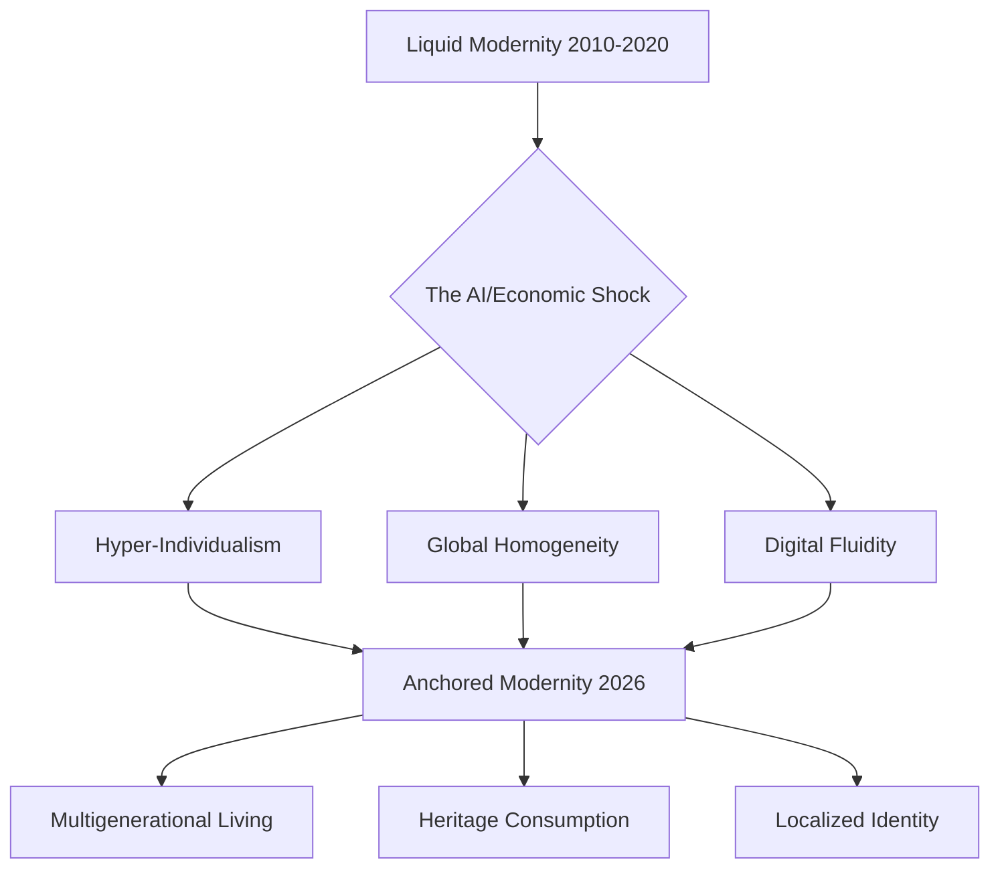

You know, 2026 didn't exactly turn out like those neon-lit, cyberpunk movies we grew up with. Instead, it feels more like a weird collage where the ultra-modern is just smashed together with things from way back in the day. Some experts are calling this **The Great Recalibration**. Basically, the breakneck speed of AI has finally collided with a very basic human need for stability, real touch, and actual truth. For about twenty years, the goal seemed to be "escape velocity"—the idea that success meant leaving your hometown behind to join some borderless, global elite. But by 2026, that tide has completely turned.

We’ve moved away from what some call "Liquid Modernity"—that phase where our identities and careers felt temporary and fluid—and shifted toward **Anchored Modernity**. It's a global pivot. We're moving away from that "everyone looks and acts the same" vibe of the 2010s and trying to find something more rooted and local. It’s not just a nostalgic retreat into the past; it's more of a smart mix: using the tools of the future to protect the values of the past. Whether it's people "flexing" their actual knowledge in meetings or more families living under one roof, life in 2026 is all about finding **Cultural Resonance**. Let's dive into the eight big pillars of how we're working, loving, and just surviving in a world where it's getting harder to tell the difference between what's human and what's synthetic.

---

## 🌍 The Great Re-Anchoring: The Return to Rootedness

  
  
📸 <a href="https://unsplash.com/@jhustin30">Kiel Salazar</a> on <a href="https://unsplash.com/photos/white-and-blue-taxi-cab-doors-are-all-close-gh0lS8C-ck0">Unsplash</a>

For a long time, the story was all about blending in globally. Streaming and social media flattened everything, so a teenager in São Paulo, Seoul, or Stockholm was usually wearing the same clothes and laughing at the same memes. But by 2026, we're seeing a move toward **re-anchoring**. People are finding comfort in tradition and physical roots as a way to stay emotionally sane in an unstable century [Rajiv Gopinath, Medium](https://medium.com/@mail2rajivgopinath/trends-2026-28-33-the-return-of-the-familiar-why-societies-are-re-anchoring-themselves-9fe05bd013f4).

You can see this most clearly in how we live. Between inflation and the housing crisis, money is tight, but there's also a psychological craving for security. In India, **joint-family households have gone up by 18%**, and in the US, about **31% of young adults have moved back home** [Rajiv Gopinath, Medium](https://medium.com/@mail2rajivgopinath/trends-2026-28-33-the-return-of-the-familiar-why-societies-are-re-anchoring-themselves-9fe05bd013f4). This isn't just about saving on rent; it's a survival strategy. The "me first" individualism of the early 2000s is being swapped for an "us again" way of living, where having multiple generations in one house is a primary way people find stability.

We're also seeing the rise of the "Continuity Consumer." People aren't hunting for the "newest" thing anymore; they want the "timeless" thing. This is why we're seeing double-digit growth in ancestral foods—think millets, kefir, and turmeric—and why regional-language content is climbing the streaming charts [Rajiv Gopinath, Medium](https://medium.com/@mail2rajivgopinath/trends-2026-28-33-the-return-of-the-familiar-why-societies-are-re-anchoring-themselves-9fe05bd013f4). Heritage crafts are actually growing faster than fast fashion on platforms like Etsy and Taobao. It's as if the "algorithmic world" made everything feel global, and in response, our brains are making everything local again.

---

## 🤖 The AI Paradox: Integration vs. Institutional Anxiety

In 2026, AI isn't just a "tool" we open in a tab; it's the air we breathe. We now have an **AI-Native Generation**—kids who think it's totally normal to have a humanoid opponent in sports or an AI expert in their classroom. But this has created a weird psychological paradox: the better AI gets, the less we trust the institutions running it.

Research shows that a significant number of people now want strict rules for AI, even if that means the tech takes longer to develop [Rebecca Wear Robinson, LinkedIn](https://www.linkedin.com/posts/rebeccawr_people-loved-the-dot-com-boom-the-ai-boom-activity-7432115387963506688-jUch). There's a real sense of **AI Anxiety**—a fear that we're outsourcing our own agency to chatbots that feel "enshittified." On top of that, we're having a crisis of evidence. Deepfakes are so sophisticated now that we're hitting a "post-truth" wall. In Australia, **89% of people think they can spot an AI deepfake, but when actually tested, only 42% could** [York Park Group, LinkedIn](https://www.linkedin.com/posts/york-park-group_york-park-group-shifting-the-dial-activity-7424334074372186112-79Mc).

Academics have pointed out a massive "trust gap" here. Take the research into "Moltbook"—a social network with zero humans and 2.6 million LLM agents. It found that while AI can mimic the "look" of a society (the posts and the replies), it can't actually build a genuine culture. The agents didn't have "shared memory" or "durable influence," proving that human connection is slow and expensive, and you simply cannot simulate it [arXiv:2602.14299].

> "A.I. doesn't have to change humanity. The tech companies just need to make you think it is succeeding." — *Industry Perspective on AI Marketing* [Rebecca Wear Robinson, LinkedIn](https://www.linkedin.com/posts/rebeccawr_people-loved-the-dot-com-boom-the-ai-boom-activity-7432115387963506688-jUch)

Because of all this, we're seeing the rise of the **Human Premium**. When it costs basically nothing to produce "perfect" AI content, the value of "imperfect" human effort goes through the roof. We're going back to high-cost signals—showing up in person, building a long-term reputation, and sharing physical rituals. It's the only way to prove something is real in a synthetic world.

---

## 💡 The New Status Symbols: "Wisdom Flexing" and Intellectual Signaling

The way we show off status has changed. For years, it was all about conspicuous consumption—the right bag, the latest iPhone, or an exclusive trip. In 2026, we're seeing **Wisdom Flexing**. In a world full of AI-generated "hot takes" and shallow content, showing that you actually have depth and a real command of complex topics has become the ultimate luxury [Weber Shandwick](https://webershandwick.com/news-insights/predicting-the-unpredictable-the-top-10-cultural-trends-and-moments-of-2026).

"Nerding out" isn't a niche hobby anymore; it's social currency. Books have almost become the "new handbag"—physical proof that you have the intellectual stamina to finish something in a world of 15-second clips. This also ties into how we work. We're moving from "doing" to "editing." Since AI can handle the first draft of almost anything, the high-status skill isn't producing anymore—it's the ability to **curate, critique, and refine**. Because so much "craft" has been lost, the ability to build something from scratch (whether it's a chair or a complex piece of code) is now rare and highly prized.

You can think of this shift using a conceptual formula for **Cultural Resonance ($R_c$)**:

$$R_c = \frac{(D \times A)}{V_{alg}}$$

Here's the breakdown:
- $D$ = Depth of knowledge (the "Wisdom Flex")
- $A$ = Authenticity of human experience (the "Analog Anchor")
- $V_{alg}$ = Algorithmic Volatility (all the noise in your feed)

Basically, as the noise ($V_{alg}$) gets louder, the only way to actually be heard or matter is to increase your depth and your authenticity. This is why the "Continuity Consumer" chooses a handmade craft over fast fashion or a long essay over an AI summary. Status isn't about what you own anymore; it's about what you *know* that a machine can't fake.

---

## 📈 Hyper-Fueling and the "New Yuppie" Era

While some people are retreating into old-school wisdom, others are going the opposite way—leaning into a high-octane, stimulant-heavy lifestyle. We're calling this **Energy Overload**. As more people stop drinking for health reasons, the search for a "kick" has moved toward supersized stimulants [Weber Shandwick](https://webershandwick.com/news-insights/predicting-the-unpredictable-the-top-10-cultural-trends-and-moments-of-2026).

"Coffee buckets," "Monster Lattes," and Zyn binges are the new fuel for productivity. It’s paired with an aesthetic that romanticizes '80s banker culture—sharp suits, high stress, and a relentless drive for efficiency. It's a "New Yuppie" era, but instead of spending on luxury, the hedonism is all about **hyper-fueling**. It's a survival mechanism for people trying to stay competitive in an AI-boosted economy.

This really shows the tension in our society: the struggle to keep up when AI is raising the baseline for how productive we "should" be. The pressure to stay relevant has created "Hustle Culture 2.0." The goal isn't just to work hard, but to *look* like you're always performing at 100%. People on Reddit have described this feeling as "burnout with better lighting" [Reddit, r/AskReddit](https://www.reddit.com/r/AskReddit/comments/1sfxn6y/whats_a_trend_in_2026_that_everyone_is_following).

- **What the Hyper-Fueling culture looks like**:
    - Using "nootropics" and brain boosters to try and match AI processing speeds.
    - Moving from "work-life balance" to "work-life integration" (where your home is basically just a satellite office).
    - Treating "the grind" as a core part of your professional identity.
    - Bio-hacking to cut down on sleep and pump up output.

---

## 🎯 Monetized Connection: "Friends for Sale" and the Loneliness Epidemic

One of the sadder trends of 2026 is how we've started commercializing intimacy. Because real, authentic connection has become so rare, we've seen the rise of the **"Friends for Sale"** model. Friendship apps, ticketed singles events, and paid community memberships are booming, and some of these friendship apps are pulling in huge venture capital [Weber Shandwick](https://webershandwick.com/news-insights/predicting-the-unpredictable-the-top-10-cultural-trends-and-moments-of-2026).

This is a direct result of the "loneliness epidemic," which only got worse as we moved toward digital-first interactions. AI companions offer a frictionless version of friendship, but they often act as a **"social solvent"**—they dissolve the need to do the messy, difficult, but rewarding work of building real human relationships. People are paying for the *feeling* of being known because organic communities, like neighborhood associations or local guilds, have mostly crumbled.

> "Coordination isn't free, and the gap between agents that interact and agents that form a collective may be far wider than we assume." — *Reflection on AI Social Dynamics* [LinkedIn, Elvis S.](https://www.linkedin.com/posts/omarsar_too-many-people-working-with-multi-agent-activity-7429532648097820672-L-uN)

This is creating a new kind of social divide: those who can afford "curated" human communities and those who only have AI-simulated friends. We're already seeing a backlash, with people calling out "AI necklaces" and other intimacy-tech for profiting off our isolation. The "Friends for Sale" trend is a sign of a society that optimized for efficiency but forgot how to build a village.

---

## 🚀 The Intersection of Sports and Style: "Serving Looks"

In 2026, the center of fashion and lifestyle influence has moved from the runway to the court. The "Challengers effect" has pushed tennis and other high-performance sports into the spotlight for style [Weber Shandwick](https://webershandwick.com/news-insights/predicting-the-unpredictable-the-top-10-cultural-trends-and-moments-of-2026). For example, the US Open has been generating significantly more online buzz than traditional events like New York Fashion Week.

This is part of a bigger trend: the desire for **functional aesthetics**. When the world feels unstable, we prefer style that suggests action, health, and capability. "Athleisure" has evolved into "Performance Luxury"—clothes that can go from a high-stakes meeting to a high-intensity workout without missing a beat. It's a move away from just looking pretty toward a "readiness" aesthetic.

This "Serving Looks" phenomenon is also about **niche-inspired campaigns**. Brands aren't trying to talk to everyone anymore; they're targeting "obsessions." Whether it's a specific group of pickleball players or urban hikers, they want to speak the specific language of a niche community instead of using polished, generic corporate talk [Weber Shandwick](https://webershandwick.com/news-insights/predicting-the-unpredictable-the-top-10-cultural-trends-and-moments-of-2026).

- **The big shifts in style**:
    - **Court-side > Front row**: Athletes are the new fashion icons.
    - **Function > Ornament**: We want fabrics that actually help us perform.
    - **Hyper-local > Global**: Brand campaigns that feel like they were made for a specific Reddit community.
    - **Found > Designed**: A preference for "low-fi" visuals that feel organic, not staged.

---

## 🗓️ The 2026 Calendar of Chaos: Moments of Global Synchronicity

Even though we're all splitting off into our own private bubbles, 2026 still has a few massive moments that force everyone to look in the same direction. These are the last remaining "shared memories" we have as a global society.

1. **The World Cup**: Hosted by the US, Canada, and Mexico. It's redefining global sports, adding things like "hydration breaks" because of extreme heat and seeing some absolute legends retire [Weber Shandwick](https://webershandwick.com/news-insights/predicting-the-unpredictable-the-top-10-cultural-trends-and-moments-of-2026).
2. **America 250**: The U.S. semi-quincentennial is acting as a cultural reset, sparking intense conversations about identity, legacy, and who actually fits into the American story [Weber Shandwick](https://webershandwick.com/news-insights/predicting-the-unpredictable-the-top-10-cultural-trends-and-moments-of-2026).
3. **The Release of GTA 6**: After a legendary 13-year wait, GTA 6 is expected to create a "Miami Vice" ripple effect through fashion, music, and digital culture. It's effectively the most anticipated entertainment event of the decade [Weber Shandwick](https://webershandwick.com/news-insights/predicting-the-unpredictable-the-top-10-cultural-trends-and-moments-of-2026).
4. **The "Royal" Wedding**: The predicted wedding of Taylor Swift and Travis Kelce is expected to dominate the conversation all summer, setting new trends in everything from décor to fashion [Weber Shandwick](https://webershandwick.com/news-insights/predicting-the-unpredictable-the-top-10-cultural-trends-and-moments-of-2026).

These events give us a rare sense of being in sync. In a year where most of us live in AI-curated bubbles, these are the "cultural glue" that briefly brings everyone together.

---

## 🌑 The Digital Retreat: From the Public Square to Private Enclaves

The last big shift of 2026 is the **Digital Retreat**. The "public square" of early social media—Facebook, X, and the open web—is basically collapsing. This is driven by the **Dead Internet Theory**: the realization that much of public content is now AI-generated, creating a loop of synthetic noise.

Because of this, people are moving toward "dark social"—private chats, encrypted groups, and niche communities. We've gone from *broadcasting* to *narrowcasting*. People don't want to be "seen" by the whole world anymore; they want to be "known" by a few. This is accelerated by **Algorithmic Homophily**, where AI pushes us into hyper-niche bubbles, making the "outside world" feel alien and hostile.

The result is a society of "digital tribes," where trust is reserved for those inside an encrypted circle. It's a retreat from public expression in favor of private, high-trust spaces.

- **The New Digital Hierarchy**:
    - **Tier 1 (The Noise)**: Public social media (mostly AI bots and ads).
    - **Tier 2 (The Enclave)**: Discord servers, WhatsApp groups, and private Substacks.
    - **Tier 3 (The Sanctuary)**: Analog-only spaces, phone-free zones, and physical community guilds.

This move toward "local-first" software and owning your own data is all about reclaiming identity from the cloud giants. Digital life in 2026 isn't about more connection; it's about *better* boundaries.

---

## Conclusion: The Human Premium

When you look at everything happening in 2026, a clear pattern pops up: the more the world is flooded with synthetic stuff, the more we value what's authentic. We've entered the era of the **Human Premium**. Whether it's moving back in with family, "wisdom flexing" at work, or hiding away in private human-only groups, the goal is the same: figuring out how to be human in a world that's obsessed with efficiency.

The "Great Recalibration" isn't about rejecting progress. It's just the realization that progress without roots is just accelerating toward a void. In 2026, the most successful people, brands, and communities won't be the ones with the fastest AI—they'll be the ones who provide a real sense of belonging, a reliable truth, and a connection that lasts. In a world of infinite simulations, the only thing that stays truly scarce—and therefore truly valuable—is the unsimulated human experience.