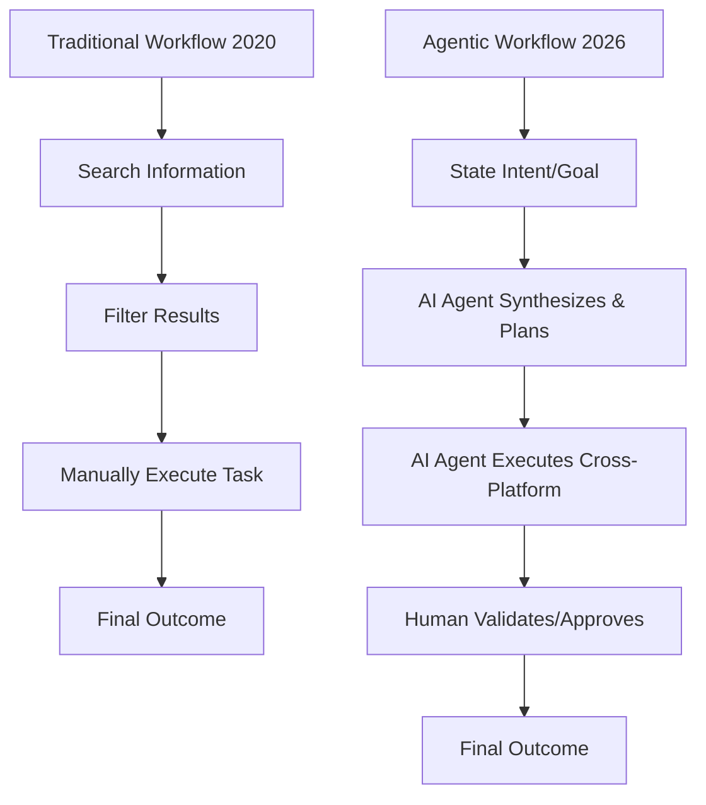

2026 isn't going to arrive with a huge bang. Instead, it'll feel more like a few different trends that have been building up for years finally sliding into place. For most of us waking up in 2026, the world will probably feel smaller and more fragmented all at once. We’re moving into what some call the "Great Integration," where the line between our digital screens and the real world is almost gone. The smartphone isn't the center of everything anymore; we've shifted toward "ambient intelligence." AI agents don't just answer questions now—they actually anticipate what we need, handle our calendars, and take care of the boring, repetitive parts of life.

But while everything feels seamless and efficient, there's a real tug-of-war happening under the surface. As we let silicon chips handle the thinking for us, a lot of us are swinging back toward things we can actually touch—the local, the slow, and the physical. You see it in the "15-minute cities" popping up in Europe and the way Gen Alpha views social norms. 2026 is a world of contradictions: we're hyper-personalized but often lonely, globally connected but fiercely protective of our local spots. We're living in a "digital panopticon" where we're always watched, yet people are fighting harder than ever for "analog zones" where they can totally unplug. Let's look at the eight pillars of daily life in 2026 and see how we're actually working, loving, healing, and surviving in a world that's stopped asking *if* AI will change things and started asking *how* we deal with the change.

---

## 🤖 The AI-Agent Epoch: From Search to Synthesis

  
  
📸 <a href="https://unsplash.com/@jhustin30">Kiel Salazar</a> on <a href="https://unsplash.com/photos/white-and-blue-taxi-cab-doors-are-all-close-gh0lS8C-ck0">Unsplash</a>

By 2026, "Googling" something is starting to feel like a throwback to the early 2020s. We've moved past simple search engines and into the era of the **AI Agent**. These aren't just chatbots like the early GPT models; they're autonomous tools that can actually *do* things across different apps. Over on [r/Futurology](https://www.reddit.com/r/Futurology/comments/1pi9nqd/make_some_2026_predictions_rate_who_did_best_in/), users are predicting that AI will move from "demonstration toward practicality," basically becoming an invisible layer in every app we touch. Your agent won't just tell you there's a flight to Tokyo; it’ll check your budget, remember you hate middle seats, scan your calendar for conflicts, and give you a final itinerary that only needs a "yes" or "no."

The downside? There's a psychological cost. As we let AI do the heavy lifting, we're seeing something called **"semantic atrophy."** When AI writes our emails, handles the apologies to our partners, and summarizes complex ideas, the nuance of how humans actually talk to each other starts to fade. We're trading the "friction" of communication—the messy parts where we actually grow and connect—for a streamlined, optimized version of a relationship.

> "The AI bubble popping will end some big US firms, but won't slow global adoption of open-source AI, especially by China." — Perspective from [u/lughnasadh](https://www.reddit.com/user/lughnasadh/) on [r/Futurology](https://www.reddit.com/r/Futurology/comments/1pi9nqd/make_some_2026_predictions_rate_who_did_best_in/).

Here is how the daily grind has shifted from manual searching to autonomous execution:

---

## 🌐 Asynchronous Living: The End of the 9-to-5

"Remote work" has turned into something a bit more radical: **Asynchronous Culture**. By 2026, the big fights over "Return to Office" (RTO) mandates have mostly settled into a permanent hybrid mix. But the real change is that work is no longer tied to a specific time. We don't really "log in" at 9 AM anymore; we just contribute to a constant stream of progress. This has created a new global middle class of **transnational professionals** who work across time zones without needing to be in a meeting at the same time.

This is basically "un-tethering" our professional identities from a specific place. When your team is a dev in Lagos, a designer in Seoul, and a PM in Buenos Aires, the "watercooler" is just a digital archive of updates. Because of this, **digital nomad visas** are booming as countries compete for high-value remote workers who spend foreign money without taking local jobs. We're also seeing the "zoom town" effect speed up, with small rural villages seeing increased property values as office workers ditch the big cities.

- **The "Async" Toolkit**: Work in 2026 relies on video memos (instead of meetings) and AI-summarized threads.
- **Time-Zone Arbitrage**: People are strategically shifting their hours to get more "Deep Work" done, often working in intense bursts rather than a steady 8-hour block.
- **The Professional Void**: A growing feeling of being alone as the "social glue" of the office is replaced by transactional digital pings.

As this becomes the norm, the way we connect at work looks more like this:
$$\text{Professional Connection} = \frac{\text{Shared Goal} \times \text{Async Transparency}}{\text{Geographic Distance}}$$

---

## 🌍 The Walkable Renaissance: 15-Minute Cities and Social Cohesion

While our jobs have gone global, our actual lives are becoming very local. The **"15-minute city"**—the idea that everything you need should be within a 15-minute walk or bike ride—has gone from a nice theory to a reality in dozens of cities [Wikipedia](https://en.wikipedia.org/wiki/15-minute_city). Urbanists like [Carlos Moreno](https://en.wikipedia.org/wiki/Carlos_Moreno_(urbanist)) have pushed this to cut down on cars and make city life better.

This isn't just about the environment; it's about how we feel. By getting rid of the commute, people are finding "Third Places" again—cafes, libraries, and plazas where you just bump into people. It's a direct response to how lonely people felt in the early 2020s. But it's not all smooth sailing. As [Wikipedia's entry on Climate Lockdowns](https://en.wikipedia.org/wiki/Climate_lockdown) points out, the 15-minute city has become a target for conspiracy theories, with some people fearing it's actually about surveillance and restricting where they can go.

> "The car was a tool of isolation. By removing it, we aren't just reducing CO2; we are rebuilding the social muscle of the neighborhood." — Observed trend in sustainable urbanism discussions.

- **Hyper-Localization**: More neighborhoods are starting their own local currencies and "tool libraries" to stop buying so much stuff.
- **The Pedestrian Shift**: We're seeing more "weak tie" social interactions (the casual "hello" to a neighbor), which is huge for mental health.
- **Urban Stratification**: The risk of "green gentrification," where these walkable areas get so expensive that working-class people are pushed into "car-dependent deserts."

---

## 🎓 The Gen Alpha Paradigm: The AI-Native Generation

By 2026, the first wave of **Generation Alpha** (born 2010-2024) is hitting their early teens. Gen Z had to learn to use AI, but Gen Alpha is **AI-native**. For them, the idea of starting with a "blank page" is almost foreign; they've always had AI to give them a starting point for school or art. This is totally changing how they learn.

Education is moving away from memorizing facts—which is kind of pointless now—and toward **prompt engineering and critical synthesis**. In these classrooms, "being smart" isn't about *having* the knowledge, but about knowing how to *find and verify* it in a sea of AI content. This has basically led to the "Death of the Essay." Teachers now prefer oral exams and grading the *process*—looking at how the student directed the AI rather than just the final paper.

- **Gamified Reality**: Gen Alpha sees the world as immersive. Shopping is now "phygital," with AR overlays giving them real-time social validation for things they want to buy.
- **Algorithmic Taste**: Their tastes are shaped by hyper-personalized feeds, creating tiny "micro-cultures" and basically killing the idea of one big "global culture."
- **Virtual Identity**: Their avatars are becoming as important as their physical selves, with social status often tied to digital assets.

As [u/Silly-Low6019](https://www.reddit.com/user/Silly-Low6019/) mentioned on [r/Futurology](https://www.reddit.com/r/Futurology/comments/1pi9nqd/make_some_2026_predictions_rate_who_did_best_in/), there's a prediction that "AI teachers" will replace those who just read from a manual, changing the teacher's role from the "source of truth" to a "mentor of inquiry."

---

## 🔬 Proactive Wellness: The Wearable Revolution

Health in 2026 has shifted from **reactive** (going to the doctor because you're sick) to **proactive** (constantly optimizing). This is all thanks to the "Wearable Revolution." Things like continuous glucose monitors (CGMs), biometric rings, and smart fabrics are now just standard gadgets.

We've entered the age of **"Algorithmic Governance"** of our own bodies. Wellness isn't a feeling anymore; it's a score. AI agents look at your sleep, blood sugar, and heart rate variability (HRV) to tell you exactly what to eat or how to work out that day. Instead of saying "I feel tired," the conversation is now "My cortisol is spiked and my REM sleep was 15% low; I need a recovery day."

> "US obesity rates will show significant measurable decline as weight loss drug use spreads." — Prediction by [deleted user](https://www.reddit.com/r/Futurology/comments/1pi9nqd/comment/nt5xeru/) on [r/Futurology](https://www.reddit.com/r/Futurology/comments/1pi9nqd/make_some_2026_predictions_rate_who_did_best_in/).

- **Precision Health**: Generic GLP-1 drugs are making weight loss and metabolic health much more accessible to everyone.
- **Health Orthorexia**: A new kind of anxiety where people get so obsessed with their biometric data that they forget how to actually *feel* well.
- **The Bio-Divide**: A growing gap between people who can afford high-end longevity clinics and CRISPR-lite therapies, and those relying on a struggling traditional healthcare system.

The irony of 2026 is that while we have more data on our bodies than ever, we're struggling to listen to the actual, non-digital signals our bodies are sending us.

---

## 🏆 Culture in the Age of the Global Event: The 2026 World Cup

Culture in 2026 is defined by massive, synchronized global events that act as "cultural catalysts." The **2026 FIFA World Cup**, hosted by Canada, Mexico, and the USA, is a perfect example. This tournament is basically a showcase for "Seamless Travel": AI-driven visas, holographic translation for fans, and a big push for sustainable high-speed trains.

As people discussed on [r/Futurology](https://www.reddit.com/r/Futurology/comments/1pi9nqd/make_some_2026_predictions_rate_who_did_best_in/), these events are some of the last places where "monoculture" still exists. In a world of algorithmic niches, the World Cup is a rare moment where everyone is watching the same thing. It's also blending local and global vibes—the highly commercial "North American" style is clashing and mixing with the traditional football cultures of Europe and South America.

- **Hyper-Tourism**: We're seeing "event-based migration," where people move to host cities for months using their "Async" work setups.
- **Digital Twins**: Fans who can't travel use VR "Digital Twins" of stadiums to watch the game in real-time with friends globally.
- **Real-time Translation**: AI is removing language barriers, making cross-cultural interactions more spontaneous and deep.

This event is a real-world test for the "Global Village" concept described in [Wikipedia's Globalization entry](https://en.wikipedia.org/wiki/Globalization), proving that even if we're digitally divided, we still want that visceral, physical experience of being together.

---

## 🌿 The Slow Living Counter-Culture: The Analog Rebellion

As a reaction to the hyper-optimization of AI and the obsession with the "Quantified Self," 2026 has seen a huge rise in the **Slow Living counter-culture**. This isn't just a hobby—for many, it's a survival strategy. There are more "Digital Detox" communities and "Analog Zones" where signals are jammed and screens aren't allowed.

This rebellion comes from the **"Dead Internet Theory"**—the idea that the web is now mostly AI content made for other AIs. This has created a huge "trust deficit." The answer? A return to **tactile kinship**: vinyl records, film photography, hand-written letters, and community gardens.

> "The more my life is optimized by an agent, the more I crave the inefficiency of a real conversation, a messy kitchen, and a book made of paper." — User sentiment from [r/Futurology](https://www.reddit.com/r/Futurology/comments/1pi9nqd/make_some_2026_predictions_rate_who_did_best_in/).

- **The "Dumbphone" Trend**: A lot of Gen Z and Alpha are switching back to basic phones to escape the "algorithmic loop."
- **Micro-Communities**: We're moving from "followers" to "circles"—small, gated groups based on trust rather than broad interests.
- **Slow Food 2.0**: People are ditching delivery apps and going back to ancestral cooking and buying from local farmers.

This is the "human" side fighting back against the "synthetic," creating a divide between people who love the AI-overlay and those who just want something "real."

---

## ⚖️ The Identity Paradox: Global Digital vs. Local Heritage

The final piece of 2026 is the **Identity Paradox**. We're experiencing a weird expansion and contraction of who we are. On one side, there's the **Global Digital Identity**: a curated, AI-enhanced persona that lets us belong to global tribes regardless of where we actually live.

On the other side, there's a fierce **resurgence of local heritage**. As the world feels more the same due to globalization, people are clinging tighter to their specific languages, religions, and ethnic roots. This is the "tension of the global village" mentioned in [Wikipedia](https://en.wikipedia.org/wiki/Globalization). You see it in "hyper-local" movements, like neighborhood currencies and apps designed to save local languages.

The struggle looks like a balance of these forces:
$$\text{Total Identity} = \int (\text{Global Digital Influence} + \text{Local Heritage Roots}) \, dt$$

- **Cultural Hybridity**: The rise of "glocal" products—using global tech to amplify local traditions.
- **The Authenticity Crisis**: Since AI can generate almost anything, "authenticity" is now the most valuable currency. "Human-made" work now costs a premium.
- **Digital Sovereignty**: Movements to create "national clouds" or "cultural firewalls" to keep local identities from being washed away by global AI models.

This paradox creates a new kind of social split. You have the "Cloud Citizens" who are fully integrated into the digital layer, and those who choose to stay anchored in the physical, local world. The tension between these two groups is what defines the politics and society of 2026.

---

## Conclusion: The Human Element in a Synthetic Age

Looking at 2026, it's clear we haven't been replaced by our tools, but we've definitely been reshaped by them. Life in 2026 is a balancing act. We use AI agents to clear the friction out of our lives so that, in theory, we have more time for the things that actually make us human: art, community, nature, and deep connection.

But there's still a risk. In our rush to optimize everything, we might accidentally optimize away the struggles that give life meaning. The "semantic atrophy" of our talking, the constant surveillance of our health, and the distance of our work are all trade-offs. The people who thrive in 2026 aren't the ones most integrated with the tech, but the ones who know exactly when to turn it off.

In the end, the culture of 2026 isn't defined by the AI we built, but by the human needs that AI just can't satisfy. Whether it's the roar of the crowd at the World Cup, the quiet of a 15-minute city plaza, or the crackle of a vinyl record, the "Human Element" is the only thing that can't be synthesized. As we move forward, the goal isn't to fight the future, but to make sure that in a world of perfect algorithms, we still leave room for the beautiful, messy, and unpredictable experience of being human.