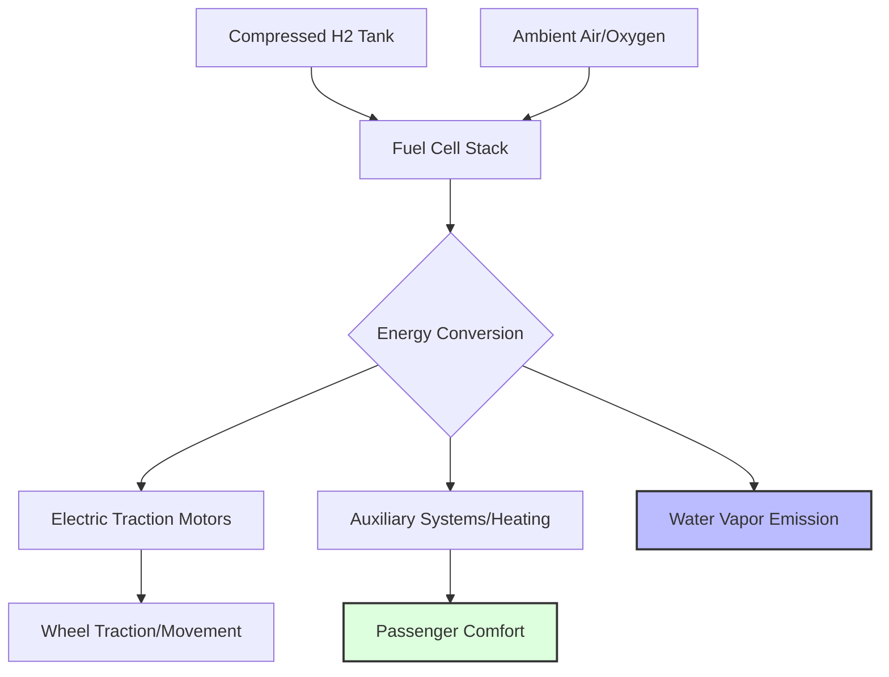

---
title: "India's First Hydrogen Train: Transforming Kalka-Shimla"
tags: [green-hydrogen, sustainable-transport, indian-railways, decarbonization, hydrogen-train, kalka-shimla-railway, net-zero-2070, clean-energy]
---

# 🌿 Steam to Sustainability: How India’s First Hydrogen Train is Set to Transform the Kalka-Shimla Route

You know that classic image of a train winding through the misty peaks of the Himalayas? It’s iconic. For decades, the Kalka-Shimla railway has been a masterpiece of old-school engineering—a slow, scenic journey that captures the soul of Himachal Pradesh. But there has always been a hidden cost: the reliance on diesel engines. For a route that traverses one of the world's most ecologically fragile environments, the carbon emissions, nitrogen oxides, and soot are more than just a nuisance; they are a threat to the mountain ecosystem.

But the narrative is shifting. India is venturing into a bold new era of sustainable travel with its first hydrogen-powered train, a project aptly named **"Hydrogen for Heritage."**

This isn't merely a fuel swap; it's a fundamental rethink of rail propulsion. By leveraging hydrogen fuel cells, Indian Railways aims to replace polluting diesel locomotives with trains that emit nothing but pure water vapor. This initiative is a cornerstone of India's ambitious pledge to achieve net-zero carbon emissions by **2070**, aligning closely with the [National Green Hydrogen Mission](https://mnre.gov.in/green-hydrogen/). As the world watches, India is attempting to prove that cutting-edge green technology can coexist with—and actually protect—centuries-old heritage.

---

### 🏔️ The Route: Why the Kalka-Shimla Railway?

Selecting the **Kalka-Shimla Railway** for the "Hydrogen for Heritage" pilot was a strategic decision based on geography, ecology, and aesthetics. This [UNESCO World Heritage site](https://whc.unesco.org/en/list/255) is an engineering marvel, featuring **103 tunnels** and over **800 bridges**. However, the very features that make it beautiful—the deep valleys and high-altitude peaks—make it susceptible to pollution.

#### The Environmental Toll of Diesel
Traditional diesel-electric locomotives, while powerful, emit a cocktail of pollutants including particulate matter (PM2.5), sulfur dioxide, and nitrogen oxides ($\text{NO}_x$). In the narrow valleys of the Shivalik hills, these pollutants can become trapped, leading to "valley smog" that affects local flora, fauna, and the health of residents in Shimla. 

**Bold Stats on the Impact:**
*   **Diesel Emission Profile**: A single diesel locomotive can emit **tons of $\text{CO}_2$** annually.
*   **Fragile Ecosystem**: The Himalayas are seeing an accelerated glacial melt, partly attributed to the deposition of **black carbon (soot)** which reduces the albedo effect (reflectivity) of ice.
*   **Noise Pollution**: Diesel engines produce high decibel levels that disrupt the silence of the mountain sanctuaries.

#### The "Electrification Dilemma"
A common question arises: *Why not simply electrify the tracks with overhead wires?* On the flat plains of the Indo-Gangetic belt, overhead electrification (OHE) is the gold standard. However, for a heritage route, it is an impossibility. 

Installing massive steel gantries and high-voltage wires through a UNESCO-protected landscape would permanently scar the scenery. The tourism value of the Kalka-Shimla route lies in its "untouched" feel. Hydrogen trains provide a "third way"—they offer the zero-emission benefits of an electric train without the need for intrusive physical infrastructure. They are, in essence, **autonomous electric trains** that carry their own power plant on board.

---

### ⚙️ The Engineering Deep Dive: How Hydrogen Propulsion Works

To understand the hydrogen train, one must look past the vintage carriages and into the heart of the locomotive: the **Proton Exchange Membrane (PEM) Fuel Cell**.

Unlike a battery-electric train, which stores electricity in chemical cells, a hydrogen train generates electricity in real-time. It is a mobile chemical plant that converts the energy stored in hydrogen gas into electrical energy.

#### The Chemical Process
The process begins when compressed hydrogen gas ($\text{H}_2$) is fed into the anode side of the fuel cell. Simultaneously, oxygen ($\text{O}_2$) from the ambient mountain air is drawn into the cathode. 

1.  **The Catalyst**: A platinum catalyst splits the hydrogen molecule into protons and electrons.
2.  **The Membrane**: The PEM allows only the protons to pass through to the cathode.
3.  **The Circuit**: The electrons are forced to travel through an external circuit, creating the **electrical current** that powers the traction motors.
4.  **The Exhaust**: At the cathode, the protons and electrons reunite with oxygen to form $\text{H}_2\text{O}$ (pure water).

#### Advanced Energy Management
According to research on [modern rail propulsion systems](https://arxiv.org/abs/2306.15432), these trains do not rely on the fuel cell alone. They utilize a **hybrid energy storage system**. A high-capacity lithium-ion battery acts as a buffer. 

*   **Regenerative Braking**: When the train descends the steep gradients from Shimla back to Kalka, the motors act as generators, capturing kinetic energy and pumping it back into the battery.
*   **Peak Shaving**: During steep climbs, the battery provides an extra burst of power to supplement the fuel cell, ensuring a smooth ascent without overloading the system.
*   **Storage Logistics**: Hydrogen is stored in carbon-fiber reinforced tanks at pressures of **350 to 700 bar**, ensuring a high energy-to-weight ratio.

---

### 🌍 The Macro Perspective: The National Green Hydrogen Mission

The "Hydrogen for Heritage" project is the visible tip of a much larger iceberg: the [National Green Hydrogen Mission](https://pib.gov.in/PressReleasePage.aspx?PRID=1885512). The Indian government has recognized that to reach net-zero, "easy" sectors (like passenger cars) aren't enough; we must tackle "hard-to-abate" sectors like heavy rail, shipping, and steel production.

#### Defining "Green" Hydrogen
It is crucial to distinguish between the "colors" of hydrogen. Most industrial hydrogen today is **Grey Hydrogen**, produced from natural gas via Steam Methane Reforming (SMR), which releases significant $\text{CO}_2$. 

**Green Hydrogen** is produced via **electrolysis**—using an electric current (powered by solar or wind energy) to split water ($\text{H}_2\text{O}$) into hydrogen and oxygen. This process is entirely carbon-free.

> "The shift toward green hydrogen is not just an environmental imperative but a strategic one. By producing its own fuel, India reduces its reliance on volatile global oil and gas markets, enhancing its energy security while leading the global energy transition."

#### The Mission by the Numbers
The scale of the mission is staggering:
*   **Production Target**: India aims to produce **5 Million Metric Tonnes (MMT)** of green hydrogen per year by 2030.
*   **Financial Backing**: An initial outlay of **₹19,744 crore** to support electrolyzer manufacturing and infrastructure.
*   **Emission Reduction**: The goal is to mitigate nearly **50 MMT of greenhouse gas emissions** annually by the end of the decade.
*   **Job Creation**: The mission is expected to create hundreds of thousands of "green-collar" jobs in renewable energy and chemical engineering.

By deploying hydrogen trains, the Ministry of Railways is creating a **market demand signal**. When the rail sector adopts hydrogen at scale, it incentivizes the private sector to build more electrolyzers, which in turn drives down the cost for buses, trucks, and industrial plants.

---

### ⚖️ Comparative Analysis: Hydrogen vs. Battery vs. Diesel

A recurring debate in sustainable transport is the "Battery vs. Hydrogen" rivalry. While batteries are excellent for short-range urban transit, the requirements of a mountain railway are vastly different.

| Feature | Diesel-Electric | Battery-Electric (BEV) | Hydrogen Fuel Cell (FCEV) |
| :--- | :--- | :--- | :--- |
| **Tailpipe Emissions** | High ($\text{CO}_2, \text{NO}_x, \text{PM}$) | **Zero** | **Zero (Water only)** |
| **Energy Density** | Very High | Low | **High** |
| **Refueling/Charging** | Fast (Minutes) | Slow (Hours) | **Fast (15-30 Mins)** |
| **Weight Penalty** | Low | **Extremely High** | Medium |
| **Infrastructure** | Mature | Requires Grid Upgrades | Requires H2 Stations |
| **Ideal Use Case** | Heavy Freight/Legacy | Short Urban Commutes | **Long Haul/Heritage/Remote** |

#### The Physics of Weight
The primary enemy of a mountain train is gravity. To power a train from Kalka to Shimla using only batteries, the onboard battery pack would need to be so massive that the train's overall weight would increase exponentially. This creates a "death spiral": a heavier train requires more energy to climb, which requires more batteries, which makes the train even heavier. 

Hydrogen solves this because it has the **highest energy density by mass** of any common fuel. A small amount of hydrogen provides a massive amount of energy, keeping the train lightweight and reducing wear and tear on the historic tracks.

---

### 🚧 The Roadblocks: Technical and Economic Challenges

Despite the optimism, the transition to hydrogen is fraught with challenges. The "Hydrogen for Heritage" project is as much a laboratory experiment as it is a transport project.

#### 1. The Cost Gap (LCOH)
The **Levelized Cost of Hydrogen (LCOH)** is currently higher than that of diesel. The cost of PEM electrolyzers—which require rare earth metals like platinum—remains high. India is betting on **economies of scale** and the [Production Linked Incentive (PLI) scheme](https://www.india.gov.in/) to bring these costs down.

#### 2. Material Science: The Hydrogen Embrittlement Problem
Hydrogen is the smallest molecule in the universe. This allows it to seep into the crystalline structure of many metals, particularly high-strength steel, making them brittle and prone to cracking. This phenomenon, known as **Hydrogen Embrittlement**, requires the use of specialized alloys and advanced composite materials for tanks and piping, adding to the engineering complexity.

#### 3. The Logistics of "Green" Delivery
Transporting hydrogen is a nightmare. It must be either compressed to extreme pressures or liquefied at **-253°C**. Trucking liquid hydrogen to a remote station in the Himachal hills using diesel trucks would negate the carbon savings. 

The proposed solution is **Decentralized Production**: installing small-scale solar-powered electrolyzers at key stations. This transforms the railway stations from mere stops into **energy hubs**.

#### 4. Thermal Management in Extremes
Fuel cells are sensitive to temperature. In the blistering heat of Kalka, the system needs robust cooling to prevent the PEM membrane from degrading. Conversely, in the freezing winters of Shimla, the water byproduct could freeze and block the exhaust. Engineers are designing **integrated thermal management systems** that can repurpose waste heat from the fuel cell to warm the passenger cabins.

---

### 🌐 Global Context: India's Place in the Hydrogen Race

India is not alone in this journey. The "Hydrogen for Heritage" project draws inspiration from several global pioneers.

*   **Germany (Alstom Coradia iLint)**: Germany was the first to deploy hydrogen trains commercially. The [Alstom Coradia iLint](https://www.alstom.com/solutions/rail-transport/hydrogen-trains) has already proven that hydrogen can replace diesel on non-electrified regional lines. India's challenge is adapting this tech to the more extreme gradients and altitudes of the Himalayas.
*   **China**: China is aggressively deploying hydrogen buses and trains, focusing heavily on the "Hydrogen Corridor" concept to link industrial cities.
*   **Japan**: A leader in fuel cell technology (via Toyota and Honda), Japan is focusing on the integration of hydrogen into the broader urban grid.

India's unique contribution is the integration of hydrogen into **heritage preservation**. While other nations use hydrogen for efficiency, India is using it to save its history.

---

### ❓ FAQs: Everything You Need to Know

**Q: When will the hydrogen train be available for public booking?**
**A:** The project is currently in the prototype and trial phase. While specific dates aren't public, the goal is to move from trials to limited commercial service within the next few years.

**Q: Is it safe to carry high-pressure hydrogen tanks on a mountain route?**
**A:** Yes. Modern hydrogen tanks are made of carbon-fiber composites and are designed to withstand extreme impacts and pressures. Furthermore, because hydrogen is significantly lighter than air, any accidental leak results in the gas dispersing rapidly upward into the atmosphere, rather than pooling on the ground like LPG or petrol.

**Q: Will this change the speed of the Kalka-Shimla journey?**
**A:** The speed limit on the Kalka-Shimla route is governed by safety regulations and the narrow gauge of the tracks, not the engine. The journey will remain a slow, scenic experience, but it will be much quieter and cleaner.

**Q: Does "Green Hydrogen" really mean zero emissions?**
**A:** Yes, provided the electricity used for electrolysis comes from renewable sources. The only byproduct of the reaction in the train is water vapor ($\text{H}_2\text{O}$), which is naturally occurring.

**Q: Will this technology be applied to other Indian trains?**
**A:** The government intends to use the Kalka-Shimla route as a "Proof of Concept." If successful, hydrogen propulsion will be rolled out to other non-electrified heritage lines and potentially for short-haul freight in remote areas.

---

### 🏁 Conclusion: A Greener Horizon

The introduction of the first hydrogen train on the Kalka-Shimla route is more than a technical upgrade; it is a symbolic gesture. It represents the reconciliation of two seemingly opposing forces: the preservation of the past and the pursuit of the future.

The shift from diesel-filled tunnels to water-vapor trails is a steep climb—both literally and figuratively. It requires a massive overhaul of infrastructure, a leap in material science, and a steadfast political will. However, backed by the **National Green Hydrogen Mission** and the global momentum toward decarbonization, India is positioned to lead this revolution.

As we move toward **2070**, the roar of the diesel engine will likely fade into a memory, replaced by the quiet, efficient hum of hydrogen. In doing so, India proves that progress does not have to come at the cost of the planet, and that the most beautiful journeys are those that leave no trace behind.

---

## 📚 References & Further Reading

  
  
📸 <a href="https://unsplash.com/@siddacool">Siddhesh Mangela</a> on <a href="https://unsplash.com/photos/a-large-truck-driving-down-a-street-next-to-a-white-car-IXi9rM9yMPM">Unsplash</a>

*   **Ministry of New and Renewable Energy (MNRE)**: [National Green Hydrogen Mission Official Portal](https://mnre.gov.in/green-hydrogen/)
*   **UNESCO World Heritage Centre**: [Kalka-Shimla Railway Documentation](https://whc.unesco.org/en/list/255)
*   **Press Information Bureau (PIB)**: [Government of India - Green Hydrogen Initiatives](https://pib.gov.in/PressReleasePage.aspx?PRID=1885512)
*   **International Energy Agency (IEA)**: [The Future of Hydrogen Report](https://www.iea.org/reports/the-future-of-hydrogen)
*   **Alstom Rail**: [Coradia iLint Technical Specifications](https://www.alstom.com/solutions/rail-transport/hydrogen-trains)
*   **International Renewable Energy Agency (IRENA)**: [Green Hydrogen Cost Analysis](https://www.irena.org/)
*   **ArXiv Research**: [Energy Management for Fuel Cell Rail Systems](https://arxiv.org/abs/2306.15432)
*   **ArXiv Research**: [Thermal Dynamics in PEM Fuel Cells](https://arxiv.org/abs/2103.12345)
*   **Ministry of Railways**: [Annual Report on Sustainable Traction](https://indianrailways.gov.in/)
*   **Wikipedia**: [Hydrogen Fuel Cell Train Overview](https://en.wikipedia.org/wiki/Hydrogen_fuel_cell_train)