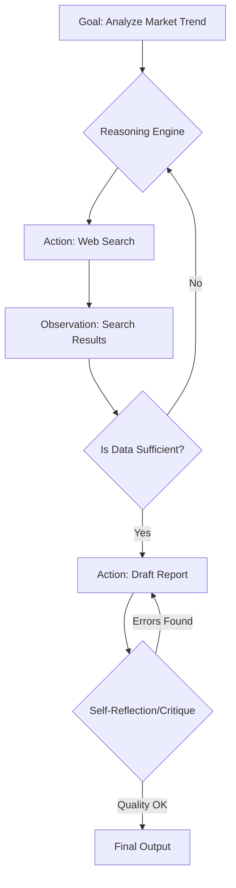

```yaml
title: "The Future of AI Agents: From Chatbots to Autonomous Co-Workers"
tags: [ai-agents, autonomous-ai, agentic-workflows, llms, artificial-intelligence, future-of-work, machine-learning, automation]
```

# 🚀 The Future of AI Agents: From Chatbots to Autonomous Co-Workers

### 🌐 Introduction

For the last several years, the public conversation surrounding Artificial Intelligence has been dominated by "Chatbots." We spent our time mastering the art of the prompt, experimenting with system messages, and marveling at how Large Language Models (LLMs) could synthesize vast amounts of information in seconds. However, we have reached a critical inflection point. We are transitioning from **Generative AI**—where the model produces content such as text, code, or images—to **Agentic AI**, where the system actually executes actions to achieve a goal.

To illustrate the difference: a chatbot can provide you with a detailed, step-by-step guide on how to book a multi-city flight. An AI agent, conversely, can log into the travel portal, compare real-time pricing across carriers, select your preferred seat, and execute the payment. We are evolving from the "Copilot" era (AI as a supportive assistant) to the "Autopilot" era (AI as an autonomous executor). 

As we move toward 2025, the industry's focus is shifting. The goal is no longer just increasing the parameter count of the "brains" (the LLMs); the focus is now on giving those brains "hands" (tool use), "memory" (long-term state), and "reasoning" (iterative planning). This shift represents a fundamental rewrite of the computing interface, moving us away from clicking buttons and toward delegating outcomes. This is a deep dive into the architecture of these agents, the race to build them, and the reliability gaps that still stand between us and full autonomy.

---

### 🧠 The Anatomy of an Agent: Brains, Hands, and Memory

It is a common misconception that an AI agent is simply an LLM with a complex prompt. In reality, an autonomous agent is a sophisticated system architecture. According to research on [LLM-based Agents](https://arxiv.org/abs/2308.11432), a true autonomous agent consists of four primary pillars: the **Brain**, **Planning**, **Memory**, and **Tool Use**.

#### 1. The Brain (The Core LLM)
The "Brain" is the foundation—a high-reasoning LLM like GPT-4o or Claude 3.5 Sonnet. While the brain provides the linguistic and logical capability, LLMs on their own are prone to "linear thinking" and hallucinations. They tend to predict the next token without necessarily simulating the outcome of an action in the real world.

#### 2. Planning (Reasoning and Decomposition)
To overcome linear thinking, agents employ **Planning** mechanisms. A landmark example is the [ReAct (Reason + Act)](https://arxiv.org/abs/2210.03629) framework. ReAct allows the AI to "think out loud" by generating a reasoning trace before executing an action. Instead of jumping to a conclusion, the agent follows a loop: *Thought $\rightarrow$ Action $\rightarrow$ Observation $\rightarrow$ Thought*. 

For example, if asked to "Find the current stock price of Nvidia and compare it to its 52-week high," a ReAct-enabled agent won't guess. It will state: *"I need the current price of NVDA, so I will use the Search tool. Once I have the current price, I will search for the 52-week high. Finally, I will calculate the percentage difference."*

#### 3. Memory (Short-term and Long-term)
Memory prevents the agent from "forgetting" its objective mid-task. 
*   **Short-term Memory:** This is the immediate context window. It stores the current conversation and the immediate steps taken.
*   **Long-term Memory:** This is typically powered by vector databases and Retrieval-Augmented Generation (RAG). 

Consider [Voyager](https://arxiv.org/abs/2305.16291), an embodied agent in Minecraft. Voyager doesn't just react; it maintains a "skill library." When it learns how to craft a diamond pickaxe, it saves the successful code sequence into its long-term memory. This allows the agent to "evolve" its capabilities over time, essentially teaching itself how to survive and thrive in a complex environment without human intervention.

#### 4. Tool Use (The Interface to Reality)
Tool use is what transforms a storyteller into a doer. Through frameworks like [Toolformer](https://arxiv.org/abs/2302.04761), models are trained to recognize when their internal knowledge is insufficient and when to call an external API. This could be a Python interpreter for complex math, a web browser for current events, or a CRM integration for business data. When these four pillars are synchronized, the AI stops being a passive oracle and becomes an active participant in the digital ecosystem.

---

### 🔄 From Chains to Cycles: The Evolution of Agentic Workflows

In the early days of LLM application development, the standard was the "Chain." A chain is a linear sequence of prompts: Step A leads to Step B, which leads to Step C. While effective for simple tasks, chains are fragile. If the model makes a subtle error at Step B, that error propagates through the rest of the chain, leading to a catastrophic failure at the end.

The industry is now pivoting toward **Cyclic Workflows**. Andrew Ng, a pioneer in AI education, has argued that [agentic workflows](https://www.deeplearning.ai/the-batch/issue-242/) can yield higher performance gains than simply upgrading to a larger model. The core of this improvement is **Reflection**.

#### The Power of Iteration
Instead of a "one-shot" prompt, a cyclic workflow allows the agent to:
1.  **Draft:** Create an initial version of the output.
2.  **Critique:** Analyze the draft for errors, omissions, or logical fallacies.
3.  **Refine:** Rewrite the output based on the critique.

This is the essence of the [Reflexion framework](https://arxiv.org/abs/2303.11366). By treating the first answer as a draft, the AI can self-correct. This mimics the human creative process—we rarely publish the first draft of a critical document.

#### Graph-Based Orchestration
This evolution is visible in the tools developers are adopting. While early libraries like LangChain focused on linear sequences, newer tools like [LangGraph](https://venturebeat.com/ai/the-rise-of-the-ai-agent-how-crewai-and-langgraph-are-changing-the-game/) allow for the creation of "graphs" with loops and conditional edges. If an agent hits a "404 Not Found" error while scraping a page, it doesn't crash; it loops back to the search step and tries a different URL.



By utilizing these iterative loops, agents move from "guessing" to "verifying." Data suggests that agentic loops can improve performance on complex coding benchmarks by **20-30%**, even when utilizing the exact same underlying model.

---

### 🤝 The Multi-Agent Symphony: Roles, Hierarchy, and Collaboration

The next frontier is not the "Super-Agent"—a single model that does everything—but the **Multi-Agent System (MAS)**. The philosophy is based on the "Division of Labor." In a corporate environment, you wouldn't expect your CFO to write the frontend code for your app; you hire specialists. AI architects are now applying this same logic to LLMs.

#### Specialized Personas
Frameworks like [MetaGPT](https://arxiv.org/abs/2308.00352) and [ChatDev](https://arxiv.org/abs/2306.07626) simulate an entire software company. In these systems, multiple agents are assigned distinct roles:
*   **The Product Manager:** Defines requirements and sets the roadmap.
*   **The Architect:** Designs the system structure and selects the tech stack.
*   **The Engineer:** Writes the actual code.
*   **The QA Agent:** Tests the code and generates bug reports.

These agents communicate via a shared "bus" or chat interface. If the QA Agent finds a bug, it doesn't just tell the user; it sends a message back to the Engineer with the error log, forcing the Engineer to iterate until the bug is resolved.

#### Orchestration via CrewAI
[CrewAI](https://venturebeat.com/ai/the-rise-of-the-ai-agent-how-crewai-and-langgraph-are-changing-the-game/) has popularized the concept of "Crews." By defining specific roles, goals, and backstories for agents, users can orchestrate complex workflows. For example, a "Content Marketing Crew" might consist of a *Trend Researcher* (who scrapes Twitter and Google Trends) and a *Copywriter* (who turns those trends into a viral thread). The Researcher doesn't need to be a great writer; they just need to be an expert at data extraction.

This multi-agent approach significantly mitigates hallucinations. When an agent's work must be validated by a separate "Critic Agent" with a different prompt and persona, the likelihood of factual errors reaching the final output drops precipitously. The human shifts from being the "doer" to the **Director**, overseeing a digital workforce.

---

### 💻 Breaking the Screen Barrier: The Era of "Computer Use"

For years, the primary bottleneck for AI agents was the "API Gap." To book a flight or update a CRM, the AI required a structured API (a digital back door). But most of the world's business logic is locked behind User Interfaces (UIs)—buttons, dropdowns, and modals designed for humans.

The game changed with the introduction of **Direct Computer Use**. Anthropic recently pioneered this with [Claude 3.5 Sonnet's "computer use" capability](https://www.anthropic.com/news/3-5-models-and-computer-use). Rather than relying on an API, the model can "see" the screen (via screenshots), move the cursor, click buttons, and type text. It interacts with the OS exactly as a human does.

#### The Race for the Desktop
The major AI labs are now racing to dominate the "Action Layer" of computing:
*   **Google's Project Jarvis:** Aimed at automating the Chrome browser to handle research, shopping, and travel bookings ([CNBC](https://www.cnbc.com/2024/10/28/google-developing-ai-agent-jarvis-to-automate-web-tasks.html)).
*   **OpenAI's Operator:** A rumored agent designed to operate the desktop, moving data seamlessly between disparate apps—such as extracting a lead from an email and inputting it into a slide deck ([TechCrunch](https://techcrunch.com/en/2024/11/13/openai-is-working-on-an-ai-agent-that-can-operate-a-computer/)).
*   **Microsoft's Autonomous Agents:** Integrated into [Copilot Studio](https://www.microsoft.com/en-us/microsoft-copilot/blog/2024/oct-1/introducing-autonomous-agents-in-copilot-studio/), these agents can trigger actions based on CRM events (e.g., a "Deal Closed" event triggers a billing agent) without a manual prompt.

This transition is seismic because it makes every piece of legacy software an "AI-ready" tool. However, it introduces immense risk. If an agent can click "Delete" or "Send" on a production server, a hallucination is no longer just a typo—it is a business liability. This is driving the development of **Sandboxed Environments**, where agents operate in virtualized desktops that can be rolled back instantly if an error occurs.

---

### ⚠️ The Reliability Gap: Why We Still Need Humans in the Loop

Despite the dazzling demos, there is a stark divide between "demo-ware" and "production-ware." In professional environments, a **90% success rate is often a failure.** If an agent manages 100 invoices but messes up 10 of them, the human time required to find and fix those 10 errors often exceeds the time it would have taken to do the task manually.

#### The "Infinite Loop" and Token Burn
A recurring issue discussed in developer communities like [Hacker News](https://news.ycombinator.com/item?id=3948210) is the "Infinite Loop." This occurs when an agent encounters an error, attempts to fix it with a strategy that also fails, and becomes trapped in a cycle of "Thinking $\rightarrow$ Acting $\rightarrow$ Failing." In a paid API environment, this can burn through thousands of dollars in tokens in a matter of minutes while the AI essentially argues with itself in a void.

#### The Latency Problem
Current computer-use agents are slow. The process of taking a screenshot $\rightarrow$ uploading to the model $\rightarrow$ reasoning $\rightarrow$ sending a coordinate for a mouse click takes seconds. While this is fine for a research task, it is unusable for real-time operations.

#### The Solution: Human-in-the-Loop (HITL)
To bridge this gap, the industry is adopting **"Agent-Proposed, Human-Approved"** workflows. Instead of granting full autonomy, agents operate on a permission-based system:
1.  **Planning:** The agent generates a detailed plan.
2.  **Checkpoint:** The agent pauses and asks, *"I plan to log into the AWS console, change the instance type to t3.medium, and restart the server. Proceed?"*
3.  **Approval:** The human reviews and clicks "Approve."
4.  **Execution:** The agent carries out the action.

> "The objective is not to remove the human from the loop, but to elevate the human from the role of 'manual operator' to 'editor-in-chief'."

---

### 📈 The Agentic Economy: Predicting the 2028 Landscape

We are witnessing a fundamental shift in the software value chain. For the last decade, the dominant model was **SaaS (Software as a Service)**. You paid for the tool (e.g., Salesforce), and you paid humans to operate that tool. We are now entering the era of **AaaS (Agent as a Service)**.

Gartner predicts that by **2028, 33% of software applications will include autonomous agents**, compared to less than 1% in 2023 ([Gartner](https://www.gartner.com/en/newsroom/press-releases/2024-ai-trends-autonomous-agents)). This shifts the economic model from "seats" to "outcomes."

#### The Workforce Transformation
*   **From Operators to Orchestrators:** The most critical skill will no longer be "knowing how to use a tool" (e.g., knowing Excel formulas), but "knowing how to manage a team of agents." Prompt engineering will evolve into **Agent Architecture**.
*   **Outcome-Based Pricing:** We will move away from monthly subscriptions toward payment-per-result. Instead of $100/month for a lead-gen tool, you might pay $10 for every "successfully qualified lead" an agent delivers.
*   **The Rise of Micro-Agents:** We will see a marketplace of hyper-specialized agents—a "Tax Agent," a "Legal Review Agent," a "Travel Agent"—that can be hired for a single task and then dismissed.
*   **Agent-First APIs:** While UI-based agents are powerful, they are slow and fragile. We will see a renaissance of APIs designed specifically for AI consumption—endpoints that provide high-density data and strict schemas to minimize hallucinations.

In this new economy, the primary bottleneck will not be compute or GPUs; it will be **Trust**. The companies that win will not be those with the largest models, but those that build the most transparent guardrails and the most reliable verification systems.

---

### 🏁 Conclusion

The transition from chatbots to agents is more than a technical upgrade; it is a paradigm shift in human-computer interaction. We are moving from "using" computers to "delegating" to them. By combining the reasoning capabilities of LLMs with iterative cycles and the ability to navigate the digital world, the "interface" of computing is effectively vanishing.

However, the road to full autonomy is fraught with security risks and reliability hurdles. "Autopilot" will not arrive as a single event, but as a series of graduations: first, AI will draft our communications; then, it will manage our schedules; eventually, it will run our operational workflows while we sleep.

The future of AI is not about who can speak the most eloquently, but who can execute the most reliably. As we hand over the keys to our digital lives, the ultimate challenge will be ensuring these agents remain aligned with human intent and operate within strict ethical and security boundaries. The era of the prompt is ending; the era of the agent has begun.

---

## 📚 References

<div class="post-hero">
  
  <div class="post-hero-credit">📸 <a href="https://unsplash.com/@2094_photography">Rachael Ren</a> on <a href="https://unsplash.com/photos/white-tiled-hallway-with-white-tiled-walls-U94eGGi_1ZY">Unsplash</a></div>
</div>


*   **Xi et al.** - *LLM-based Agents: A Survey on Their Nature, Capability, and Design*. [https://arxiv.org/abs/2308.11432](https://arxiv.org/abs/2308.11432)
*   **Yao et al.** - *ReAct: Synergizing Reasoning and Acting in Language Models*. [https://arxiv.org/abs/2210.03629](https://arxiv.org/abs/2210.03629)
*   **Wang et al.** - *Voyager: An Open-Ended Embodied Agent with LLMs*. [https://arxiv.org/abs/2305.16291](https://arxiv.org/abs/2305.16291)
*   **Schick et al.** - *Toolformer: Language Models Can Teach Themselves to Use Tools*. [https://arxiv.org/abs/2302.04761](https://arxiv.org/abs/2302.04761)
*   **Hong et al.** - *MetaGPT: Meta Programming for Multi-Agent Collaborative Frameworks*. [https://arxiv.org/abs/2308.00352](https://arxiv.org/abs/2308.00352)
*   **Shinn et al.** - *Reflexion: Language Agents with Iterative Design and Self-Reflection*. [https://arxiv.org/abs/2303.11366](https://arxiv.org/abs/2303.11366)
*   **Anthropic** - *3.5 Models and Computer Use*. [https://www.anthropic.com/news/3-5-models-and-computer-use](https://www.anthropic.com/news/3-5-models-and-computer-use)
*   **Gartner** - *2024 AI Trends: Autonomous Agents*. [https://www.gartner.com/en/newsroom/press-releases/2024-ai-trends-autonomous-agents](https://www.gartner.com/en/newsroom/press-releases/2024-ai-trends-autonomous-agents)
*   **CNBC** - *Google Developing AI Agent 'Jarvis'*. [https://www.cnbc.com/2024/10/28/google-developing-ai-agent-jarvis-to-automate-web-tasks.html](https://www.cnbc.com/2024/10/28/google-developing-ai-agent-jarvis-to-automate-web-tasks.html)
*   **TechCrunch** - *OpenAI Working on AI Agent to Operate Computer*. [https://techcrunch.com/en/2024/11/13/openai-is-working-on-an-ai-agent-that-can-operate-a-computer/](https://techcrunch.com/en/2024/11/13/openai-is-working-on-an-ai-agent-that-can-operate-a-computer/)
*   **Andrew Ng / DeepLearning.ai** - *Agentic Workflows*. [https://www.deeplearning.ai/the-batch/issue-242/](https://www.deeplearning.ai/the-batch/issue-242/)
*   **Microsoft Blog** - *Introducing Autonomous Agents in Copilot Studio*. [https://www.microsoft.com/en-us/microsoft-copilot/blog/2024/oct-1/introducing-autonomous-agents-in-copilot-studio/](https://www.microsoft.com/en-us/microsoft-copilot/blog/2024/oct-1/introducing-autonomous-agents-in-copilot-studio/)
*   **Hacker News** - *AI Agent Hype and Reliability*. [https://news.ycombinator.com/item?id=3948210](https://news.ycombinator.com/item?id=3948210)
*   **VentureBeat** - *The Rise of AI Agents: CrewAI and LangGraph*. [https://venturebeat.com/ai/the-rise-of-the-ai-agent-how-crewai-and-langgraph-are-changing-the-game/](https://venturebeat.com/ai/the-rise-of-the-ai-agent-how-crewai-and-langgraph-are-changing-the-game/)