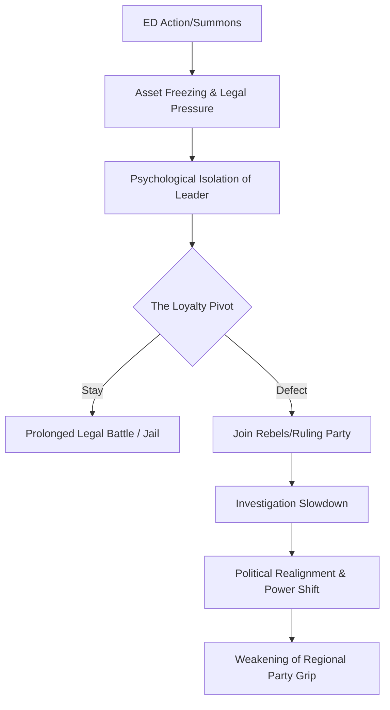

```yaml
title: "The Agency Effect: Madan Mitra's Exit and the TMC Crisis"
tags: [west-bengal-politics, tmc, mamata-banerjee, enforcement-directorate, political-defection, pmla, indian-politics, saradha-scam]
```

<div class="post-hero">
  
  <div class="post-hero-credit">📸 <a href="https://unsplash.com/@tforcym">Nghia Nguyen</a> on <a href="https://unsplash.com/photos/a-woman-sitting-in-a-field-holding-her-hands-up-ZmibZ9O_DrY">Unsplash</a></div>
</div>


# 🚩 The Loyalists' Exit: Madan Mitra, the ED, and the Cracks in Mamata Banerjee’s Fortress

West Bengal politics has long been characterized by its cinematic intensity, shifting allegiances, and high-stakes drama. However, the recent departure of Madan Mitra from the inner sanctum of the All India Trinamool Congress (TMC) is more than just another chapter in a political soap opera; it is a systemic tremor. For over a decade, Mitra was not merely a Member of the Legislative Assembly (MLA); he was the operational engine of the party—a trusted lieutenant of Mamata Banerjee and a symbol of the party's grassroots muscle.

The timing of his alignment with the "rebels" is a flashing red light. This shift occurred just **24 hours** after the Enforcement Directorate (ED), India's premier agency for combating financial crimes, intensified its scrutiny of his assets and activities. In the current landscape of Indian governance, such timing is rarely coincidental. The transition from "loyal soldier" to "political rebel" in a single day suggests that the mounting pressure of a federal legal battle finally outweighed a lifetime of party loyalty. This incident serves as a potent case study in how central investigative agencies can unilaterally reshape the political map of a state.

---

### 👤 The Man Behind the Machinery: Who is Madan Mitra?

To comprehend the gravity of this defection, one must understand Madan Mitra’s specific role within the TMC ecosystem. Mitra was the quintessential "strongman." In the context of West Bengal, a strongman is not just someone with power, but someone who possesses the unique ability to mobilize the street, manage local disputes, and ensure that the party's directives are implemented—regardless of the obstacles.

For years, Mitra served as Mamata Banerjee's primary "troubleshooter." When a local conflict threatened the party's image or a high-stakes political maneuver required an uncompromising hand, Mitra was the designated operative. His rise was intrinsically linked to the TMC’s meteoric ascent from a breakaway faction of the Congress to the hegemon that ended **34 years** of Left Front rule in 2011. He represented the "steel" in the party's structure, providing the necessary friction to oppose rivals while maintaining a grip on the urban working class.

However, the proximity to absolute power is a double-edged sword. Because Mitra was the face of the party's operational dominance, he naturally became the primary target for corruption allegations. He was frequently linked to the "syndicates" of West Bengal—those opaque, unofficial networks of contractors and brokers who allegedly monopolized infrastructure projects and controlled the supply of building materials across the state. 

While his influence was vast, it created a permanent target on his back. For years, the prevailing narrative was that the bond between Mitra and Mamata Banerjee was unbreakable, forged in the fires of the anti-Left struggle. This is why his move toward the rebels is perceived not just as a political shift, but as a psychological blow to the TMC leadership.

---

### ⚖️ The ED Move: The Catalyst of Betrayal

The spark that ignited this crisis was a targeted escalation by the Enforcement Directorate. The ED has been conducting a protracted investigation into the [Saradha Chit Fund scam](https://www.thehindu.com/news/national/other-states/saradha-chit-fund-scam-explained/article66235458.ece) and the [Rose Valley scam](https://indianexpress.com/article/india/west-bengal/rose-valley-scam-ed-raids-trinamool-leaders-7354210/), two of the largest financial frauds in Indian history. In these schemes, **billions of rupees** were collected from millions of small-time investors under the guise of high-return investments, only for the money to vanish into a web of political payoffs and luxury assets.

Mitra had previously endured stints in jail during the early waves of these probes, but the latest intervention—comprising fresh summons, intensified interrogation, and the credible threat of prolonged incarceration—proved to be the breaking point. 

The primary weapon in the ED's arsenal is the **Prevention of Money Laundering Act (PMLA)**. Legal scholars frequently highlight the PMLA as one of the most stringent laws in the Indian penal code because it effectively shifts the "burden of proof." Under standard criminal law, the state must prove the accused is guilty; under the PMLA, the accused must often prove that their assets were acquired through legitimate means. 

> "The PMLA has transformed from a financial regulation tool into a potent political instrument. By freezing assets and making bail nearly impossible, it creates a state of legal paralysis that can compel even the most loyal political operatives to reconsider their allegiances."

When a leader like Mitra faces the prospect of spending years in a cell or seeing his entire empire seized, the hierarchy of needs shifts. "Party loyalty" is suddenly superseded by "personal survival." The fact that he defected within a day of the ED's move suggests a surgical application of pressure: the agency isolates the individual until they feel that the only available lifeline is a change in political affiliation.

---

### 🌪️ The "Rebels" and the Internal Rift

The emergence of "rebels" within the TMC is more complex than a simple migration to the BJP or the Congress. The group Mitra has joined represents a fragmented internal opposition—a mix of "old guard" veterans and disillusioned strategists. 

For a decade, the TMC operated as a strictly top-down organization. Mamata Banerjee's leadership is charismatic and absolute, demanding total devotion. However, as the party transitioned from a protest movement to a governing body, internal frictions began to emerge. The "old guard," including figures like Mitra, felt that their influence was being diluted by a "new guard" of tech-savvy administrators and loyalists who lacked the grassroots scars of the early struggle.

There is now a quiet but pervasive tension between two factions:
1. **The Defiants**: Those who believe in Mamata Banerjee's strategy of total confrontation with central agencies, viewing the ED as a purely political tool.
2. **The Pragmatists**: Those who believe that defiance is a luxury the rank-and-file cannot afford. They argue that while the leadership can survive a political storm, the individual MLA cannot survive a PMLA charge.

By joining the rebels, Mitra is signaling that he has moved into the "pragmatist" camp. He is essentially declaring that the party's protective umbrella is no longer large enough to shield him from the rain of central agency probes. This rebellion is a cocktail of **legal panic** and **marginalization**.

---

### 🧼 The "Washing Machine" Phenomenon

To analyze the Madan Mitra case, one must examine the "Washing Machine" effect, a colloquial term used by political analysts to describe a recurring pattern in contemporary Indian politics. The metaphor suggests that a politician, stained by corruption charges and pursued by the ED or CBI, can enter the "washing machine" of the ruling party and emerge "clean"—or at least, no longer pursued.

The operational cycle of the "Washing Machine" typically follows four stages:
1. **The Probe**: A high-profile investigation is launched by a central agency into the leader's finances.
2. **The Squeeze**: Assets are frozen, raids are conducted on family homes, and the leader is arrested. This phase is designed to create a sense of total isolation.
3. **The Defection**: The leader exits their current party, citing "ideological differences" or "the need to serve the people better."
4. **The Relief**: Shortly after joining the ruling party, the intensity of the investigation drops. Summons are delayed, bail is granted, and the leader is often given a new political role.

The **bold statistic** here is telling: over the last five years, dozens of MLAs and MPs across states like Maharashtra, Madhya Pradesh, and Karnataka have followed this exact trajectory. The ruling party justifies these defections as "joining the cause of good governance," but the timing in Mitra's case points toward a transactional survival strategy.

In the case of Madan Mitra, the "rebels" act as a transit lounge. By not joining the BJP immediately, he maintains a shred of political dignity and leaves the door open for negotiations, while essentially signalling his willingness to flip if the legal pressure remains unsustainable.

---

### 💔 The Blow to Mamata Banerjee's Fortress

For Mamata Banerjee, the defection of Madan Mitra is not merely a loss of a seat in the assembly; it is a breach in the fortress. Her leadership style is built on the concept of the "political family." She expects a level of devotion that borders on the familial, and in return, she provides protection and power.

Mitra was not a disposable asset; he was a comrade who helped build the foundation of her power in Kolkata. His departure reveals a critical vulnerability in the TMC's armor: **The fear of the central agency is now stronger than the fear of the party leader.**

This creates a dangerous psychological domino effect. If a "strongman" like Mitra—someone with deep roots and significant personal power—can be broken by the ED, the junior leaders and district-level operatives will feel exponentially more vulnerable. The message is clear: no one is truly "untouchable."

Furthermore, this undermines Banerjee's public narrative. She has spent years framing the ED's actions as a "political conspiracy" and urging her followers to stand firm with "courage and truth." However, when her own inner circle collapses under that same pressure, the narrative shifts from one of "heroic defiance" to one of "attrition."

---

### 📊 The Mechanics of Political Realignment

The shift in power dynamics can be visualized as a cycle of pressure and response. The goal of the central agencies is often not necessarily a conviction in court (which can take decades), but the creation of a political environment where defection becomes the only rational choice.



The opposition, particularly the BJP, gains significantly from this. Even if the rebels do not formally merge into the BJP immediately, their existence as a separate faction within the TMC creates internal chaos. A house divided is far easier to dismantle during an election cycle. The "strongman" era of Bengal politics, where local lords ruled their territories with impunity, is being replaced by an era of "centralized clearance," where political survival depends on the approval of the central government.

---

### 🏛️ Legal Context: The Anti-Defection Law and its Failures

A critical question arises: why doesn't the [Anti-Defection Law](https://en.wikipedia.org/wiki/Anti-defection_law_of_India) (the Tenth Schedule of the Constitution) stop this? The law is designed to prevent "floor-crossing" by disqualifying members who leave their party. However, politicians have found numerous loopholes.

One common tactic is the "split" or "merger" strategy. If a sufficient percentage of a party's legislators defect together, they can claim it is a legitimate merger rather than an individual betrayal. Others simply resign from the assembly entirely, only to run again in a by-election on a different ticket. In Mitra's case, aligning with a "rebel" group allows him to maintain a level of ambiguity, avoiding immediate disqualification while negotiating his future.

This legal gymnastics underscores the decay of political ethics. The focus has shifted from ideological alignment to the management of legal liabilities.

---

### 🔮 Future Implications for West Bengal

As West Bengal moves toward its next electoral cycle, the Madan Mitra incident serves as a harbinger. We are likely to see a "cascade effect." Other leaders currently under the ED's microscope will be watching Mitra's trajectory closely. If he finds relief and a new platform, others will follow.

The political landscape is shifting in three key ways:
1. **The Erosion of the Strongman**: The era of the local "don-politician" is ending. Power is being centralized in the hands of those who can navigate the federal bureaucracy.
2. **The Rise of "Transactional Loyalty"**: Loyalty is no longer a lifelong commitment but a calculated asset that is traded when the cost of maintaining it becomes too high.
3. **The Vulnerability of Regionalism**: Regional parties that rely on a single charismatic leader are more susceptible to this "agency-led attrition" than national parties with diversified leadership.

---

### 🏁 Conclusion: The Tragedy of the Old Guard

Madan Mitra’s story is a tragedy of survival. It illustrates the brutal reality of modern Indian political warfare, where the primary battlefield has shifted from the polling booth to the interrogation room. The transition from a trusted confidant to a political outcast in 24 hours is a stark reminder that in the current climate, loyalty is a luxury that those under federal investigation simply cannot afford.

As Mitra walks away from the leadership that once championed him, he leaves behind a void in the TMC's operational strength and a permanent scar on the legacy of Mamata Banerjee. His journey is a cautionary tale for every politician in the republic: when the machinery of the state is used to reshape the political map, decades of shared struggle can vanish the moment an ED summons hits the table. The "rebels" may find temporary sanctuary, but they do so by sacrificing the very identity and grassroots power that once made them indispensable.

---

### 📚 References

- **The Hindu**: [Saradha Chit Fund Scam Explained](https://www.thehindu.com/news/national/other-states/saradha-chit-fund-scam-explained/article66235458.ece) - Detailed breakdown of the investment fraud and political links.
- **Indian Express**: [Rose Valley Scam and ED Raids](https://indianexpress.com/article/india/west-bengal/rose-valley-scam-ed-raids-trinamool-leaders-7354210/) - Analysis of the ED's targeted raids on TMC leaders.
- **Indian Express**: [Madan Mitra's Political Journey](https://indianexpress.com) - Archives on Mitra's role as a TMC troubleshooter.
- **Wikipedia**: [All India Trinamool Congress](https://en.wikipedia.org/wiki/All_India_Trinamool_Congress) - History and structure of the party.
- **India Code**: [PMLA Act Overview](https://www.indiacode.nic.in) - The legal framework of the Prevention of Money Laundering Act.
- **Government of West Bengal**: [Official Statements on Central Agencies](https://www.wb.gov.in) - Mamata Banerjee's official responses to ED/CBI probes.
- **Economic and Political Weekly (EPW)**: [Analysis of Political Defections in India](https://www.epw.in) - Academic perspective on the "Washing Machine" effect.
- **Election Commission of India**: [West Bengal Reports](https://eci.gov.in) - Data on by-elections and legislator resignations.
- **The Wire**: [The PMLA and Political Prisoners](https://thewire.in) - Legal analysis of the burden of proof under the PMLA.
- **Scroll.in**: [The Syndicate Culture of Bengal](https://scroll.in) - Investigative report on the construction syndicates in Kolkata.