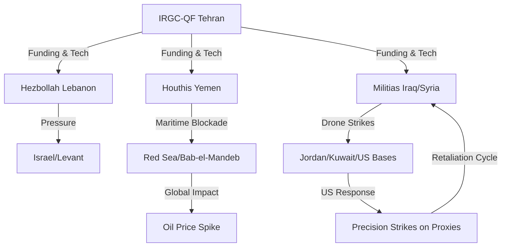

```yaml
title: "US-Iran Conflict: Tanker Wars & Proxy Attacks in the Gulf"
tags: [geopolitics, us-iran-relations, middle-east-security, asymmetric-warfare, global-oil-market, defense-strategy, proxy-war]
```

# 🚨 What's Actually Happening with the US and Iran in Jordan and Kuwait?

# 🚢 Is this a New Tanker War? US Strikes and Iranian Proxies are Heating Things Up

The Middle East has entered a phase of "managed instability" that is rapidly sliding toward an unmanaged crisis. For decades, the tension between Washington and Tehran was a cold war fought through sanctions and diplomatic shouting matches. Today, that conflict has migrated into a "Gray Zone"—a space where the line between peace and war is intentionally blurred.

Recent reports from [Al Jazeera](https://www.aljazeera.com) and other regional monitors highlight a dangerous pattern: the US is conducting high-precision strikes on Iranian-backed militias, while Tehran’s "Axis of Resistance" is expanding its theater of operations into Jordan and Kuwait. This isn't a series of isolated skirmishes; it is a sophisticated, asymmetric struggle for regional hegemony.

The core of the conflict lies in a clash of strategies. The US is attempting to maintain a "deterrence posture" to protect its allies and the flow of global energy. Meanwhile, Iran is utilizing "strategic depth," projecting power through a network of proxies to ensure that any US move against Tehran must first pass through a gauntlet of fires in Iraq, Syria, Lebanon, and Yemen. With the Strait of Hormuz serving as the world's most volatile chokepoint, the risk is no longer just a local conflict, but a global economic shock.

---

## 💥 The US Playbook: Calibrated Pressure and the "Land Bridge"

<div class="post-hero">
  
  <div class="post-hero-credit">📸 <a href="https://unsplash.com/@saifee_art">Saifee Art</a> on <a href="https://unsplash.com/photos/toy-soldiers-and-jets-arranged-on-a-map-sai1uSZbqY8">Unsplash</a></div>
</div>


The Pentagon describes its recent operations as "defensive" and "proportional," but a deeper dive into the targeting reveals a strategic objective: the disruption of the Iranian "Land Bridge." This corridor—stretching from Tehran through Baghdad and Damascus to Beirut—is the logistical artery used by the Islamic Revolutionary Guard Corps (IRGC) to arm Hezbollah and various Shia militias.

### The Strategy of "Calibrated Pressure"
Rather than engaging in a direct kinetic conflict with the Iranian state—which would likely trigger a full-scale regional war—the US employs **"Calibrated Pressure."** This involves hitting the "tentacles" of the IRGC-QF (Quds Force) without striking the "head" in Tehran. As detailed in [Wikipedia’s overview of US-Iran relations](https://en.wikipedia.org/wiki/Iran%E2%80%93United_States_relations), this pattern emerged strongly after the 2020 assassination of Qasem Soleimani, shifting the conflict toward a cycle of "strike-and-respond."

**The US military architecture in the region currently relies on three pillars:**
1.  **Carrier Strike Groups (CSGs)**: By maintaining a rotating presence of nuclear-powered carriers, the US ensures it can launch airstrikes from international waters, avoiding the political complications of relying solely on land bases.
2.  **Integrated Air and Missile Defense (IAMD)**: The deployment of Patriot and THAAD systems in the Gulf is designed to neutralize the "drone swarm" tactics favored by Iranian proxies.
3.  **Special Operations & Intelligence**: Leveraging deep SIGINT (Signals Intelligence) to map the command-and-control structures of militias in Iraq and Syria before striking.

> "The objective is not to initiate a conflict, but to ensure that those who seek to destabilize the region understand the cost of their aggression," a US defense official recently stated. However, the efficacy of this approach is debated; some analysts argue that "calibrated" strikes only encourage proxies to innovate and find gaps in US detection.

---

## 🚢 The Tanker Crisis: Oil as a Geopolitical Lever

The most immediate threat to global stability is the escalation of the "Shadow War" at sea. The Persian Gulf is the world's primary artery for liquid petroleum, and the Strait of Hormuz—a narrow passage barely 21 miles wide at its narrowest point—is the ultimate strategic chokepoint.

### A Return to the "Tanker War"
The current seizures of commercial vessels are reminiscent of the **"Tanker War" (1984–1988)** during the Iran-Iraq conflict. Back then, both nations attacked tankers to bleed the other's economy. Today, Iran uses "limpet mines," fast-attack craft, and seizure operations to signal its ability to disrupt global energy markets.

According to reports from [Reuters](https://www.reuters.com), Tehran views tankers not just as economic targets, but as "bargaining chips." Seizing a ship often coincides with diplomatic disputes over frozen assets or the detention of Iranian nationals abroad.

**The Economic Ripple Effect:**
*   **Insurance Premiums**: War-risk insurance for vessels entering the Gulf has seen **estimated double-digit percentage spikes**, adding significant costs to every barrel of oil.
*   **Shipping Diversions**: To avoid "high-risk zones," many shipping companies are opting for longer, more expensive routes, which delays delivery and increases the carbon footprint of global trade.
*   **Market Volatility**: Even the *threat* of a closure of the Strait of Hormuz can cause Brent Crude prices to jump by **$5 to $10 per barrel** within hours.

If the Strait were fully blocked, approximately **20% of the world's total oil consumption** would be cut off instantly, likely triggering a global recession.

---

## 🦅 Why Jordan is Now a Strategic Target

Jordan has historically been one of the most stable and reliable US partners in the Levant. However, the security landscape has shifted. Iranian-backed militias in Iraq have begun launching drone strikes and rocket attacks into Jordanian territory, signaling that the "red lines" have moved.

### The Rise of Loitering Munitions
The primary weapon of choice in these attacks is the **"Suicide Drone" (Loitering Munition)**. These cheap, mass-produced drones allow proxies to project power across borders with minimal risk to personnel. Iran has effectively democratized this technology, exporting drone kits to its partners across the "Shiite Crescent."

**The strategic rationale for targeting Jordan includes:**
*   **US Logistics Hubs**: Jordan hosts critical military infrastructure used for counter-terrorism operations and intelligence gathering.
*   **Psychological Warfare**: By hitting a stable monarchy, Tehran sends a message to other Arab allies that US protection is not an absolute shield.
*   **Diversionary Tactics**: Attacks in Jordan force the US to divert resources away from other theaters, stretching the capacity of CENTCOM (US Central Command).

Jordan's military is currently investing heavily in air defense, but the cost-asymmetry is brutal: a **$20,000 drone** can force a defender to use a **$2 million interceptor missile**.

---

## 🇰🇼 The Situation in Kuwait: Testing the Perimeter

While Jordan faces direct strikes, Kuwait is experiencing a more subtle form of aggression: airspace violations and "probing actions." Squeezed between Iraq and Iran, Kuwait represents a critical vulnerability in the Gulf's security architecture.

### Probing for Weakness
Most drone incursions into Kuwaiti airspace are not intended to cause mass casualties but to conduct "reconnaissance by fire." By flying drones near oil refineries or naval bases, Iranian-backed groups are testing:
1.  **Radar Response Times**: How long does it take for Kuwaiti and US forces to detect a low-flying UAV?
2.  **Rules of Engagement**: At what point does the US order its assets to shoot down a probe?
3.  **Inter-Ally Coordination**: How well do Kuwaiti and US military commands communicate during a breach?

**Kuwait's precarious position:**
Kuwait relies heavily on the **US-Kuwait Mutual Defense Agreement**. However, the government must balance this security reliance with a desire to avoid becoming a primary target. Since Kuwait possesses some of the world's largest oil refineries, a single successful drone strike on a refinery could cause a localized fire that disrupts global energy exports for weeks.

---

## 🧠 The Architecture of the "Axis of Resistance"

To understand why Iran operates through proxies rather than direct military action, one must understand the concept of **Asymmetric Deterrence**. Research found on [ArXiv](https://arxiv.org) suggests that Iran utilizes "plausible deniability" to avoid direct state-on-state conflict.

### The Hub-and-Spoke Model
Iran acts as the "hub," providing funding, weaponry, and training, while the "spokes" (proxies) execute the attacks. These include:
*   **Hezbollah (Lebanon)**: The most sophisticated proxy, capable of conventional warfare.
*   **The Houthis (Yemen)**: Specializing in maritime disruption and long-range drone strikes.
*   **Kata'ib Hezbollah & PMF (Iraq)**: Focused on harassing US bases and disrupting the "land bridge."



**The Strategic Logic:**
*   **Cost Asymmetry**: Iran forces the US to spend billions on defense while spending millions on offense.
*   **Political Shielding**: By using proxies, Iran can deny involvement in an attack, making it diplomatically harder for the US to justify a direct strike on Iranian soil.
*   **Regional Influence**: By embedding itself in the security apparatus of multiple countries, Iran ensures that it is an indispensable power broker in any regional peace deal.

---

## 📉 Global Fallout: From Oil Prices to AI Warfare

This conflict is not confined to the deserts of Jordan or the waters of the Gulf; it is a live laboratory for the future of warfare and a catalyst for global economic shifts.

### The Tech Dimension: AI and Autonomous Systems
 Discussions on [Hacker News](https://news.ycombinator.com) and among defense analysts highlight how this conflict is accelerating the adoption of **Autonomous Weapon Systems**. We are seeing the transition from remotely piloted drones to AI-driven swarms that can coordinate attacks without a human operator, potentially bypassing traditional signal-jamming techniques.

**Key Technological Shifts:**
*   **Electronic Warfare (EW)**: The battle is now fought in the electromagnetic spectrum. Signal jamming and "spoofing" (tricking a drone's GPS) are as important as the missiles themselves.
*   **Distributed Lethality**: The US Navy is shifting toward "distributed lethality," spreading its offensive power across more ships rather than concentrating it on a single carrier, to reduce the risk of a "single point of failure."

### The Macro-Economic Risk
The volatility in the Gulf creates a "hidden tax" on global commerce. Beyond the price of gas at the pump, the instability affects:
1.  **Supply Chain Resilience**: The Red Sea and Persian Gulf are critical for trade between Asia and Europe. Disruptions here force ships to navigate around the Cape of Good Hope, adding **10-14 days** to transit times.
2.  **The Petrodollar System**: Persistent instability pushes Gulf states to diversify their currency reserves, potentially moving away from the US Dollar toward the Chinese Yuan for oil trades.
3.  **Strategic Realignment**: Tensions are driving the "Abraham Accords" nations (UAE, Bahrain) to further integrate their security with the US, while simultaneously maintaining a pragmatic diplomatic channel with Tehran to avoid total war.

> "We are seeing the emergence of a 'fragmented security architecture' where traditional alliances are being tested by the reality of asymmetric drone warfare," notes a senior geopolitical analyst.

---

## 🏁 Conclusion: The Danger of Miscalculation

The current state of affairs between the US and Iran is a high-stakes game of "geopolitical chicken." Both sides are operating under the assumption that the other will not cross the ultimate red line. However, history is littered with "limited" conflicts that spiraled into total wars due to a single miscalculation.

A single missile hitting a US carrier, or a drone strike causing significant civilian casualties in Amman or Kuwait City, could shatter the fragile "managed escalation." When trust is non-existent and communication channels are limited to third-party intermediaries (like Oman or Qatar), the margin for error is razor-thin.

For now, the region exists in a state of **violent equilibrium**. The tankers remain hostages to political whims, the skies are filled with probing drones, and the "Axis of Resistance" continues to test the limits of American patience. The exit ramp to a lasting peace requires more than just "calibrated strikes"; it requires a fundamental shift in the regional security architecture—one that may not be possible until the current cycle of attrition reaches a breaking point.

---

## 📚 References & Further Reading

*   **Al Jazeera**: [Regional Escalation and Proxy Conflict Updates](https://www.aljazeera.com) – Comprehensive coverage of on-the-ground events in Iraq and Jordan.
*   **Wikipedia**: [Iran–United States Relations](https://en.wikipedia.org/wiki/Iran%E2%80%93United_States_relations) – Historical context of the diplomatic and military rivalry.
*   **Reuters**: [Maritime Security and Tanker Seizures](https://www.reuters.com) – Real-time data on shipping disruptions and oil market impacts.
*   **ArXiv**: [Research on Asymmetric Warfare](https://arxiv.org) – Academic papers on the mathematics of proxy networks and attrition.
*   **Hacker News**: [Geopolitical Risk and Tech Discussions](https://news.ycombinator.com) – Community analysis on the impact of AI and drones in modern conflict.
*   **Council on Foreign Relations (CFR)**: [Middle East Security Analysis](https://www.cfr.org) – Deep dives into the "Axis of Resistance" and US strategic goals.
*   **Bloomberg**: [Global Energy Markets and the Gulf](https://www.bloomberg.com) – Analysis of Brent Crude volatility and insurance premiums.
*   **AP News**: [Drone Warfare in the Levant](https://apnews.com) – Reporting on the specifics of strikes in Jordan and Syria.
*   **Institute for the Study of War (ISW)**: [Daily Assessments of Iran-backed Militias](https://www.understandingwar.org) – Technical mapping of proxy movements.
*   **Naval News**: [US Carrier Strike Group Operations](https://navalnews.com) – Details on the naval posture in the Persian Gulf and Red Sea.