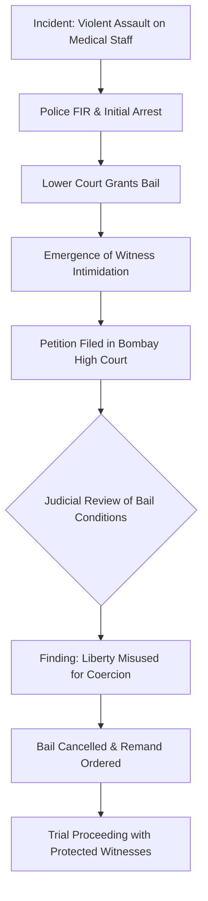

```yaml
title: "The Law vs. The Muscle: Bombay HC on Medical Violence"
tags: [bombay-high-court, medical-violence, healthcare-law, india-legal-news, doctor-safety, maharashtra-politics, human-rights, judicial-activism]
```

# ⚖️ The Law vs. The Muscle: What the Bombay High Court’s Crackdown on Political Violence Against Doctors Actually Means

### 🩺 Introduction: When a Safe Space Isn't Safe

Hospitals are designed to be sanctuaries—neutral zones where the only priority is the preservation of life. They are spaces where people enter at their most vulnerable, placing an absolute trust in the expertise of doctors and the compassion of nurses. However, in recent years, across the Indian landscape, these sanctuaries have increasingly begun to resemble battlegrounds. While the occasional outburst from a grieving or stressed relative is a known risk of the profession, a far more sinister trend has emerged: the weaponization of political power to intimidate and assault healthcare providers.

The recent intervention by the Bombay High Court marks a pivotal moment in this struggle. By cancelling the bail of Ramesh Mhatre, a corporator affiliated with the Eknath Shinde-led Shiv Sena, the court did more than simply order a man back into custody. It issued a loud, clear signal to the political class: the white coat is not a target, and a political title is not a shield against the law.

Mhatre stands accused of violently assaulting medical professionals—an act that transcends simple physical injury. It is an assault on the healthcare infrastructure itself. This case brings into sharp focus the precarious gap between the laws written in legislative books and the reality of the "muscle power" that often governs local politics. When witnesses are intimidated, when police hesitate, and when the presumption of innocence is twisted into a license for harassment, the judiciary becomes the final line of defense. This is not merely a legal dispute over bail; it is a fundamental question of whether the people saving our lives can feel safe while doing so.

---

### 📉 Section 1: The Anatomy of an Assault — When Power Becomes a Weapon

The incident involving Ramesh Mhatre was not a spontaneous disagreement or a momentary lapse in judgment; it was a targeted act of aggression occurring in a professional environment dedicated to healing. According to reports by [Live Law](https://www.livelaw.in), Mhatre and his associates allegedly utilized their social and political standing to physically assault medical staff.

In the context of Indian healthcare, these attacks often follow a predictable, devastating pattern. They typically ignite over disputes regarding patient care, perceived delays in treatment, or claims of medical negligence. However, when a political representative leads the charge, the nature of the violence shifts from "emotional outburst" to "systemic intimidation." The objective is rarely just to express anger; it is to demonstrate dominance.

**The "Chilling Effect" on Healthcare Delivery**
When a politician enters a clinic with a mob, it creates what sociologists call a "chilling effect." Junior doctors, nurses, and administrative staff are not just witnessing a crime; they are witnessing the perceived "untouchability" of the perpetrator. This leads to several dangerous outcomes:

1.  **Defensive Medicine:** Doctors begin practicing "defensive medicine," where they avoid high-risk patients or order unnecessary tests simply to create a paper trail that protects them from potential legal or physical retaliation.
2.  **Psychological Erosion:** The mental toll is immense. Healthcare workers are trained for the stress of surgery and the grief of loss, but they are not trained to fear for their physical safety from the very people they are meant to serve.
3.  **Institutional Paralysis:** When leadership in a hospital fears political blowback, they may fail to report assaults, leading to a culture of silence that emboldens future attackers.

**Bold Stats on the Crisis:** 
Recent surveys by the [Indian Medical Association (IMA)](https://www.ima-india.org) indicate that **nearly 70% of doctors** in India have experienced some form of violence in their professional lives. Furthermore, reports suggest that **over 50% of resident doctors** in government-run public hospitals have been physically assaulted at least once during their residency.

---

### ⚖️ Section 2: The Legal Rollercoaster — From Bail to Cancellation

The trajectory of Ramesh Mhatre’s case provides a masterclass in the tension between the "presumption of innocence" and the necessity of maintaining public order. In the initial stages of the legal process, Mhatre was granted bail. In the Indian legal system, bail is generally the rule and jail is the exception, provided the accused is not a flight risk and does not possess a history of violent recidivism.

However, the Bombay High Court’s decision to cancel that bail is a rare and significant legal maneuver. Under Indian law, cancelling bail is a drastic step, typically reserved for instances where the accused has breached bail conditions or where new, disturbing evidence suggests that the liberty of the accused is being used to obstruct justice.

**The Pivot: Witness Intimidation**
The High Court identified a critical failure in the lower court's assessment: the ability of a politically powerful individual to influence witnesses. When "muscle power" is involved, the intimidation doesn't vanish once the accused is released on bail; it simply migrates from the hospital corridor to the witness's private residence.

The Court recognized that if doctors and nurses—who are often government employees—feel that their careers or personal safety are at risk if they testify truthfully, the trial becomes a facade. By cancelling the bail, the Court effectively removed the source of intimidation, ensuring that the evidence could be presented without the shadow of political coercion.



---

### 🏛️ Section 3: Why the Court Stepped In — The Doctrine of Zero Tolerance

The Bombay High Court’s reasoning extended beyond the specific facts of Mhatre's case; it addressed a systemic pathology. The judiciary viewed the attack on healthcare workers not as a private dispute, but as an attack on the state's ability to provide essential public services.

> "Such acts of violence against healthcare professionals are absolutely unacceptable. The court cannot overlook the gravity of the offense, especially when there are indications that the liberty granted through bail is being misused to influence the course of justice," the court indicated in its reasoning.

The court's logic was anchored in three fundamental pillars:

1.  **The Essentiality of the Service:** Healthcare is a fundamental right. Any action that disrupts the delivery of this service—whether through the physical assault of a doctor or the intimidation of a nurse—is a crime against the public interest.
2.  **The Asymmetry of Power:** The Court acknowledged that as a corporator, Mhatre possessed a level of social and political clout that created an uneven playing field. The law must intervene to balance this asymmetry.
3.  **Deterrence against Political Impunity:** By targeting a member of a ruling faction (the Shinde-led Shiv Sena), the Court sent a message that political affiliation does not grant immunity. It asserted that the rule of law is supreme, regardless of the party symbol one carries.

Furthermore, the Court's directive to the police to be "meticulous" in their investigation is a subtle but sharp critique of local law enforcement. It is an open secret in many districts that police officers may "soften" the charges in an FIR if the accused is a powerful local leader. By urging a thorough investigation, the High Court provided the police with the judicial cover necessary to perform their duties without fearing political retribution.

---

### 🚨 Section 4: A National Crisis — The Systemic Failure of Medical Safety

To view the Mhatre case in isolation is to miss the broader tragedy. Violence against doctors in India is a national epidemic that threatens the very foundation of the healthcare system.

The frustration that fuels these attacks is often rooted in a failing infrastructure. In Maharashtra’s government hospitals, overcrowding, lack of beds, and shortage of staff create a pressure cooker environment. When a patient dies or a treatment fails, the mob doesn't look at the lack of ventilators or the 1:100 doctor-to-patient ratio; they look for a scapegoat.

**The Vicious Cycle of Healthcare Violence**
This environment creates a catastrophic feedback loop:
*   **The Trigger:** Systemic failure $\rightarrow$ Patient death/complication.
*   **The Reaction:** Mob violence $\rightarrow$ Assault on doctors.
*   **The Result:** Burnout and "Brain Drain" $\rightarrow$ Doctors leave the public sector or migrate to the West.
*   **The Aftermath:** Worse healthcare $\rightarrow$ More patient frustration $\rightarrow$ More violence.

This "Brain Drain" is a critical concern for the [National Health Authority (NHA)](https://nha.gov.in). When the brightest medical minds realize that their profession carries the risk of physical assault and political persecution, they seek opportunities in countries with stronger protections for healthcare workers. India is effectively subsidizing the medical education of doctors who then leave the country because they no longer feel safe practicing in their own homeland.

**Global Context:** While violence in healthcare occurs globally, the [World Health Organization (WHO)](https://www.who.int) has highlighted that in many developing nations, the lack of institutional security makes healthcare workers uniquely vulnerable to political coercion—a phenomenon vividly illustrated in the Mhatre case.

---

### 🚩 Section 5: Political Muscle vs. The Law — The Maharashtra Dynamics

The political context of this case—the involvement of a corporator from the Shinde-led Shiv Sena—adds a layer of complexity. In the volatile political climate of Maharashtra, where party splits and shifting alliances are common, local leaders often feel the need to project an image of "strength" and "accessibility" to their constituents.

Unfortunately, this projection of strength often manifests as "political muscle." This takes several forms:

*   **The "Champion of the Poor" Narrative:** Politicians often lead mobs against hospitals to frame themselves as crusaders fighting an "apathetic" or "corrupt" medical system, regardless of the actual clinical facts of the case.
*   **Administrative Coercion:** Hospital staff, being government employees, are susceptible to threats of punitive transfers or withheld promotions. A phone call from a powerful corporator to a district health officer can be more terrifying than a legal summons.
*   **Legal Maneuvering:** The ability to hire top-tier legal counsel ensures that bail is granted rapidly, often before the full extent of witness intimidation is realized by the court.

The Bombay High Court's decision is a direct challenge to this "culture of impunity." It asserts that being a "representative of the people" does not mean being a "ruler of the people." The cancellation of bail serves as a judicial correction, reminding the political class that the courtroom is the only place where power should be adjudicated.

---

### 🛡️ Section 6: The Law on Paper vs. Reality — The Maharashtra Medicare Act

In response to the rising tide of violence, the state government enacted the **Maharashtra Medicare Service Persons and Medicare Service Institutions Act**. On paper, this legislation is one of the toughest in the country.

**Key Provisions of the Act:**
*   **Non-Bailable Offenses:** It classifies attacks on medical professionals as non-bailable and cognizable offenses.
*   **Strict Penalties:** It mandates heavy fines and significant prison terms for those who assault staff or damage hospital property.
*   **Immediate Action:** It requires police to register an FIR immediately upon the report of an assault.

However, the Ramesh Mhatre case exposes the "implementation gap." If the spirit of the Medicare Act were being followed consistently at the lower levels, the initial granting of bail to a politically connected individual accused of violent assault would have been far more difficult.

**How to Bridge the Gap:**
For the Medicare Act to move from a "paper tiger" to a functional shield, three things must happen:

1.  **Institutional Autonomy:** Police investigations into political figures must be overseen by an independent body or a special prosecutor to prevent the "watering down" of charges.
2.  **Robust Witness Protection:** India needs a formal witness protection program for healthcare workers, similar to those used in high-profile criminal cases, to ensure they can testify without fear of retaliation.
3.  **Fast-Track Adjudication:** Violence against doctors should be tried in fast-track courts. When a perpetrator is jailed within months rather than decades, the deterrent effect is exponentially higher.

---

### 🏁 Conclusion: Looking Beyond the Verdict

The cancellation of Ramesh Mhatre's bail is a victory for the medical community, but it is a victory won at the eleventh hour. It reveals a sobering truth: in the face of political muscle, the lower tiers of the legal and administrative system can be fragile. It took the intervention of the High Court to ensure that justice was not derailed by intimidation.

For a society to thrive, the relationship between a physician and a patient must be built on a foundation of mutual trust and respect. When that trust is replaced by fear, the quality of care inevitably declines. A doctor who is looking over their shoulder is a doctor who cannot focus entirely on the patient on the table.

The Bombay High Court did not just put one man back in a cell; it reaffirmed a fundamental principle: the white coat is a symbol of service that the state is obligated to protect. However, judicial wins are a cure for the symptoms, not the disease. The real cure lies in a cultural shift—a societal realization that political leadership is defined by the ability to protect the vulnerable, not the ability to bully the healers. Until the safety of healthcare workers is viewed as a non-negotiable requirement for public health, doctors will continue to look to the courts as their last, and sometimes only, line of defense.

---

## 📚 References

<div class="post-hero">
  
  <div class="post-hero-credit">📸 <a href="https://unsplash.com/@sasun1990">Sasun Bughdaryan</a> on <a href="https://unsplash.com/photos/man-in-white-thobe-standing-RlIppR1I3E8">Unsplash</a></div>
</div>


*   **Live Law**: Comprehensive legal analysis and reporting on the Bombay High Court's decision regarding Ramesh Mhatre. [Live Law Official Website](https://www.livelaw.in)
*   **Indian Medical Association (IMA)**: Data and advocacy reports on the prevalence of violence against doctors in India. [IMA India](https://www.ima-india.org)
*   **Government of Maharashtra**: Legislative text and provisions of the Maharashtra Medicare Service Persons and Medicare Service Institutions Act. [Maharashtra State Gazette](https://www.maharashtra.gov.in)
*   **National Health Authority (NHA)**: Policy guidelines on healthcare worker safety and patient-provider relations. [NHA India](https://nha.gov.in)
*   **World Health Organization (WHO)**: Global reports on violence and harassment against health workers. [WHO Official Website](https://www.who.int)
*   **The Hindu**: In-depth coverage of the political dynamics between the Shinde and Thackeray factions in Maharashtra. [The Hindu](https://www.thehindu.com)
*   **Times of India**: Local reporting on the incidents of assault in Mumbai clinics and hospital responses. [Times of India](https://timesofindia.indiatimes.com)
*   **Supreme Court of India**: Guidelines and observations on the protection of medical professionals from mob violence. [Supreme Court of India](https://main.sci.gov.in)