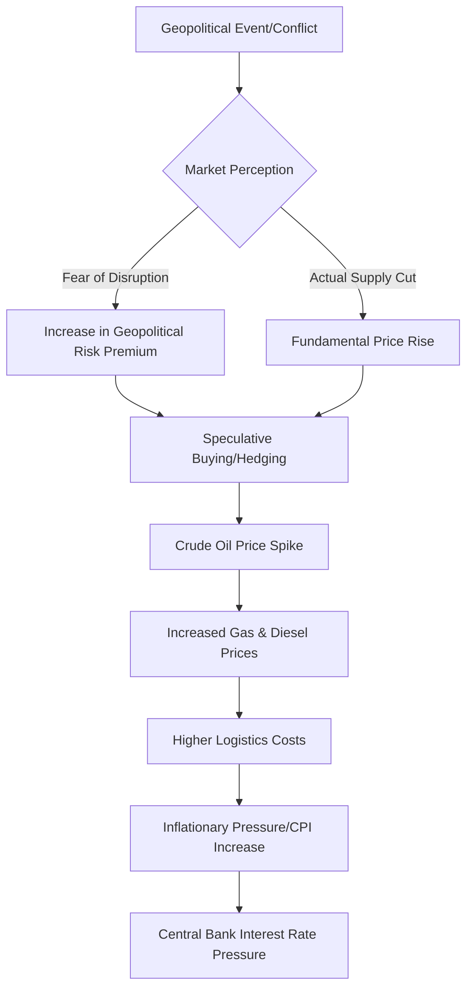

```yaml
title: "Why Oil Prices Just Spiked: The Geopolitical Risk Premium"
tags: [oil-prices, energy-markets, geopolitics, opec-plus, inflation, global-economy, commodity-trading, energy-security]
```

# Why Oil Prices Just Spiked: The "Fear Factor" Explained 🛢️

If you’ve noticed the price of gas creeping up or seen the headlines about crude oil, you're not imagining it. The energy market is often the most sensitive barometer for global instability; when the world gets anxious, oil prices reflect it almost instantly. After a period of relative stagnation and downward pressure, crude oil prices recently experienced their most significant weekly jump in months.

The nuance here is critical: this spike didn't occur because of a sudden surge in industrial demand or a physical disappearance of barrels from the earth. Instead, the market has seen the return of a phenomenon known as the **Geopolitical Risk Premium (GRP)**.

For much of the past year, traders focused on "fundamentals"—the dry, mathematical balance of supply and demand. However, as tensions escalate in the Middle East, shipping lanes become hazardous, and OPEC+ coordinates strategic production cuts, the world has been reminded that oil is not merely a commodity; it is a political instrument. When the market perceives a non-zero chance that supply *might* be disrupted, traders begin paying a premium today to hedge against that uncertainty. This "extra" cost is the risk premium. We have shifted from a "demand-side" worry (Will China buy enough?) to a "supply-side" panic (Can we actually get it?).

---

## 📈 What Actually Happened? Breaking Down the Numbers

<div class="post-hero">
  
  <div class="post-hero-credit">📸 <a href="https://unsplash.com/@sasun1990">Sasun Bughdaryan</a> on <a href="https://unsplash.com/photos/blue-blocks-spelling-risk-next-to-a-magnifying-glass-q5kwAqdyRe8">Unsplash</a></div>
</div>


The recent volatility in the energy sector was not a slow climb, but a series of sharp, jagged spikes. Both Brent Crude (the international benchmark) and West Texas Intermediate (WTI, the US benchmark) surged upward in a synchronized move. According to data tracked by [OilPrice.com](https://oilprice.com), the market saw a weekly gain ranging from **3% to 5%** in a matter of days.

This movement differs fundamentally from the typical "seasonal" rise. Usually, prices climb slowly during the US "summer driving season" as consumer demand increases. This, however, was a "shock reaction." Brent crude surged back toward the **$85–$90 per barrel** range, with WTI following closely behind. The high trading volume indicates that this wasn't merely speculative gambling by retail traders; institutional investors and hedge funds were aggressively moving capital to protect their portfolios against potential instability.

The underlying reality is that the global "buffer"—the spare capacity that can be brought online quickly to offset a crisis—is thinner than it has been in decades. When the market is this "tight," any piece of negative news acts as a catalyst for panic. Traders are no longer pricing in the most *likely* outcome; they are pricing in the *worst-case* scenario.

> "The volatility we are seeing is a direct reflection of a market that has lost its anchor in fundamentals and is now drifting toward a fear-based pricing model, where a single tweet or missile launch can swing prices by several percentage points."

For the average consumer, this is a primary driver of inflation. Because oil is a feedstock for everything from plastics and pharmaceuticals to the diesel fuel powering the global logistics chain, a **5% jump** in crude prices creates a ripple effect. This increases transportation costs, which in turn pushes up the Consumer Price Index (CPI), complicating the efforts of central banks to lower interest rates.

---

## 🛡️ Decoding the "Risk Premium": The Price of Fear

To understand the "Geopolitical Risk Premium," one must understand how oil is actually priced. The price you see at the pump or on a ticker is a composite of several layers: production costs, refining margins, transportation fees, and the risk premium.

The GRP is essentially a "what-if" tax. It is not based on oil that is missing *right now*, but on the probability that oil *could* disappear tomorrow. If the global economy produces and consumes 100 million barrels a day and the flow is smooth, the price remains stable. However, if there is a perceived **10% to 15% chance** that a regional conflict could remove 2 million barrels from the market, traders bid up the price immediately to ensure they have secured supply.

Academic research into energy volatility, such as studies archived on [ArXiv](https://arxiv.org), suggests that the GRP acts as a "volatility amplifier." In times of geopolitical peace, oil prices correlate strongly with GDP growth and industrial output. But when the GRP is active, these traditional economic correlations break down. Prices begin to move based on diplomatic cables, intelligence reports, and military movements.

Furthermore, this reveals a hard truth about the "green energy transition." For years, the narrative suggested that a shift toward renewables would insulate the global economy from oil shocks. However, the persistence of the risk premium proves that we are still deeply dependent on fossil fuels. The bridge to a carbon-neutral economy is proving to be longer and more treacherous than predicted, leaving the world exposed to the whims of oil-producing regimes.

---

## 🌋 The Flashpoints: Why Now?

The primary engine driving current market fear is the Middle East, where three specific catalysts have converged to create a "perfect storm."

### 1. The Israel-Iran Nexus and the Strait of Hormuz
While much of the conflict in the region has been managed through proxy forces, the prospect of a direct, full-scale confrontation between Israel and Iran is the market's ultimate nightmare. The focal point of this fear is the **Strait of Hormuz**. This narrow waterway is the world's most important energy chokepoint, with approximately **20% of the world's total oil consumption** passing through it daily.

If the Strait of Hormuz were to be blocked or severely restricted, the result would not be a small price increase; it would be a global energy crisis. Analysts suggest that Brent crude could easily soar past **$100 or even $120 per barrel** almost overnight, as the world would scramble for non-Gulf oil.

### 2. The Red Sea Crisis and Logistic Friction
Simultaneously, attacks by Houthi rebels in the Red Sea have disrupted one of the most vital shipping arteries in the world. To avoid these attacks, many tankers are abandoning the Suez Canal and opting for the long journey around the Cape of Good Hope in Africa. 

While the oil still reaches its destination, the trip takes an additional **10 to 14 days**. This adds significant costs in the form of fuel, insurance, and vessel chartering. More importantly, it creates "localized shortages"—where oil is available globally, but not available *where it is needed* at the right time—which further drives up the spot price.

### 3. The Contagion Effect
There is also a psychological "contagion effect." Traders assume that instability is rarely contained. Even if Saudi Arabia or the UAE remain stable, the market fears that a conflict in one part of the region will inevitably spill over into others. This systemic fear keeps the risk premium elevated even during periods of relative diplomatic quiet.



---

## 🛢️ The OPEC+ Tightrope: Strategy vs. Stability

While geopolitical conflicts provide the spark, **OPEC+** (the alliance of OPEC members and Russia) provides the fuel. Under the leadership of Saudi Arabia, OPEC+ has pursued a strategy of aggressive production cuts to maintain a "floor" under oil prices.

Their goal is to ensure that oil remains profitable enough to fund their massive state budgets and national transformation projects (such as Saudi Arabia's "Vision 2030"). However, by intentionally keeping the market "tight," they have inadvertently made it far more sensitive to shocks. 

In previous decades, the world had significant "spare capacity"—oil that was produced but kept in reserve. Today, that buffer is minimal. Because OPEC+ has stripped away the excess, there is very little room for error. If a conflict actually removes oil from the market, there is no "white knight" ready to flood the market with cheap barrels to stabilize prices.

> "OPEC+ is essentially playing a high-stakes game of chicken with the global economy. They want prices high enough to maximize revenue, but not so high that they trigger a global recession or accelerate the transition to electric vehicles (EVs) by making internal combustion engines prohibitively expensive."

When traders see that OPEC+ is unwilling to increase production despite rising prices, it reinforces the fear that supply is fragile, thereby expanding the risk premium further.

---

## 📉 The Great Tug-of-War: War vs. Economics

Currently, the oil market is locked in a violent tug-of-war between two opposing forces: the "Bulls" (who expect higher prices) and the "Bears" (who expect lower prices).

### The Bull Case: Instability and Scarcity
The bulls focus on the fragility of the global order. They see a world where diplomatic solutions are failing and energy security is becoming a primary national security concern. To them, oil is a "safe haven" asset—a way to hedge against global chaos. They believe that any disruption in the Middle East will lead to a permanent shift in pricing, moving us into a regime of chronic scarcity.

### The Bear Case: The China Slowdown
The bears look at the cold, hard economic data. Their primary focus is **China**, the world's largest importer of crude oil. China's economy has been hampered by a severe real estate crisis, low domestic consumption, and aging demographics. 

If China's industrial engine continues to sputter, the global demand for oil will drop regardless of what is happening in the Red Sea. The bears argue that the "fear factor" is temporary and that the underlying economic gravity will eventually pull prices back down toward **$70 per barrel**.

### The US Wildcard: The Shale Revolution
Adding another layer of complexity is the **United States**. The US has become one of the world's top oil producers thanks to the shale revolution. According to the [U.S. Energy Information Administration (EIA)](https://www.eia.gov), US production has hit record levels, acting as a massive shock absorber for the global market.

Every time a geopolitical headline threatens to push Brent to $120, the reality of US shale production pulls it back. The US acts as the "swing producer" of last resort, though its ability to increase production rapidly is now limited by a lack of new drilling investment.

### The Macroeconomic Pressure: The US Dollar
Finally, we must consider the role of the US Dollar. Oil is priced globally in dollars. When the Federal Reserve keeps interest rates high, the dollar strengthens. A stronger dollar makes oil more expensive for countries using other currencies (like the Euro or Yen), which naturally suppresses demand. This creates a paradoxical situation where high US interest rates—intended to fight inflation—actually help keep oil prices from spiraling completely out of control.

---

## 🔮 What Happens Next? Three Possible Scenarios

The question remains: will the risk premium vanish, or is this the new baseline? There are three primary paths the market could take over the next 12 to 24 months.

### Scenario 1: The "Cool Down" (The Optimistic Path)
In this scenario, diplomatic efforts succeed in de-escalating tensions in the Middle East. The Red Sea is secured, shipping lanes return to normal, and China implements a successful economic stimulus package. The risk premium evaporates, and prices slide back toward the **$70–$75 range**. This would be a victory for inflation-fighting central banks and a relief for global consumers.

### Scenario 2: The "New Normal" (The Current Path)
This is the most likely outcome. Tensions remain high but "contained." We experience periodic spikes followed by corrections. Oil stays in a volatile corridor between **$80 and $90 per barrel**. The risk premium becomes a permanent fixture of the market, bouncing between **$5 and $15 per barrel** depending on the weekly news cycle. In this world, energy security becomes a permanent line item in national budgets.

### Scenario 3: The "Black Swan" (The Nightmare Path)
A "Black Swan" event—such as a direct war between major regional powers or the total closure of the Strait of Hormuz—triggers a systemic collapse of supply. In this case, China's economic slowdown and US shale production become irrelevant. Pure panic sets in, and prices could blast past **$120 or even $150 per barrel**. This would almost certainly trigger a global recession, as the cost of energy would bankrupt millions of businesses and crush consumer spending.

---

## 🏁 Wrapping Up: The End of Stability

The recent price jump is a loud reminder that the global energy system is built on precarious ground. The return of the **Geopolitical Risk Premium** signals that we have moved from an era of complacency back to an era of high alert.

The immediate numbers—the **biggest weekly gain in months** and the climb toward **$90 Brent**—are the surface-level story. The deeper story is the fragility of our interconnected world. Between the strategic maneuvers of OPEC+, the record production of the US, and the volatile flashpoints of the Middle East, oil has transitioned from a simple commodity back into a primary tool of geopolitical leverage.

As long as the world relies on a few narrow chokepoints for its energy, fear will remain a primary driver of price. In the oil market, the *fear* of a shortage is often just as economically powerful as the shortage itself.

---

## 📚 References & Further Reading

For those looking to track these trends in real-time or dive deeper into the data, the following sources are essential:

- **[OilPrice.com](https://oilprice.com)**: Excellent for daily spot price tracking and market sentiment analysis.
- **[International Energy Agency (IEA)](https://www.iea.org/reports/oil-market-report)**: The gold standard for monthly oil market reports and long-term demand forecasting.
- **[U.S. Energy Information Administration (EIA)](https://www.eia.gov/outlooks/steo/)**: Detailed data on US shale production and the Short-Term Energy Outlook (STEO).
- **[Reuters Energy](https://www.reuters.com/business/energy/)**: Reliable, fast-breaking news on OPEC+ meetings and geopolitical events.
- **[Bloomberg Commodities](https://www.bloomberg.com/markets/commodities)**: Deep-dive analysis into the financialization of oil and hedge fund positioning.
- **[OPEC Monthly Oil Market Report (MOMR)](https://www.opec.org/opec_web/en/publications/338.htm)**: The official perspective from the producing nations.
- **[ArXiv - Energy Economics](https://arxiv.org)**: For academic papers on the mathematical modeling of the Geopolitical Risk Premium.
- **[Wikipedia - Crude Oil Pricing](https://en.wikipedia.org/wiki/Crude_oil)**: A comprehensive overview of the technical mechanisms behind Brent and WTI pricing.