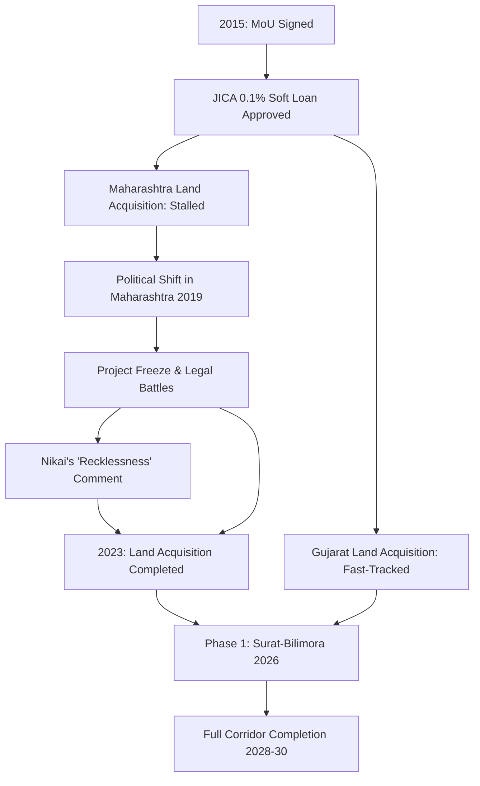

```yaml
title: "Bullet Trains & Bitter Words: Japan's Frustration with India"
tags: [bullet-train, india-japan-relations, infrastructure, shinkansen, mahsr, economic-development, high-speed-rail]
```

Imagine zooming between Mumbai and Ahmedabad at **320 km/h**. For the better part of a decade, this has been the shimmering centerpiece of the India-Japan strategic partnership. The Mumbai-Ahmedabad High-Speed Rail (MAHSR) project has been pitched not merely as a transportation upgrade, but as the ultimate symbol of a modern, "New India"—a promise to slash travel times from six hours to under two and import the legendary, clockwork precision of the Shinkansen to the chaotic vibrancy of the subcontinent.

However, beneath the glossy architectural renders of sleek stations and bullet-shaped trains lies a narrative of diplomatic friction, bureaucratic paralysis, and deep-seated cultural clashes. What was intended to be a seamless "turnkey" project has instead become a case study in the difficulties of exporting high-precision infrastructure into a complex, democratic landscape.

The tension reached a fever pitch when former Japanese minister Toshihiro Nikai described India's handling of the project as "sheer recklessness." In the world of Japanese diplomacy, where nuance, indirectness, and the preservation of "face" are paramount, such a statement is the equivalent of a diplomatic earthquake. When Nikai spoke of "recklessness," he wasn't critiquing India's ambition—he was lamenting a total breakdown in execution. Between the nightmare of land acquisition in Maharashtra and the grinding gears of bureaucratic red tape, the project has been delayed by years, turning a symbol of partnership into a source of profound frustration in Tokyo.

---

## 🚄 The Diplomacy of Disappointment: Decoding "Sheer Recklessness"

<div class="post-hero">
  
  <div class="post-hero-credit">📸 <a href="https://unsplash.com/@bamaham93">Jacob McGowin</a> on <a href="https://unsplash.com/photos/a-chalkboard-with-the-word-request-written-on-it-NQn-Y-rJJU0">Unsplash</a></div>
</div>


To understand the weight of Toshihiro Nikai's words, one must first understand the Japanese approach to international cooperation. For Japan, the MAHSR is not just a commercial venture; it is a vehicle for "soft power." By exporting the Shinkansen, Japan is exporting its core national values: punctuality, extreme reliability, and an obsessive commitment to meticulous planning.

When Nikai used the phrase "sheer recklessness" in a report by [Telegraph India](https://www.telegraphindia.com/world/japan-ex-minister-blames-new-delhi-for-bullet-train-delay/cid/2045678), he was voicing a sentiment shared by many within the Japanese Ministry of Land, Infrastructure, Transport and Tourism. The frustration stems from a perceived gap between the commitments made by the Indian central government and the reality on the ground. 

From Tokyo's perspective, the "recklessness" lay in the decision to announce timelines and begin funding without first securing the land. In the Japanese engineering mindset, the "groundwork" (both literal and figurative) must be **100% complete** before a single rail is laid. To launch a multi-billion dollar project in a densely populated corridor without a foolproof, bipartisan plan for land acquisition was, to the Japanese, a strategic gamble that bordered on negligence.

> "The delays are not just technical; they are systemic. When you promise a timeline to a partner like Japan, the expectation is that the groundwork is solid. The failure to secure land in Maharashtra for years was a blow to the project's credibility."

This friction reveals a deeper tension in the partnership. Japan did not just invest capital; they invested their intellectual property and their reputation. They expected the [National High Speed Rail Corporation Limited (NHSRCL)](https://nhsrcl.in/) to operate with the same rigor as the East Japan Railway Company. Instead, the project became entangled in the volatile nature of state politics. In Maharashtra, a change in state government in 2019 led to a sudden freeze on land procurement, stalling the entire corridor for nearly **three years**. To a Japanese planner, this lack of policy continuity is the height of instability.

---

## 🏗️ The Shinkansen Blueprint: A Masterclass in Engineering

To appreciate why Japan is so protective of this project, one must look at the staggering complexity of the technology being deployed. India is not just buying trains; it is adopting the **E5 Series Shinkansen** ecosystem. 

The E5 is an engineering marvel designed to tackle the specific challenges of high-speed travel. One of the most critical issues in high-speed rail is the "tunnel boom" (or sonic boom) effect—a loud atmospheric pressure wave created when a train enters a tunnel at high speed, which can disturb residents and damage structures. The E5 features a distinctive, elongated "nose" design specifically engineered to minimize this pressure wave.

### Technical Specifications & Infrastructure
The MAHSR corridor spans approximately **508 kilometers**. To maintain a constant speed of **320 km/h**, the track cannot have the sharp curves or level crossings found on traditional Indian railways. Consequently, the vast majority of the line is being built on elevated viaducts.

*   **Speed**: Operating speeds of **320 km/h**, reducing the Mumbai-Ahmedabad trip to approximately **2 hours**.
*   **Safety**: Adopting the "Zero Accidents" philosophy, which includes the Automatic Train Control (ATC) system.
*   **Structure**: Massive use of pre-cast concrete viaducts to avoid splitting farmland and to mitigate the impact of floods.
*   **Specialized Bridges**: Construction of massive bridges over the Narmada and Tapi rivers, utilizing advanced Japanese casting techniques to ensure a lifespan of **100+ years**.

According to [Wikipedia's technical breakdown of the MAHSR](https://en.wikipedia.org/wiki/Mumbai%E2%80%93Ahmedabad_high-speed_rail_corridor), the project requires a level of precision where the margin of error is measured in millimeters. This contrasts sharply with the "flexible" approach often seen in local Indian construction. The [NHSRCL](https://nhsrcl.in/) has had to implement strict Japanese quality control standards, which initially caused significant friction with local contractors who were unaccustomed to such rigid oversight.

---

## 🌾 The Land Mine: Bureaucracy and the Battle for Soil

The root of the "recklessness" claim is the land. In Japan, land acquisition for the Shinkansen is a structured, often decades-long process managed with surgical precision. In India, land is not merely a commodity; it is deeply tied to identity, caste, ancestral heritage, and survival.

The project required thousands of hectares of land across two states, and it is here that the project hit a wall. In Gujarat, the process was relatively swift. The state government was proactive, offering competitive compensation and utilizing a streamlined administrative process. However, Maharashtra became the project's Achilles' heel.

### The Maharashtra Stalemate
In districts like Palghar and Thane, farmers and environmental activists protested vehemently. Their concerns were twofold: the loss of fertile agricultural soil and the destruction of sensitive mangrove ecosystems. These protests were then amplified by political shifts. When the state government changed in 2019, the new administration viewed the bullet train as a "pet project" of the previous regime, leading to a tactical freeze on land procurement.

**The struggle in numbers:**
*   **Total Land Needed**: Over **1,000 hectares** across several critical districts.
*   **The Maharashtra Stall**: Land acquisition was paralyzed for nearly **3 years** (2019-2022).
*   **Legal Hurdles**: Dozens of petitions were filed in the Bombay High Court challenging the valuation of land and the compensation packages offered under the [Land Acquisition, Rehabilitation and Resettlement Act (LARR)](https://doi.org/10.1080/03071898.2014.925354).

To a Japanese planner, launching a project of this scale without a bipartisan political consensus or a secured corridor is an unthinkable risk. It created a surreal scenario: the project was "ready to build" in Gujarat but "forbidden to enter" in Maharashtra, leaving expensive Japanese machinery and expertise idling.

---

## 💰 The Golden Handcuffs: JICA and the 0.1% Loan

The financial architecture of the MAHSR is as unique as the trains themselves. Rather than relying on high-interest commercial loans, the project is primarily funded by the [Japan International Cooperation Agency (JICA)](https://www.jica.go.jp/english/index.html).

JICA is providing approximately **80% of the total project cost** through a "soft loan" with an incredibly low interest rate of **0.1%**. On the surface, this looks like a gift. In reality, these are "golden handcuffs." 

### Strategic Financing vs. Debt Traps
This financing model is a strategic move by Japan to deepen its ties with India and provide a democratic alternative to the [Belt and Road Initiative (BRI)](https://www.worldbank.org/en/topic/infrastructure) promoted by China. By offering such favorable terms, Japan ensures that India is deeply committed to the project. However, this also means that Japan is not just a lender; they are a stakeholder. When the project is delayed, Japan isn't losing interest on a loan—they are losing diplomatic prestige and the opportunity to showcase their technology.

The total estimated cost exceeds **₹1.1 lakh crore**. In the world of high-speed rail, delays are exponentially expensive. Inflation in raw materials (steel, cement) and the cost of maintaining a mobilized workforce mean that every year of delay adds billions to the final bill. Japanese corporate culture views a budget as a sacred commitment; in Indian infrastructure, budgets are often treated as flexible estimates. This fundamental difference in financial discipline has added a layer of silent frustration to the partnership.

---

## 🌏 Beyond the Tracks: A Clash of Operational Cultures

The friction surrounding the MAHSR is a microcosm of the broader India-Japan relationship. It is a clash between two distinct philosophies of productivity and problem-solving.

### Kaizen vs. Jugaad
On one side is the Japanese philosophy of *Kaizen*—the pursuit of continuous, incremental improvement and a commitment to "Zero Errors." In the Shinkansen system, a delay of **60 seconds** is considered a significant failure.

On the other side is the Indian reality of *Jugaad*—the art of the frugal workaround. *Jugaad* is what allows India to function despite its crumbling infrastructure and suffocating bureaucracy. It is the ability to find a "way through" when the official path is blocked.

While *Jugaad* is an asset for survival, it is a liability for high-speed rail. You cannot "work around" the physics of a train moving at **320 km/h**. A single loose bolt or a millimeter of track misalignment can result in a catastrophe. The "recklessness" Nikai mentioned is essentially the fear that *Jugaad* was being applied to a system that requires absolute *Kaizen*.

However, this clash is also a fertile ground for learning. The [NHSRCL](https://nhsrcl.in/) is increasingly adopting Japanese project management techniques, while Japanese engineers are learning the "art of the possible" in India—discovering how to navigate the labyrinth of environmental clearances for mangroves and coordinate between conflicting state and central ministries.

---

## 🌳 Environmental Friction and the Mangrove Dilemma

A critical but often overlooked aspect of the project's delay was the environmental battle. The route from Mumbai to Ahmedabad passes through sensitive coastal zones, including the mangroves of Maharashtra.

Mangroves are critical for storm surge protection and biodiversity. Environmentalists argued that the elevated viaducts, while reducing land fragmentation, would still disrupt the hydrological flow of the wetlands. The [Ministry of Environment, Forest and Climate Change (MoEFCC)](https://moef.gov.in/) had to balance the urgent need for infrastructure with the mandate for conservation.

The process of obtaining environmental clearances became another bottleneck. Japan's approach to environmental impact is typically handled in a centralized, predictable manner. In India, it involves a complex web of public hearings, NGO petitions, and judicial reviews. This "regulatory friction" was another element that contributed to the Japanese sense of "recklessness," as they felt the environmental risks were not sufficiently mitigated before the project was publicized.

---

## 📈 The Corridor Effect: Economic Transformation

Beyond the trains, the MAHSR is designed to create a "Corridor Effect." High-speed rail does not just move people; it reshapes geography. By reducing the travel time between Mumbai and Ahmedabad, the project effectively merges two of India's most powerful economic hubs into a single "mega-region."

### Transit-Oriented Development (TOD)
The goal is to implement Transit-Oriented Development around the new stations. Instead of having a station in the middle of nowhere, the plan is to build integrated hubs with commercial offices, residential complexes, and retail centers.

*   **Decongesting Mumbai**: By making Ahmedabad and Surat viable "commuter" cities, the project could potentially relieve some of the suffocating population pressure on Mumbai.
*   **Industrial Synergy**: The corridor links the financial capital (Mumbai) with the industrial powerhouse (Gujarat), facilitating a faster flow of talent and capital.
*   **Investment Attraction**: The presence of Shinkansen technology acts as a "quality signal" to other global investors, proving that India can execute world-class infrastructure.

---

## ⏱️ The Race Against the Clock: Where We Stand Now

Despite the harsh words of the past, the project has entered a phase of aggressive execution. The "recklessness" of the planning phase is being replaced by a desperate scramble to catch up. As of 2024, the landscape has changed significantly.

In Gujarat, the project is a hive of activity. Thousands of piers have been cast, and the viaducts are stretching across the landscape. The [NHSRCL](https://nhsrcl.in/) has shifted its strategy toward a "phased opening." Rather than waiting for the entire **508 km** stretch to be completed, they are aiming for a trial run on a shorter section—likely between **Surat and Bilimora**—by **2026**.

**Current Progress Snapshot:**
*   **Land Acquisition**: Land procurement in Maharashtra is now nearly **100% complete**, ending the years-long stalemate.
*   **River Crossings**: Work is advanced on the Narmada and Tapi river bridges, utilizing specialized Japanese equipment.
*   **Station Construction**: Work has begun on the massive hubs in Surat and Bilimora.
*   **Timeline**: While the original 2023 goal was unrealistic, a full corridor opening by **2028-2030** is now viewed as a realistic target.

---

## 🗺️ Project Lifecycle and Bottleneck Mapping

The following diagram illustrates the trajectory of the MAHSR project, from its optimistic beginnings to its bureaucratic nadir and its current recovery.



---

## 🌍 Global Context: How India Compares

To understand the scale of the MAHSR, it is helpful to compare it to other global high-speed rail (HSR) networks.

| Feature | India (MAHSR) | China (CRH) | France (TGV) | Japan (Shinkansen) |
| :--- | :--- | :--- | :--- | :--- |
| **Top Speed** | **320 km/h** | **350+ km/h** | **320 km/h** | **320 km/h** |
| **Funding** | Soft Loan (JICA) | State-Led Investment | State/Private Mix | State/Private Mix |
| **Philosophy** | Hybrid Precision | Rapid Scaling | Network Connectivity | Absolute Punctuality |
| **Biggest Hurdle** | Land Acquisition | Debt Sustainability | Labor Unions | Geography/Earthquakes |

India's approach is unique because it is attempting to leapfrog directly to the highest tier of technology without having a robust mid-tier high-speed network. China achieved this through a command-and-control economy where land was seized by the state. India is attempting to do it within a democratic framework, which is inherently slower and more contentious.

---

## 🏁 Conclusion: Triumph of Will or Cautionary Tale?

Toshihiro Nikai’s "sheer recklessness" comment serves as a permanent reminder that high-tech engineering cannot simply bypass low-level bureaucracy. The Mumbai-Ahmedabad Bullet Train is more than a transportation project; it is a massive gamble on India's ability to institutionalize precision.

It represents India's desire to leapfrog into the future, but it also exposes the fragility of such ambitions when they collide with regional politics, environmental concerns, and land disputes. The project has tested the limits of the India-Japan bond, pushing both nations to confront their own cultural blind spots.

Yet, the fact that the project continues is a testament to the strategic necessity of the partnership. Tokyo has not pulled the plug, and New Delhi has not abandoned the dream. This train is a test of whether two fundamentally different operational cultures—one obsessed with the second, the other comfortable with the "approximate"—can align their clocks to the exact same moment.

When the first Shinkansen finally glides into Mumbai, it will be a victory for diplomacy as much as for engineering. The "recklessness" will become a footnote in a larger story of adaptation. The hum of a train moving at **320 km/h** will prove that while the path to progress in a democracy is often bumpy and frustratingly slow, the destination is ultimately worth the struggle.

---

## 📚 References

*   **Official Reports**: [National High Speed Rail Corporation Limited (NHSRCL)](https://nhsrcl.in/) - *Project Progress, Technical Specifications, and Tender Updates.*
*   **Financial Data**: [Japan International Cooperation Agency (JICA)](https://www.jica.go.jp/english/index.html) - *Loan Terms and Strategic Partnership Frameworks.*
*   **News Analysis**: [Telegraph India](https://www.telegraphindia.com/world/japan-ex-minister-blames-new-delhi-for-bullet-train-delay/cid/2045678) - *Report on Toshihiro Nikai's comments regarding project delays.*
*   **Technical Documentation**: [Wikipedia: Mumbai–Ahmedabad high-speed rail corridor](https://en.wikipedia.org/wiki/Mumbai%E2%80%93Ahmedabad_high-speed_rail_corridor) - *Overview of route, speed, and rolling stock.*
*   **Regulatory Framework**: [Ministry of Environment, Forest and Climate Change (MoEFCC)](https://moef.gov.in/) - *Guidelines on mangrove conservation and environmental clearances.*
*   **Policy Analysis**: [Invest India](https://www.investindia.gov.in/) - *Analysis of the "Corridor Effect" and infrastructure investment in India.*
*   **Global Benchmarks**: [World Bank Infrastructure Reports](https://www.worldbank.org/en/topic/infrastructure) - *Comparative analysis of high-speed rail economics globally.*
*   **Governmental Portals**: [Government of Japan Official Portal](https://www.japan.go.jp/) - *Details on the export of Shinkansen technology and diplomatic goals.*