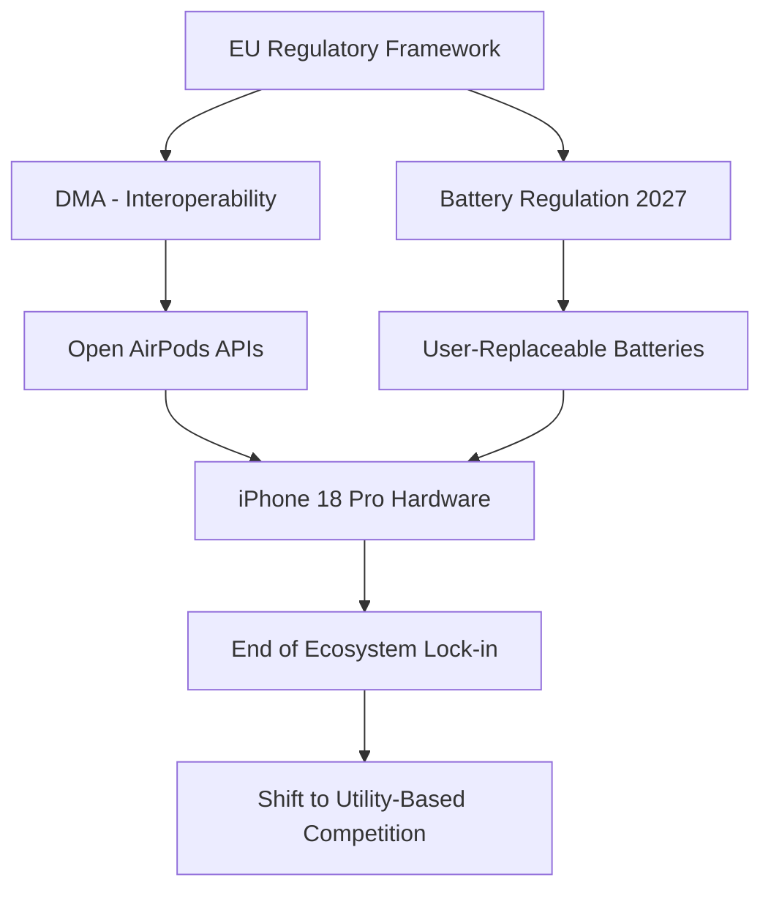

```yaml
title: "iPhone 18 Pro: 2nm Silicon, EU Law & The Open Ecosystem"
tags: [apple, iphone-18-pro, tsmc, eu-regulation, semiconductors, airpods, dma, tech-leaks]
```

# 🚀 The Future of Silicon and Sovereignty: iPhone 18 Pro Leaks & The EU’s AirPods War

**Apple’s 2026 Gamble: Inside the iPhone 18 Pro Roadmap and the EU’s Regulatory Clampdown**

Tech moves fast, but every few years, a critical intersection occurs where cutting-edge hardware and government legislation collide to fundamentally alter the user experience. We are currently entering one of those windows. While the general public focuses on the iterative updates of current-generation devices, strategic leaks—including reports from [chshyd.in](https://chshyd.in/tech/apple-iphone-18-pro-release-date-leak-reveals)—suggest that the **iPhone 18 Pro** is where Apple intends to execute its next systemic leap.

This transition is not merely about clock speeds or camera megapixels. As Apple pivots toward a revolutionary **2nm chip architecture**, the European Union is systematically dismantling the walls of Apple's "walled garden." Between new mandates requiring user-replaceable batteries by 2027 and the Digital Markets Act (DMA) forcing AirPods to embrace interoperability, the iPhone 18 Pro is shaping up to be less of a standard upgrade and more of a survival strategy for the company's business model.

We are witnessing a shift from an era of total corporate vertical integration to one of mandatory openness. Below is a comprehensive analysis of the leaked timelines, the semiconductor physics of the next-gen chips, and the legal battles in Brussels that will decide whether your next pair of AirPods will finally "play nice" with non-Apple gear.

---

## 🔋 The Battery Battle: The EU's 2027 Mandate

<div class="post-hero">
  
  <div class="post-hero-credit">📸 <a href="https://unsplash.com/@ubeyonroad">ubeyonroad</a> on <a href="https://unsplash.com/photos/back-of-a-silver-smartphone-with-three-cameras-oLZ2htMNhbA">Unsplash</a></div>
</div>


For over a decade, Apple has treated the internal battery as a permanent component. For the average consumer, replacing a battery required a trip to an authorized service provider because the cells are secured with industrial-grade adhesives and proprietary fasteners. Apple’s defense was consistently based on two factors: maintaining an ultra-thin chassis and preserving the **IP68 water and dust resistance rating**.

However, the [European Union Battery Regulation 2023/1542](https://eur-lex.europa.eu/eli/reg/2023/1542/oj) has fundamentally rewritten the rules of engagement. This legislation mandates that by **2027**, all portable batteries in electronics must be **removable and replaceable by the end-user** using commonly available tools.

Since the iPhone 18 Pro is slated for a late 2026 release, it arrives exactly as the deadline looms. This places Apple in a precarious engineering position: they must abandon the "glue-everything" philosophy without compromising the structural integrity or the premium feel of the device.

### Engineering the Transition
To comply without sacrificing the "luxury" experience, industry analysts expect a shift toward **mechanical latches** or precision-engineered clips. We are likely to see a redesigned internal frame where the battery is held by a tension-based system rather than chemical bonding. This will necessitate a move away from fragile ribbon cables in favor of **spring-loaded "click-in" connectors** capable of surviving multiple disconnect/reconnect cycles.

**The Physical Cost of Compliance:**
This architectural shift will almost certainly impact the phone's dimensions. Experts estimate a thickness increase of **0.5mm to 1.2mm**. While negligible to some, in the world of industrial design, this is a significant change. However, it is a necessary trade-off for the "Circular Economy." The EU's goal is to eliminate the phenomenon of "planned obsolescence" where a user discards a functional $1,000 device simply because a $30 battery has degraded.

If Apple fails to meet these standards, the penalties are staggering. The EU has the authority to levy fines up to **10% of Apple's global annual turnover**, a figure that would dwarf any potential loss in sales caused by a slightly thicker phone.

---

## ⚡ The 2nm Revolution: TSMC’s Next Big Move

While the exterior of the device is being redesigned to appease regulators, the interior is evolving due to the laws of physics. Leaks indicate that Apple will be the primary launch partner for TSMC’s **2nm (nanometer) process**. This represents the most significant leap in transistor density seen in nearly a decade.

To understand the impact, we must look at the shift from FinFET (Fin Field-Effect Transistor) to **GAAFET (Gate-All-Around Field-Effect Transistors)**. 

In traditional FinFET chips, the "gate" that controls the flow of electricity touches the channel on three sides. As transistors shrink, this leads to "leakage"—electricity escaping the channel and turning into wasted heat. GAAFET solves this by surrounding the channel on all four sides, providing total control over the current.

> "The transition to 2nm represents a paradigm shift in semiconductor fabrication. By implementing GAAFET, Apple can achieve a reduction in power consumption by **15-30%** while simultaneously increasing performance through higher drive currents and lower leakage."

### Practical Implications for the iPhone 18 Pro
This isn't just a theoretical win for engineers; it translates to three tangible user benefits:

1.  **Thermal Management:** The Pro models have historically struggled with thermal throttling during 4K ProRes recording or high-end gaming (like Resident Evil or Death Stranding). The 2nm process significantly reduces heat waste, allowing the SoC (System on Chip) to maintain peak performance for longer durations.
2.  **On-Device Intelligence:** Local AI (Apple Intelligence) is computationally expensive. The 2nm node allows Apple to integrate a significantly larger **NPU (Neural Processing Unit)** into the same footprint. This means more complex LLMs (Large Language Models) can run locally on the device, enhancing privacy and reducing latency by eliminating the need for cloud-based processing.
3.  **Battery Longevity:** When you combine a **20% more efficient chip** with the slightly larger battery housing necessitated by the EU laws, the iPhone 18 Pro could realistically achieve **two-day battery life** for the average user—a "holy grail" for the smartphone industry.

---

## 🎧 The AirPods War: The DMA and the EU

The hardware may be the centerpiece, but the ecosystem is the moat. For years, AirPods have provided a "magical" experience on iPhones (instant pairing, seamless switching, automatic device detection) while operating as basic Bluetooth peripherals on Android or Windows.

This strategy is now under fire from the [EU Digital Markets Act (DMA)](https://commission.europa.eu/strategy-strategies/2022-2024/digital-markets-act_en). The DMA is designed to prevent "gatekeepers" from using their dominant market position to lock users into a closed ecosystem. 

According to reports from [chshyd.in](https://chshyd.in/tech/apple-iphone-18-pro-release-date-leak-reveals), Apple may be forced to expose the proprietary APIs (Application Programming Interfaces) that govern the seamless integration of AirPods.

### The Vision of "Open" AirPods
Under the DMA, the EU is pushing for true **interoperability**. If Apple complies, the user experience for non-Apple devices will transform:

*   **Unified Switching:** AirPods could switch between a MacBook and a Samsung Galaxy Tab using a standardized protocol instead of the proprietary iCloud-based handoff.
*   **Democratized Spatial Audio:** Android users could gain access to the same head-tracking data and immersive audio processing that currently define the Apple experience.
*   **Transparent Battery Metrics:** Precise, real-time battery percentages for both the buds and the charging case would be available across all OS platforms via a standardized API.

For Apple, this is a strategic nightmare. The "Walled Garden" was not just a design choice; it was a financial engine. By making it inconvenient to switch to a competitor, Apple ensured high customer retention. If AirPods work perfectly with everything, the "lock-in" effect vanishes. Apple is essentially being forced to convert its moat into a public bridge.



---

## 📸 Leaked Specs: The Hardware Evolution

Beyond the legal and semiconductor shifts, the iPhone 18 Pro is expected to be a powerhouse of imaging technology. While Apple maintains strict secrecy, supply chain analysis suggests three major breakthroughs for 2026.

### 1. The Unified 48MP Array
Current Pro models utilize a mix of resolutions (e.g., 48MP main, 12MP ultra-wide). The iPhone 18 Pro is predicted to move to a **triple 48MP setup**. This allows the device to capture "ProRAW" data across all three focal lengths. For professional photographers, this means consistent color science, noise levels, and detail regardless of whether they are shooting a wide landscape or a zoomed-in portrait.

### 2. Under-Display FaceID (The End of the Island)
The Dynamic Island was a brilliant software solution to a hardware problem, but the goal has always been a seamless display. Roadmaps suggest that by the 18 series, Apple will successfully integrate **Under-Display FaceID (UD-FaceID)**. The sensors will be hidden beneath the pixels, leaving only a tiny, nearly invisible aperture for the front-facing camera.

### 3. Physical Variable Aperture
Most smartphones use "Computational Bokeh"—software that fakes a blurry background. The iPhone 18 Pro may introduce a **physical variable aperture**, allowing the lens to mechanically open and close. This provides natural depth-of-field control and significantly better performance in extreme lighting conditions, bridging the gap between mobile photography and DSLR capabilities.

### Comparison Forecast: The Generational Leap

| Feature | iPhone 15 Pro | iPhone 18 Pro (Predicted) | Impact |
| :--- | :--- | :--- | :--- |
| **Chip Process** | 3nm (TSMC) | **2nm (TSMC GAAFET)** | **+30% Efficiency** |
| **Battery Design** | Glued/Proprietary | **User-Replaceable (EU)** | **Sustainable Lifecycle** |
| **Front Interface** | Dynamic Island | **Under-Display FaceID** | **True Full-Screen** |
| **Lens Resolution** | Mixed (48/12/12) | **Triple 48MP Array** | **ProRAW Consistency** |
| **Connectivity** | USB-C 3.0 | **USB-C 4.0 / Thunderbolt 5** | **Faster Data Transfer** |
| **AI Processing** | Cloud-Hybrid | **Fully Localized NPU** | **Enhanced Privacy** |

---

## 🗓️ Release Date: The September Cycle and the Yield Risk

The [chshyd.in](https://chshyd.in/tech/apple-iphone- திருதியை-18-pro-release-date-leak-reveals) leak confirms that Apple will adhere to its traditional September window. This is not merely habit; it is a calculated financial imperative.

**The September 2026 Project Timeline:**
*   **Keynote Event:** Mid-September 2026.
*   **Pre-order Window:** The following Friday.
*   **Retail Availability:** Late September 2026.

The "September Surge" is the primary driver of Apple's annual revenue. Even a three-week delay could result in billions of dollars in lost quarterly revenue and trigger volatility in AAPL stock.

However, there is a significant technical risk: **The 2nm Yield Gap**. Transitioning to a new fabrication process is notoriously difficult. If TSMC experiences "low yields"—meaning a high percentage of 2nm wafers are defective—Apple may face severe supply shortages. This could lead to a staggered release where the base Pro model arrives in September, but the high-capacity or "Ultra" variants are delayed until November.

---

## ⚖️ Market Impact: From "Lock-in" to "Utility"

The convergence of 2nm hardware and EU mandates signals a fundamental pivot in the tech industry. For two decades, the dominant strategy was **"Ecosystem Lock-in."** You bought the phone, then the watch, then the headphones, and suddenly, the cost of leaving the ecosystem became too high.

The [Digital Markets Act](https://en.wikipedia.org/wiki/Digital_Markets_Act) and the new Battery Regulations are effectively outlawing this strategy. We are moving from the era of **Ecosystems** to the era of **Utility**.

### The New Rules of Competition:
1.  **Hardware Supremacy:** When batteries are replaceable and accessories are interoperable, you can no longer "trap" a user. Competition reverts to the fundamentals: Who has the most vibrant screen? Whose chip is faster? Whose camera is more accurate?
2.  **Authentic Sustainability:** Apple can no longer rely on carbon offsets or "recycled aluminum" marketing. They must prove sustainability through **longevity**. Making a phone that is easy to repair and lasts seven years instead of three becomes a competitive advantage.
3.  **The "Mix-and-Match" Consumer:** As the barriers fall, users will optimize their tech stacks. A power user might use a Google Pixel for its AI integration, an iPhone 18 Pro for its superior video recording, and AirPods for their audio quality—all working in harmony.

Apple is being forced to tear down the walls that made it the most profitable company in history. Yet, historically, Apple is at its most innovative when it is backed into a corner. The iPhone 18 Pro will likely be the most polished "open" device ever created.

---

## 🔮 Conclusion: The End of the Walled Garden?

The iPhone 18 Pro is far more than a hardware refresh. It represents the moment Apple's vision of a closed, vertical ecosystem hits the wall of global legal and ethical reality.

By integrating **2nm GAAFET chips** for unprecedented power and complying with **EU laws** for open batteries and accessories, the iPhone 18 Pro will be a hybrid: the most powerful consumer electronic device ever engineered, and the first "open" Pro iPhone.

For the consumer, this is an unqualified victory. We receive the benefits of world-class engineering alongside the freedom to repair our own gear and use our accessories without restriction. For Apple, it is a forced evolution. If they can successfully navigate this transition, the iPhone 18 Pro won't just be a successful product—it will be the blueprint for the next decade of mobile computing.

---

## 📚 References

*   **EU Battery Regulation 2023/1542:** [Official EU Lex Portal](https://eur-lex.europa.eu/eli/reg/2023/1542/oj) - Detailed mandates on battery removability and sustainability.
*   **Digital Markets Act (DMA):** [European Commission Strategy](https://commission.europa.eu/strategy-strategies/2022-2024/digital-markets-act_en) - Legislative framework for interoperability and fair competition.
*   **iPhone 18 Pro Analysis:** [chshyd.in Tech News](https://chshyd.in/tech/apple-iphone-18-pro-release-date-leak-reveals) - Industry leaks regarding 2nm chips and release timelines.
*   **TSMC Semiconductor Roadmap:** [TSMC Official](https://tsmc.com) - Technical specifications on the 2nm node and GAAFET architecture.
*   **Apple Newsroom:** [Apple Official](https://www.apple.com/newsroom/) - Historical data on product launch cycles and environmental goals.
*   **MacRumors Supply Chain:** [MacRumors](https://www.macrumors.com) - Tracking of component leaks and display technology.
*   **Reuters Technology:** [Reuters](https://www.reuters.com/technology/) - Business analysis of EU regulatory impacts on Big Tech.
*   **Wikipedia - Digital Markets Act:** [Wikipedia](https://en.wikipedia.org/wiki/Digital_Markets_Act) - General overview of the DMA's objectives and "gatekeeper" definitions.
*   **Right to Repair Movement:** [iFixit](https://www.ifixit.com) - Analysis of repairability scores and the push for modular design.
*   **IEEE Xplore:** [IEEE](https://ieeexplore.ieee.org) - Research on GAAFET vs. FinFET transistor efficiency.