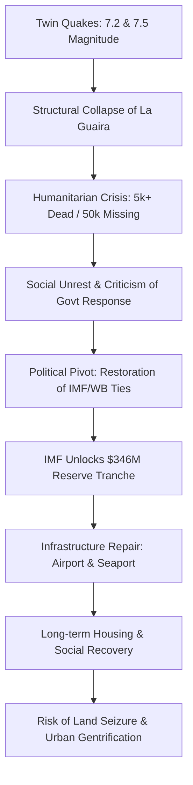

---
title: "Venezuela's La Guaira Earthquake: Ruins and Recovery"
tags: [venezuela, la-guaira, earthquake, imf, humanitarian-crisis, seismic-activity, disaster-recovery, caribbean-basin]
---

# 📰 The Rubble of La Guaira: What's Really Happening After Venezuela’s Earthquake

The Caribbean coast of Venezuela has long been a region defined by its stark beauty—where the steep cliffs of the Avila mountains plummet directly into the turquoise waters of the Caribbean. However, in June 2026, this geography became a death trap. What unfolded in the state of La Guaira was not merely a natural disaster, but a catastrophic intersection of geological instability, urban negligence, and political volatility.

On June 24, the ground under La Guaira literally split open. The region was struck by a rare and devastating "double-tap" seismic event. First, a **magnitude 7.2** earthquake rocked the coast, sending shockwaves through the city's infrastructure. Then, in a harrowing interval of just **39 seconds**, a second, more powerful **magnitude 7.5** quake struck the same epicenter. In less than a minute, entire city blocks were reduced to piles of pulverised concrete and twisted rebar.

By mid-July, the official death toll reached a grim milestone. National Assembly President Jorge Rodriguez confirmed that **5,119 people have died** ([Al Jazeera](https://www.aljazeera.com/amp/news/2026/7/18/venezuela-quake-death-toll-tops-5000-as-imf-releases-emergency-aid)). While the government maintains a narrative of controlled recovery, the reality on the ground is one of desperation. Though the International Monetary Fund (IMF) has released **$346 million** in emergency funds, for the thousands of survivors still huddling in sports stadiums or digging through ruins with their bare hands, international financial maneuvers feel like a distant abstraction.

---

### 🌋 The "One-Two Punch": Anatomy of a Catastrophe

To understand the scale of the destruction, one must look at the location. La Guaira is situated approximately **40 kilometers northeast** of the capital, Caracas. It serves as the country's primary gateway to the world, housing the main international airport (Simón Bolívar International Airport) and the nation's largest seaport. When the seismic waves hit, the city's strategic importance became its greatest vulnerability.

The devastation was amplified by a phenomenon known as structural fatigue. The first magnitude 7.2 quake acted as a "softening" blow. It created hairline fractures in the foundations of apartment towers and weakened the load-bearing columns of commercial buildings. Because the second, stronger quake arrived just **39 seconds later**, there was no time for the structures to settle. The second shockwave hit buildings that were already compromised, causing them to pancake—a collapse where floors stack on top of one another, leaving almost no survival voids for those trapped inside.

The geographical bottleneck of La Guaira further complicated the tragedy. The city is a narrow strip of land squeezed between the mountains and the sea. When the shaking began, massive landslides cascaded down the slopes, obliterating the main coastal highways. This created an immediate logistical nightmare: rescue teams from Caracas could not reach the epicenter, and survivors were trapped in a corridor of wreckage with no way out.

Furthermore, the seismic activity did not end with the twin quakes. The region has experienced over **1,300 aftershocks**, some strong enough to bring down already leaning walls. This persistent instability has created a climate of terror, forcing survivors to sleep in open squares rather than risking a return to their homes.

---

### 💔 The Human Cost: Beyond the Official Numbers

The official death toll of **5,119** is viewed by many international observers and local activists as a conservative estimate. The United Nations has suggested a far more haunting reality, estimating that as many as **50,000 people remain missing** ([Al Jazeera](https://www.aljazeera.com/amp/news/2026/7/18/venezuela-quake-death-toll-tops-5000-as-imf-releases-emergency-aid)). This massive discrepancy suggests a breakdown in accounting, or perhaps a government reluctance to acknowledge the full scale of the carnage.

While official reports state there are **16,740 injured** and that most have been discharged from hospitals ([Yahoo News Canada](https://ca.news.yahoo.com/venezuela-quake-death-toll-tops-082528691.html)), the psychological and physical scars remain deep. The failure of state-led rescue operations led to the rise of a shadow economy of recovery.

Desperate families, unwilling to wait for military teams that were slow to arrive, began hiring private recovery workers known as "moles." These individuals are often former construction workers or locals with basic digging equipment who charge exorbitant fees to search the rubble. Some "moles" reportedly charge up to **$1,300**—a fortune in the collapsed Venezuelan economy—simply to retrieve a body.

Joan Torumo, a volunteer who witnessed the aftermath, provided a chilling account of this practice:

> "When they find your loved one, they ask you for a black rubbish bag and bring them back inside it" ([Politis](https://en.politis.com.cy/news/world/1020036/venezuela-earthquake-death-toll-tops-5000-as-imf-releases-346m-for-rebuilding)).

The proliferation of "moles" is a damning indictment of the state's response. Many believe the government only counts victims if a relative is present to identify the body at the moment of recovery, effectively erasing thousands of "unclaimed" dead from the official statistics.

---

### 💰 The IMF Lifeline: Understanding the "Reserve Tranche"

In a surprising diplomatic shift, the International Monetary Fund (IMF) stepped in to provide financial relief. Interim President Delcy Rodriguez announced a release of **$346 million** in emergency funding, a move confirmed by IMF Managing Director Kristalina Georgieva ([Al Jazeera](https://www.aljazeera.com/amp/news/2026/7/18/venezuela-quake-death-toll-tops-5000-as-imf-releases-emergency-aid)).

However, to understand this money, one must understand the concept of **Special Drawing Rights (SDRs)**. The IMF does not typically provide "grants" in the traditional sense. Instead, it uses SDRs—an international reserve asset. Venezuela actually holds approximately **3.568 billion SDRs**, which equates to roughly **$5.1 billion** ([Dainik Jagran English](https://english.dainikjagranmpcg.com/international/venezuela-earthquake-death-toll-rises-above-5000-as-imf-releases/article-22688)).

For years, this money was effectively frozen. Due to international sanctions and disputes over the legitimacy of the government in Caracas, Venezuela could not access its own reserves. The release of the **$346 million** is not a gift from the IMF, but rather the "unlocking" of a portion of Venezuela's own assets.

The government has earmarked these funds for three critical pillars of recovery:
1. **Immediate Survival:** Procurement of potable water, emergency food rations, and essential medicines for those in temporary shelters.
2. **Critical Infrastructure:** Repairing the runways of the international airport and the berths of the seaport to allow larger shipments of international aid to arrive.
3. **Housing Transition:** A desperate attempt to move **20,000 displaced people** from tents and stadiums into semi-permanent housing.

Critics argue that the timing of this release is as much about politics as it is about humanitarianism. By unlocking these funds, the IMF is signaling a tacit recognition of the current administration's authority.

---

### ⚖️ The Geopolitics of Disaster

The tragedy in La Guaira cannot be separated from the political upheaval of early 2026. For nearly a decade, Venezuela existed in a state of diplomatic isolation. The IMF and the World Bank refused to engage with the administration of Nicolas Maduro, which contributed to a catastrophic economic spiral and left the country’s disaster preparedness systems in shambles.

The landscape shifted dramatically in January 2026, when Maduro was forcibly removed from power ([Yahoo News Canada](https://ca.news.yahoo.com/venezuela-quake-death-toll-tops-082528691.html)). This regime change opened a diplomatic window. By April 2026, the IMF and World Bank had resumed formal communications with Caracas.

Had these earthquakes occurred in 2025, the **$346 million** would likely have remained frozen. The current administration—led by figures like Delcy Rodriguez and Jorge Rodriguez—is now leveraging this newfound international legitimacy to manage the crisis. However, this "diplomatic win" is overshadowed by internal rage. Survivors argue that while the money is coming now, the *competence* was missing when it mattered most—during the first 72 hours of the "Golden Window" for rescue.

---

### ⛺ Life in the Shadows: The Stadium Cities

For the **20,000 people** who lost their homes, "recovery" is a word that feels like a lie. Many have migrated to makeshift cities established in public spaces. The most prominent of these is a large sports stadium in La Guaira, which has been transformed into a sprawling tent city.

Conditions in these shelters are precarious. Survivors report a systemic failure in basic sanitation:
* **Water Scarcity:** With the city's water mains ruptured, residents rely entirely on intermittent truck deliveries.
* **Sanitary Collapse:** Toilets are overflowing and waste management is non-existent, raising the immediate threat of cholera and other water-borne diseases.
* **Medical Trauma:** While the **16,740 injured** are largely out of acute care, the camps lack the facilities to treat chronic injuries, infections, or the pervasive PTSD affecting the population.

The loss is not just physical. Entire neighborhoods—social ecosystems that had existed for generations—were erased. Families are now sleeping on pavements and in public squares, facing the terrifying possibility that the government may seize their land for "urban renewal" rather than allowing them to rebuild their own homes.

---

### 🔍 The Accountability Gap: Who Failed La Guaira?

The central conflict in the aftermath of the quake is the narrative of the response. The Venezuelan state claims a "swift and decisive" action. However, independent investigations tell a different story. A Reuters report indicated that the initial rescue effort was plagued by chaos: **military orders were delayed**, specialized search-and-rescue gear was unavailable, and there was a critical lack of a unified command structure ([Al Jazeera](https://www.aljazeera.com/amp/news/2026/7/18/venezuela-quake-death-toll-tops-5000-as-imf-releases-emergency-aid)).

When confronted with these reports, Jorge Rodriguez dismissed them as products of "media laboratories," suggesting that international news outlets were fabricating stories to undermine the government ([Al Jazeera](https://www.aljazeera.com/amp/news/2026/7/18/venezuela-quake-death-toll-tops-5000-as-imf-releases-emergency-aid)).

For those who lost everything, this dismissal is an insult. Ildegár Mujica, an economist who spent days searching for his former wife beneath the ruins of a 12-storey building, expressed the collective grief of the survivors:

> "There are many people down there, but nobody wants to touch the dead" ([Politis](https://en.politis.com.cy/news/world/1020036/venezuela-earthquake-death-toll-tops-5000-as-imf-releases-346m-for-rebuilding)).

The existence of the "moles" is the ultimate proof of this failure. When a state cannot provide the basic dignity of recovering a citizen's body, the "swift response" narrative collapses.

---

### 📉 The Cycle of Disaster and Debt

The path from the first tremor to the IMF disbursement follows a predictable, yet tragic, pattern of state failure and international intervention.

---

### 🌅 The Long Road to Reconstruction

The earthquakes of June 24, 2026, were more than a geological event; they were a stress test for a nation in transition. The loss of **5,000+ lives** and the displacement of **20,000 people** is a tragedy that will haunt Venezuela for a generation.

While the **$346 million** from the IMF provides a necessary financial floor, money cannot rebuild the trust between the people and the state. The reconstruction of La Guaira will require more than just new concrete and asphalt; it requires a commitment to transparency and a genuine effort to account for the **50,000 missing**.

As the world looks on, the ruins of La Guaira serve as a stark reminder of the cost of instability. For the survivors, the goal is no longer just a roof over their heads, but the peace of knowing where their loved ones are buried. The road back is long, and for many, it is a road they must walk alone.

---

## 📚 References & Further Reading

  
  
📸 <a href="https://unsplash.com/@jimromero">Jim Romero</a> on <a href="https://unsplash.com/photos/city-with-high-rise-buildings-during-night-time-b6Pzz9yrjsg">Unsplash</a>

* **Al Jazeera**: [Venezuela quake death toll tops 5,000 as IMF releases emergency aid](https://www.aljazeera.com/amp/news/2026/7/18/venezuela-quake-death-toll-tops-5000-as-imf-releases-emergency-aid)
* **Dainik Jagran English**: [Venezuela Earthquake Death Toll Rises Above 5,000 as IMF Releases $346 Million](https://english.dainikjagranmpcg.com/international/venezuela-earthquake-death-toll-rises-above-5000-as-imf-releases/article-22688)
* **Politis**: [Venezuela Earthquake Death Toll Tops 5,000 as IMF Releases $346m for Rebuilding](https://en.politis.com.cy/news/world/1020036/venezuela-earthquake-death-toll-tops-5000-as-imf-releases-346m-for-rebuilding)
* **Yahoo News Canada**: [Venezuela quake death toll tops 5,000 as IMF releases recovery funds](https://ca.news.yahoo.com/venezuela-quake-death-toll-tops-082528691.html)
* **International Monetary Fund (IMF)**: [About Special Drawing Rights (SDRs)](https://www.imf.org/external/np/fin/sdr/sdr.htm)
* **USGS**: [Latest Earthquakes and Seismic Hazards](https://earthquake.usgs.gov/)
* **United Nations (OCHA)**: [Humanitarian Response Planning](https://www.unocha.org/)
* **World Bank**: [Venezuela Country Overview](https://www.worldbank.org/en/country/venezuela)