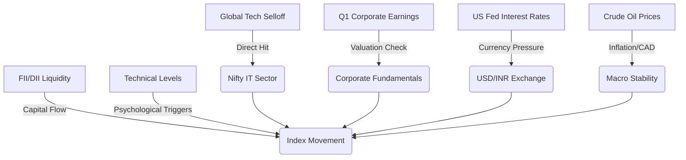

```yaml
title: Sensex and Nifty Outlook: 6 Key Market Drivers Explained
tags: [indian-stock-market, nifty-50, sensex, investing-tips, global-economy, fii-dii, stock-analysis, financial-markets]
```

# 📈 Will Sensex and Nifty Keep Climbing? Here are the 6 Things Actually Moving the Market

The current atmosphere on Dalal Street is one of cautious optimism bordering on anxiety. While the long-term trajectory of the Indian economy remains one of the most compelling growth stories globally, the immediate horizon is clouded by volatility. As investors prepare for the market opening, the central question is no longer just about India's internal growth engine, but whether that engine is powerful enough to withstand a chaotic global environment. 

For several quarters, the Indian equity markets seemed to exist in a sanctuary of their own, insulated by a massive surge in domestic retail participation and robust macroeconomic fundamentals. However, the "AI gold rush" that propelled global indices to record highs is facing a reality check. The global tech sector is experiencing a correction, and the ripple effects are reaching the shores of Mumbai.

Investors are currently balancing a complex array of triggers. From the granular details of **Q1 FY25 corporate earnings** to the sweeping sell-offs in the US Nasdaq, the variables are numerous and interconnected. We are witnessing a fundamental transition: the market is moving away from "momentum buying"—where assets were purchased simply because their prices were rising—toward a "value-driven" phase. Investors are now asking the critical question: *Is the intrinsic value of these companies justifying their current valuations?* Monday’s trading session is not merely another day on the calendar; it is a litmus test for the sustainability of the current bull run.

---

## 🏢 1. The Q1 Earnings Reality Check: Fundamentals vs. Speculation

The ultimate heartbeat of any equity market is corporate profitability. For the Nifty 50, the Q1 FY25 results are serving as a necessary wake-up call. Historically, Indian stocks have traded at a premium compared to other emerging markets (EMs). While this premium is justified by higher GDP growth and political stability, it leaves very little margin for error. When a stock trades at a high Price-to-Earnings (P/E) ratio, the market isn't just pricing in current growth—it is pricing in "perfection."

Currently, we are seeing a stark divergence across sectors:

*   **BFSI (Banking, Financial Services, and Insurance):** This sector remains the bedrock of the index. While the Reserve Bank of India (RBI) has tightened norms on unsecured lending to curb systemic risk, the core credit growth remains healthy. However, any compression in Net Interest Margins (NIMs) could spark a sell-off in heavyweights like HDFC Bank or ICICI Bank.
*   **FMCG (Fast-Moving Consumer Goods):** This sector is under pressure. Slow rural recovery and an erratic monsoon have dampened volume growth. For companies like Hindustan Unilever (HUL) or ITC, the challenge is to pass on raw material costs to a consumer base that is currently price-sensitive.
*   **Mid-Caps and Small-Caps:** This is the area of highest concern. Over the last **24 months**, many mid-cap stocks have seen their valuations decouple from their actual earnings. The "froth" in this segment is significant.

> "Earnings are the ultimate anchor. In a volatile global market, the only mechanism that can prevent a sharp correction in India is the proven ability of corporates to grow their bottom lines without relying solely on multiple expansion."

The market is shifting its focus from headline profits to **Free Cash Flow (FCF)**. Investors are no longer satisfied with "adjusted" EBITDA; they want to see actual cash hitting the bank. If the remaining Q1 reports show shrinking margins due to rising input costs or stagnating demand, we can expect a rotation of capital from risky small-caps back into the relative safety of large-cap "blue chip" stocks.

[Explore detailed Q1 earnings analysis on Economic Times](https://economictimes.indiatimes.com/markets/stocks/news).

---

## 💻 2. The US Tech Drama: The Nasdaq Ripple Effect

The most immediate external threat to Indian indices is the volatility in the US Nasdaq. For the past eighteen months, global equity markets were effectively carried by the "Magnificent Seven"—Apple, Microsoft, Alphabet, Amazon, Nvidia, Meta, and Tesla. The narrative was simple: Generative AI would revolutionize every industry, and the companies providing the hardware (like Nvidia) and software (like Microsoft) would see exponential growth.

However, the market mood has shifted from "speculative excitement" to "execution demand." Investors are now demanding proof of monetization. They want to see how AI is translating into actual revenue growth and margin expansion for software-as-a-service (SaaS) and IT services firms.

**The AI Paradox for Indian IT:**
This shift creates a complex dynamic for the Indian IT giants—**TCS, Infosys, and HCL Tech**. While AI offers immense long-term opportunities for operational efficiency and new service offerings, it creates short-term headwinds. The traditional "time and material" billing model (charging by the hour) is under threat because AI can complete tasks in a fraction of the time. These firms are now scrambling to pivot toward "outcome-based" or "value-based" pricing models.

When the Nasdaq dips, it triggers a "risk-off" sentiment globally. Because Indian IT stocks are highly correlated with US tech valuations, they often fall in tandem, regardless of their individual balance sheets. Furthermore, many global emerging market funds treat "Tech" as a single asset class. When they liquidate US tech positions to lock in profits or hedge risk, they often sell their most liquid holdings in other markets—like India—to raise cash quickly. This is why a red screen in Silicon Valley frequently leads to a red screen in Mumbai.

[Monitor real-time global tech trends on Nasdaq](https://www.nasdaq.com).

---

## ⚔️ 3. The FII vs. DII Battle: The New Market Architecture

For decades, the Indian stock market was a playground for Foreign Institutional Investors (FIIs). The playbook was simple: FIIs buy, the market rallies; FIIs sell, the market crashes. However, the structural architecture of the Indian market has undergone a revolution. We are now witnessing a monumental **Tug-of-War** between FIIs and Domestic Institutional Investors (DIIs).

**The Mechanics of the Money Flow:**
*   **Foreign Institutional Investors (FIIs):** Their movements are dictated by global macro factors. They track the **US Dollar Index (DXY)**, geopolitical stability, and relative valuations between India and other markets (like China). If the US Treasury yields rise, FIIs often pull money out of emerging markets to seek safer, guaranteed returns in USD.
*   **Domestic Institutional Investors (DIIs):** This group is powered by the "SIP Revolution." Millions of Indian retail investors have institutionalized their savings through Systematic Investment Plans (SIPs). This has created a consistent, monthly inflow of capital that acts as a massive shock absorber.

The data reveals a striking trend: there are now frequent sessions where FIIs sell **thousands of crores** worth of equities, yet the Nifty 50 finishes the day in the green. This "domestic wall of money" has effectively decoupled the Indian market from the total dependence on foreign capital that characterized the 2000s and 2010s.

However, this protection is not absolute. DIIs cannot buy indefinitely if the fundamental earnings (as discussed in Section 1) are deteriorating. If FIIs enter a prolonged selling streak—perhaps triggered by a massive reallocation of funds toward a recovering Chinese market—the domestic liquidity may eventually be overwhelmed. Monday's movement will hinge on whether FIIs view the current Indian valuations as "too rich" or if they see India as a safe haven amidst global instability.

[Analyze institutional flow data via NSE India](https://www.nseindia.com).

---

## 🏦 4. The Federal Reserve's Influence: Interest Rates and the Rupee

The US Federal Reserve acts as the "invisible hand" guiding global liquidity. For Dalal Street, the singular most important question is the timing and magnitude of Fed rate cuts. The correlation is direct: **Lower US Interest Rates $\rightarrow$ Weaker US Dollar $\rightarrow$ Increased Capital Flow to Emerging Markets $\rightarrow$ Equity Bull Market.**

Currently, the market has priced in rate cuts for late 2024. However, the Fed is in a precarious position. If US inflation remains "sticky" or the labor market stays unexpectedly strong, the Fed may keep rates "higher for longer." This creates immediate pressure on the **USD/INR exchange rate**.

**The Rupee-Market Connection:**
A strengthening US Dollar (rising DXY) puts downward pressure on the Indian Rupee. This is problematic for two reasons:
1.  **Import Costs:** India imports a vast amount of essential commodities. A weaker Rupee makes these imports more expensive, fueling domestic inflation.
2.  **Currency Depreciation Risk:** Foreign investors calculate their returns in Dollars. If the Nifty goes up by **5%** but the Rupee falls by **3%** against the Dollar, the actual return for the FII is only **2%**. This makes Indian assets less attractive.

To combat this, the Reserve Bank of India (RBI) frequently intervenes by selling dollars from its foreign exchange reserves—which currently stand at a robust level—to prevent a free-fall of the Rupee. However, constant intervention is a temporary fix. The market is craving a clear, definitive signal from the Fed that the hiking cycle is over and the easing cycle has begun. Such a signal would provide the necessary fuel for the Nifty to break through its current psychological resistance levels.

[Stay updated with Federal Reserve monetary policy](https://www.federalreserve.gov).

---

## 🛢️ 5. The Crude Oil Dependency: India's Achilles' Heel

India's economic vulnerability is most apparent in its energy profile. Importing over **80% of its crude oil** requirements makes the Indian economy hypersensitive to fluctuations in Brent Crude prices. Oil is not just a commodity; it is a primary driver of the **Current Account Deficit (CAD)** and a major contributor to the Wholesale Price Index (WPI) inflation.

**The Oil Domino Effect:**
$\text{Rising Oil Prices} \rightarrow \text{Higher Logistics/Input Costs} \rightarrow \text{Consumer Price Inflation} \rightarrow \text{RBI Maintains High Rates} \rightarrow \text{Lower Corporate Profitability} \rightarrow \text{Market Correction}$

Currently, oil prices are caught in a geopolitical tug-of-war:
*   **Bullish Factors (Pushing prices up):** Ongoing tensions in the Middle East, potential supply disruptions, and OPEC+ production cuts designed to keep prices elevated.
*   **Bearish Factors (Pushing prices down):** A sluggish economic recovery in China (the world's largest oil importer) and increased production from non-OPEC nations like the US and Brazil.

For the upcoming trading session, any spike in Brent crude above **$85–$90 per barrel** is a red flag. It immediately impacts sectors such as **Paints (due to crude-based monomers), Aviation (due to ATF costs), and Lubricants**. Conversely, if oil prices stabilize or decline, it provides a "tailwind" that allows investors to ignore global noise and focus on India's internal growth metrics.

[Track global oil and commodity prices via Bloomberg](https://www.bloomberg.com).

---

## 📉 6. Technical Analysis: Support, Resistance, and Psychology

While fundamentals tell us *why* a market should move, technical analysis tells us *where* and *when* it is likely to move. Institutional traders and algorithmic bots rely on specific price levels to trigger massive buy or sell orders, often creating self-fulfilling prophecies.

**Critical Nifty 50 Levels to Watch:**
*   **The Floor (Support):** The **24,000 - 24,200** zone is currently viewed as the primary support. As long as the index holds above this level, the long-term bullish structure remains intact. A decisive close below this could trigger "stop-loss" selling, leading to a sharper correction.
*   **The Ceiling (Resistance):** There is significant selling pressure around the **24,800 - 25,000** mark. Breaking through this psychological barrier requires a "perfect storm": strong Q1 earnings combined with a dovish signal from the Fed.
*   **The RSI Indicator:** The Relative Strength Index (RSI) for several heavy-weight stocks is currently in the **"Overbought" (above 70)** territory. This suggests that the rally has been too steep and a period of "time correction" (moving sideways) or a minor dip is healthy to shake out speculative traders.

Swing traders are also monitoring the **20-day and 50-day Exponential Moving Averages (EMA)**. A "Golden Cross"—where the short-term average crosses above the long-term average—is a classic bullish signal. Conversely, if the Nifty slips below its 50-day EMA, it may signal a shift from a "buy the dip" market to a "sell the rip" market.

---

## 🗺️ Market Steering Logic: The Interconnectivity Map

The Indian market does not move based on one factor, but rather the interaction of all six. The following diagram illustrates how these variables converge to influence the index.



---

## 🏁 Conclusion: The Verdict for Monday

Will the Sensex and Nifty continue their ascent on Monday? The most accurate answer is that the market is currently in a state of **Equilibrium between Internal Strength and External Fragility**.

**The Bull Case:** If the US tech sell-off stabilizes and the final batch of Q1 earnings shows resilience, the Nifty is well-positioned to test its upper resistance levels. The domestic SIP flow provides a safety net that didn't exist a decade ago, making the "floor" much more stable.

**The Bear Case:** If the US Dollar Index (DXY) spikes, oil prices climb due to Middle East tensions, and corporate margins show signs of contraction, we could see a healthy correction of **3-5%**. Given the high valuations, the market is currently more sensitive to negative news than positive news.

For the strategic investor, the current environment demands **selective optimism**. The era of "blindly buying the dip" across the board is over. Success in the current phase of the bull market requires a focus on quality: companies with **strong cash flows, low debt-to-equity ratios, and a clear strategy for AI integration**. Monday may be volatile, but the overarching narrative of India as a global growth engine remains intact. The key is to ignore the daily noise and focus on the quarterly trend.

---

## 📚 References

*   **Economic Times:** [Comprehensive Market News & Equity Analysis](https://economictimes.indiatimes.com/markets/stocks/news)
*   **NSE India:** [Live Market Data, Indices, and Institutional Flow Reports](https://www.nseindia.com)
*   **Nasdaq:** [Global Technology Index Tracking and Tech Sector Analysis](https://www.nasdaq.com)
*   **Federal Reserve:** [Official Monetary Policy Statements and Rate Updates](https://www.federalreserve.gov)
*   **Bloomberg:** [Global Commodity Tracking and Brent Crude Analysis](https://www.bloomberg.com)
*   **MoneyControl:** [Q1 FY25 Corporate Earnings Dashboard and P/E Ratios](https://www.moneycontrol.com)
*   **RBI:** [Foreign Exchange Reserves and Monetary Policy Reports](https://www.rbi.org.in)
*   **Investing.com:** [Global Indices and Advanced Technical Charts](https://www.investing.com)
*   **BSE India:** [Sensex Data and Company Filings](https://www.bseindia.com)
*   **World Bank:** [India GDP Growth Projections and Macroeconomic Data](https://www.worldbank.org)