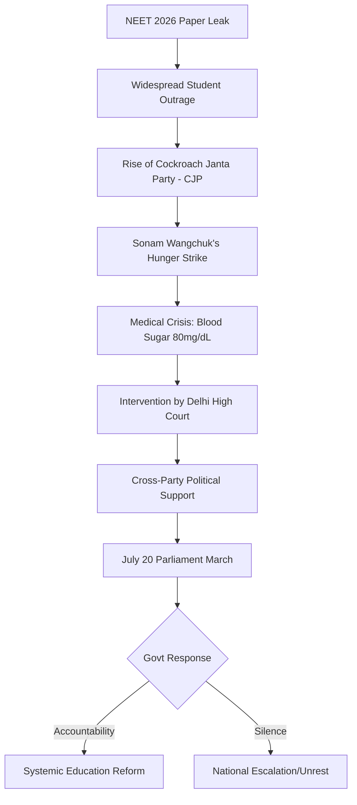

```yaml
title: "Fasting for the Future: Sonam Wangchuk & India's Exam Crisis"
tags: [sonam-wangchuk, neet-2026, education-reform, india-protests, mental-health, competitive-exams, cjp-party]
```

Imagine being at Jantar Mantar on July 17, 2026. The air is thick with a heavy mix of desperation and defiance, a palpable tension that vibrates through the crowd of thousands. Right in the epicenter of this storm is Sonam Wangchuk—the innovator, educator, and visionary from Ladakh whose face has become synonymous with resilience. By this point, he has been on an indefinite hunger strike for twenty days, and the physical toll is becoming impossible to ignore. He isn't just fighting for the preservation of Himalayan glaciers or the constitutional autonomy of Ladakh anymore; he has evolved into the focal point of a massive, nationwide frustration with a school system that is not merely glitching, but fundamentally collapsing.

With his **blood sugar plummeted to 80mg/dL** and medical teams expressing grave concerns regarding potential organ damage, Wangchuk has remained steadfast. His ultimatum is clear: he will not break his fast until the Union government accepts systemic responsibility for the failures of the national examination apparatus. This is no longer a local protest; it is a battle for the soul of Indian education.

He does not stand alone. Surrounding him is a surreal coalition: the "Cockroach Janta Party" (CJP) and students from the All India Students’ Association (AISA). It is a striking sight—part satirical political theater, part grim determination. The catalyst for this upheaval was a total institutional meltdown: the catastrophic NEET 2026 paper leaks coupled with a systemic failure in the CBSE's "On-Screen Marking" process. What began as a series of administrative errors has morphed into a national referendum on how India treats its youth and the predatory nature of the competitive exam industry. It is, in essence, one man pushing his physical body to the absolute limit to prevent an entire generation from hitting theirs.

---

## 🪳 The Cockroach Janta Party: Satire as a Weapon of Survival

<div class="post-hero">
  
  <div class="post-hero-credit">📸 <a href="https://unsplash.com/@corey_untitled">Corey Young</a> on <a href="https://unsplash.com/photos/grayscale-photo-of-people-walking-on-street-_ShB2QhB4C0">Unsplash</a></div>
</div>


To grasp the emotional core of the protest, one must understand the Cockroach Janta Party (CJP). Founded by youth activist Abhijeet Dipke, the CJP is not a political party in the traditional sense, but a movement rooted in the art of the absurd. In a political landscape dominated by rigid ideologies and dynastic legacies, these students chose the cockroach as their mascot. The choice was deliberate and biting. Cockroaches are renowned for their ability to survive almost any catastrophe, including nuclear fallout. For these students, the "nuclear apocalypse" is the crushing, dehumanizing pressure of India's education system. They have survived the sleepless nights, the social isolation, and the mental breakdowns; they are refusing to be ignored by a negligent administration.

According to [Wikipedia's documentation of the 2026 Jantar Mantar protests](https://en.wikipedia.org/wiki/2026_Delhi_Jantar_Mantar_protests), the CJP launched its primary offensive on June 20, 2026. They utilize satire to highlight the grotesque absurdity of a system where a single leaked PDF—distributed via a Telegram group—can incinerate years of a student's disciplined hard work. By framing themselves as a "party," they mock the very political structures that failed to secure the integrity of the exams. They aren't seeking a seat in Parliament; they are illustrating the absolute powerlessness of a student facing a monolithic, uncaring bureaucracy.

The CJP has provided a strategic framework for other student organizations, including the Students Federation of India (SFI) and AISA. Their demands are uncompromising: the immediate resignation of Union Education Minister Dharmendra Pradhan and a mandate for **₹1 crore in compensation** for the families of students who committed suicide as a result of exam irregularities. This is not a request for policy tweaks; it is a demand for a moral reckoning. By embracing the identity of "cockroaches," these students have reclaimed a term of insignificance and transformed it into a badge of survival.

---

## 📉 The Breaking Point: NEET 2026 and the CBSE Digital Disaster

The spark that ignited this national fire was a devastating "double whammy": the 2026 NEET paper leak and the simultaneous collapse of the CBSE's "On-Screen Marking" system. While the forensic details are still emerging in [live reports by The Hindu](https://www.thehindu.com/news/national/i-will-stay-alive-till-july-20-at-any-cost-wangchuk-as-fast-enters-day-20/article71232868.ece), the pattern is a haunting repetition of history. India has long struggled with a "paper leak economy"—a shadow market where exam questions are auctioned to the highest bidder, effectively turning academic merit into a purchasable commodity.

This crisis mirrors the [NEET-UG 2024 controversy](https://indianexpress.com/article/great-neet-2024-controversy-paper-leak-grace-marks-explained/), where the issuance of "grace marks" and suspected leaks led to a protracted legal battle in the Supreme Court. However, 2026 feels fundamentally different because of the digital failure. The CBSE's transition to "On-Screen Marking" was intended to increase efficiency, but it instead introduced technical glitches and opaque grading algorithms. Millions of students found their futures decided not by their knowledge, but by software bugs and inconsistent digital grading. When a student's entire life trajectory can be altered by a glitch or a bribe, the concept of "merit" becomes a cruel fiction.

Consequently, trust in the National Testing Agency (NTA) and the Ministry of Education has evaporated. The public exam is the primary vehicle for social mobility in India; when that vehicle is corrupted, the psychological impact on the youth is catastrophic. This is a crisis of institutional integrity, echoing [previous warnings from the Supreme Court](https://livelaw.in/top-stories/supreme-court-on-neet-paper-leaks-national-crisis-indian-government-must-ensure-integrity/) that substandard exam security constitutes a national crisis. The CJP argues that these are not "administrative lapses" but systemic crimes committed by the state against its children.

---

## 🏔️ The Reformer’s Burden: From SECMOL to the Streets of Delhi

The question remains: why would a Ladakhi innovator like Sonam Wangchuk tether his fate to a student protest in Delhi? The answer lies in his lifelong crusade against "rote learning"—the mechanical memorize-and-repeat pedagogy that defines Indian schooling. Wangchuk is not a politician; he is an engineer and educator who founded the Students' Educational and Cultural Movement of Ladakh (SECMOL) in 1988. As detailed in his [Wikipedia biography](https://en.wikipedia.org/wiki/Sonam_Wangchuk), SECMOL was born from the realization that the public school system was designed for a different climate and mindset, leaving Ladakhi students to fail despite their innate intelligence.

Wangchuk’s philosophy is centered on "learning by doing." He views the contemporary Indian education system as a "memory factory" that systematically kills curiosity. By aligning with the CJP, he is connecting the dots: when education is reduced to a high-stakes race for a handful of medical or engineering seats, the system becomes inherently prone to corruption. If the goal were actual *learning*, a leaked paper would be an annoyance. But when the goal is a *rank*, a leaked paper is a tragedy.

> "I am weak from the outside but very strong inside. I am sure all of you are strong from the inside, and outside too. We need this energy for July 20, when we will take out a peaceful march to Parliament," Wangchuk declared during a moment of frailty.

His statement is a powerful metaphor: his wasting body is a reflection of the decay within the educational system. Moving from the serene heights of Ladakh to the chaotic streets of Jantar Mantar represents a shift in scale. He is no longer advocating for regional rights or environmental protection; he is fighting for the cognitive and mental freedom of every Indian student. He views the obsession with standardized testing as a form of mental incarceration, where the only exit is a door that the state has left unlocked for the wealthy.

---

## 💔 The Human Toll: The Shadow of the Kota Factory

The most harrowing aspect of the CJP protest is the demand for compensation for students who took their own lives. This is a direct indictment of the "coaching complex"—the parallel education industry that has effectively replaced formal schooling in hubs like Kota, Rajasthan. As [Al Jazeera reported on the 'Coaching Factory'](https://www.aljazeera.com/news/2024/4/15/kota-the-coaching-factory-and-the-student-suicide-crisis/), Kota has become a global symbol of the inhuman pressure placed on teenagers.

The "exam factory" model is predicated on extreme, curated competition. Students are stratified into "batches" based on their mock test scores, creating a rigid intellectual caste system. In this environment, a paper leak is not just a logistical failure; it is a psychological death blow. Imagine a student spending **16 hours a day** in a 10x10 room, sustained only by the hope of a specific rank, only to discover the game was rigged. The collapse is not just academic; it is an existential failure of their identity and their parents' life savings. The CJP’s demand for **₹1 crore per family** is a strategic attempt to force the government to quantify the value of the lives it has failed to protect.

[The Hindu's analysis of private tuition](https://www.thehindu.com/opinion/lead/the-coaching-complex-how-private-tuition-is-replacing-schools-in-india/article67123456.ece) highlights how formal schooling has become a mere formality, while the actual "cracking" of the test occurs in expensive, high-pressure private centers. This creates a dual tragedy: students who cannot afford premium coaching are disadvantaged from the start, and those who do are pushed to the brink of insanity. It is a mental health epidemic where a child's self-worth is reduced to a percentile.

---

## ⚙️ The Mechanics of Failure: The NTA and the Paper Leak Economy

To understand why this keeps happening, one must look at the National Testing Agency (NTA). Designed to be an autonomous body, the NTA has instead become a lightning rod for controversy. The "paper leak economy" is not a series of isolated incidents but a sophisticated network involving insiders, printing press operators, and middle-men.

The process typically follows a predictable pattern:
1. **The Breach:** A paper is leaked during the printing or transport phase.
2. **The Auction:** The questions are sold to coaching centers or wealthy individuals for sums reaching **tens of millions of rupees**.
3. **The Distribution:** Leaked content is disseminated via encrypted apps like Telegram just hours before the exam.
4. **The Result:** A suspicious spike in "perfect" scores in specific regions, which the NTA often fails to flag until public outrage reaches a boiling point.

This systemic rot suggests that the NTA lacks the necessary security infrastructure and, more importantly, the political will to purge corrupt elements. When the state agency responsible for meritocracy becomes the facilitator of corruption, the social contract is broken. The CJP argues that the NTA should be dismantled and replaced with a decentralized, transparent system that incorporates blockchain technology for paper security—a suggestion that underscores the gap between the students' vision and the government's inertia.

---

## ⚖️ The Political Collision: A Rare Unity of Opposites

One of the most significant developments of the 2026 protests is the unprecedented coalition of political figures standing with Wangchuk. It is rare to see Congress's Pawan Khera, AAP's Arvind Kejriwal, TMC's Mamata Banerjee, and SP's Akhilesh Yadav in a unified front. This indicates that the education crisis has transcended partisan politics to become a matter of basic civic justice.

The failure to conduct a fair exam is viewed as a breach of trust between the state and its citizens. When intellectuals like Arundhati Roy and actors like Naseeruddin Shah join the fray, the protest shifts from a student grievance to a civil rights struggle. They argue that when the state allows merit to be bought, it sends a devastating message to the youth: hard work is irrelevant; only money and connections provide a path forward.

The judiciary has also been forced to intervene. The Delhi High Court, observing Wangchuk’s deteriorating health—specifically a **blood pressure of 108/68mmHg** and a **pulse of 72bpm**—has mandated daily health screenings. This puts the government in a precarious position. While the administration prefers to let the protest fade into obscurity, the court's involvement ensures that Wangchuk's health is a matter of public record. Should he suffer a medical emergency, the narrative will instantly shift from "exam irregularities" to "state negligence leading to the death of a national icon."

---

## 🚶 Toward the Temple of Democracy: The July 20 March

The momentum is building toward July 20, the opening day of Parliament's Monsoon Session. The CJP and Sonam Wangchuk are organizing a peaceful march to the "temple of democracy," intending to bring their grievances directly to the doorstep of the legislators. The timing is tactical, ensuring that the education crisis dominates the news cycle exactly when the government is most visible.

The objectives for the July 20 march are precise:
1. **Official Admission of Failure:** A formal acknowledgement from the Ministry of Education regarding the 2026 leaks.
2. **Structural Overhaul:** A complete redesign of the NTA’s security protocols to permanently end the "leak economy."
3. **Symbolic Accountability:** The resignation of Union Education Minister Dharmendra Pradhan.

The stakes could not be higher. Wangchuk has remarked with a haunting irony that if the march fails, he will "come back as a ghost." While phrased as a joke, it reflects a profound disillusionment. If a man is willing to starve himself for the sake of the youth and is still ignored, it confirms the protesters' worst fear: that the state is not just negligent, but indifferent.



---

## 🌍 The Global Contrast: Why India's Model is Failing

To understand the pathology of the Indian system, it is helpful to look at global alternatives. In countries like Finland, the emphasis is on holistic growth and teacher autonomy rather than high-stakes standardized testing. There are no national "rankings" that determine a child's worth at age 17. In Singapore, while competition is high, the infrastructure for exam security is ironclad, and there is a massive state investment in mental health support for students.

India, by contrast, has created a "bottleneck" system. Because the number of quality seats in premier institutions is so low compared to the population, the exam becomes a zero-sum game. This creates the perfect environment for the "coaching factory" to thrive. When the reward for winning is a lifetime of security and the penalty for losing is perceived as total failure, the incentive to cheat—and the desperation of the students—reaches a breaking point.

The CJP is not just asking for better security; they are implicitly asking for a shift in the educational paradigm. They are calling for a move away from the "rank-based" identity toward a "skill-based" identity. This is where Sonam Wangchuk’s vision and the students' anger converge. Both believe that the current system is a relic of a colonial mindset designed to produce compliant clerks, not creative thinkers.

---

## Conclusion: The Cost of Silence

Sonam Wangchuk’s hunger strike is far more than a protest against a leaked paper; it is a scream against a system that has become profoundly indifferent to the human cost of "merit." By risking his life, he has illuminated the "invisible deaths" in the hostels of Kota and the slow death of curiosity in classrooms across the country. The "Cockroach Janta Party" may have a satirical name, but the pain they embody—the feeling of being an insignificant pest in a giant, uncaring machine—is devastatingly real.

As the countdown to July 20 continues, the government faces a pivotal choice. They can maintain a posture of silence and hope the public forgets, or they can dismantle the "exam factory" and build a system that values learning over rankings. If they choose the former, the "ghost" Wangchuk mentioned will not be him—it will be the ghost of a failed generation, haunted by the lie that meritocracy actually exists in a corrupted system. The health of one man at Jantar Mantar has become the ultimate diagnostic test for the health of Indian democracy.

## References
- [ 'I will stay alive till July 20 at any cost': Wangchuk as fast enters Day 20 - The Hindu](https://www.thehindu.com/news/national/i-will-stay-alive-till-july-20-at-any-cost-wangchuk-as-fast-enters-day-20/article71232868.ece)
- [Sonam Wangchuk - Wikipedia](https://en.wikipedia.org/wiki/Sonam_Wangchuk)
- [2026 Delhi Jantar Mantar protests - Wikipedia](https://en.wikipedia.org/wiki/2026_Delhi_Jantar_Mantar_protests)
- [The NEET-UG 2024 Controversy - The Indian Express](https://indianexpress.com/article/great-neet-2024-controversy-paper-leak-grace-marks-explained/)
- [Kota: The 'Coaching Factory' and the Student Suicide Crisis - Al Jazeera](https://www.aljazeera.com/news/2024/4/15/kota-the-coaching-factory-and-the-student-suicide-crisis/)
- [The Coaching Complex - The Hindu](https://www.thehindu.com/opinion/lead/the-coaching-complex-how-private-tuition-is-replacing-schools-in-india/article67123456.ece)
- [Supreme Court on NEET Paper Leaks - LiveLaw](https://livelaw.in/top-stories/supreme-court-on-neet-paper-leaks-national-crisis-indian-government-must-ensure-integrity/)
- [Ministry of Education - Government of India](https://www.education.gov.in/)
- [National Testing Agency (NTA) Official Portal](https://nta.ac.in/)
- [UNESCO Report on Global Education Standards](https://unesdoc.unesco.org/)