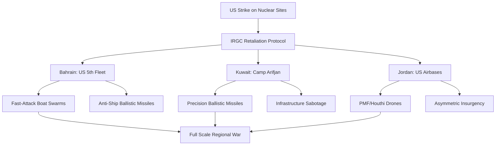

---
title: "Crossing the Red Line: US Strikes on Iranian Nuclear Sites"
tags: [geopolitics, us-iran-conflict, nuclear-proliferation, middle-east-security, military-strategy, oil-markets, asymmetric-warfare, strategic-depth]
---

# 🚨 Crossing the Red Line: What Happens if the US Hits Iranian Nuclear Sites?

The Middle East has long existed in a state of "permanent instability," a geopolitical "Grey Zone" where conflict is constant but rarely reaches the threshold of total war. For decades, the most critical boundary in this environment has been the "nuclear red line." The prospect of a nuclear-armed Iran is viewed by Washington and its regional allies not merely as a proliferation risk, but as a systemic threat to the global security architecture.

Now, imagine a scenario—the kind of worst-case simulation analyzed by strategic think tanks and reported by outlets like [Al Jazeera](https://www.aljazeera.com/where/middle-east/)—where diplomacy fails, sanctions plateau, and the United States decides that a kinetic strike is the only remaining option to dismantle Iran's nuclear capabilities. 

The moment the first munitions penetrate the reinforced concrete of Natanz or Fordow, the regional security framework doesn't just crack—it shatters. This would not be a localized skirmish between two superpowers; it would be the ignition of a regional wildfire. Iran does not view its security in isolation. Instead, it employs a doctrine known as **"Strategic Depth,"** a philosophy that ties the survival of the regime in Tehran to its ability to project power far beyond its own borders. 

If the US hits the Iranian nuclear heart, Tehran would likely activate a pre-planned, multi-front retaliation strategy. This strategy is designed to make the cost of US intervention unsustainable by targeting the most critical US military hubs in the region: **Bahrain, Kuwait, and Jordan**.

---

## ☢️ The Trigger: Hitting the Nuclear Heart

To understand the scale of the retaliation, one must first understand the difficulty of the attack. Iran's nuclear program is not housed in simple warehouses; it is embedded in some of the most heavily fortified structures on earth. The primary targets would be the [Natanz enrichment plant](https://en.wikipedia.org/wiki/Iranian_nuclear_program) and the [Fordow fuel enrichment plant](https://en.wikipedia.org/wiki/Fordow_Fuel_Enrichment_Plant). 

Fordow, in particular, is a nightmare for air planners. It is carved deep into a mountain, designed specifically to withstand the shockwaves of conventional airstrikes. To neutralize such a site, the US would need to deploy its most sophisticated penetration assets: the **B-2 Spirit stealth bomber** armed with the GBU-57 Massive Ordnance Penetrator (MOP). 

The GBU-57 is a **30,000-pound "bunker buster"** capable of punching through dozens of feet of reinforced concrete before detonating. The objective would be "strategic paralysis"—the total destruction of centrifuges, uranium stockpiles, and the specialized technicians who operate them. The goal is to set the program back by at least a decade.

However, military history suggests that "surgical strikes" rarely remain surgical. While the US might focus on the technical destruction of centrifuges, the Iranian Revolutionary Guard Corps (IRGC) views such an attack as an existential threat to the state. According to the [CSIS Missile Threat](https://missilethreat.csis.org/country/iran/) analysis, the IRGC does not believe in symmetrical warfare. They know they cannot win a direct air-to-air battle with the US Air Force. Instead, they employ **"asymmetric retaliation."**

> "The danger of a kinetic strike is not the immediate damage to the centrifuges, but the unpredictable nature of the retaliatory cycle that follows in a region where borders are porous and alliances are fragile."

By hitting the US "outposts" rather than the US mainland, Iran aims to create a regional crisis so volatile that Washington is forced to withdraw from the Middle East entirely to avoid a total war.

---

## 🛡️ The Doctrine of "Forward Defense"

To understand why Bahrain, Kuwait, and Jordan are targets, one must analyze the IRGC’s concept of **"Forward Defense."** This is the belief that the best way to protect Tehran is to fight the war in Baghdad, Beirut, Sana'a, and Damascus. 

By establishing a network of proxies—the "Axis of Resistance"—Iran has effectively created a buffer zone. This network includes Hezbollah in Lebanon, the Houthis in Yemen, and various Popular Mobilization Forces (PMF) in Iraq. When the US strikes Iran, the IRGC doesn't just launch missiles from its own soil; it activates this entire network.

This creates a **"360-degree threat environment."** While the US Navy is defending Bahrain, the Houthis are mining the Red Sea, and Hezbollah is raining rockets on Israel. This forces the US to split its resources, diluting its defensive capabilities across thousands of miles. The goal is to stretch US assets to the breaking point, ensuring that no single point of defense is fully saturated but every point is vulnerable.

---

## ⚓ The Bahraini Front: Crippling the Naval Nerve Center

Bahrain is perhaps the most sensitive target in the Persian Gulf. It is not merely a diplomatic partner; it is the operational headquarters for US naval power in the region, hosting the [United States Naval Forces Central Command (NAVCENT)](https://en.wikipedia.org/wiki/United_States_Forces_Bahrain) and the **US 5th Fleet**.

The 5th Fleet is the primary instrument for maintaining the "freedom of navigation" in the Strait of Hormuz and the Bab el-Mandeb. For Iran, the 5th Fleet represents the "blockade" that restricts Iranian oil exports. If the nuclear sites are hit, Iran’s primary goal in Bahrain would be to blind and cripple the US Navy's ability to project power.

**The Tactics of Attrition:**
Iran would likely avoid a traditional naval battle. Instead, they would employ **"swarm tactics,"** utilizing hundreds of fast-attack craft (FACs) and suicide drones. By saturating the Aegis combat systems of US destroyers with sheer volume, Iran hopes to create a gap in the defenses.

Simultaneously, Iran would deploy **Anti-Ship Ballistic Missiles (ASBMs)**, such as the *Khalij Fars*. These missiles are designed to strike ships at high speeds, making them incredibly difficult to intercept. A successful strike on the port facilities in Manama would not only sink ships but would destroy the logistics of refueling and repair, effectively pushing the US Navy out of the Gulf.

Furthermore, the socio-political landscape of Bahrain adds a layer of complexity. With a large Shiite majority and a history of internal unrest, Iran might use a "hybrid approach," stirring up domestic instability to distract the Bahraini government while the missiles are in the air. This forces the host nation to allocate security resources internally, leaving military bases more exposed to external attack.

---

## 🚛 The Kuwaiti Corridor: Severing the Logistical Lifeline

If Bahrain is the naval heart, Kuwait is the logistical lungs of the US operation. Kuwait hosts [Camp Arifjan](https://en.wikipedia.org/wiki/United_States_Forces_-_Kuwait), the primary hub for the US Army Central (ARCENT).

Camp Arifjan serves as the massive warehouse and transit point for every tank, troop shipment, and pallet of ammunition moving into Iraq or across the Gulf. If the US military is to sustain a conflict with Iran, it needs the "Kuwaiti Corridor." Without it, the US is fighting with a severed supply line, relying on expensive and slow airlifts rather than efficient ground transport.

**The Missile Math:**
Unlike a ship, Camp Arifjan is a fixed target. Iran possesses a vast arsenal of **Precision-Guided Munitions (PGMs)** that make fixed bases highly vulnerable. The *Fateh-110* and *Zolfaghar* missiles can strike specific coordinates with high accuracy. 

A massive wave of these missiles would target:
1.  **Airstrips and Hangars:** To prevent the rapid deployment of aircraft and reinforcements.
2.  **Fuel Depots:** To paralyze ground movements and starve the army of diesel.
3.  **Ammo Dumps:** To eliminate the stockpile of munitions needed for a counter-offensive.

Beyond the military impact, the economic stakes are staggering. Kuwait is one of the world's largest oil exporters. Any missile landing on Kuwaiti soil—even accidentally—would cause an immediate spike in global oil prices. Iran understands that the US administration is hypersensitive to energy costs; by targeting Kuwait, they are not just attacking a base, but targeting the American consumer to force a ceasefire.

---

## 🦅 The Jordanian Pivot: The Eastern Flank

Jordan may seem geographically removed from the Gulf tension, but it is a critical piece of the US security umbrella. Jordan provides the US with a vantage point to monitor Iranian activity in Syria and Iraq and hosts strategic assets like the **Muwaffaq Salt Sultan Air Base**.

In the eyes of the IRGC, Jordan is the "Eastern Flank" of the US presence in the Levant. Striking Jordan serves a dual purpose: it degrades US intelligence gathering and warns other Arab allies that US protection is a double-edged sword. If the US cannot protect its most stable partner in the Levant, other allies may reconsider their security guarantees.

**The Proxy Pipeline:**
Iran is unlikely to launch long-range missiles from Tehran to Amman. Instead, they would utilize their proxies in Iraq—specifically the **Popular Mobilization Forces (PMF)**. Using a mix of low-cost drones and rockets, these militias can launch persistent, low-intensity attacks on Jordanian bases.

This "hybrid warfare" provides Iran with **plausible deniability**. They can claim the attacks are "local Iraqi grievances" while simultaneously coordinating the timing to coincide with the Gulf strikes. This forces the US to relocate Patriot missile batteries from the Gulf to Jordan, creating "holes" in the defensive shield elsewhere.

---

## 🚀 The Arsenal: A Breakdown of Iranian Capabilities

The ability of Iran to strike Bahrain, Kuwait, and Jordan simultaneously stems from a decade of investment in missile technology and drone warfare. The shift from "dumb" rockets to precision strike capabilities has fundamentally changed the risk calculation for US bases.

**The Key Weapon Systems:**
*   **Fateh-110:** A short-range ballistic missile known for its extreme accuracy. It is the primary tool for targeting specific military buildings.
*   **Khorramshahr:** A medium-range missile with a **1,800kg warhead**. This is a "base-killer," designed to flatten entire complexes like Camp Arifjan.
*   **Shahed-136 Drones:** These "kamikaze" drones are cheap, loud, and effective. Their primary role is to exhaust air defense systems; they fly in waves to force the US to use expensive Patriot missiles on $20,000 drones.
*   **The "Axis" Synergy:** The coordination between the IRGC and groups like Hezbollah allows for a "distributed strike." While the US is focused on the Gulf, the Houthis can close the Bab el-Mandeb, effectively cutting off the Suez Canal and doubling the shipping time for global trade.

---

## 💻 The Digital Front: Cyber-Kinetic Synergy

No modern conflict happens only in the physical realm. A US strike on nuclear sites would be preceded and followed by a massive cyberwar. The precedent was set with **Stuxnet**, the worm that sabotaged Iranian centrifuges years ago.

However, Iran has developed its own sophisticated cyber capabilities. In a retaliation scenario, we would see "Cyber-Kinetic Synergy." This means that just as missiles are launched, cyberattacks would target:
1.  **SCADA Systems:** Shutting down power grids in Bahrain and Kuwait to disable radar and communication systems.
2.  **Air Traffic Control:** Creating chaos in Jordanian airspace to prevent US reinforcements from landing.
3.  **Financial Markets:** Targeting the banking systems of Gulf allies to create economic panic and capital flight.

By blending digital sabotage with physical explosions, Iran maximizes the feeling of chaos, making the US military feel "blind" and "deaf" during the critical first 72 hours of the conflict. This psychological warfare is intended to create a sense of helplessness among US personnel on the ground.

---

## 🛡️ The Defensive Shield: US Counter-Measures

The US does not enter these conflicts without a shield. The defense of Bahrain, Kuwait, and Jordan relies on a **"Layered Defense Architecture"** designed to intercept threats at every stage of flight.

1.  **The Outer Layer (THAAD):** The Terminal High Altitude Area Defense (THAAD) system is designed to intercept short, medium, and intermediate-range ballistic missiles in their terminal phase.
2.  **The Middle Layer (Patriot):** The MIM-104 Patriot system handles lower-altitude threats and is the primary defense against the *Fateh-110*.
3.  **The Naval Layer (Aegis):** The Aegis Combat System on US destroyers uses the SM-3 and SM-6 missiles to create a "bubble" of protection over naval task forces.

**The Vulnerability Gap:**
Despite this technology, the "saturation point" is the great fear. If Iran launches **500 drones and 100 missiles** simultaneously, the defensive systems can be overwhelmed. Even a **90% interception rate** means 10 missiles get through—and 10 missiles hitting a fuel depot in Kuwait can change the course of the war. This "mathematics of attrition" is the core of Iran's strategy.

---

## 📉 The Global Ripple: Oil and Money

The fallout of a US-Iran conflict would be felt most acutely at the gas pump and in the stock market. The Strait of Hormuz is the world's most critical oil chokepoint, with approximately **20% of the world's petroleum** passing through it daily.

**The Oil Shock:**
If Iran closes the Strait or attacks the infrastructure of Kuwait and Saudi Arabia, the "risk premium" on oil would explode. Analysts suggest that prices could jump from **$80 to over $150 a barrel** in a matter of days. This is not just a number; it is a global economic shock.

**The Economic Dominoes:**
*   **Global Inflation:** A sudden spike in energy costs would drive up the price of everything from food to transport, triggering a new wave of inflation.
*   **Shipping Insurance:** Marine insurance premiums for tankers in the Gulf would skyrocket, making oil transport prohibitively expensive.
*   **Developing Economies:** Nations in the Global South, already struggling with debt, would face a balance-of-payments crisis.

According to reports from the [International Monetary Fund (IMF)](https://www.imf.org/en/Publications/WEO), energy shocks of this magnitude can trigger global recessions. Iran knows that the US administration's biggest vulnerability isn't military—it's economic. By threatening the global energy supply, Tehran attempts to turn the international community against Washington.

---

## 🏁 Conclusion: The Fragility of the "Red Line"

The hypothetical strike on Iranian nuclear sites reveals a fundamental truth about modern geopolitics: there is no such thing as a "contained" conflict in the Middle East. The interconnectedness of military bases, proxy networks, and energy markets means that a bomb dropped in the mountains of Isfahan creates a shockwave that hits Manama, Kuwait City, and Amman.

Deterrence only works when both sides believe that the cost of action outweighs the benefit. However, when a "red line" as significant as nuclear sovereignty is crossed, the logic of the "Security Dilemma" takes over. The goal shifts from deterrence to **survival and revenge**.

For the United States, the technical challenge of destroying a nuclear site is trivial. The real challenge is managing the "Day After." Without a comprehensive plan to protect regional partners, stabilize the oil markets, and neutralize the "Axis of Resistance," a surgical strike could easily ignite a regional wildfire that consumes everything in its path. The risk is not just a lost base or a sunk ship—it is the total destabilization of the global order.

---

## 📚 References

*   **Iranian Nuclear Program & Sites:** [Wikipedia - Iranian Nuclear Program](https://en.wikipedia.org/wiki/Iranian_nuclear_program)
*   **Fordow Enrichment Plant:** [Wikipedia - Fordow Fuel Enrichment Plant](https://en.wikipedia.org/wiki/Fordow_Fuel_Enrichment_Plant)
*   **US Naval Forces Bahrain:** [Wikipedia - United States Forces Bahrain](https://en.wikipedia.org/wiki/United_States_Forces_Bahrain)
*   **US Forces Kuwait:** [Wikipedia - United States Forces - Kuwait](https://en.wikipedia.org/wiki/United_States_Forces_-_Kuwait)
*   **Regional Tensions Analysis:** [Al Jazeera - Middle East News](https://www.aljazeera.com/where/middle-east/)
*   **US Military Doctrine:** [Department of Defense - Central Command (CENTCOM)](https://www.centcom.mil/)
*   **Missile Capabilities:** [CSIS Missile Threat - Iran](https://missilethreat.csis.org/country/iran/)
*   **Strategic Depth & Proxy Warfare:** [Council on Foreign Relations - Iran's Proxies](https://www.cfr.org/)
*   **Global Security Analysis:** [International Institute for Strategic Studies (IISS)](https://www.iiss.org/)
*   **Arms Control Data:** [SIPRI - Stockholm International Peace Research Institute](https://www.sipri.org/)
*   **Economic Outlook:** [IMF - World Economic Outlook](https://www.imf.org/en/Publications/WEO)