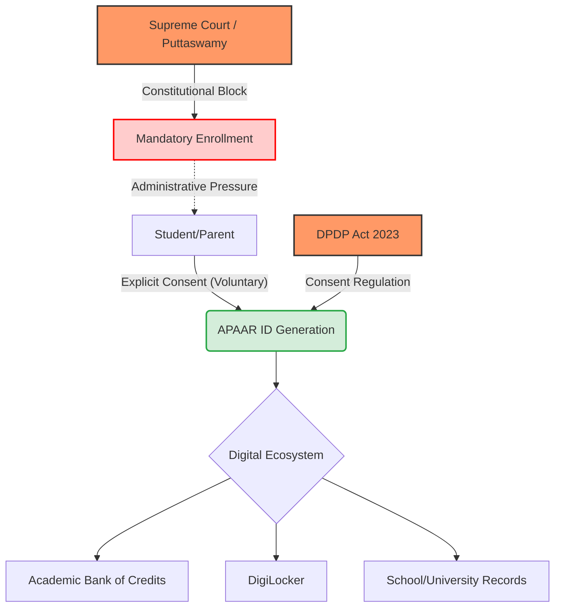

```yaml
title: "Privacy vs. Progress: The Legal Battle Over APAAR IDs"
tags: [apaar-id, data-privacy, supreme-court-india, dpdp-act, student-rights, digital-india, education-policy]
```

Imagine the scale of this digital architecture: **24 crore students**—ranging from toddlers in preschool to PhD candidates—each assigned a single, lifelong digital identity. This is the **APAAR (Automated Permanent Academic Account Registry)**, the center-piece of India’s "One Nation, One Student ID" plan. On paper, it presents as a bureaucratic dream. It promises a frictionless method to transfer academic credits, a secure digital locker for all certifications, and a definitive end to the nightmare of hunting down physical paperwork every time a student applies for a university or a scholarship.

However, beneath the surface of administrative efficiency lies a profound constitutional conflict. While the Ministry of Education is pushing for rapid enrollment, a critical legal question has emerged: **Can the government legally compel every child in the nation to possess a digital ID?** The official government stance is that APAAR is "voluntary," yet when educational institutions are pressured to achieve **100% coverage**, the distinction between "voluntary" and "mandatory" vanishes. 

This is where the Supreme Court of India becomes the final arbiter. By leaning on the established "Right to Privacy," the court has effectively signaled that any mandatory rollout lacking genuine, informed consent is constitutionally untenable. This isn't merely a debate over a student ID; it is a battle over whether an entire generation of Indians retains their digital autonomy or becomes a permanent entry in a state-controlled ledger.

> "Privacy is the ultimate vantage point from which all other liberties are viewed. When the state creates a permanent digital shadow of a citizen from childhood, it doesn't just track data—it shapes behavior through the knowledge of being watched." — *Legal Analysis on Digital Surveillance*

---

## 🚀 Section 1: The APAAR Ambition: Mapping the 24 Crore Vision

<div class="post-hero">
  
  <div class="post-hero-credit">📸 <a href="https://unsplash.com/@jayopeniano">Jay Openiano</a> on <a href="https://unsplash.com/photos/a-sign-that-is-lit-up-in-the-dark-53dp_Oyt3m0">Unsplash</a></div>
</div>


To understand why the APAAR ID has become a flashpoint for privacy advocates, one must first grasp the sheer magnitude of the project. The Indian government aims to build a comprehensive digital ecosystem for approximately **240 million students**. This is not simply a registration number; it is a lifelong "Academic Account" intricately linked to the [Academic Bank of Credits (ABC)](https://www.abc.gov.in/), designed to store credits, certifications, and even co-curricular achievements.

The technical engine driving this vision is [DigiLocker](https://digilocker.gov.in/), a cloud-based platform designed to eliminate the reliance on physical documents. In this ecosystem, the APAAR ID serves as the master key. If a student migrates between states, switches schools, or transitions from a vocational college to a university, their academic credits flow seamlessly with them. This solves a systemic pain point: the agonizing process of requesting transcripts from defunct institutions or the panic that ensues when a **10th-grade mark sheet** is lost during a relocation.

However, the government's goal extends beyond simple record-keeping. The vision is a "holistic" profile of every student. By aggregating data from various educational touchpoints, the state could theoretically track learning progress in real-time and deploy targeted interventions to fix learning gaps. While this sounds beneficial, the "holistic view" is precisely what alarms privacy experts. It risks transforming a student's journey of discovery and failure—essential parts of growth—into a process of constant, quantified surveillance. 

Creating a centralized database of **24 crore minors** creates an unprecedented "honey pot" for both government overreach and sophisticated cyber-attacks. When data is centralized at this scale, a single breach doesn't just leak passwords; it exposes the developmental trajectory of an entire generation.

---

## ⚖️ Section 2: The Mandate Paradox: Voluntary in Name, Mandatory in Practice?

The core of the legal conflict is what critics call the "Mandate Paradox." Officially, the Ministry of Education asserts that the APAAR ID is [entirely voluntary](https://www.education.gov.in/) and requires the explicit consent of parents or the students themselves. The official guidelines explicitly state that no student should be denied education, exams, or essential services simply because they lack an ID.

Yet, the operational reality on the ground tells a different story. In various states, school administrators have interpreted "encouragement" as a "directive." There are mounting reports of schools informing parents that the APAAR ID is a prerequisite for board exams or the disbursement of government scholarships. When the central government sets aggressive targets for "universal coverage," that pressure trickles down: from the Ministry to the State Education Department, to the School Principal, and finally to the parent.

This creates a psychological state of "coerced consent." If a parent believes their child's admission to a prestigious college or their eligibility for a critical scholarship depends on this ID, the choice is no longer free. They are not consenting to a service; they are mitigating a risk to their child's future. 

Legally, for consent to be valid, it must be **free, informed, and specific**. If a system forces a parent's hand to ensure their child's basic right to education is not hindered, it is no longer voluntary—it is a mandate in disguise. This subtle shift from "opt-in" to "forced-in" is why legal experts are challenging the rollout in the courts.

---

## 🛡️ Section 3: The Supreme Court’s ‘No’: The Puttaswamy Privacy Shield

While there is no single decree that explicitly "bans" the APAAR ID, the Supreme Court of India has already provided the legal framework to challenge its mandatory imposition. The landmark ruling in [Justice K.S. Puttaswamy (Retd.) vs Union of India](https://main.sci.gov.in/supremecourt/2012/35071/35071_2012_Judgement_24-Aug-2017.pdf) established that the **Right to Privacy is a fundamental right** protected under Article 21 of the Constitution.

Under the *Puttaswamy* precedent, any state action that infringes upon privacy must pass a rigorous "Three-Fold Test." For the APAAR ID to be made mandatory, it must satisfy these three criteria:

1.  **Legality:** The mandate must be backed by a formal law passed by Parliament. A government "circular," "notification," or "guideline" is insufficient to override a fundamental right.
2.  **Need/Legitimate State Aim:** The government must prove that the ID is necessary to achieve a legitimate goal (e.g., preventing academic fraud or ensuring the delivery of benefits).
3.  **Proportionality:** The state must demonstrate that the measure is proportional to the goal. Specifically, it must prove that there is no less-intrusive way to achieve the objective.

This is where the APAAR mandate hits a constitutional wall. The "Proportionality" argument is the weakest link. Does the state *actually* need a lifelong, Aadhaar-linked, centralized ID for every child just to track academic credits? Could the same result be achieved through a decentralized system where records are held by the schools and shared only upon the student's request?

The Supreme Court has been consistent in previous Aadhaar-related cases: the state cannot make a digital ID the sole gateway to accessing fundamental rights, such as education. Therefore, the court's implicit "No" is not a rejection of the technology, but a **constitutional barrier** preventing the ID from becoming a mandatory prerequisite for citizenship in the classroom.

---

## 🔍 Section 4: The Digital Panopticon: Why a Lifelong ID is Risky

The inclusion of the word "Permanent" in the Academic Account Registry is where the project shifts from "convenience" to "surveillance." This brings us to the sociological concept of the **Panopticon**—a prison design where a single guard can observe all inmates without them knowing if they are being watched. The result is that the inmates begin to police their own behavior, knowing that surveillance is *possible* at any moment.

APAAR risks becoming a **Digital Panopticon for the youth of India**. Consider the implications of a lifelong, permanent record:

*   **The End of the Fresh Start:** Historically, a student who struggled in 7th grade, faced behavioral issues in middle school, or suffered a period of academic slump could "reset" their identity as they matured. In a centralized digital ledger, every failure, disciplinary note, and academic dip is etched permanently.
*   **Predictive Profiling:** If future employers, insurance companies, or government agencies gain access to these longitudinal records, a mistake made by a 14-year-old could theoretically haunt a 30-year-old professional.
*   **Data Vulnerability:** Centralized databases are "honey pots" for hackers. If a database containing the personal and academic histories of **240 million minors** were breached, the result would be a generational disaster. The risk of identity theft for minors, who lack the agency to manage their own data, is astronomical.

By prioritizing administrative efficiency over data minimization, the state is effectively trading the long-term security and psychological freedom of students for short-term bureaucratic ease.

---

## 📜 Section 5: DPDP Act 2023: The New Legal Hurdle

The rollout of APAAR coincides with the implementation of the [Digital Personal Data Protection (DPDP) Act 2023](https://www.meity.gov.in/content/digital-personal-data-protection-act-2023). This legislation fundamentally alters the relationship between the state and personal data, adding a new layer of legal scrutiny to the mandate.

Under the DPDP Act, the government and educational institutions act as **"Data Fiduciaries,"** while the students (and their parents) are the **"Data Principals."** The Act mandates that:

*   **Clear Notice:** The Data Fiduciary must provide a notice explaining exactly what data is being collected and for what specific purpose.
*   **Unambiguous Consent:** Consent must be free, specific, informed, and unconditional.
*   **Right to Withdraw:** Parents must have the ability to withdraw their consent at any time, and the data must be deleted accordingly.

For the APAAR project, this means the government cannot rely on blanket guidelines. They must provide notices in multiple regional languages, ensure that parents fully understand the lifelong nature of the ID, and guarantee that the data is used *strictly* for academic credit management.

If the government uses this data for "function creep"—such as tracking political inclinations, profiling students for law enforcement, or sharing datasets with EdTech corporations—it would constitute a massive violation of the DPDP Act. The law provides for significant financial penalties for breaches. Consequently, the government's insistence that the ID is "voluntary" may be a strategic legal shield: if a parent "consents," the government is protected. If they mandate it, they invite thousands of lawsuits based on the DPDP Act's strict consent requirements.

---

## 🌍 Section 6: Global Benchmarks: Learning from GDPR and FERPA

India is not the first nation to grapple with the tension between student data and privacy. Other jurisdictions have developed systems that prioritize the individual over the institution.

### The European Union and GDPR
In the EU, the [General Data Protection Regulation (GDPR)](https://gdpr-info.eu/) provides some of the world's strongest protections for children's data. GDPR treats the processing of children's data as a high-risk activity, requiring "explicit consent" and stringent safeguards. Crucially, the EU embraces the **"Right to be Forgotten,"** allowing individuals to request the deletion of data that is no longer necessary. The APAAR model of a "Permanent" registry is the antithesis of this principle.

### The United States and FERPA
In the US, the [Family Educational Rights and Privacy Act (FERPA)](https://studentprivacy.ed.gov/ferpa/) grants parents and students significant control over educational records. Schools are prohibited from disclosing records to third parties without written permission. FERPA is built on a philosophy of **decentralization**—the data remains with the institution, and the student controls its movement.

### The Shift Toward Self-Sovereign Identity (SSI)
While India is moving toward a highly centralized "One Nation, One ID" model, the global trend in privacy-preserving technology is shifting toward **Self-Sovereign Identity (SSI)**. In an SSI model, the individual holds their own credentials in a secure digital wallet. They can share a "verified" degree with an employer using **Zero-Knowledge Proofs (ZKP)**—proving they have the qualification without revealing their entire academic history or a permanent ID number.

By opting for a centralized state mandate, India is swimming against the global tide of digital privacy.

---

## 📉 The APAAR Data Flow & The Privacy Wall

The following diagram illustrates the movement of data within the APAAR ecosystem and the legal "walls" that prevent it from becoming a mandatory surveillance tool.



---

## 🛠️ Toward a Privacy-First Alternative

The government's goal of streamlining education is valid, but the method is flawed. To achieve the benefits of APAAR without the risks of a Digital Panopticon, India could adopt a **Hybrid Decentralized Model**:

1.  **Decentralized Identifiers (DIDs):** Instead of one central registry, students could have DIDs that they control.
2.  **Selective Disclosure:** Rather than granting access to a "Permanent Account," the system should allow students to share only the specific credit or certificate needed for a specific application.
3.  **Data Expiration Policies:** Implement "sunset clauses" where non-essential behavioral or minor academic data is automatically purged after a certain period, restoring the "right to a fresh start."
4.  **Independent Oversight:** Establish an independent data ombudsman to audit how the Ministry of Education uses APAAR data, ensuring it never leaks into policing or commercial profiling.

---

## Conclusion: Balancing Innovation with Rights

The APAAR ID represents a classic struggle between **Efficiency and Liberty**. From the perspective of a state administrator, a single ID for **24 crore students** is a masterpiece of logistical optimization. It simplifies admissions, reduces fraud, and drags a fragmented educational system into the 21st century.

However, the "cost" of this efficiency is the potential erosion of the most personal part of a human being's life: their intellectual and academic growth. The Supreme Court's implicit rejection of a mandate is a critical guardrail. It serves as a reminder that **making things easier for bureaucrats is not a valid justification for suspending constitutional rights**.

By keeping APAAR voluntary, the judiciary is protecting the right of every student to be more than just a data point in a government registry. As India continues its digital transformation, the guiding principle should not be "One Student, One ID," but "One Student, One Right to Privacy." Education should be a journey of curiosity and exploration, not a lifelong exercise in state surveillance.

---

## 📚 References

*   **Supreme Court of India:** [Justice K.S. Puttaswamy (Retd.) vs Union of India](https://main.sci.gov.in/supremecourt/2012/35071/35071_2012_Judgement_24-Aug-2017.pdf) — The definitive legal ruling establishing the Right to Privacy as a fundamental right.
*   **Ministry of Education, India:** [APAAR ID Guidelines & ABC Portal](https://www.abc.gov.in/) — Official framework for the Academic Bank of Credits and student ID registration.
*   **Ministry of Electronics and IT (MeitY):** [Digital Personal Data Protection Act 2023](https://www.meity.gov.in/content/digital-personal-data-protection-act-2023) — The primary legislation governing personal data processing in India.
*   **DigiLocker:** [Official Platform for Digital Documents](https://digilocker.gov.in/) — The underlying cloud infrastructure for the APAAR ID ecosystem.
*   **European Union:** [General Data Protection Regulation (GDPR) Official Text](https://gdpr-info.eu/) — The global benchmark for data privacy and the "Right to be Forgotten."
*   **U.S. Department of Education:** [FERPA Overview](https://studentprivacy.ed.gov/ferpa/) — Standards for the privacy of student educational records in the United States.
*   **Constitution of India:** [Article 21](https://www.india.gov.in/my-government/constitution-india) — The constitutional provision regarding the protection of life and personal liberty.
*   **Govt of India:** [Official Ministry of Education Portal](https://www.education.gov.in/) — Central source for educational policy updates and voluntary registration mandates.