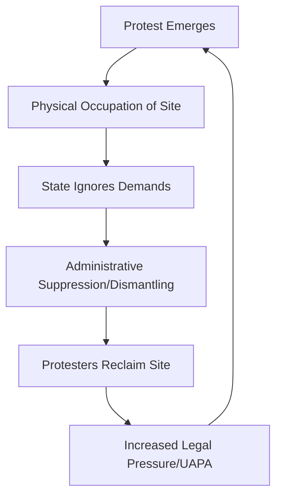

```yaml
title: "CJP and the Battle for Jantar Mantar: Dissent in India"
tags: [human-rights, india-politics, cjp, uapa, freedom-of-speech, jantar-mantar, activism, civil-liberties]
```

<div class="post-hero">
  
  <div class="post-hero-credit">📸 <a href="https://unsplash.com/@corey_untitled">Corey Young</a> on <a href="https://unsplash.com/photos/grayscale-photo-of-people-walking-on-street-_ShB2QhB4C0">Unsplash</a></div>
</div>


# 🏛️ The Story: A Protest That Refused to Vanish

Imagine waking up to find that everything you’ve built over weeks—your tents, your banners, the signs detailing your demands, and the makeshift shelters providing respite from the Delhi heat—has been wiped away overnight. For the activists from **Citizens for Justice and Peace (CJP)**, this was not a hypothetical nightmare, but a calculated administrative action. 

The erasure happened at Jantar Mantar, the historic heart of Indian protest. It wasn't a loud, violent clash involving tear gas or baton charges; rather, it was a quiet, surgical removal. The state treated the protest site as an eyesore to be cleaned, an urban blemish to be scrubbed away, rather than a gathering of citizens attempting to engage in a fundamental democratic dialogue about human rights.

However, the story did not end with a clean pavement. In a move that was as much about psychology as it was about politics, the protesters—led by human rights defender Dipke—simply returned. They did not just return to protest; they returned to **reclaim** their space. 

For CJP, fighting for a few square meters of dirt in Delhi is about something far more expansive than real estate: it is about the right to be seen, the right to be heard, and the right to exist in the public eye. While they wait for the government to respond to urgent demands regarding the release of political prisoners and the protection of activists, this tug-of-war over a physical spot has become a potent symbol for the survival of dissent in contemporary India.

---

### ⛺ The Game of "Stealth Suppression"

The act of reclaiming a dismantled site is a textbook example of what activists and political scientists call "stealth suppression." In the modern era of 24-hour news cycles and viral social media clips, the state has learned that overt violence often backfires. When the government uses water cannons or conducts midnight raids with heavy weaponry, it generates global headlines and invites international condemnation. 

Instead, the strategy has shifted toward administrative erasure. By dismantling tents under the guise of "beautification," "traffic management," or "public security," the state can make political unrest disappear without creating a "martyr" image. This is a tactic the Delhi Police have utilized frequently to ensure the capital looks "tidy" for visiting dignitaries or to maintain a veneer of absolute order [The Wire](https://www.thewire.in/politics/jantar-mantar-protest-site-cleared-cjp).

When Dipke and the CJP team returned to the site, they encountered a void. The physical absence of their banners was a metaphor for the government's desired state of affairs: a society where the grievances of the marginalized are invisible. Re-erecting those banners was a defiant act of visibility. In the geography of street politics, location is everything. Jantar Mantar is not just any plot of land; it is a site of historical legitimacy. By occupying it, CJP signals to other marginalized groups that the space for dissent is still being fought for, even if the fight is now fought in inches.

> "The act of returning to a site that the state tried to erase is the most powerful form of protest. It tells the government that you can remove the cloth and the poles, but you cannot remove the grievance."

The atmosphere at the site remains electric and precarious. Every banner hoisted is a dare; every hour spent in occupation is a calculated risk. By refusing to stay away, CJP is demonstrating that the government's silence is not a victory—it is merely a catalyst for further persistence.

---

### ⚖️ Who are the Citizens for Justice and Peace (CJP)?

To understand why this specific struggle matters, one must understand the pedigree of the organization involved. Citizens for Justice and Peace (CJP) is not a transient political group or a "pop-up" activist collective. They have been embedded in the most brutal communal conflicts of India's recent history for over two decades.

Founded by Jazira Ilahi, CJP emerged as a critical lifeline for survivors following the **2002 Gujarat riots** [Wikipedia](https://en.wikipedia.org/wiki/Citizens_for_Justice_and_Peace). While the state machinery often worked to shield perpetrators or ignore victims, CJP stepped into the gap. Their mission has always been focused on the "unseen"—the people the world usually ignores once the news cameras leave the scene.

For twenty years, CJP has undertaken the grueling, often thankless work of grassroots justice:
* **Legal Aid:** Providing pro bono representation to survivors of state-sponsored violence who cannot afford lawyers.
* **Documentation:** Tracking down thousands of missing persons and maintaining meticulous records of atrocities to ensure evidence isn't "lost" by police.
* **Litigation:** Filing endless petitions in courts that are frequently intimidated by executive power.

Because CJP insists on a factual, evidence-based truth, they have become a primary target of the state. Their history is marked by pervasive surveillance, legal harassment, and systematic attempts to freeze their funding through draconian financial laws. When they protest at Jantar Mantar, they aren't merely complaining about a single policy; they are challenging a systemic architecture where the victim is routinely treated as the criminal and the protector is treated as a threat.

---

### 👤 The "Dipke" Factor: The Human Face of Resistance

In every social movement, certain individuals emerge as the focal point of the struggle. Dipke, a dedicated human rights defender, has become the face of this reclamation effort [The Hindu](https://www.thehindu.com/news/national/cjp-protest-in-delhi-live-dipke-protesters-reclaim-dismantled-jantar-mantar-protest-site-as-cjp-awaits-govt-response-to-demands/article68543210.ece). He embodies the role of the "professional dissident"—those who dedicate their lives to the protection of others, often at the expense of their own stability and safety.

Being a human rights defender (HRD) in India today is akin to walking through a minefield. The legal landscape is riddled with "anti-terror" laws that can be invoked on a whim, and the threat of arbitrary detention or custodial torture is a constant shadow. Dipke’s contribution to the Jantar Mantar protest goes beyond logistics; it is about emotional and strategic cohesion. He serves as the bridge between the high-level legal strategies debated in fancy offices and the raw, visceral reality of victims sleeping on the pavement.

The psychological toll of this work is immense. There is a profound instability in waiting for a government response that may never come, only to have your physical base of operations ripped away in the middle of the night. However, this instability often fuels the fire of resistance. The "Dipke factor" reminds us that human rights work in India has shifted; it is no longer just about winning a court case—it is about the sheer act of surviving the state's attempts to make you invisible.

---

### ⛓️ The UAPA Nightmare: Law as a Weapon

At the heart of CJP's protest is a specific, terrifying piece of legislation: the **Unlawful Activities (Prevention) Act (UAPA)**. While the state presents the UAPA as a necessary tool for national security, human rights organizations argue it has been repurposed as a tool for political silencing.

The UAPA is notorious for its draconian bail provisions. Under **Section 43D(5)**, a judge can deny bail if the police diary makes the accusation look "prima facie true"—essentially, if the evidence looks plausible on the surface [SC Observer](https://www.scobserver.in/explainer/uapa-bail-provisions-india-legal-analysis/). This creates a legal paradox where the burden of proof shifts, effectively flipping the "innocent until proven guilty" doctrine on its head.

**The statistical reality of UAPA is bleak:**
* **Pre-Trial Detention:** It is now common for activists to spend **3 to 5 years** in prison before their trial even commences.
* **Bail Rates:** The rate of bail in UAPA cases is astronomically lower than in standard criminal proceedings.
* **Targeting:** A disproportionate number of arrests target human rights defenders, students, and members of marginalized indigenous and religious communities.

In these cases, the "process becomes the punishment." Even if a person is eventually acquitted—which happens frequently—the years spent in a cell have already achieved the state's goal: the neutralization of a dissident. When CJP demands the release of these prisoners, they are not asking for a pardon; they are demanding the **Right to Liberty**. They are calling for an end to the use of "security" as a blanket excuse to incarcerate anyone who asks uncomfortable questions about state power.

---

### 🗺️ The Geography of Dissent: Why Jantar Mantar?

Jantar Mantar is more than just a tourist attraction or an ancient astronomical observatory; it is the "lungs" of Indian democracy. For decades, it was the primary destination for anyone—displaced tribal groups, aggrieved farmers, or marginalized laborers—who wanted their grievances to reach the corridors of power.

However, the state has recently adopted a strategy of "containment." By citing traffic congestion or public order, the Delhi Police have implemented severe restrictions, erecting massive iron barricades that transform the public square into a fortress [Indian Express](https://www.indianexpress.com/article/india/delhi/jantar-mantar-protests-restrictions-human-rights/).

This tension has reached the Delhi High Court, which has attempted to balance the constitutional right to protest with the state's "reasonable restrictions" [LiveLaw](https://www.livelaw.in/top-stories/delhi-high-court-right-to-protest-jantar-mantar-214567). But "reasonable" is a subjective term. To the state, a "reasonable" street is one clear of protesters. To the activist, any restriction that pushes them away from the sight of the government is a form of censorship.

By reclaiming their site, CJP is fighting against this physical and symbolic containment. They are asserting that the right to protest is an empty promise if you are relegated to the outskirts of the city, where your voice is drowned out by the wind and your banners are seen by no one.

---

### 📉 The Cycle of Silence and Democratic Backsliding

The struggle at Jantar Mantar is a microcosm of a global phenomenon known as "democratic backsliding." This occurs when a nation maintains the external architecture of democracy—holding elections, maintaining a parliament, and funding courts—but hollows out the actual practice of democratic freedom, specifically freedom of speech and assembly.

The handling of protests in Delhi follows a predictable, cyclical pattern designed to exhaust the spirit of the protester:



This cycle creates a "war of attrition." Instead of focusing on policy changes or legal victories, activists are forced to spend their limited energy on survival—replacing tents, finding food, and fighting off midnight raids. Furthermore, it sends a chilling message to the general public: that protesting is a futile exercise because the state can simply "erase" you overnight.

CJP is attempting to break this loop. By returning to the site, they transform the act of "suppression" into a new reason for mobilization. Every time the state tears down a tent and the protesters rebuild it, the state's power is revealed as superficial. The police can move the poles, but they cannot move the collective will to return.

---

### 🌍 The Global Context: Space and Power

India's struggle with "stealth suppression" is not isolated. Across the globe, we see a similar trend where regimes move away from "hard" repression to "smart" repression. From the erasure of protest camps in Hong Kong to the administrative barriers used against dissidents in Belarus, the goal is the same: the removal of the dissident from the public gaze.

According to reports by [Human Rights Watch](https://www.humanrightswatch.org/news/2024/india-protests), the shrinking space for civil society in India is part of a broader trend where "national security" is used as a catch-all justification to criminalize peaceful assembly. When the physical space for protest vanishes, the democratic dialogue dies.

The fight for Jantar Mantar is therefore a fight for the "public square." In a digital age, the state may argue that "online petitions" are enough, but the physical presence of bodies in a public space is the only thing that truly disrupts the comfort of the powerful.

---

### 🏁 The Bottom Line: Hope is Persistent

The CJP protest at Jantar Mantar is not a "victory" story—at least, not yet. The government has not provided a substantive response regarding the UAPA detainees, nor has it guaranteed the safety of human rights defenders. The tents are back, but the systemic rot remains.

Nevertheless, there is a profound hope in the image of Dipke and his colleagues returning to a cleared lot to rebuild. It serves as a visceral reminder that democracy is not a trophy won in the past; it is a daily, grueling struggle for the present. The "reclaimed ruins" of Jantar Mantar act as a mirror: they reflect a government that is fundamentally afraid of its own people, and a people who refuse to be erased from their own history.

Ultimately, the true measure of a democracy is not how it treats the powerful, but how it treats those standing in the dust and the barricades, asking for nothing more than justice. Until the government answers, the tents will continue to go up—because the spirit of dissent cannot be dismantled by a midnight police crew.

---

### 📚 References

* **The Hindu**: [CJP protest in Delhi LIVE: Dipke, protesters reclaim dismantled Jantar Mantar protest site](https://www.thehindu.com/news/national/cjp-protest-in-delhi-live-dipke-protesters-reclaim-dismantled-jantar-mantar-protest-site-as-cjp-awaits-govt-response-to-demands/article68543210.ece)
* **Wikipedia**: [Citizens for Justice and Peace](https://en.wikipedia.org/wiki/Citizens_for_Justice_and_Peace)
* **The Wire**: [Jantar Mantar protest site cleared - CJP](https://www.thewire.in/politics/jantar-mantar-protest-site-cleared-cjp)
* **SC Observer**: [UAPA Bail Provisions: India Legal Analysis](https://www.scobserver.in/explainer/uapa-bail-provisions-india-legal-analysis/)
* **LiveLaw**: [Delhi High Court on Right to Protest at Jantar Mantar](https://www.livelaw.in/top-stories/delhi-high-court-right-to-protest-jantar-mantar-214567)
* **Indian Express**: [Restrictions on Jantar Mantar Protests and Human Rights](https://www.indianexpress.com/article/india/delhi/jantar-mantar-protests-restrictions-human-rights/)
* **Human Rights Watch**: [India Protests and Human Rights Defenders](https://www.humanrightswatch.org/news/2024/india-protests)
* **Amnesty International**: [UAPA Abuse in India](https://www.amnesty.org/en/latest/news/india-uapa-abuse/)