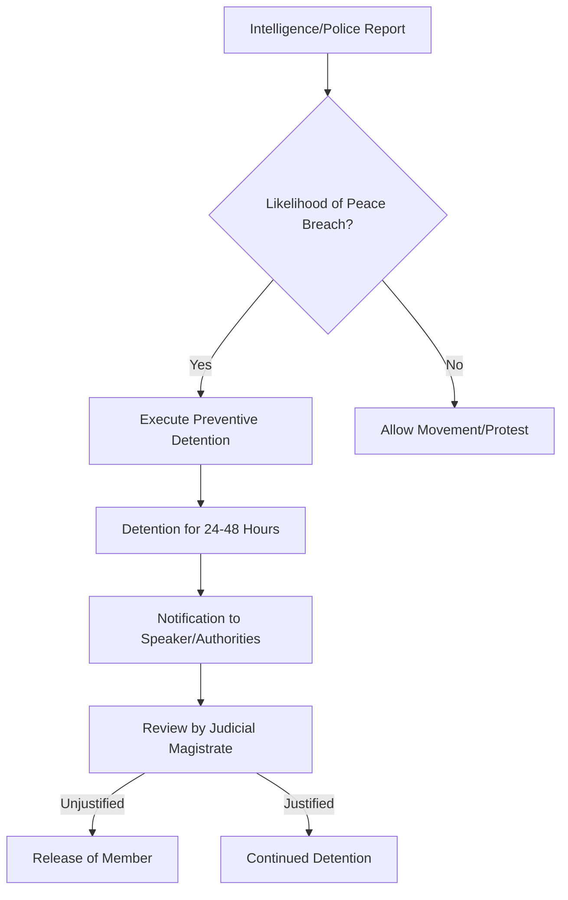

```yaml
title: "Parliamentary Privilege vs. Police Power: The Real Law"
tags: [indian-constitution, parliamentary-privilege, article-105, rahul-gandhi, legal-analysis, indian-law, preventive-detention, lok-sabha]
```

<div class="post-hero">
  
  <div class="post-hero-credit">📸 <a href="https://unsplash.com/@ml_qureshi">ml _qureshi</a> on <a href="https://unsplash.com/photos/man-in-white-dress-shirt-sitting-on-tree-branch-during-daytime--Di6VS0nSqg">Unsplash</a></div>
</div>


# 🏛️ The "Speaker’s Nod" Myth: Can Police Actually Detain an MP?

Whenever a Member of Parliament (MP) is led away by the police into a detention van, it triggers a firestorm of legal debate across news channels and social media. When high-profile figures like Rahul Gandhi are detained during protests or rallies, a recurring question emerges: **"Can the police even do this without the Speaker's permission?"**

This question stems from a widespread belief that MPs possess a "legal shield"—a constitutional sanctuary that renders them untouchable unless the Speaker of the Lok Sabha or the Chairman of the Rajya Sabha provides a formal "green light." This perception is a complex cocktail of inherited British parliamentary traditions and modern misunderstandings of the Indian Constitution.

The reality is far more nuanced. While MPs are granted "privileges" to ensure the independence of the legislature, these are not "get out of jail free" cards. The tension between the **Rule of Law** and **Parliamentary Privilege** often exists in a gray area, which is frequently exploited for political narrative. To determine if the police truly need the "Speaker's nod," we must dissect [Article 105 of the Constitution](https://www.constitutionofindia.net/articles/article-105/), the dichotomy between civil and criminal law, and the operational mechanics of the executive branch.

---

### 🚩 The Context: Rahul Gandhi and the Politics of Detention

To understand the law, one must examine its application. Rahul Gandhi has been detained on numerous occasions—most notably during his "Bharat Jodo" marches and protests concerning farmers' rights. In the majority of these instances, he is not being "arrested" in the formal, judicial sense (where a First Information Report (FIR) is filed and the individual is remanded to judicial custody); rather, these are **"preventive detentions."**

Preventive detention is a proactive police measure used when authorities believe a person's presence in a specific area may provoke a breach of peace or lead to a cognizable offense. In the heat of a political rally, police utilize sections of the [Code of Criminal Procedure (CrPC)](https://www.indiacode.nic.in/)—now transitioned to the [Bharatiya Nagarikaksha Sanhita (BNSS)](https://www.mha.gov.in/)—to remove a leader from the scene to "maintain public order."

The friction arises when the opposition labels these detentions "illegal" on the grounds that the Speaker was not consulted. This transforms a routine police action into a constitutional crisis. However, legally, the "Speaker's nod" is a political courtesy, not a statutory requirement. If an MP is detained for blocking a public highway or violating a **Section 144 order** (which prohibits gatherings of a certain size), the police are exercising executive power, not infringing upon legislative privilege. The conflict is not between the police and the Speaker, but between the **Executive branch** (the government and police) and a **Legislative representative**.

---

### 📜 Deep Dive: Understanding Parliamentary Privilege and Article 105

The bedrock of this debate is [Article 105 of the Constitution of India](https://www.constitutionofindia.net/articles/article-105/), which defines the powers, privileges, and immunities of MPs. The fundamental purpose of parliamentary privilege is to ensure that lawmakers can perform their duties without fear of intimidation or harassment by the executive.

**Article 105 provides two primary categories of protection:**

1.  **Absolute Freedom of Speech:** An MP cannot be held liable in any court for anything said or any vote cast within the House. This is an absolute immunity. For example, if an MP accuses a government minister of corruption during a debate in the Lok Sabha, they cannot be sued for defamation in a civil court.
2.  **Protection from Proceedings:** This is the source of the common misconception. While the Constitution protects the *act* of legislating and speaking *inside* the House, it does not provide a blanket exemption from the law *outside* the House.

It is a critical error to view Article 105 as an impenetrable wall between an MP and the police. In legal terms, the privilege is designed to protect the **function of the office**, not the **person of the member**. When an MP is accused of a crime—whether it is financial fraud, inciting violence, or violating administrative orders—the law views them as a citizen first.

> "Parliamentary privilege is not a personal privilege of the member, but a privilege of the House to ensure that its members can function effectively. It is a shield for the legislature, not a cloak for the individual." — *Analysis via [LiveLaw](https://www.livelaw.in)*.

#### The British Origin of the Myth
The "Speaker's nod" myth is a lingering ghost of the British parliamentary system. In the UK, the House of Commons has a long tradition of protecting members from **civil arrest** (such as arrests for debt) while Parliament is in session. This was designed to prevent the Crown from using trivial legal disputes to keep opposition members away from crucial votes. Over time, this tradition was misinterpreted in the Indian context as a general immunity from *all* forms of arrest.

---

### ⚖️ Civil vs. Criminal: The Crucial Legal Distinction

The confusion surrounding the Speaker's permission usually stems from a failure to distinguish between **civil arrest** and **criminal arrest**. 

In India, the legal framework operates as follows:

*   **Criminal Offenses:** There is **zero immunity** for criminal acts. If an MP is accused of a "cognizable offense" (a crime where police can arrest without a warrant), the police have the authority to detain them immediately. No permission from the Speaker is required.
*   **Civil Matters:** While there is a convention of avoiding the arrest of members for civil disputes during a session to ensure they do not miss House business, this is a matter of courtesy and tradition, not a constitutional mandate.

**Comparative Analysis Table:**

| Case Type | Speaker's Permission Needed? | Legal Basis | Immediate Effect |
| :--- | :--- | :--- | :--- |
| **Criminal (Cognizable)** | ❌ **No** | BNSS / General Law | Immediate Detention |
| **Civil Dispute** | ⚠️ **Conventionally No** | Parliamentary Tradition | Rare during active session |
| **Speech in Parliament** | ✅ **Fully Immune** | Article 105 | No court can take notice |
| **Preventive Detention** | ❌ **No** | BNSS / Executive Order | Temporary Removal from Site |

When Rahul Gandhi or other opposition leaders are detained for "unlawful assembly" or "preventive reasons," these are administrative and criminal actions. The police are not required to petition the Speaker to prevent a riot or clear a road. The law applies uniformly to the Prime Minister, Cabinet Ministers, and Opposition MPs.

---

### 🚫 Debunking the "Speaker's Nod" Myth

To be absolutely clear: **Does the law require the Speaker's permission to arrest an MP?**

**The answer is a definitive NO.**

There is no provision in the Constitution, the Lok Sabha Rules of Procedure, or the Indian Penal Code (now the Bharatiya Nyaya Sanhita) that mandates the Speaker's approval for an arrest. The Speaker is the presiding officer of the House; they are not the legal guardian or the "protective agent" of the members.

#### So, why is there a tradition of notifying the Speaker?
The confusion often arises from the **administrative habit of notification**. It is standard procedure for the police or the Ministry of Home Affairs to **inform** the Speaker’s office when an MP is arrested. However, this is a notification of a *fact*, not a request for *permission*.

**The reasons for this notification are purely operational:**
1.  **Attendance and Quorum:** The Speaker must be aware of why a member is absent during a critical vote or a high-stakes debate to manage the House effectively.
2.  **The Privilege Motion:** If an MP believes their arrest was a politically motivated attempt to prevent them from attending Parliament, they (or their party) can file a **"Privilege Motion."**

In this scenario, the Speaker's role is **post-facto**. The Speaker does not act as a gatekeeper for the police; rather, the House acts as a watchdog. If the House determines that the executive overstepped its bounds to silence dissent, it can pass a resolution condemning the action. However, that does not render the initial arrest "illegal" under criminal law at the moment it occurred.

---

### 🚔 Preventive Detention and the "Grey Zone"

The most contentious aspect of MP detentions is **Preventive Detention**. Under the [Bharatiya Nagarikaksha Sanhita (BNSS)](https://www.mha.gov.in/), police can detain individuals if they have "reasonable grounds" to believe that the person is about to commit a cognizable offense.

This is an incredibly powerful tool. Because preventive detention is not a punishment for a crime already committed, but a precaution to prevent a future crime, the evidentiary bar is significantly lower than in a standard criminal trial.

**The Preventive Detention Workflow:**



For high-profile MPs, "preventive" action often feels like "political" action. When police prevent an MP from entering a specific zone, they are employing **Police Power**, not **Judicial Power**. Since they are not acting on a court warrant but on administrative necessity to maintain public order, the Speaker's permission is irrelevant.

**The Democratic Cost:**
Legal advocacy groups, including [Amnesty International](https://www.amnesty.org), have highlighted a trend of increasing preventive detentions against political dissidents. This creates a paradox where the law is technically followed (the procedure is correct), but the *spirit* of democratic dissent is suppressed. When a leader is detained every time they attempt to march toward a government building, the distinction between "maintaining order" and "suppressing opposition" becomes dangerously thin.

---

### ⚖️ The Balance: Democratic Privilege vs. The Rule of Law

The debate over the "Speaker's permission" is a proxy for a larger struggle: the **balance of power** in a constitutional democracy.

#### The Argument for the Rule of Law
The "Rule of Law" dictates that **no one is above the law**. If an MP commits a crime, they must face the same consequences as any other citizen. If the police were required to seek the Speaker's permission for every arrest, the Speaker would effectively become a "super-judge." This would create a dangerous precedent where a presiding officer could protect political allies from criminal prosecution, undermining the judiciary.

#### The Argument for Parliamentary Privilege
Conversely, Parliamentary Privilege exists because history shows that executives often use the police as a tool to silence the opposition. If a government can "preventively detain" the Leader of the Opposition every time a crucial bill is tabled, the legislature is reduced to a rubber stamp. The privilege is intended to ensure that the government cannot use the police to "clear the house" of its critics.

#### The Ultimate Safeguard: Judicial Review
Since the "Speaker's nod" is not a legal reality, the true safeguard for an MP is **Judicial Review**. Any detained MP can approach the High Court or the Supreme Court via a *Habeas Corpus* petition. The courts then scrutinize the detention based on three criteria:
*   **Evidence:** Was the detention based on actual intelligence or a political whim?
*   **Procedure:** Did the police follow the strict guidelines laid out in the BNSS/CrPC?
*   **Proportionality:** Was the detention a proportional response to the threat, or was it an overkill?

The judiciary acts as the ultimate referee, ensuring that the police do not act as an arm of the ruling party and that MPs do not treat their office as a license for lawlessness.

---

### 🏁 Conclusion: Law vs. Legitimacy

To summarize: **The police can, and do, detain Members of Parliament without the permission of the Speaker.** The belief that such permission is a legal requirement is a myth born of misunderstood traditions. Whether it is Rahul Gandhi or any other representative, the immunity granted by Article 105 applies to speech and voting within the House—it is not a shield against criminal or preventive detention in the public sphere.

However, we must distinguish between **legality** and **legitimacy**. While the *legality* of a detention may be sound under the BNSS, its *legitimacy* is often questioned when it appears to be timed to stifle political expression. Notifying the Speaker is a vital step for transparency, and the courts remain the only viable check against executive overreach.

In a robust democracy, the law should serve as a fence that protects the rights of all citizens, not a weapon used to sideline critics. While the "Speaker's nod" may not be a legal necessity, respecting the dignity and the representative role of an elected official is a democratic necessity.

---

### 📚 References

*   **The Constitution of India**: [Article 105 - Powers, privileges, etc., of members of Parliament](https://www.constitutionofindia.net/articles/article-105/)
*   **India Code**: [The Code of Criminal Procedure, 1973](https://www.indiacode.nic.in/)
*   **Ministry of Home Affairs**: [Bharatiya Nagarikaksha Sanhita (BNSS) Implementation Guidelines](https://www.mha.gov.in/)
*   **LiveLaw**: [Legal Analysis of Parliamentary Privileges and Criminal Law in India](https://www.livelaw.in)
*   **Bar and Bench**: [Case Law Analysis on the Arrest of Legislators](https://www.barandbench.com)
*   **Amnesty International**: [Reports on Political Detention and Civil Liberties in India](https://www.amnesty.org)
*   **Lok Sabha Secretariat**: [Rules of Procedure and Conduct of Business in Lok Sabha](https://loksabha.nic.in)
*   **Supreme Court of India**: [Judgments on Habeas Corpus and the Limits of Preventive Detention](https://main.sci.gov.in)