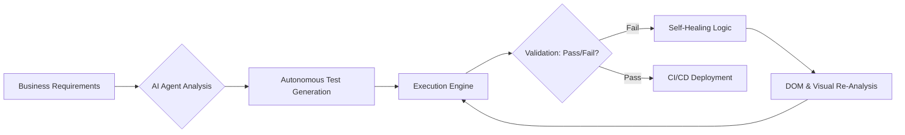

```yaml
title: "Beyond the Script: The Rise of Autonomous AI Testing"
tags: [software-testing, ai-qa, test-automation, devops, self-healing-tests, generative-ai, software-engineering]
```

# 🤖 The Bot Revolution in QA: From Boring Scripts to Smart Agents

For years, anyone working in software quality assurance (QA) has been fighting a constant battle with what engineers call the "regression monster." As applications evolved from monolithic blocks of code into fragmented microservices, serverless functions, and highly dynamic Single Page Applications (SPAs), the surface area for potential failure exploded. The linear growth of features led to an exponential growth in the testing surface.

At first, the industry relied on manual testing—a slow, grueling process where humans followed checklists. While humans are excellent at spotting "weird" UX issues, they are naturally inconsistent and prone to fatigue. To scale, we moved to scripted automation, leveraging tools like Selenium to mimic user interactions. However, this brought a new, more insidious headache: **test fragility**. 

One tiny change to a CSS class, a button moving a few pixels, or a developer renaming an ID from `btn-submit` to `submit-form` could break hundreds of tests. This created the phenomenon of "flaky tests," where a CI/CD pipeline fails not because the application is broken, but because the test itself is obsolete. The result? A "maintenance tax" that often consumed more engineering hours than the actual feature development.

That’s where "test from bot" comes in. We are currently witnessing a paradigm shift from automated testing to **autonomous testing**. Instead of a human meticulously scripting every click, scroll, and assertion, we are moving toward intelligent agents that *observe, learn, and validate*. These agents don't just execute a sequence; they understand the intent of the test. They possess "self-healing" capabilities, allowing them to adapt to UI changes on the fly.

This isn't merely a tool upgrade; it's a fundamental restructuring of the software development lifecycle (SDLC). By delegating the repetitive, fragile aspects of validation to AI bots, organizations are finally clearing the path toward true Continuous Deployment (CD).

---

## 📜 The Evolution of the 'Test Bot': From Macros to Minds

<div class="post-hero">
  
  <div class="post-hero-credit">📸 <a href="https://unsplash.com/@coopery">Mohamed Nohassi</a> on <a href="https://unsplash.com/photos/a-white-robot-with-blue-eyes-and-a-laptop--0xMiYQmk8g">Unsplash</a></div>
</div>


To understand the current state of AI in QA, we must examine the trajectory of automation. The journey can be categorized into three distinct eras: the Scripted Era, the Augmented Era, and the Autonomous Era.

### 1. The Scripted Era (The Age of Determinism)
The first wave of automation was built on "record-and-playback" and hard-coded selectors. Bots in this era were essentially fancy macros. They operated on a strictly deterministic basis: *Find element X $\rightarrow$ Perform action Y $\rightarrow$ Verify result Z*. 

The weakness here was the lack of context. If a developer updated a UI library that changed the DOM structure, the bot would fail immediately. It had no concept of what a "Login Button" actually was; it only knew that it was looking for `<button id="login-123">`. This era created a massive bottleneck where QA engineers became "script maintainers" rather than "quality strategists."

### 2. The Augmented Era (The Age of Heuristics)
To combat fragility, the industry introduced "intelligent selectors" and fuzzy matching. Instead of relying on a single, brittle ID, bots began using a weighted collection of attributes. A bot might look for an element that had the text "Submit," was located inside a `form` tag, and had a blue background.

While this reduced flakiness, the logic was still based on human-written heuristics (if-then-else rules). The bot wasn't "thinking"; it was just checking a longer list of possibilities. It was an improvement, but the underlying model was still static.

### 3. The Autonomous Era (The Age of Probabilistic AI)
We have now entered the era of Large Language Models (LLMs) and Reinforcement Learning (RL). Modern testing bots do not follow a rigid path; they explore the application based on goals. According to research on [autonomous test case generation](https://arxiv.org/abs/2303.16641), AI agents can now ingest system requirements in plain English and automatically synthesize test scenarios that cover edge cases a human might overlook.

These bots use probabilistic reasoning. They understand that a "Cart" icon, a "Shopping Bag" label, and a "Checkout" link are semantically related. If the "Cart" icon disappears but is replaced by a "Shopping Bag" in the same coordinate space, the bot recognizes the intent and continues the test without failing.

> "The shift from 'automation' to 'autonomy' is the difference between a train on tracks and a self-driving car. One follows a fixed path; the other navigates the environment to reach a goal based on an understanding of the terrain."

---

## 🛠️ The Architecture of Autonomy: How Self-Healing Works

The most transformative feature of bot-driven testing is "self-healing." To the uninitiated, it feels like magic; to a computer scientist, it is a sophisticated application of multi-dimensional probabilistic matching and Document Object Model (DOM) analysis.

In traditional frameworks, a missing locator triggers an `ElementNotFoundException`, killing the test suite. A self-healing bot, however, triggers a **recovery workflow** the moment a primary selector fails.

### The Multi-Dimensional Search Process
When a bot loses track of an element, it performs a three-pronged analysis to find a replacement:

1. **Visual Similarity (Computer Vision):** The bot uses visual regression techniques to scan the page for an element that *looks* like the missing component. It analyzes shapes, colors, and relative positioning.
2. **Semantic Similarity (NLP):** Using Natural Language Processing, the bot evaluates the text. It knows that "Sign In" and "Log In" are semantically identical in the context of authentication.
3. **Relational Mapping (DOM Topology):** The bot examines the "family tree" of the HTML. If the target button is still a child of the `div` with the class `.payment-container`, the bot concludes that the element has likely changed its ID but maintained its function.

**The Impact in Numbers:** Industry data suggests that AI-driven self-healing can reduce test maintenance overhead by **up to 70%**. Platforms such as [Mabl](https://www.mabl.com/) and [Testim](https://www.testim.io/) have pioneered this approach, treating the UI as a fluid organism rather than a static map.

### The Human-in-the-Loop (HITL) Safeguard
To prevent "silent failures"—where a bot accidentally "heals" a test by clicking the wrong button—modern systems employ a human-in-the-loop model. The bot does not silently rewrite the test code. Instead, it flags the change: *"I couldn't find the 'Submit' button, but I found a 'Send' button that matches 95% of the characteristics. Should I update the test?"* The engineer simply clicks "Approve," and the test is updated across the entire suite.

---

## 🧠 Generative AI and the End of Manual Scripting

The integration of LLMs has pushed the "test from bot" concept into the realm of **Generative QA**. We are approaching a tipping point where the barrier to entry for creating complex test suites is no longer coding proficiency, but the ability to define clear business requirements.

### The Prompt-to-Test Workflow
Imagine a Product Manager defining a user story in Jira: *"A premium user should be able to apply a 20% discount code at checkout and see the total update in real-time."* 

In a traditional setup, this would require a QA engineer to manually map the UI, write the Playwright or Cypress code, and set up the test data. With Generative QA, the process is automated:

*   **Intent Parsing:** The LLM breaks the story into atomic goals: `Verify Premium Status` $\rightarrow$ `Enter Discount Code` $\rightarrow$ `Validate Math`.
*   **UI Mapping:** The bot crawls the application to find the specific input fields and labels that correspond to these goals.
*   **Scenario Generation:** The AI generates a Gherkin-style scenario (`Given... When... Then...`) to ensure the logic is sound.
*   **Code Synthesis:** The bot writes the executable code for the target framework (e.g., [Playwright](https://playwright.dev/) or [Cypress](https://www.cypress.io/)).

### Exploring the "Dark Corners" with Negative Testing
Beyond the "happy path," LLMs are exceptionally skilled at **negative testing**. Human testers often subconsciously follow the intended flow. AI bots, however, can be instructed to be "adversarial." They will attempt to inject emojis into credit card fields, input 10,000 characters into a name field, or trigger "Race Conditions" by clicking a submit button twenty times per second.

Research into [LLM-based software testing](https://arxiv.org/abs/2401.00000) indicates that these agents are significantly more likely to uncover "edge-case" bugs—the kind of rare, catastrophic failures that usually only appear after a product has been in production for months.

### The Hallucination Hurdle
The primary risk with Generative QA is **AI hallucination**. A bot might assume a "Forgot Password" link exists because it *should* exist, even if the developer forgot to build it. To mitigate this, the industry uses **Deterministic Wrappers**. The LLM suggests the test steps, but a strict validation engine verifies that each step is physically possible in the current DOM before the test is executed.

---

## ⚖️ The Trust Gap: Determinism vs. Probabilistic Testing

Despite the efficiency gains, a significant portion of the engineering community remains skeptical. On forums like [Hacker News](https://news.ycombinator.com/), the debate centers on the **Black Box Problem**.

### The Determinism Dilemma
The core of the conflict is the difference between *deterministic* and *probabilistic* results.
*   **Deterministic (Traditional):** A Selenium script fails with a `NoSuchElementException`. The failure is binary, transparent, and easy to debug.
*   **Probabilistic (AI):** An AI bot "heals" a test. It decides that a "Cancel" button is "close enough" to a "Submit" button and lets the test pass. This could potentially mask a critical regression for weeks.

### The "Oracle Problem"
In testing theory, the "Oracle" is the mechanism used to determine if a test passed or failed. When we move to autonomous bots, the AI becomes both the *executor* and the *oracle*. This creates a circular dependency: we are using AI to check if the code is correct, but we are trusting the AI's definition of "correct."

Some senior architects argue that the solution isn't more AI, but a return to **Property-Based Testing**. Instead of testing specific UI flows, engineers define invariant properties (e.g., "The shopping cart total can never be a negative number"). This is mathematically sound and avoids the fragility of the UI entirely.

> "The danger of autonomous testing is that we stop asking 'Why did this fail?' and start trusting the bot when it says 'I fixed it.' We are trading visibility and rigor for velocity."

To bridge this gap, the next generation of bots must focus on **Explainability (XAI)**. A bot should not just say "Test Passed"; it should provide a logic trace: *"I identified the 'Checkout' button via 85% visual similarity and 90% semantic matching to the previous version."*

---

## 📈 Quantifying the Impact: Efficiency and the Bottom Line

Bot-driven testing is a cornerstone of the "Shift-Left" movement—the practice of moving testing as early as possible in the development cycle. When the cost of creating and maintaining tests drops, teams can run exhaustive suites on every single commit.

### Key Performance Indicators (KPIs)
The transition to autonomous testing yields measurable business results:

*   **Release Velocity:** Companies adopting AI-augmented testing typically see a **30-50% increase** in deployment frequency. The "maintenance tax" no longer stalls the pipeline.
*   **Defect Detection Rate:** Autonomous agents often find **20% more critical bugs** in the pre-production phase because they explore non-linear paths that humans ignore.
*   **Operational Cost:** By automating the "grunt work" of script maintenance, organizations can transition QA engineers into **Quality Engineering (QE)** roles, focusing on system architecture and risk modeling rather than CSS selectors.

### Case Study: Visual AI in Enterprise Apps
For massive enterprise platforms with thousands of pages, manual scripting is an impossibility. [Applitools](https://applitools.com/) leverages "Visual AI" to solve the "false positive" problem. Traditional pixel-comparison tools fail if a logo shifts by one pixel or if a different browser renders a font slightly differently. Visual AI ignores these irrelevant differences while flagging actual layout breaks, reducing false positives by **90%**.



---

## 🚀 The Horizon: Toward Fully Agentic QA

The current state of AI in QA is "reactive"—the bot responds to a failure or a prompt. The next evolution is **Agentic QA**, where bots are "proactive" goal-seekers.

### Goal-Oriented Testing
In an agentic model, you don't provide a script; you provide a mission.
**Mission:** *"Find a way to checkout without a valid credit card."*
The agent will then use Reinforcement Learning (RL) to probe the application. It will try thousands of permutations—entering negative numbers, exploiting API latency, or bypassing client-side validation—to find a vulnerability. It isn't following a path; it is hunting for a flaw.

### The Future Feature Set
We are moving toward a world where QA agents will:
1. **Analyze Real-User Behavior:** By integrating with tools like Mixpanel or Google Analytics, bots will prioritize the paths that **90% of real users** actually take, ensuring the most critical flows are the most tested.
2. **Cross-Platform State Sync:** An agent will start a journey on a mobile app, transition to a desktop browser, and verify the final result in an email, ensuring data consistency across the entire ecosystem.
3. **Autonomous Bug Remediation:** Instead of just reporting a bug, the bot will record a video, capture network logs, write a detailed Jira ticket, and—using the source code—suggest a specific fix via a Pull Request.

In this future, the QA engineer evolves into an **Orchestrator**. Their value is no longer in their ability to write a script, but in their ability to define the boundaries, the ethics, and the goals of the autonomous swarm.

---

## 🏁 Conclusion: Balancing Intelligence and Intuition

The transition to "test from bot" is not a luxury; it is a necessity of the modern era. Software is now too complex and moves too fast for static scripts to keep pace. From self-healing selectors to LLM-generated test suites, the tools required to survive the "regression monster" are already here.

However, we must resist the urge to fully automate the human element. A bot can tell you that a button is clickable; it cannot tell you that the user experience is frustrating. A bot can verify that a page loads in 2 seconds; it cannot tell you that the layout feels cluttered or the journey is counter-intuitive.

The most successful engineering organizations will treat AI bots as **force multipliers**, not replacements. When you combine the tirelessness and speed of an AI agent with the empathy and critical thinking of a human expert, software doesn't just get "tested"—it becomes resilient. The bot is no longer just a tool; it is the most productive member of the team.

---

## 📚 References & Further Reading

### Tooling & Platforms
- **Mabl AI Testing Platform:** [https://www.mabl.com/](https://www.mabl.com/) — Leader in self-healing, low-code test automation.
- **Testim Autonomous Testing:** [https://www.testim.io/](https://www.testim.io/) — AI-driven stability for fast-moving UIs.
- **Applitools Visual AI:** [https://applitools.com/](https://applitools.com/) — The industry standard for AI-powered visual validation.
- **Playwright Framework:** [https://playwright.dev/](https://playwright.dev/) — Modern, fast end-to-end testing for web apps.
- **Cypress Automation:** [https://www.cypress.io/](https://www.cypress.io/) — Developer-centric frontend testing tool.
- **Selenium Project:** [https://www.selenium.dev/](https://www.selenium.dev/) — The foundational framework for web automation.

### Academic & Industry Research
- **ArXiv - Autonomous Test Case Generation:** [https://arxiv.org/abs/2303.16641](https://arxiv.org/abs/2303.16641) — Study on AI-driven scenario creation.
- **ArXiv - LLMs for Software Testing:** [https://arxiv.org/abs/2401.00000](https://arxiv.org/abs/2401.00000) — Analysis of Generative AI in the QA lifecycle.
- **Gartner Software Testing Trends 2024:** [https://www.gartner.com/](https://www.gartner.com/) — Market analysis of AI's role in the SDLC.
- **Hacker News Community:** [https://news.ycombinator.com/](https://news.ycombinator.com/) — Technical discourse on the "Black Box" problem in AI.