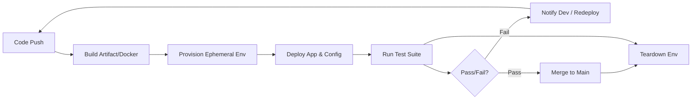

```yaml
title: "The Secret to Faster Testing: Ephemeral Environments"
tags: [devops, ci-cd, ephemeral-environments, software-testing, infrastructure-as-code, cloud-computing, kubernetes, developer-experience]
```

<div class="post-hero">
  
  <div class="post-hero-credit">📸 <a href="https://unsplash.com/@markuswinkler">Markus Winkler</a> on <a href="https://unsplash.com/photos/a-wooden-block-spelling-the-word-result-on-a-table-k64ejFiMbJw">Unsplash</a></div>
</div>


# The Secret to Faster Testing: How Ephemeral Environments Actually Work

### Introduction 🚀

Back in the day, the "test environment" was usually just one physical or virtual server that stayed in a permanent state of being slightly broken. We called it the "Staging" server. It was the one place every developer fought over, and if someone pushed a single bad commit, the whole engineering team was basically blocked for the day. "Redeploying" back then was a stressful manual chore: you'd SSH into the box, pull a git branch, and just pray the environment variables were actually correct.

This era of "Static Environments" was defined by a culture of fear. Deployment was a high-stakes event, often scheduled for 2:00 AM on a Tuesday to minimize user impact. The feedback loop was agonizingly slow; a developer might write code on Monday, see it hit Staging on Wednesday, and find out it crashed the database on Friday.

Fast forward to now, and the way we handle **test redeploys** has changed completely. It's not a manual "event" anymore; it's more like a heartbeat. Today, a "test redeploy" is a fully automated cycle: the system spins up the infrastructure, deploys a specific version of the app, runs the tests, and then tears the whole thing down. In high-velocity engineering organizations, this happens hundreds, if not thousands, of times a day.

This is the real engine behind Continuous Integration and Continuous Deployment (CI/CD). When it works, it creates a "fail-fast" culture—meaning you catch bugs in minutes instead of weeks. But as apps grow from simple monoliths into complex microservice meshes, this process can become a bottleneck. Whether it's "flaky tests" that force you to redeploy for no reason or the massive cost of cloud bills, the logistics of testing are a huge engineering challenge. Let's dive into how the best teams make this loop fast, reliable, and cheap.

---

### 🏗️ How Test Environments Evolved: From Static to Disposable

For decades, the industry relied on a linear progression of environments: Dev $\to$ QA $\to$ Staging $\to$ Production. While this seems logical, it introduces a systemic risk known as **"Environment Drift."** Over time, the Staging server accumulates manual tweaks, hotfixes, and configuration changes that nobody documented. Suddenly, you encounter the classic "it worked in Staging but failed in Production" nightmare because the two environments are no longer identical.

The industry's answer to this was **Infrastructure as Code (IaC)**. By using tools like [Terraform](https://www.terraform.io/) or [AWS CloudFormation](https://aws.amazon.com/cloudformation/), teams started treating their test environments like disposable tools rather than permanent pets. This gave birth to **Ephemeral Environments** (also known as Preview Environments). 

> "The goal of modern infrastructure is immutability. We no longer 'update' servers; we replace them entirely with a known-good configuration."

Now, instead of everyone sharing one fragile Staging server, every single Pull Request (PR) triggers the creation of its own isolated version of the entire app stack. This shift aligns with the [Twelve-Factor App](https://12factor.net/) methodology, specifically the principle of **Dev/Prod Parity**, which argues that the gap between development and production should be as small as possible.

This changed the fundamental nature of the redeploy. In the old static world, a redeploy was about *replacing* something. In the ephemeral world, it's about *recreating* it from a blueprint. Because everything is isolated, your tests are more reliable—you aren't fighting with leftover data or cached state from another developer's failed experiment. As seen in [Vercel's deployment model](https://vercel.com/docs/concepts/deployments/preview-deployments), this "per-commit" approach shrinks the feedback loop from hours to seconds, letting reviewers see the live code before it ever hits a shared branch.

However, the shift to ephemeral infrastructure isn't a free lunch. Moving from one persistent server to 50 short-lived ones makes networking and service discovery significantly more complex. You have to manage dynamic DNS, handle short-lived SSL certificates, and ensure a rigorous "teardown" phase. Without this, you end up with "cloud sprawl," where forgotten environments continue to consume resources and budget long after a PR has been merged or closed.

---

### ⚙️ What’s Actually Happening in the Redeploy Loop?

A modern test redeploy isn't just one step; it's a complex chain reaction. If you've ever wondered why some pipelines take two minutes and others take two hours, it's usually due to the efficiency of these specific stages.

The cycle typically follows this orchestration pattern:

1.  **The Trigger**: A developer pushes code to a branch or opens a Pull Request in GitHub/GitLab.
2.  **The Build Phase**: The source code is compiled, dependencies are resolved, and the application is packed into a container image (typically Docker). To speed this up, teams use **layer caching**, ensuring that only the changed parts of the app are rebuilt.
3.  **Provisioning**: An orchestrator, most commonly [Kubernetes](https://kubernetes.io/), claims resources from a cluster and creates a new namespace or set of pods to house the application.
4.  **Configuring**: Secret management tools, such as HashiCorp Vault or AWS Secrets Manager, inject the necessary environment variables and API keys into the container at runtime.
5.  **Verification**: The test runner initiates a suite of tests. This usually starts with fast Unit tests, progresses to Integration tests, and culminates in heavy End-to-End (E2E) tests using tools like Playwright or Cypress.
6.  **Analysis**: Results are aggregated and streamed back to the PR as a comment or a status check.
7.  **Cleanup**: Once the PR is merged or the tests finish, the environment is deleted to reclaim resources.



The "gold standard" for measuring this process is **Lead Time for Changes**, one of the four key [DORA metrics](https://cloud.google.com/devops). High-performing teams strive to keep this lead time under one hour. When a redeploy loop is lean, developers remain in a "flow state"; when it's slow, they switch tasks, leading to cognitive load and decreased productivity.

One common speed bump is the "Cold Start" problem—the time it takes for a Kubernetes pod to pull a large image and reach a "Ready" state. To solve this, advanced teams use **Warm Pools**. These are pre-provisioned, generic environments that sit idle. When a PR is opened, the system simply "claims" a warm environment and injects the new code, reducing the wait time from minutes to seconds.

---

### ⚡ Fixing the 'Feedback Gap' with Smart Test Selection

As a codebase grows, the test suite grows proportionally. If you have 10,000 integration tests that take 45 minutes to run, the "test redeploy" becomes a productivity killer. This creates a "Feedback Gap," where developers stop running tests locally because they are too slow, and instead "push and pray" to the CI server. This leads to a frustrating cycle of: push $\to$ wait $\to$ fail $\to$ fix $\to$ repeat.

To bridge this gap, teams implement **Test Case Selection (TCS)**. Research published on [ArXiv regarding regression testing](https://arxiv.org/abs/2005.01234) suggests that the goal should be to identify the smallest subset of tests likely to fail based on the specific files modified in a commit. For example, if a developer only changes the CSS of a landing page, there is no logical reason to redeploy the entire backend payment processing suite.

Using a smart selection strategy can cut total test time by **60% to 90%**. This is typically achieved through three primary methods:

*   **Static Analysis**: Using dependency graphs to map which tests touch which lines of code. If `File A` is changed, only run tests that import `File A`.
*   **Historical Analysis**: Tracking which tests have failed most frequently in the past. These "high-risk" tests are prioritized in the redeploy loop.
*   **Impact Analysis**: Using runtime tracing to see which downstream services are actually invoked by a specific code path.

The inherent risk of TCS is the "false negative"—missing a bug that a full suite would have caught. To mitigate this, the industry uses a tiered testing strategy:
1.  **Smoke Suite**: A tiny set of critical tests (e.g., "Can a user log in?") that run on every single redeploy.
2.  **Targeted Suite**: Tests selected via TCS based on the change.
3.  **Nightly Full Suite**: A comprehensive run of every single test in the system, performed once every 24 hours to ensure total correctness.

---

### 👻 The Ghost in the Machine: Flakiness and Retries

The most demoralizing part of any CI/CD pipeline is the "Flaky Test"—a test that passes and fails randomly despite no changes to the code. Flakiness is usually caused by race conditions, asynchronous timing issues, or external API instability.

In many organizations, flakiness leads to a dangerous habit: **The Blind Redeploy**. When the pipeline turns red, the developer doesn't investigate the logs; they simply hit the "Re-run" button. If it passes the second time, they assume it was just "CI noise" and merge the code.

This habit is a silent killer. As frequently discussed on [Hacker News](https://news.ycombinator.com/), flaky tests destroy the team's trust in automation. When developers stop trusting the "Red" signal, the tests cease to be a safety net and become a nuisance. Some internal studies at large-scale microservice companies show that **up to 30% of developer time** is wasted fighting flaky pipelines.

To combat this, "pro" teams implement the following strategies:

**1. The Quarantine Pattern**
When a test is identified as flaky, it is moved to a "quarantine" suite. These tests still run, but their failure does not block the merge. This keeps the pipeline moving while flagging the test for a dedicated fix.

**2. Deterministic Environments**
External dependencies are the primary source of flakiness. Instead of hitting a real staging API, teams use tools like [LocalStack](https://localstack.cloud/) to mock AWS services locally or within the ephemeral environment. This removes the unpredictability of the public internet from the equation.

**3. Auto-Retries with Metadata**
The system may automatically retry a failed test $N$ times. However, if the test passes on the second or third try, it is not marked as a "Success." Instead, it is flagged as **"Flaky"** on a dashboard. This allows engineers to identify the most unstable tests and prioritize them for refactoring.

---

### 💾 The Hard Part: Data Gravity and Migrations

Deploying code is relatively easy because code is stateless. The database is where the real complexity lies. Every time you redeploy a test environment, you encounter the problem of **Data Gravity**.

If your application requires a 100GB dataset to perform a meaningful integration test, you cannot simply spin up a new database for every PR. It would be prohibitively slow and expensive. Furthermore, if a redeploy involves a database migration (e.g., renaming a column), you must ensure that the test data is migrated correctly without affecting other concurrent environments.

There are three primary architectural patterns to solve this:

**The Seed Approach**
The environment starts with a blank database and populates it with a minimal set of "seed data" via SQL scripts.
*   **Pros**: Extremely fast, deterministic, and lightweight.
*   **Cons**: Often misses "edge case" bugs that only emerge with massive, real-world datasets.

**The Snapshot Approach**
A sanitized, anonymized snapshot of production data is taken and mounted to the ephemeral environment.
*   **Pros**: High fidelity; tests behave exactly as they would in production.
*   **Cons**: High storage cost and slow setup time. Managing PII (Personally Identifiable Information) during anonymization is a significant legal and technical hurdle.

**The Database-per-PR (Branching) Approach**
Modern database tooling allows for "branching" the data layer. Tools like [Prisma](https://www.prisma.io/) or [Flyway](https://flywaydb.org/) manage migrations programmatically, while newer "serverless" databases like Neon or PlanetScale allow you to create instant, copy-on-write branches of your database.
*   **Pros**: The gold standard for developer experience. Each PR has its own isolated data state.
*   **Cons**: Requires specialized tooling and a move away from traditional monolithic SQL setups.

Ultimately, a successful test redeploy must treat the database migration as an integral part of the deployment package. If the migration fails, the environment is considered "broken," preventing the catastrophic scenario where code is deployed to production but the database schema is out of sync.

---

### 💰 The Cost of Quality: Watching the Cloud Bill

When every single commit triggers a full stack of containers, load balancers, and databases, the cloud bill can spiral out of control. While a single ephemeral environment might cost only a few cents per hour, the math changes at scale. If 200 developers push 5 times a day, and environments linger for 24 hours, you are suddenly paying for thousands of idle resources.

This creates a tension between **Developer Velocity** (give everyone everything) and **Cloud Spend** (save every penny). To resolve this, companies are adopting "FinOps for Testing."

**Time-to-Live (TTL) Policies**
Every ephemeral environment is assigned a TTL. For example, an environment may be automatically deleted after 4 hours of inactivity or immediately upon the PR being merged/closed. Automated "reaper" scripts ensure that no "ghost" environments survive the weekend.

**Scale-to-Zero Infrastructure**
By using serverless frameworks like [Knative](https://knative.dev/) or AWS Lambda, environments can "sleep" when not in use. The environment only consumes CPU and RAM when a test runner or a reviewer actually sends an HTTP request to the preview URL.

**Cluster-Slicing (Namespace Isolation)**
Rather than provisioning a whole new cluster, teams use Kubernetes Namespaces to share a single, large cluster. This allows for better resource utilization through "bin packing," where multiple small ephemeral environments are crammed into a few large VM nodes.

**The Financial Impact**: Some organizations have reported cutting their CI/CD infrastructure costs by **up to 40%** simply by implementing aggressive automated teardowns and scale-to-zero policies. The goal is to ensure that the cost of the redeploy is always lower than the cost of a bug reaching production.

---

### Conclusion 🏁

The "test redeploy" has evolved from a manual, dreaded chore into a sophisticated engineering discipline. By leveraging ephemeral environments, implementing smart test selection, and mastering data gravity, modern teams have turned their deployment pipeline into a competitive advantage.

The future of this field lies in **AI-driven orchestration**. We are moving toward a world where ML models analyze the AST (Abstract Syntax Tree) of a code change and predict with **99% accuracy** exactly which tests will fail, potentially reducing the redeploy loop from minutes to seconds. As we shift further toward edge computing and serverless architectures, the distinction between "testing" and "production" will continue to blur, with feature flags and canary releases serving as the final validation step.

At its core, the goal remains unchanged: providing the developer with the fastest, most accurate answer to the most important question in software engineering: *"Did I break it?"*

---

### 📚 References

*   **DORA Metrics & Google Cloud DevOps Research**: [cloud.google.com/devops](https://cloud.google.com/devops) - The industry standard for measuring software delivery performance.
*   **Vercel Preview Deployments**: [vercel.com/docs](https://vercel.com/docs/concepts/deployments/preview-deployments) - A leading implementation of the per-commit environment model.
*   **ArXiv: Regression Test Selection**: [arxiv.org/abs/2005.01234](https://arxiv.org/abs/2005.01234) - Academic research on optimizing test suites for faster feedback.
*   **Terraform by HashiCorp**: [terraform.io](https://www.terraform.io/) - The foundational tool for Infrastructure as Code.
*   **Kubernetes Documentation**: [kubernetes.io](https://kubernetes.io/) - The standard for container orchestration and namespace isolation.
*   **The Twelve-Factor App**: [12factor.net](https://12factor.net/) - A methodology for building scalable, maintainable SaaS applications.
*   **Prisma ORM & Migrations**: [prisma.io](https://www.prisma.io/) - Modern approach to type-safe database schema management.
*   **Hacker News Community**: [news.ycombinator.com](https://news.ycombinator.com/) - Real-world developer discussions on CI/CD pain points.
*   **LocalStack**: [localstack.cloud](https://localstack.cloud/) - Essential tool for deterministic cloud mocking.
*   **Knative Serverless**: [knative.dev](https://knative.dev/) - Framework for scale-to-zero workloads on Kubernetes.
*   **Flyway Database Tool**: [flywaydb.org](https://flywaydb.org/) - Version control for your database schema.