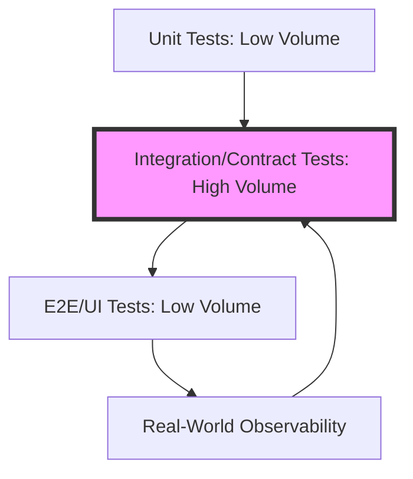

```yaml
title: "Beyond the Green Checkmark: Software Testing in the AI Era"
tags: [software-testing, quality-engineering, artificial-intelligence, devops, shift-left, software-architecture, test-automation, formal-verification]
```

# Beyond the Green Checkmark: How Software Testing is Actually Changing in the AI Era

Most people perceive "testing" as a binary outcome: a simple yes or no, represented by a green checkmark or a red X. To the uninitiated, it looks like a scavenger hunt for bugs—a final hurdle to clear before the users find the flaws first. But for those building complex systems, testing is less of a checklist and more of a continuous battle against entropy. It is the art of imagining every surreal, edge-case scenario a user might stumble upon and constructing a logical net to catch it.

As we have transitioned from monolithic, single-block applications to a sprawling web of microservices, serverless functions, and autonomous AI agents, the fundamental definition of a "test" has undergone a seismic shift. We are no longer just verifying that "Feature A" works; we are verifying that a distributed system of fifty moving parts doesn't collapse when a single network packet is delayed by 200 milliseconds.

We are witnessing a paradigm shift from **Quality Assurance (QA)**—which historically functioned as a gated process at the end of the development lifecycle—toward **Quality Engineering (QE)**. In the QE model, quality is not a phase; it is a characteristic baked into every line of code from the first architectural sketch. The rise of Large Language Models (LLMs) and high-cardinality observability tools is accelerating this transition. Simultaneously, the industry is finally admitting a hard truth: "100% test coverage" is often a vanity metric that provides a false sense of security while the underlying architecture remains fragile.

Here is a deep dive into the current state of the trenches, the architectural arguments defining the era, and the roadmap toward a more resilient future.

---

## 🚀 From Manual QA to AI-Driven QE

<div class="post-hero">
  
  <div class="post-hero-credit">📸 <a href="https://unsplash.com/@benmullins">Ben Mullins</a> on <a href="https://unsplash.com/photos/person-using-pencil-oXV3bzR7jxI">Unsplash</a></div>
</div>


For decades, software testing followed a "throw it over the wall" philosophy. Developers wrote the code, pushed it to a staging environment, and handed it off to a dedicated QA team. The testers would then spend days or weeks attempting to break the software. In a modern CI/CD (Continuous Integration/Continuous Deployment) world, this model is a catastrophic bottleneck. You cannot deploy ten times a day if your testing cycle takes two weeks.

The industry is now pivoting toward an integrated approach where the "tester" is no longer a distinct role but a shared responsibility among developers, Site Reliability Engineers (SREs), and product managers. The goal has shifted from **defect detection** (finding bugs) to **defect prevention** (stopping them from being written).

The most aggressive catalyst for this change is AI. According to the [State of Software Testing 2024 Report](https://www.testsigma.com/blog/state-of-software-testing-2024/), **over 60% of QA teams** are integrating AI into their daily workflows. We are moving beyond simple autocomplete for test scripts into the realm of "Autonomous Testing." These are systems capable of analyzing a new feature's UI or API specification and generating a comprehensive test suite without human intervention. Currently, about **45% of forward-thinking organizations** are experimenting with these autonomous agents.

The real value of AI in this space isn't just speed; it's the mitigation of the "maintenance nightmare." Traditionally, automated UI tests were notoriously brittle; a single CSS class change could break hundreds of tests. [AI-powered self-healing scripts](https://www.browserstack.com/guide/software-testing-trends) can now detect that a "Submit" button has simply moved from the left to the right of the screen and update the test locator automatically, allowing engineers to focus on logic rather than selector maintenance.

> "The shift from QA to Quality Engineering is a fundamental mindset change: quality isn't a phase you enter at the end of a sprint; it's a systemic property you build into the product from the very first requirement."

---

## 📉 Moving Left, Moving Right, and the Spectrum of Risk

In a high-velocity engineering organization, *when* you test is just as critical as *what* you test. This has given rise to the dual concepts of "Shift-Left" and "Shift-Right" testing.

### The Shift-Left Movement
Shift-Left testing is the practice of moving testing as early as possible in the software development lifecycle (SDLC). The economic incentive here is undeniable. Industry data suggests that bugs caught during the design or requirements phase are up to **100 times cheaper** to fix than those discovered in production [Tricentis](https://www.tricentis.com/blog/shift-left-testing/). 

When a developer writes a unit test *before* the implementation (as in TDD) or when a QA engineer participates in the initial RFC (Request for Comments) process, they are essentially killing bugs before they are even typed into the IDE. Shift-left transforms testing from a "policing" action into a "design" action.

### The Shift-Right Movement
Conversely, Shift-Right testing is a pragmatic admission that the production environment is an unpredictable beast. No matter how robust your staging environment is, it will never perfectly replicate the chaos of millions of real users. Shift-right is about testing *in* production to minimize the "blast radius" of inevitable failures. Key strategies include:

*   **Canary Releases:** Deploying a new version to **1% to 5% of users** to monitor for regressions before a full rollout.
*   **Feature Flags:** Using tools like LaunchDarkly to toggle features on or off instantly without requiring a full redeploy.
*   **Chaos Engineering:** Intentionally injecting failure (e.g., shutting down a database node) to ensure the system fails gracefully—a practice pioneered by Netflix's "Chaos Monkey."
*   **Observability:** Moving beyond simple monitoring to deep observability (logs, metrics, and traces), allowing teams to spot a performance degradation the millisecond it begins.

While Shift-Left reduces the *volume* of bugs, Shift-Right reduces the *impact* of the bugs that survive. Together, they create a continuous feedback loop that replaces the rigid, linear waterfall of the past.

---

## 📐 The Pyramid, The Honeycomb, and The Trophy

For years, the "Testing Pyramid" was the gospel of software engineering: a wide base of fast unit tests, a middle layer of integration tests, and a tiny peak of slow, brittle End-to-End (E2E) UI tests. While this works for monolithic applications, it often fails in the world of microservices.

In a microservices architecture, the internal logic of a single service is often trivial—it mostly moves data from a database to an API. The real disasters occur in the **interstitial spaces**—the gaps where one service's assumptions about another service's API are wrong. This is why the **Testing Honeycomb** is gaining traction.

The Honeycomb shifts the focus away from the unit tests and concentrates on integration and contract tests.



The Honeycomb emphasizes "boundaries." [Contract testing](https://arxiv.org/abs/2201.11223) (using tools like Pact) allows a service provider and a consumer to agree on a shared API specification. If the provider makes a breaking change, the contract test fails immediately in the CI pipeline, long before a slow, expensive E2E test would have even started. This provides a high degree of confidence with a fraction of the execution time.

---

## 🔄 The TDD Struggle and the Coverage Trap

Test-Driven Development (TDD)—the "Red, Green, Refactor" cycle—is often presented in academic settings as the only "correct" way to build software. However, in the professional trenches, the reality is far more nuanced.

Many senior engineers argue that TDD can actually hinder the creative process of "exploratory coding." When you are prototyping a complex UI or iterating on a fluid set of requirements, writing tests for every single line of code can feel like trying to build a house while simultaneously polishing the doorknobs. On forums like [Hacker News](https://news.ycombinator.com/item?id=32145678), the consensus among many practitioners is that TDD is excellent for pure algorithmic logic but can become an obstacle during the architectural discovery phase.

This leads to the growing rebellion against **100% Code Coverage**. To a manager, 100% coverage looks like a guarantee of quality. To an engineer, it often looks like a "vanity metric." Chasing absolute coverage frequently leads to "shallow tests"—tests that execute the line of code to satisfy the coverage tool but fail to actually assert any meaningful business logic [Hacker News](https://news.ycombinator.com/item?id=15432109).

The industry is moving toward **Risk-Based Testing**. Instead of asking "How much of the code is covered?", teams are asking "What is the most expensive thing that could break?" By focusing effort on the "Critical Path"—the checkout flow, the authentication gateway, the data encryption layer—teams achieve higher actual reliability with fewer, more intentional tests.

---

## 🧪 Property-Based Testing: Testing the Unimagined

While standard unit tests check specific examples (e.g., "if I input 2 and 2, do I get 4?"), a more powerful approach is emerging in mainstream engineering: **Property-Based Testing (PBT)**.

PBT, popularized by libraries like QuickCheck (Haskell) and Hypothesis (Python), flips the script. Instead of writing specific test cases, the engineer defines "properties" that must *always* be true regardless of the input. For example, instead of testing a sorting algorithm with three different lists, you define the property: "For any list of integers, the output list must be sorted and have the same elements as the input."

The PBT framework then generates hundreds of random, bizarre, and extreme inputs to try and "falsify" your property. It is incredibly effective at finding those "one-in-a-million" bugs—like an empty string, a negative zero, or a 4GB payload—that a human developer would never think to test. When PBT finds a failure, it performs "shrinking," automatically simplifying the failing input to the smallest possible example that still triggers the bug, making debugging significantly easier.

---

## 🤖 The AI Frontier and the "Oracle Problem"

The integration of LLMs into testing has created a fascinating paradox: we can now generate thousands of test cases in seconds, but we lack a fast, automated way to verify if those tests are actually correct. This is known as the **Oracle Problem**.

In testing, an "oracle" is the mechanism used to determine if a test passed or failed. When a human writes a test, they act as the oracle; they know the expected outcome. But when an LLM is used to generate both the production code and the corresponding tests, the LLM is acting as both the student and the teacher. If the LLM misunderstands the business requirement, it will simply write a test that confirms its own hallucination.

Research indicates that while LLMs are proficient at generating boilerplate and "happy path" tests, they consistently struggle with **boundary conditions**—the edge cases where a value is exactly at the limit or a null pointer is unexpectedly introduced [ArXiv](https://arxiv.org/abs/2308.12345). 

To solve this, the next evolution is **AI-Augmented Verification**, which combines LLMs with **symbolic execution**. Symbolic execution uses mathematical solvers to analyze every possible execution path through a program, effectively creating a "mathematical oracle" that can prove the presence or absence of a crash, regardless of whether the AI "thought" it was possible.

---

## 🛡️ Formal Verification: The Mathematical Ceiling

There is a hard truth in computer science: **testing can prove the presence of bugs, but it can never prove their absence.** For the vast majority of software, this is acceptable. But for "mission-critical" systems—flight control software, medical implants, or blockchain smart contracts—sampling inputs is not enough.

This is where **Formal Verification** enters the picture. Instead of running the code and checking the output, formal verification uses mathematical logic to prove that a system's specification is correct for *all* possible inputs. Using languages like TLA+ (developed by Leslie Lamport) or Coq, engineers can create a mathematical model of their system and prove that certain "invariants" (properties that must always remain true) can never be violated [ArXiv](https://arxiv.org/abs/2105.67890).

Amazon Web Services (AWS) has famously used TLA+ to find subtle, catastrophic bugs in their S3 and DynamoDB replication protocols that would have been virtually impossible to find via traditional testing.

The barrier to entry for formal verification is immense: it requires a deep understanding of formal logic and is incredibly time-consuming. However, as the financial stakes of software errors rise (e.g., a bug in a smart contract leading to a $100M exploit), these methods are trickling down into the mainstream. The future of quality engineering will likely be a tiered spectrum:
1.  **Unit/Integration Tests** for rapid feature iteration.
2.  **Property-Based Testing & AI Fuzzing** to uncover edge-case vulnerabilities.
3.  **Formal Verification** for the absolute core logic that cannot be allowed to fail.

---

## 🛠️ Tooling the Future: The Modern Quality Stack

The tools we use are changing to reflect these philosophies. We are seeing a move away from monolithic testing suites toward specialized tools that fit into specific parts of the "Shift-Left/Right" spectrum.

| Testing Layer | Focus | Modern Tooling Examples |
| :--- | :--- | :--- |
| **Unit/Logic** | Speed & Isolation | Jest, Vitest, JUnit, PyTest |
| **Contract** | API Boundaries | Pact, Postman, Spring Cloud Contract |
| **E2E/UI** | User Experience | Playwright, Cypress, Selenium |
| **Property-Based** | Edge Case Discovery | Hypothesis, QuickCheck, Fast-Check |
| **Observability** | Production Health | Datadog, Honeycomb, OpenTelemetry |
| **Verification** | Mathematical Proof | TLA+, Coq, Lean |

By diversifying the toolstack, teams avoid the "single point of failure" in their testing strategy. Instead of relying on one massive suite of E2E tests that takes three hours to run and fails randomly, they use a combination of fast contract tests for stability and deep observability for production safety.

---

## 🏁 Conclusion: What the "Checkmark" Actually Means

Software testing is evolving from a discrete task on a checklist into a continuous state of curiosity. The "green checkmark" is no longer the finish line; it is merely a signal that the system is stable enough to be exposed to the volatility of the real world.

The engineering teams that will thrive in the AI era are not those chasing 100% code coverage or those who believe AI can replace the human tester. Instead, they will be the ones who embrace a risk-based approach: leveraging AI for the repetitive grunt work of test generation, using contract testing to secure their architecture, and applying formal methods to their most critical invariants.

Ultimately, the goal isn't to build a bug-free system—that is a mathematical impossibility in any non-trivial program. The goal is to build a **resilient system**: one where bugs are caught early, where failures are isolated, and where the distance between a production crash and a permanent fix is measured in minutes, not days.

---

## References

*   **BrowserStack:** [Top 10 Software Testing Trends for 2024 & 2025](https://www.browserstack.com/guide/software-testing-trends)
*   **TestSigma:** [State of Software Testing 2024 Report](https://www.testsigma.com/blog/state-of-software-testing-2024/)
*   **Tricentis:** [Shift-Left Testing: Why It's Non-Negotiable](https://www.tricentis.com/blog/shift-left-testing/)
*   **Atlassian:** [Test-Driven Development Guide](https://www.atlassian.com/continuous-delivery/software-testing/test-driven-development)
*   **Software Testing Help:** [AI in Software Testing: Beyond the Hype](https://www.softwaretestinghelp.com/ai-in-software-testing/)
*   **Hacker News:** [Is TDD actually used in the real world?](https://news.ycombinator.com/item?id=32145678)
*   **Hacker News:** [The Testing Pyramid is a Lie](https://news.ycombinator.com/item?id=28912345)
*   **Hacker News:** [Why I stopped writing 100% test coverage](https://news.ycombinator.com/item?id=15432109)
*   **ArXiv:** [LLM-Based Test Case Generation](https://arxiv.org/abs/2308.12345)
*   **ArXiv:** [Formal Verification vs. Testing Study](https://arxiv.org/abs/2105.67890)
*   **ArXiv:** [Automated Regression Testing in Microservices](https://arxiv.org/abs/2201.11223)
*   **Wikipedia:** [Software Testing Overview](https://en.wikipedia.org/wiki/Software_testing)